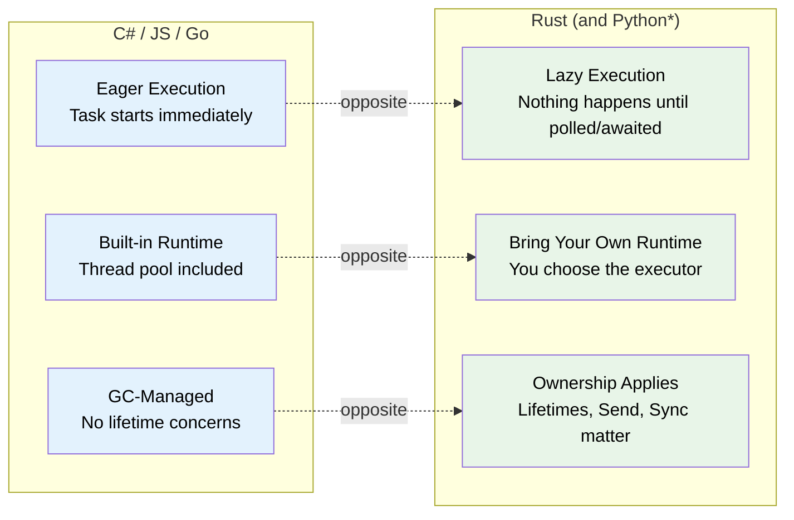
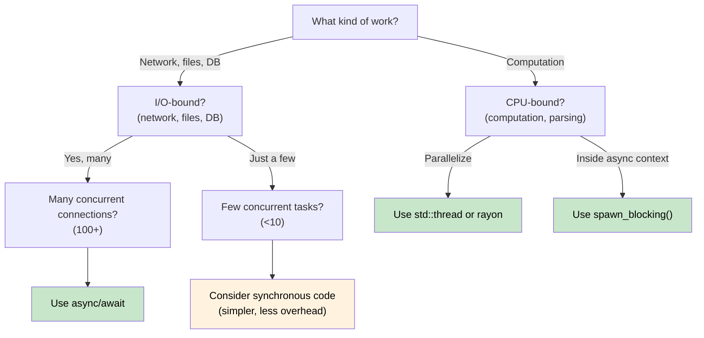

# 1. Why Async is Different in Rust / 1. 为什么 Rust 中的 Async 与众不同 🟢

> **What you'll learn / 你将学到：**
> - Why Rust has no built-in async runtime (and what that means for you) / 为什么 Rust 没有内建 async 运行时，以及这对你意味着什么
> - The three key properties: lazy execution, no runtime, zero-cost abstraction / 三个关键特性：惰性执行、无内建运行时、零成本抽象
> - When async is the right tool (and when it's slower) / 什么时候应该用 async，什么时候它反而更慢
> - How Rust's model compares to C#, Go, Python, and JavaScript / Rust 的模型与 C#、Go、Python、JavaScript 的对比

## The Fundamental Difference / 根本差异

Most languages with `async/await` hide the machinery. C# has the CLR thread pool. JavaScript has the event loop. Go has goroutines and a scheduler built into the runtime. Python has `asyncio`.

大多数带有 `async/await` 的语言都会把底层机制隐藏起来。C# 有 CLR 线程池，JavaScript 有事件循环，Go 在运行时中内建 goroutine 与调度器，Python 有 `asyncio`。

**Rust has nothing.**

**Rust 什么都没有。**

There is no built-in runtime, no thread pool, no event loop. The `async` keyword is a zero-cost compilation strategy - it transforms your function into a state machine that implements the `Future` trait. Someone else (an *executor*) must drive that state machine forward.

Rust 没有内建运行时、没有线程池、没有事件循环。`async` 关键字本质上是一种零成本编译策略，它会把函数转换成一个实现了 `Future` trait 的状态机。这个状态机必须由别的东西（也就是 *executor*，执行器）来驱动前进。

### Three Key Properties of Rust Async / Rust Async 的三个关键特性



> \* Python coroutines are lazy like Rust futures - they don't execute until awaited or scheduled. However, Python still uses GC and has no ownership/lifetime concerns.
>
> \* Python 的 coroutine 和 Rust 的 future 一样也是惰性的，只有在 `await` 或被调度时才会执行。但 Python 仍然依赖 GC，也没有所有权和生命周期问题。

### No Built-In Runtime / 没有内建运行时

```rust
// This compiles but does NOTHING:
// 这段代码可以编译，但什么都不会发生：
async fn fetch_data() -> String {
    "hello".to_string()
}

fn main() {
    let future = fetch_data(); // Creates the Future, but doesn't execute it
    // future is just a struct sitting on the stack
    // No output, no side effects, nothing happens
    // 这里只是创建了 Future，但并没有执行
    // future 只是一个放在栈上的结构体
    // 没有输出，没有副作用，什么都没发生
    drop(future); // Silently dropped - work was never started
    // 被静默丢弃，工作从未真正开始
}
```

Compare with C# where `Task` starts eagerly:

对比 C#，`Task` 是急切启动的：

```csharp
// C# - this immediately starts executing:
// C# 中，这里会立刻开始执行：
async Task<string> FetchData() => "hello";

var task = FetchData(); // Already running!
var result = await task; // Just waits for completion
```

### Lazy Futures vs Eager Tasks / 惰性 Future 与急切 Task

This is the single most important mental shift:

这是最重要的思维转变：

| | C# / JavaScript | Python | Go | Rust |
|---|---|---|---|---|
| **Creation / 创建** | `Task` starts executing immediately / `Task` 会立刻执行 | Coroutine is **lazy** - returns an object, doesn't run until awaited or scheduled / Coroutine 是**惰性**的，返回对象但不会立刻执行 | Goroutine starts immediately / Goroutine 立即开始 | `Future` does nothing until polled / `Future` 在被 `poll` 前什么都不做 |
| **Dropping / 丢弃** | Detached task continues running / 脱离引用后任务仍继续 | Unawaited coroutine is garbage-collected (with a warning) / 未 await 的 coroutine 会被 GC 回收（伴随警告） | Goroutine runs until return / Goroutine 一直运行到返回 | Dropping a Future cancels it / 丢弃 Future 就等于取消它 |
| **Runtime / 运行时** | Built into the language/VM / 内建于语言或虚拟机 | `asyncio` event loop (must be explicitly started) / `asyncio` 事件循环（需显式启动） | Built into the binary (M:N scheduler) / 内建于二进制（M:N 调度） | You choose (tokio, smol, etc.) / 由你选择（tokio、smol 等） |
| **Scheduling / 调度** | Automatic (thread pool) / 自动（线程池） | Event loop + `await` or `create_task()` / 事件循环加 `await` 或 `create_task()` | Automatic (GMP scheduler) / 自动（GMP 调度器） | Explicit (`spawn`, `block_on`) / 显式（`spawn`、`block_on`） |
| **Cancellation / 取消** | `CancellationToken` (cooperative) / `CancellationToken`（协作式） | `Task.cancel()` (cooperative, raises `CancelledError`) / `Task.cancel()`（协作式，会抛 `CancelledError`） | `context.Context` (cooperative) / `context.Context`（协作式） | Drop the future (immediate) / 直接丢弃 future（立即取消） |

```rust
// To actually RUN a future, you need an executor:
// 真正要运行 future，需要执行器：
#[tokio::main]
async fn main() {
    let result = fetch_data().await; // NOW it executes
    println!("{result}");
}
```

### When to Use Async (and When Not To) / 什么时候该用 Async，什么时候不该用



**Rule of thumb**: Async is for I/O concurrency (doing many things at once while waiting), not CPU parallelism (making one thing faster). If you have 10,000 network connections, async shines. If you're crunching numbers, use `rayon` or OS threads.

**经验法则**：Async 适用于 I/O 并发，也就是“等待时同时做很多事”，而不是 CPU 并行，也就是“把一件计算做得更快”。如果你要处理 10,000 个网络连接，async 会非常合适；如果你是在做重计算，请用 `rayon` 或操作系统线程。

### When Async Can Be *Slower* / Async 什么时候可能更慢

Async isn't free. For low-concurrency workloads, synchronous code can outperform async:

Async 不是免费的。对于低并发工作负载，同步代码有时反而比 async 更快：

| Cost / 成本 | Why / 原因 |
|------|-----|
| **State machine overhead / 状态机开销** | Each `.await` adds an enum variant; deeply nested futures produce large, complex state machines / 每个 `.await` 都会增加状态，深层嵌套会生成很大、很复杂的状态机 |
| **Dynamic dispatch / 动态分发** | `Box<dyn Future>` adds indirection and kills inlining / `Box<dyn Future>` 会增加间接层并阻碍内联优化 |
| **Context switching / 上下文切换** | Cooperative scheduling still has cost - the executor must manage a task queue, wakers, and I/O registrations / 协作式调度仍有代价，执行器需要维护任务队列、waker 与 I/O 注册 |
| **Compile time / 编译时间** | Async code generates more complex types, slowing down compilation / Async 代码会生成更复杂的类型，从而拖慢编译 |
| **Debuggability / 可调试性** | Stack traces through state machines are harder to read (see Ch. 12) / 穿过状态机的调用栈更难读（见第 12 章） |

**Benchmarking guidance**: If fewer than ~10 concurrent I/O operations, profile before committing to async. A simple `std::thread::spawn` per connection scales fine to hundreds of threads on modern Linux.

**性能建议**：如果并发 I/O 操作少于大约 10 个，在决定使用 async 之前先做性能分析。对于现代 Linux，简单地每个连接一个 `std::thread::spawn`，扩展到几百个线程通常也没有问题。

### Exercise: When Would You Use Async? / 练习：你会在什么场景下使用 Async？

<details>
<summary>Exercise / 练习（点击展开）</summary>

For each scenario, decide whether async is appropriate and explain why:

请判断以下每个场景是否适合使用 async，并说明原因：

1. A web server handling 10,000 concurrent WebSocket connections / 一个需要处理 10,000 个并发 WebSocket 连接的 Web 服务器
2. A CLI tool that compresses a single large file / 一个压缩单个大文件的命令行工具
3. A service that queries 5 different databases and merges results / 一个需要查询 5 个不同数据库并合并结果的服务
4. A game engine running a physics simulation at 60 FPS / 一个以 60 FPS 运行物理模拟的游戏引擎

<details>
<summary>Solution / 参考答案</summary>

1. **Async** - I/O-bound with massive concurrency. Each connection spends most time waiting for data. Threads would require 10K stacks.  
   **适合 Async**：典型 I/O 密集型且并发极高。每个连接大多数时间都在等待数据，若用线程则需要 10K 个线程栈。
2. **Sync/threads** - CPU-bound, single task. Async adds overhead with no benefit. Use `rayon` for parallel compression.  
   **适合同步或线程**：这是 CPU 密集型单任务。Async 只会增加开销，没有收益。若要并行压缩，使用 `rayon`。
3. **Async** - Five concurrent I/O waits. `tokio::join!` runs all five queries simultaneously.  
   **适合 Async**：这里有五个可并发等待的 I/O 操作，可以用 `tokio::join!` 同时发起并等待。
4. **Sync/threads** - CPU-bound, latency-sensitive. Async's cooperative scheduling could introduce frame jitter.  
   **适合同步或线程**：这是 CPU 密集型且对延迟敏感的工作，协作式调度可能引入帧抖动。

</details>
</details>

> **Key Takeaways - Why Async is Different / 关键要点：为什么 Async 在 Rust 中不同**
> - Rust futures are **lazy** - they do nothing until polled by an executor / Rust future 是**惰性**的，在被执行器 `poll` 之前什么都不会做
> - There is **no built-in runtime** - you choose (or build) your own / Rust **没有内建运行时**，你需要自己选择（甚至自己实现）运行时
> - Async is a **zero-cost compilation strategy** that produces state machines / Async 是一种**零成本编译策略**，最终会生成状态机
> - Async shines for **I/O-bound concurrency**; for CPU-bound work, use threads or rayon / Async 擅长 **I/O 并发**；对于 CPU 密集型任务，请使用线程或 rayon

> **See also / 延伸阅读：** [Ch 2 - The Future Trait / 第 2 章：Future Trait](ch02-the-future-trait.md), [Ch 7 - Executors and Runtimes / 第 7 章：执行器与运行时](ch07-executors-and-runtimes.md)

***
