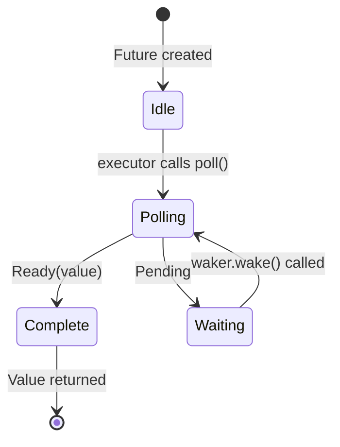

# 3. How Poll Works / 3. `poll` 的工作机制 🟡

> **What you'll learn / 你将学到：**
> - The executor's poll loop: poll → pending → wake → poll again / 执行器的轮询循环：poll → pending → wake → poll again
> - How to build a minimal executor from scratch / 如何从零构建一个最小执行器
> - Spurious wake rules and why they matter / 虚假唤醒规则及其重要性
> - Utility functions: `poll_fn()` and `yield_now()` / 实用函数：`poll_fn()` 与 `yield_now()`

## The Polling State Machine / 轮询状态机

The executor runs a loop: poll a future, if it's `Pending`, park it until its waker fires, then poll again. This is fundamentally different from OS threads where the kernel handles scheduling.

执行器运行一个循环：轮询一个 future，如果返回 `Pending`，就将其挂起，直到其 waker 被触发，然后再次轮询。这与操作系统线程有本质不同，后者由内核处理调度。



> **Important / 重要提示：** While in the *Waiting* state the future **must** have registered the waker with an I/O source. No registration = hang forever.
>
> 当处于 *Waiting*（等待）状态时，future **必须** 已经向某个 I/O 源注册了 waker。如果没有注册，程序将永远挂起。

### A Minimal Executor / 一个最小执行器

To demystify executors, let's build the simplest possible one:

为了揭开执行器的神秘面纱，让我们构建一个最简单的执行器：

```rust
use std::future::Future;
use std::task::{Context, Poll, RawWaker, RawWakerVTable, Waker};
use std::pin::Pin;

/// The simplest possible executor: busy-loop poll until Ready
fn block_on<F: Future>(mut future: F) -> F::Output {
    // Pin the future on the stack
    // SAFETY: `future` is never moved after this point — we only
    // access it through the pinned reference until it completes.
    let mut future = unsafe { Pin::new_unchecked(&mut future) };

    // Create a no-op waker (just keeps polling — inefficient but simple)
    fn noop_raw_waker() -> RawWaker {
        fn no_op(_: *const ()) {}
        fn clone(_: *const ()) -> RawWaker { noop_raw_waker() }
        let vtable = &RawWakerVTable::new(clone, no_op, no_op, no_op);
        RawWaker::new(std::ptr::null(), vtable)
    }

    // SAFETY: noop_raw_waker() returns a valid RawWaker with a correct vtable.
    let waker = unsafe { Waker::from_raw(noop_raw_waker()) };
    let mut cx = Context::from_waker(&waker);

    // Busy-loop until the future completes
    loop {
        match future.as_mut().poll(&mut cx) {
            Poll::Ready(value) => return value,
            Poll::Pending => {
                // A real executor would park the thread here
                // and wait for waker.wake() — we just spin
                std::thread::yield_now();
            }
        }
    }
}

// Usage:
fn main() {
    let result = block_on(async {
        println!("Hello from our mini executor!");
        42
    });
    println!("Got: {result}");
}
```

> **Don't use this in production!** It busy-loops, wasting CPU. Real executors (tokio, smol) use `epoll`/`kqueue`/`io_uring` to sleep until I/O is ready. But this shows the core idea: an executor is just a loop that calls `poll()`.
>
> **不要在生产环境中使用它！** 它由于忙碌循环（busy-loop）会浪费 CPU。真实的执行器（如 tokio、smol）会使用 `epoll`/`kqueue`/`io_uring` 在 I/O 就绪前保持休眠。但这个例子展示了核心思想：执行器本质上就是一个调用 `poll()` 的循环。

### Wake-Up Notifications / 唤醒通知

A real executor is event-driven. When all futures are `Pending`, the executor sleeps. The waker is an interrupt mechanism:

真实的执行器是事件驱动的。当所有 future 都处于 `Pending` 状态时，执行器会进入休眠。Waker 则是一种中断机制：

```rust
// Conceptual model of a real executor's main loop:
fn executor_loop(tasks: &mut TaskQueue) {
    loop {
        // 1. Poll all tasks that have been woken
        while let Some(task) = tasks.get_woken_task() {
            match task.poll() {
                Poll::Ready(result) => task.complete(result),
                Poll::Pending => { /* task stays in queue, waiting for wake */ }
            }
        }

        // 2. Sleep until something wakes us up (epoll_wait, kevent, etc.)
        //    This is where mio/polling does the heavy lifting
        tasks.wait_for_events(); // blocks until an I/O event or waker fires
    }
}
```

### Spurious Wakes / 虚假唤醒

A future may be polled even when its I/O isn't ready. This is called a *spurious wake*. Futures must handle this correctly:

即使 I/O 尚未就绪，future 也可能会被轮询。这被称为 *spurious wake*（虚假唤醒）。Future 必须正确处理这种情况：

```rust
impl Future for MyFuture {
    type Output = Data;

    fn poll(self: Pin<&mut Self>, cx: &mut Context<'_>) -> Poll<Data> {
        // ✅ CORRECT: Always re-check the actual condition
        if let Some(data) = self.try_read_data() {
            Poll::Ready(data)
        } else {
            // Re-register the waker (it might have changed!)
            self.register_waker(cx.waker());
            Poll::Pending
        }

        // ❌ WRONG: Assuming poll means data is ready
        // let data = self.read_data(); // might block or panic
        // Poll::Ready(data)
    }
}
```

**Rules for implementing `poll()` / 实现 `poll()` 的规则**:
1. **Never block** — return `Pending` immediately if not ready / **绝不阻塞** —— 如果未就绪，立即返回 `Pending`
2. **Always re-register the waker** — it may have changed between polls / **始终重新注册 waker** —— 它在轮询之间可能会发生变化
3. **Handle spurious wakes** — check the actual condition, don't assume readiness / **处理虚假唤醒** —— 检查实际条件，不要假设已就绪
4. **Don't poll after `Ready`** — behavior is **unspecified** (may panic, return `Pending`, or repeat `Ready`). Only `FusedFuture` guarantees safe post-completion polling / **不要在 `Ready` 之后继续轮询** —— 其行为是**未定义**的（可能会 panic、返回 `Pending` 或重复 `Ready`）。只有 `FusedFuture` 保证在完成后轮询是安全的。

<details>
<summary><strong>🏋️ Exercise: Implement a CountdownFuture / 练习：实现一个倒计时 Future</strong> (点击展开)</summary>

**Challenge**: Implement a `CountdownFuture` that counts down from N to 0, *printing* the current count as a side-effect each time it's polled. When it reaches 0, it completes with `Ready("Liftoff!")`. (Note: a `Future` produces only **one** final value — the printing is a side-effect, not a yielded value. For multiple async values, see `Stream` in Ch. 11.)

**挑战**：实现一个 `CountdownFuture`，从 N 倒数到 0，并在每次轮询时通过副作用 *打印* 当前计数。当达到 0 时，返回 `Ready("Liftoff!")` 完成。（注：一个 `Future` 只产生 **一个** 最终值 —— 打印是副作用，而不是产出的值。关于多个异步值，请参见第 11 章中的 `Stream`。）

*Hint*: This doesn't need a real I/O source — it can wake itself immediately with `cx.waker().wake_by_ref()` after each decrement.

*提示*：这不需要真实的 I/O 源 —— 它可以每次递减后使用 `cx.waker().wake_by_ref()` 立即唤醒自己。

<details>
<summary>🔑 Solution / 参考答案</summary>

```rust
use std::future::Future;
use std::pin::Pin;
use std::task::{Context, Poll};

struct CountdownFuture {
    count: u32,
}

impl CountdownFuture {
    fn new(start: u32) -> Self {
        CountdownFuture { count: start }
    }
}

impl Future for CountdownFuture {
    type Output = &'static str;

    fn poll(mut self: Pin<&mut Self>, cx: &mut Context<'_>) -> Poll<Self::Output> {
        if self.count == 0 {
            Poll::Ready("Liftoff!")
        } else {
            println!("{}...", self.count);
            self.count -= 1;
            // Wake immediately — we're always ready to make progress
            cx.waker().wake_by_ref();
            Poll::Pending
        }
    }
}

// Usage with our mini executor or tokio:
// let msg = block_on(CountdownFuture::new(5));
// prints: 5... 4... 3... 2... 1...
// msg == "Liftoff!"
```

**Key takeaway**: Even though this future is always ready to progress, it returns `Pending` to yield control between steps. It calls `wake_by_ref()` immediately so the executor re-polls it right away. This is the basis of cooperative multitasking — each future voluntarily yields.

**关键点**：尽管这个 future 总是可以继续推进，但它仍返回 `Pending` 以便在步骤之间转让控制权。它立即调用 `wake_by_ref()`，因此执行器会马上再次轮询它。这是协作式多任务的基础 —— 每个 future 都会主动让出执行权。

</details>
</details>

### Handy Utilities: `poll_fn` and `yield_now` / 实用工具：`poll_fn` 与 `yield_now`

Two utilities from the standard library and tokio that avoid writing full `Future` impls:

来自标准库和 tokio 的两个实用工具，可以避免编写完整的 `Future` 实现：

```rust
use std::future::poll_fn;
use std::task::Poll;

// poll_fn: create a one-off future from a closure
// poll_fn: 从闭包创建一个一次性的 future
let value = poll_fn(|cx| {
    // Do something with cx.waker(), return Ready or Pending
    Poll::Ready(42)
}).await;

// Real-world use: bridge a callback-based API into async
// 实际用途：将基于回调的 API 桥接到 async
async fn read_when_ready(source: &MySource) -> Data {
    poll_fn(|cx| source.poll_read(cx)).await
}
```

```rust
// yield_now: voluntarily yield control to the executor
// Useful in CPU-heavy async loops to avoid starving other tasks
// yield_now: 主动向执行器让出控制权
// 在计算密集型的异步循环中非常有用，可以避免其他任务被“饿死”
async fn cpu_heavy_work(items: &[Item]) {
    for (i, item) in items.iter().enumerate() {
        process(item); // CPU work

        // Every 100 items, yield to let other tasks run
        // 每处理 100 个条目，让出执行权给其他任务
        if i % 100 == 0 {
            tokio::task::yield_now().await;
        }
    }
}
```

> **When to use `yield_now()`**: If your async function does CPU work in a loop without any `.await` points, it monopolizes the executor thread. Insert `yield_now().await` periodically to enable cooperative multitasking.
>
> **何时使用 `yield_now()`**：如果你的异步函数在循环中执行 CPU 操作且没有任何 `.await` 点，它将独占执行器线程。定期插入 `yield_now().await` 可以启用协作式多任务。

> **Key Takeaways — How Poll Works / 关键要点：poll 的工作机制**
> - An executor repeatedly calls `poll()` on futures that have been woken / 执行器会对被唤醒的 future 反复调用 `poll()`
> - Futures must handle **spurious wakes** — always re-check the actual condition / Future 必须处理**虚假唤醒** —— 始终重新检查实际条件
> - `poll_fn()` lets you create ad-hoc futures from closures / `poll_fn()` 允许你从闭包创建临时的 future
> - `yield_now()` is a cooperative scheduling escape hatch for CPU-heavy async code / `yield_now()` 是计算密集型异步代码的协作式调度“逃生口”

> **See also / 延伸阅读：** [Ch 2 — The Future Trait / 第 2 章：Future Trait](ch02-the-future-trait.md) for the trait definition, [Ch 5 — The State Machine Reveal / 第 5 章：状态机真相](ch05-the-state-machine-reveal.md) for what the compiler generates

***


