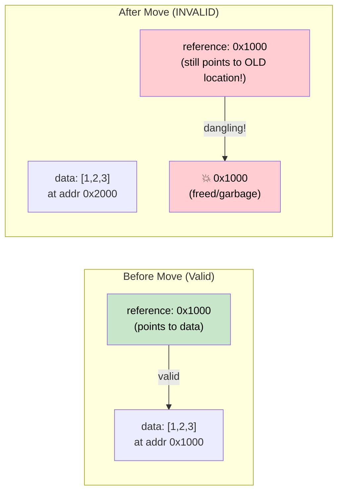

# 4. Pin and Unpin / 4. `Pin` 与 `Unpin` 🔴

> **What you'll learn / 你将学到：**
> - Why self-referential structs break when moved in memory / 为什么自引用结构体在内存中移动时会崩溃
> - What `Pin<P>` guarantees and how it prevents moves / `Pin<P>` 保证了什么，以及它是如何防止移动的
> - The three practical pinning patterns: `Box::pin()`, `tokio::pin!()`, `Pin::new()` / 三种实用的 Pin 模式：`Box::pin()`、`tokio::pin!()`、`Pin::new()`
> - When `Unpin` gives you an escape hatch / 什么时候 `Unpin` 可以作为“逃生口”

## Why Pin Exists / 为什么需要 Pin

This is the most confusing concept in async Rust. Let's build the intuition step by step.

这是 async Rust 中最令人困惑的概念。让我们循序渐进地建立直觉。

### The Problem: Self-Referential Structs / 问题所在：自引用结构体

When the compiler transforms an `async fn` into a state machine, that state machine may contain references to its own fields. This creates a *self-referential struct* — and moving it in memory would invalidate those internal references.

当编译器将 `async fn` 转换为状态机时，该状态机可能包含对其自身字段的引用。这创建了一个 *self-referential struct*（自引用结构体）—— 在内存中移动它会导致这些内部引用失效。

```rust
// What the compiler generates (simplified) for:
// async fn example() {
//     let data = vec![1, 2, 3];
//     let reference = &data;       // Points to data above
//     use_ref(reference).await;
// }

// Becomes something like:
enum ExampleStateMachine {
    State0 {
        data: Vec<i32>,
        // reference: &Vec<i32>,  // PROBLEM: points to `data` above
        //                        // If this struct moves, the pointer is dangling!
    },
    State1 {
        data: Vec<i32>,
        reference: *const Vec<i32>, // Internal pointer to data field
    },
    Complete,
}
```



### Self-Referential Structs / 自引用结构体

This isn't an academic concern. Every `async fn` that holds a reference across an `.await` point creates a self-referential state machine:

这不仅仅是一个理论问题。每一个跨越 `.await` 点持有引用的 `async fn` 都会创建一个自引用的状态机：

```rust
async fn problematic() {
    let data = String::from("hello");
    let slice = &data[..]; // slice borrows data
    
    some_io().await; // <-- .await point: state machine stores both data AND slice
    
    println!("{slice}"); // uses the reference after await
}
// The generated state machine has `data: String` and `slice: &str`
// where slice points INTO data. Moving the state machine = dangling pointer.
// 生成的状态机包含 `data: String` 和 `slice: &str`，其中 slice 指向 data 内部。
// 移动该状态机将导致指针悬空。
```

### Pin in Practice / Pin 的实践

`Pin<P>` is a wrapper that prevents moving the value behind the pointer:

`Pin<P>` 是一个包装器，用于防止移动指针所指向的值：

```rust
use std::pin::Pin;

let mut data = String::from("hello");

// Pin it — now it can't be moved
// 固定它 —— 现在它不能被移动了
let pinned: Pin<&mut String> = Pin::new(&mut data);

// Can still use it:
println!("{}", pinned.as_ref().get_ref()); // "hello"

// But we can't get &mut String back (which would allow mem::swap):
// 但我们无法拿回 &mut String（那将允许 mem::swap）：
// let mutable: &mut String = Pin::into_inner(pinned); // Only if String: Unpin
// String IS Unpin, so this actually works for String.
// But for self-referential state machines (which are !Unpin), it's blocked.
```

In real code, you mostly encounter Pin in three places:

在实际代码中，你主要在三个地方遇到 Pin：

```rust
// 1. poll() signature — all futures are polled through Pin
// 1. poll() 签名 —— 所有 future 都是通过 Pin 进行轮询的
fn poll(self: Pin<&mut Self>, cx: &mut Context<'_>) -> Poll<Output>;

// 2. Box::pin() — heap-allocate and pin a future
// 2. Box::pin() —— 在堆上分配并固定一个 future
let future: Pin<Box<dyn Future<Output = i32>>> = Box::pin(async { 42 });

// 3. tokio::pin!() — pin a future on the stack
// 3. tokio::pin!() —— 在栈上固定一个 future
tokio::pin!(my_future);
// Now my_future: Pin<&mut impl Future>
```

### The Unpin Escape Hatch / `Unpin` 逃生口

Most types in Rust are `Unpin` — they don't contain self-references, so pinning is a no-op. Only compiler-generated state machines (from `async fn`) are `!Unpin`.

Rust 中的大多数类型都是 `Unpin` —— 它们不包含自引用，因此固定（pinning）操作对它们没有实际影响。只有编译器生成的（来自 `async fn`）状态机是 `!Unpin`。

```rust
// These are all Unpin — pinning them does nothing special:
// 这些都是 Unpin —— 固定它们没有什么特别之处：
// i32, String, Vec<T>, HashMap<K,V>, Box<T>, &T, &mut T

// These are !Unpin — they MUST be pinned before polling:
// 这些是 !Unpin —— 它们在轮询之前必须被固定：
// The state machines generated by `async fn` and `async {}`

// Practical implication:
// If you write a Future by hand and it has NO self-references,
// implement Unpin to make it easier to work with:
// 实际影响：如果你手写一个 Future 且它没有自引用，请实现 Unpin 以方便使用：
impl Unpin for MySimpleFuture {} // "I'm safe to move, trust me"
```

### Quick Reference / 快速参考

| What / 内容 | When / 场景 | How / 方式 |
|------|------|-----|
| Pin a future on the heap / 在堆上固定 future | Storing in a collection, returning from function / 存储在集合中、从函数返回 | `Box::pin(future)` |
| Pin a future on the stack / 在栈上固定 future | Local use in `select!` or manual polling / 在 `select!` 中局部使用或手动轮询 | `tokio::pin!(future)` or `pin_mut!` from `pin-utils` |
| Pin in function signature / 函数签名中的 Pin | Accepting pinned futures / 接收已固定的 future | `future: Pin<&mut F>` |
| Require Unpin / 要求 Unpin | When you need to move a future after creation / 需要在创建后移动 future 时 | `F: Future + Unpin` |

<details>
<summary><strong>🏋️ Exercise: Pin and Move / 练习：Pin 与移动</strong> (点击展开)</summary>

**Challenge**: Which of these code snippets compile? For each one that doesn't, explain why and fix it.

**挑战**：以下哪些代码片段可以编译？对于不能编译的，解释原因并修复它。

```rust
// Snippet A
let fut = async { 42 };
let pinned = Box::pin(fut);
let moved = pinned; // Move the Box
let result = moved.await;

// Snippet B
let fut = async { 42 };
tokio::pin!(fut);
let moved = fut; // Move the pinned future
let result = moved.await;

// Snippet C
use std::pin::Pin;
let mut fut = async { 42 };
let pinned = Pin::new(&mut fut);
```

<details>
<summary>🔑 Solution / 参考答案</summary>

**Snippet A**: ✅ **Compiles / 可编译。** `Box::pin()` puts the future on the heap. Moving the `Box` moves the *pointer*, not the future itself. The future stays pinned in its heap location.
`Box::pin()` 将 future 放在堆上。移动 `Box` 只是移动了 *指针*，而不是 future 本身。Future 在其堆位置保持固定。

**Snippet B**: ❌ **Does not compile / 不可编译。** `tokio::pin!` pins the future to the stack and rebinds `fut` as `Pin<&mut ...>`. You can't move out of a pinned reference. **Fix**: Don't move it — use it in place:
`tokio::pin!` 将 future 固定在栈上，并将 `fut` 重新绑定为 `Pin<&mut ...>`。你不能从固定引用中移出。**修复方案**：不要移动它 —— 就地使用：
```rust
let fut = async { 42 };
tokio::pin!(fut);
let result = fut.await; // Use directly, don't reassign
```

**Snippet C**: ❌ **Does not compile / 不可编译。** `Pin::new()` requires `T: Unpin`. Async blocks generate `!Unpin` types. **Fix**: Use `Box::pin()` or `unsafe Pin::new_unchecked()`:
`Pin::new()` 要求 `T: Unpin`。异步块生成的是 `!Unpin` 类型。**修复方案**：使用 `Box::pin()` 或 `unsafe Pin::new_unchecked()`：
```rust
let fut = async { 42 };
let pinned = Box::pin(fut); // Heap-pin — works with !Unpin
```

**Key takeaway**: `Box::pin()` is the safe, easy way to pin `!Unpin` futures. `tokio::pin!()` pins on the stack but the future can't be moved after. `Pin::new()` only works with `Unpin` types.
**关键点**：`Box::pin()` 是固定 `!Unpin` future 的安全简便方法。`tokio::pin!()` 在栈上固定，但之后 future 就不能再移动。`Pin::new()` 仅适用于 `Unpin` 类型。

</details>
</details>

> **Key Takeaways — Pin and Unpin / 关键要点：Pin 与 Unpin**
> - `Pin<P>` is a wrapper that **prevents the pointee from being moved** — essential for self-referential state machines / `Pin<P>` 是一个包装器，**防止所指对象被移动** —— 这对于自引用状态机至关重要
> - `Box::pin()` is the safe, easy default for pinning futures on the heap / `Box::pin()` 是在堆上固定 future 的安全简便默认选择
> - `tokio::pin!()` pins on the stack — cheaper but the future can't be moved afterward / `tokio::pin!()` 在栈上固定 —— 开销更小，但之后 future 无法移动
> - `Unpin` is an auto-trait opt-out: types that implement `Unpin` can be moved even when pinned (most types are `Unpin`; async blocks are not) / `Unpin` 是一个自动 trait 选择退出：实现了 `Unpin` 的类型即使被固定也可以移动（大多数类型都是 `Unpin`；异步块则不是）

> **See also / 延伸阅读：** [Ch 2 — The Future Trait / 第 2 章：Future Trait](ch02-the-future-trait.md) for `Pin<&mut Self>` in poll, [Ch 5 — The State Machine Reveal / 第 5 章：状态机真相](ch05-the-state-machine-reveal.md) for why async state machines are self-referential

***


