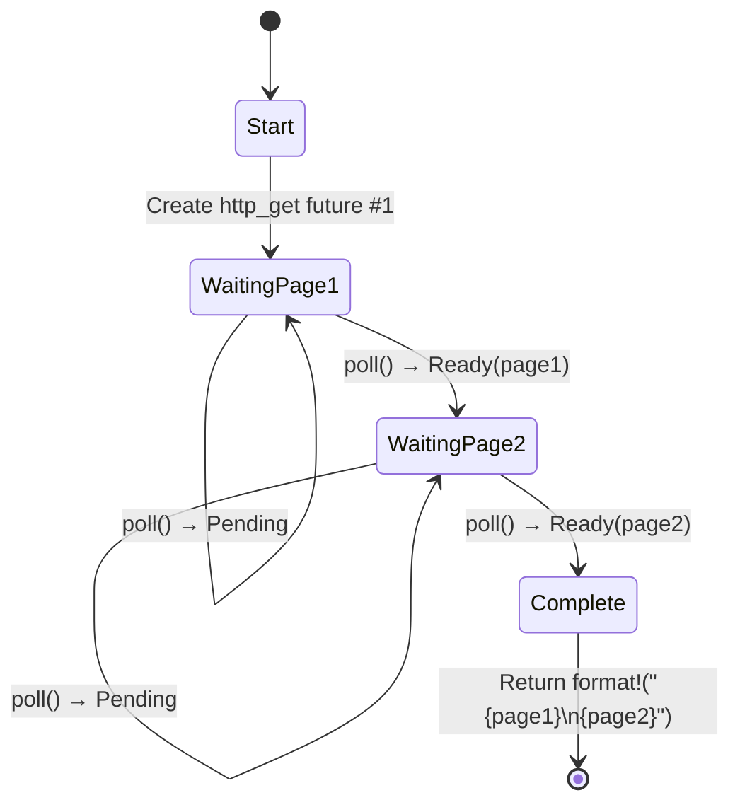

# 5. The State Machine Reveal / 5. 状态机真相 🟢

> **What you'll learn / 你将学到：**
> - How the compiler transforms `async fn` into an enum state machine / 编译器如何将 `async fn` 转换为枚举状态机
> - Side-by-side comparison: source code vs generated states / 源码与生成的各状态之间的对比
> - Why large stack allocations in `async fn` blow up future sizes / 为什么 `async fn` 中巨大的栈分配会导致 future 体积膨胀
> - The drop optimization: values drop as soon as they're no longer needed / Drop 优化：不再需要的值会立即被释放

## What the Compiler Actually Generates / 编译器究竟生成了什么

When you write `async fn`, the compiler transforms your sequential-looking code into an enum-based state machine. Understanding this transformation is the key to understanding async Rust's performance characteristics and many of its quirks.

当你编写 `async fn` 时，编译器会将你看起来像是顺序执行的代码转换为基于枚举的状态机。理解这一转换过程是掌握 async Rust 性能特性及其许多“怪癖”的关键。

### Side-by-Side: async fn vs State Machine / 对比：async fn 与状态机

```rust
// What you write:
// 你写的代码：
async fn fetch_two_pages() -> String {
    let page1 = http_get("https://example.com/a").await;
    let page2 = http_get("https://example.com/b").await;
    format!("{page1}\n{page2}")
}
```

The compiler generates something conceptually like this:

编译器会生成概念上类似于以下的代码：

```rust
enum FetchTwoPagesStateMachine {
    // State 0: About to call http_get for page1
    // 状态 0：准备为 page1 调用 http_get
    Start,

    // State 1: Waiting for page1, holding the future
    // 状态 1：等待 page1，持有相应的 future
    WaitingPage1 {
        fut1: HttpGetFuture,
    },

    // State 2: Got page1, waiting for page2
    // 状态 2：拿到 page1，等待 page2
    WaitingPage2 {
        page1: String,
        fut2: HttpGetFuture,
    },

    // Terminal state
    // 终止状态
    Complete,
}

impl Future for FetchTwoPagesStateMachine {
    type Output = String;

    fn poll(mut self: Pin<&mut Self>, cx: &mut Context<'_>) -> Poll<String> {
        loop {
            match self.as_mut().get_mut() {
                Self::Start => {
                    let fut1 = http_get("https://example.com/a");
                    *self.as_mut().get_mut() = Self::WaitingPage1 { fut1 };
                }
                Self::WaitingPage1 { fut1 } => {
                    let page1 = match Pin::new(fut1).poll(cx) {
                        Poll::Ready(v) => v,
                        Poll::Pending => return Poll::Pending,
                    };
                    let fut2 = http_get("https://example.com/b");
                    *self.as_mut().get_mut() = Self::WaitingPage2 { page1, fut2 };
                }
                Self::WaitingPage2 { page1, fut2 } => {
                    let page2 = match Pin::new(fut2).poll(cx) {
                        Poll::Ready(v) => v,
                        Poll::Pending => return Poll::Pending,
                    };
                    let result = format!("{page1}\n{page2}");
                    *self.as_mut().get_mut() = Self::Complete;
                    return Poll::Ready(result);
                }
                Self::Complete => panic!("polled after completion"),
            }
        }
    }
}
```

> **Note**: This desugaring is *conceptual*. The real compiler output uses `unsafe` pin projections — the `get_mut()` calls shown here require `Unpin`, but async state machines are `!Unpin`. The goal is to illustrate state transitions, not produce compilable code.
>
> **注意**：这种语法糖还原（desugaring）是 *概念性* 的。编译器实际生成的代码使用 `unsafe` 的 pin 投影 —— 这里显示的 `get_mut()` 调用要求 `Unpin`，但异步状态机是 `!Unpin` 的。这里的目的是演示状态转换，而不是生成可编译的代码。



> **State contents / 状态内容：**
> - **WaitingPage1** — stores `fut1: HttpGetFuture` (page2 not yet allocated) / 存储 `fut1: HttpGetFuture`（page2 尚未分配）
> - **WaitingPage2** — stores `page1: String`, `fut2: HttpGetFuture` (fut1 has been dropped) / 存储 `page1: String` 和 `fut2: HttpGetFuture`（fut1 已被释放）

### Why This Matters for Performance / 为什么这对性能很重要

**Zero-cost / 零成本**: The state machine is a stack-allocated enum. No heap allocation per future, no garbage collector, no boxing — unless you explicitly use `Box::pin()`.

**零成本**：状态机是一个分配在栈上的枚举。每个 future 都没有堆分配，没有垃圾回收，没有 boxing —— 除非你显式使用 `Box::pin()`。

**Size / 尺寸**: The enum's size is the maximum of all its variants. Each `.await` point creates a new variant. This means:

**尺寸**：枚举的大小是其所有变体中的最大值。每个 `.await` 点都会创建一个新的变体。这意味着：

```rust
async fn small() {
    let a: u8 = 0;
    yield_now().await;
    let b: u8 = 0;
    yield_now().await;
}
// Size ≈ max(size_of(u8), size_of(u8)) + discriminant + future sizes
//      ≈ small!
// 尺寸 ≈ 变体最大值 + 判别码 + 内部 future 大小，依然很小！

async fn big() {
    let buf: [u8; 1_000_000] = [0; 1_000_000]; // 1MB on the stack!
    some_io().await;
    process(&buf);
}
// Size ≈ 1MB + inner future sizes
// ⚠️ Don't stack-allocate huge buffers in async functions!
// Use Vec<u8> or Box<[u8]> instead.
// ⚠️ 不要在异步函数中在栈上分配巨大的缓冲区！请改用 Vec<u8> 或 Box<[u8]>。
```

**Drop optimization / Drop 优化**: When a state machine transitions, it drops values no longer needed. In the example above, `fut1` is dropped when we transition from `WaitingPage1` to `WaitingPage2` — the compiler inserts the drop automatically.

**Drop 优化**：当状态机发生迁移时，它会释放（drop）不再需要的值。在上面的例子中，当我们从 `WaitingPage1` 迁移到 `WaitingPage2` 时，`fut1` 会被释放 —— 编译器会自动插入释放操作。

> **Practical rule**: Large stack allocations in `async fn` blow up the future's size. If you see stack overflows in async code, check for large arrays or deeply nested futures. Use `Box::pin()` to heap-allocate sub-futures if needed.
>
> **实践法则**：在 `async fn` 中进行巨大的栈分配会使 future 的体积飙升。如果你在异步代码中遇到栈溢出，请检查是否有大数组或深度嵌套的 future。必要时使用 `Box::pin()` 来堆分配子 future。

### Exercise: Predict the State Machine / 练习：预测状态机

<details>
<summary>🏋️ Exercise / 练习（点击展开）</summary>

**Challenge**: Given this async function, sketch the state machine the compiler generates. How many states (enum variants) does it have? What values are stored in each?

**挑战**：给定这个异步函数，勾勒出编译器生成的状态机。它有多少个状态（枚举变体）？每个状态中存储了什么值？

```rust
async fn pipeline(url: &str) -> Result<usize, Error> {
    let response = fetch(url).await?;
    let body = response.text().await?;
    let parsed = parse(body).await?;
    Ok(parsed.len())
}
```

<details>
<summary>🔑 Solution / 参考答案</summary>

Four states:

五个状态：

1. **Start** — stores `url` / **Start** —— 存储 `url`
2. **WaitingFetch** — stores `url`, `fetch` future / **WaitingFetch** —— 存储 `url` 和 `fetch` 的 future
3. **WaitingText** — stores `response`, `text()` future / **WaitingText** —— 存储 `response` 和 `text()` 的 future
4. **WaitingParse** — stores `body`, `parse` future / **WaitingParse** —— 存储 `body` 和 `parse` 的 future
5. **Done** — returned `Ok(parsed.len())` / **Done** —— 返回了 `Ok(parsed.len())`

Each `.await` creates a yield point = a new enum variant. The `?` adds early-exit paths but doesn't add extra states — it's just a `match` on the `Poll::Ready` value.

每个 `.await` 都会创建一个 yield 点，即一个新的枚举变体。`?` 增加了提前退出的路径，但并不会增加额外的状态 —— 它仅仅是对 `Poll::Ready` 值的一个 `match` 操作。

</details>
</details>

> **Key Takeaways — The State Machine Reveal / 关键要点：状态机真相**
> - `async fn` compiles to an enum with one variant per `.await` point / `async fn` 会被编译为一个枚举，每个 `.await` 点对应一个变体
> - The future's **size** = max of all variant sizes — large stack values blow it up / Future 的**尺寸** = 所有变体尺寸的最大值 —— 巨大的栈分配会使其剧增
> - The compiler inserts **drops** at state transitions automatically / 编译器在状态转换时会自动插入 **drop** 操作
> - Use `Box::pin()` or heap allocation when future size becomes a problem / 当 future 尺寸成为问题时，请使用 `Box::pin()` 或堆分配

> **See also / 延伸阅读：** [Ch 4 — Pin and Unpin / 第 4 章：Pin 与 Unpin](ch04-pin-and-unpin.md) for why the generated enum needs pinning, [Ch 6 — Building Futures by Hand / 第 6 章：手动构建 Future](ch06-building-futures-by-hand.md) to build these state machines yourself

***


