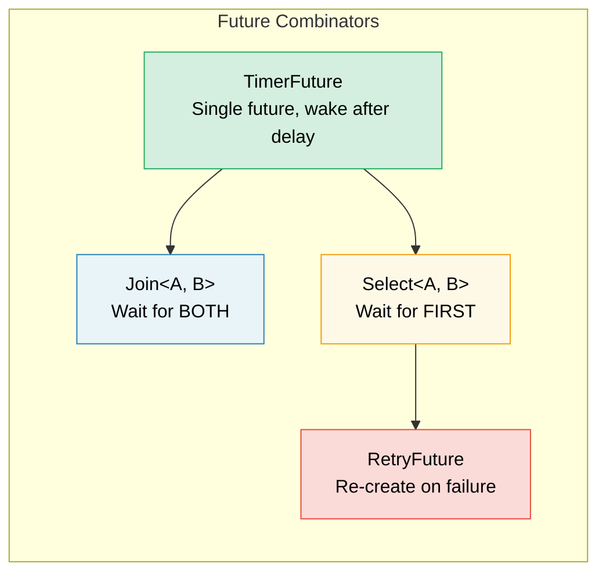

# 6. Building Futures by Hand / 6. 手写 Future 🟡

> **What you'll learn / 你将学到：**
> - Implementing a `TimerFuture` with thread-based waking / 基于线程唤醒实现 `TimerFuture`
> - Building a `Join` combinator: run two futures concurrently / 构建 `Join` 组合器：并发运行两个 future
> - Building a `Select` combinator: race two futures / 构建 `Select` 组合器：让两个 future 竞速
> - How combinators compose — futures all the way down / 组合器如何嵌套 —— 万物皆可 Future

## A Simple Timer Future / 一个简单的定时器 Future

Now let's build real, useful futures from scratch. This cements the theory from chapters 2-5.

现在让我们从零开始构建真实且有用的 future。这将巩固第 2 至第 5 章中的理论。

### TimerFuture: A Complete Example / TimerFuture：完整示例

```rust
use std::future::Future;
use std::pin::Pin;
use std::sync::{Arc, Mutex};
use std::task::{Context, Poll, Waker};
use std::thread;
use std::time::{Duration, Instant};

pub struct TimerFuture {
    shared_state: Arc<Mutex<SharedState>>,
}

struct SharedState {
    completed: bool,
    waker: Option<Waker>,
}

impl TimerFuture {
    pub fn new(duration: Duration) -> Self {
        let shared_state = Arc::new(Mutex::new(SharedState {
            completed: false,
            waker: None,
        }));

        // Spawn a thread that sets completed=true after the duration
        // 派生一个线程，在指定时长后设置 completed=true
        let thread_shared_state = Arc::clone(&shared_state);
        thread::spawn(move || {
            thread::sleep(duration);
            let mut state = thread_shared_state.lock().unwrap();
            state.completed = true;
            if let Some(waker) = state.waker.take() {
                waker.wake(); // Notify the executor
                              // 通知执行器
            }
        });

        TimerFuture { shared_state }
    }
}

impl Future for TimerFuture {
    type Output = ();

    fn poll(self: Pin<&mut Self>, cx: &mut Context<'_>) -> Poll<()> {
        let mut state = self.shared_state.lock().unwrap();
        if state.completed {
            Poll::Ready(())
        } else {
            // Store the waker so the timer thread can wake us
            // IMPORTANT: Always update the waker — the executor may
            // have changed it between polls
            // 存储 waker 以便计时器线程可以唤醒我们
            // 重要：一定要更新 waker —— 执行器在两次轮询之间可能会更改它
            state.waker = Some(cx.waker().clone());
            Poll::Pending
        }
    }
}

// Usage:
// async fn example() {
//     println!("Starting timer...");
//     TimerFuture::new(Duration::from_secs(2)).await;
//     println!("Timer done!");
// }
//
// ⚠️ This spawns an OS thread per timer — fine for learning, but in
// production use `tokio::time::sleep` which is backed by a shared
// timer wheel and requires zero extra threads.
// ⚠️ 这种做法会为每个计时器派生一个操作系统线程 —— 仅供学习。
// 在生产环境中请使用 `tokio::time::sleep`，它由共享的时间轮驱动，不需要额外线程。
```

### Join: Running Two Futures Concurrently / Join：并发运行两个 Future

`Join` polls two futures and completes when *both* finish. This is how `tokio::join!` works internally:

`Join` 会轮询两个 future，并在 *两者* 都完成后才算完成。这正是 `tokio::join!` 内部的工作原理：

```rust
use std::future::Future;
use std::pin::Pin;
use std::task::{Context, Poll};

/// Polls two futures concurrently, returns both results as a tuple
/// 并发轮询两个 future，并以元组形式返回两个结果
pub struct Join<A, B>
where
    A: Future,
    B: Future,
{
    a: MaybeDone<A>,
    b: MaybeDone<B>,
}

enum MaybeDone<F: Future> {
    Pending(F),
    Done(F::Output),
    Taken, // Output has been taken
}

impl<A, B> Join<A, B>
where
    A: Future,
    B: Future,
{
    pub fn new(a: A, b: B) -> Self {
        Join {
            a: MaybeDone::Pending(a),
            b: MaybeDone::Pending(b),
        }
    }
}

impl<A, B> Future for Join<A, B>
where
    A: Future + Unpin,
    B: Future + Unpin,
{
    type Output = (A::Output, B::Output);

    fn poll(mut self: Pin<&mut Self>, cx: &mut Context<'_>) -> Poll<Self::Output> {
        // Poll A if not done
        if let MaybeDone::Pending(ref mut fut) = self.a {
            if let Poll::Ready(val) = Pin::new(fut).poll(cx) {
                self.a = MaybeDone::Done(val);
            }
        }

        // Poll B if not done
        if let MaybeDone::Pending(ref mut fut) = self.b {
            if let Poll::Ready(val) = Pin::new(fut).poll(cx) {
                self.b = MaybeDone::Done(val);
            }
        }

        // Both done?
        match (&self.a, &self.b) {
            (MaybeDone::Done(_), MaybeDone::Done(_)) => {
                // Take both outputs
                let a_val = match std::mem::replace(&mut self.a, MaybeDone::Taken) {
                    MaybeDone::Done(v) => v,
                    _ => unreachable!(),
                };
                let b_val = match std::mem::replace(&mut self.b, MaybeDone::Taken) {
                    MaybeDone::Done(v) => v,
                    _ => unreachable!(),
                };
                Poll::Ready((a_val, b_val))
            }
            _ => Poll::Pending, // At least one is still pending
        }
    }
}

// Usage:
// let (page1, page2) = Join::new(
//     http_get("https://example.com/a"),
//     http_get("https://example.com/b"),
// ).await;
// Both requests run concurrently!
```

> **Key insight**: "Concurrent" here means *interleaved on the same thread*. Join doesn't spawn threads — it polls both futures in the same `poll()` call. This is cooperative concurrency, not parallelism.
>
> **关键洞察**：这里的“并发”是指 *在同一线程上交替执行*。`Join` 并不会派生新线程 —— 它在同一次 `poll()` 调用中轮询两个 future。这是协作式并发，而不是并行。



### Select: Racing Two Futures / Select：让两个 Future 竞速

`Select` completes when *either* future finishes first (the other is dropped):

`Select` 在 *其中任意一个* future 先完成时即告完成（另一个会被丢弃）：

```rust
use std::future::Future;
use std::pin::Pin;
use std::task::{Context, Poll};

pub enum Either<A, B> {
    Left(A),
    Right(B),
}

/// Returns whichever future completes first; drops the other
/// 返回最先完成的那个 future，并丢弃另一个
pub struct Select<A, B> {
    a: A,
    b: B,
}

impl<A, B> Select<A, B>
where
    A: Future + Unpin,
    B: Future + Unpin,
{
    pub fn new(a: A, b: B) -> Self {
        Select { a, b }
    }
}

impl<A, B> Future for Select<A, B>
where
    A: Future + Unpin,
    B: Future + Unpin,
{
    type Output = Either<A::Output, B::Output>;

    fn poll(mut self: Pin<&mut Self>, cx: &mut Context<'_>) -> Poll<Self::Output> {
        // Poll A first
        if let Poll::Ready(val) = Pin::new(&mut self.a).poll(cx) {
            return Poll::Ready(Either::Left(val));
        }

        // Then poll B
        if let Poll::Ready(val) = Pin::new(&mut self.b).poll(cx) {
            return Poll::Ready(Either::Right(val));
        }

        Poll::Pending
    }
}
```

> **Fairness note**: Our `Select` always polls A first — if both are ready, A always wins. Tokio's `select!` macro randomizes the poll order for fairness.
>
> **公平性说明**：我们的 `Select` 总是先轮询 A —— 如果两者都就绪，A 总是获胜。Tokio 的 `select!` 宏会随机化轮询顺序以确保公平。

<details>
<summary><strong>🏋️ Exercise: Build a RetryFuture / 练习：构建一个 RetryFuture</strong> (点击展开)</summary>

**Challenge**: Build a `RetryFuture<F, Fut>` that takes a closure `F: Fn() -> Fut` and retries up to N times if the inner future returns `Err`. It should return the first `Ok` result or the last `Err`.

**挑战**：构建一个 `RetryFuture<F, Fut>`，它接收一个闭包 `F: Fn() -> Fut`，并在内部 future 返回 `Err` 时重试最多 N 次。它应该返回第一个 `Ok` 结果或最后一个 `Err`。

*Hint*: You'll need states for "running attempt" and "all attempts exhausted."

*提示*：你需要“运行尝试中”和“尝试已耗尽”的状态。

<details>
<summary>🔑 Solution / 参考答案</summary>

```rust
use std::future::Future;
use std::pin::Pin;
use std::task::{Context, Poll};

pub struct RetryFuture<F, Fut, T, E>
where
    F: Fn() -> Fut,
    Fut: Future<Output = Result<T, E>> + Unpin,
{
    factory: F,
    current: Option<Fut>,
    remaining: usize,
    last_error: Option<E>,
}

impl<F, Fut, T, E> RetryFuture<F, Fut, T, E>
where
    F: Fn() -> Fut,
    Fut: Future<Output = Result<T, E>> + Unpin,
{
    pub fn new(max_attempts: usize, factory: F) -> Self {
        let current = Some((factory)());
        RetryFuture {
            factory,
            current,
            remaining: max_attempts.saturating_sub(1),
            last_error: None,
        }
    }
}

impl<F, Fut, T, E> Future for RetryFuture<F, Fut, T, E>
where
    F: Fn() -> Fut + Unpin,
    Fut: Future<Output = Result<T, E>> + Unpin,
    T: Unpin,
    E: Unpin,
{
    type Output = Result<T, E>;

    fn poll(mut self: Pin<&mut Self>, cx: &mut Context<'_>) -> Poll<Self::Output> {
        loop {
            if let Some(ref mut fut) = self.current {
                match Pin::new(fut).poll(cx) {
                    Poll::Ready(Ok(val)) => return Poll::Ready(Ok(val)),
                    Poll::Ready(Err(e)) => {
                        self.last_error = Some(e);
                        if self.remaining > 0 {
                            self.remaining -= 1;
                            self.current = Some((self.factory)());
                            // Loop to poll the new future immediately
                        } else {
                            return Poll::Ready(Err(self.last_error.take().unwrap()));
                        }
                    }
                    Poll::Pending => return Poll::Pending,
                }
            } else {
                return Poll::Ready(Err(self.last_error.take().unwrap()));
            }
        }
    }
}
```

**Key takeaway**: The retry future is itself a state machine: it holds the current attempt and creates new inner futures on failure. This is how combinators compose — futures all the way down.

**关键点**：Retry future 本身也是一个状态机：它持有当前的尝试并在失败时创建新的内部 future。这就是组合器的组合方式 —— 万物皆可 Future。

</details>
</details>

> **Key Takeaways — Building Futures by Hand / 关键要点：手写 Future**
> - A future needs three things: state, a `poll()` implementation, and a waker registration / 一个 future 需要三样东西：状态、`poll()` 实现和 waker 注册
> - `Join` polls both sub-futures; `Select` returns whichever finishes first / `Join` 轮询两个子 future；`Select` 返回最先完成的那个
> - Combinators are themselves futures wrapping other futures — it's turtles all the way down / 组合器本身也是包装其他 future 的 future —— 它是递归嵌套的
> - Building futures by hand gives deep insight, but in production use `tokio::join!`/`select!` / 手写 future 能让你获得深刻洞见，但在生产环境中建议使用 `tokio::join!`/`select!`

> **See also / 延伸阅读：** [Ch 2 — The Future Trait / 第 2 章：Future Trait](ch02-the-future-trait.md) for the trait definition, [Ch 8 — Tokio Deep Dive / 第 8 章：Tokio 深入解析](ch08-tokio-deep-dive.md) for production-grade equivalents

***


