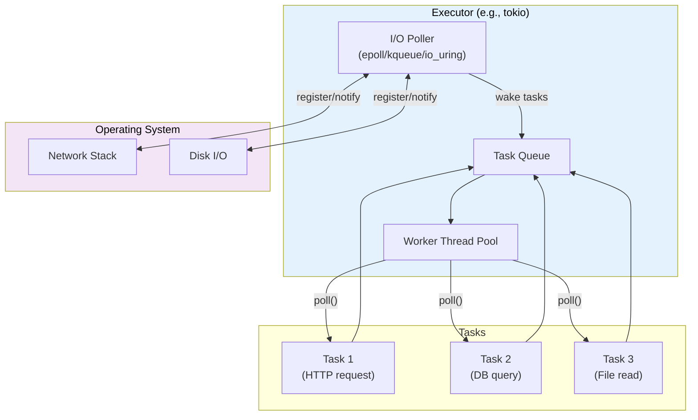
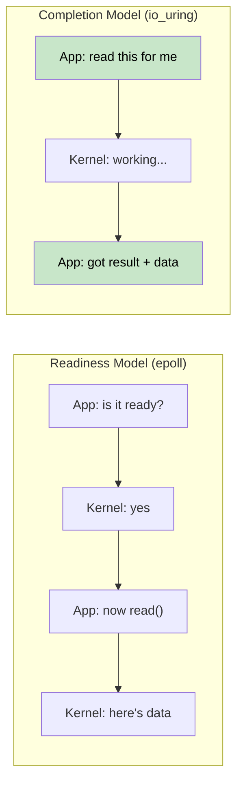
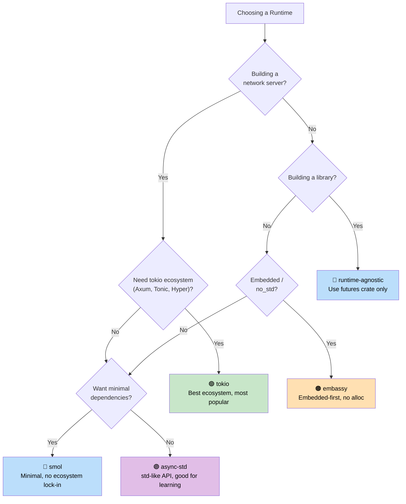

# 7. Executors and Runtimes / 7. 执行器与运行时 🟡

> **What you'll learn / 你将学到：**
> - What an executor does: poll + sleep efficiently / 执行器的作用：轮询 + 高效休眠
> - The six major runtimes: mio, io_uring, tokio, async-std, smol, embassy / 六大主要运行时：mio、io_uring、tokio、async-std、smol、embassy
> - A decision tree for choosing the right runtime / 选择合适运行时的决策树
> - Why runtime-agnostic library design matters / 为什么运行时无关的库设计很重要

## What an Executor Does / 执行器是做什么的

An executor has two jobs:

一个执行器有两项工作：

1. **Poll futures** when they're ready to make progress / 在 future 准备好继续推进时对其进行 **Poll（轮询）**
2. **Sleep efficiently** when no futures are ready (using OS I/O notification APIs) / 在没有 future 就绪时 **高效休眠**（利用操作系统的 I/O 通知 API）



### mio: The Foundation Layer / mio：底层基石

[mio](https://github.com/tokio-rs/mio) (Metal I/O) is not an executor — it's the lowest-level cross-platform I/O notification library. It wraps `epoll` (Linux), `kqueue` (macOS/BSD), and IOCP (Windows).

[mio](https://github.com/tokio-rs/mio) (Metal I/O) 并不是一个执行器 —— 它是最底层的跨平台 I/O 通知库。它封装了 `epoll` (Linux)、`kqueue` (macOS/BSD) 和 IOCP (Windows)。

```rust
// Conceptual mio usage (simplified):
// mio 的概念性用法（简化版）：
use mio::{Events, Interest, Poll, Token};
use mio::net::TcpListener;

let mut poll = Poll::new()?;
let mut events = Events::with_capacity(128);

let mut server = TcpListener::bind("0.0.0.0:8080")?;
poll.registry().register(&mut server, Token(0), Interest::READABLE)?;

// Event loop — blocks until something happens
// 事件循环 —— 阻塞直到有事件发生
loop {
    poll.poll(&mut events, None)?; // Sleeps until I/O event
    for event in events.iter() {
        match event.token() {
            Token(0) => { /* server has a new connection */ }
            _ => { /* other I/O ready */ }
        }
    }
}
```

Most developers never touch mio directly — tokio and smol build on top of it.

大多数开发者永远不会直接接触 mio —— tokio 和 smol 都是构建在它之上的。

### io_uring: The Completion-Based Future / io_uring：基于完成通知的 Future

Linux's `io_uring` (kernel 5.1+) represents a fundamental shift from the readiness-based I/O model that mio/epoll use:

Linux 的 `io_uring`（内核 5.1+）代表了从 mio/epoll 使用的“就绪通知（readiness-based）”模型到“完成通知（completion-based）”模型的根本转变：

```text
Readiness-based (epoll / mio / tokio):
  1. Ask: "Is this socket readable?"     → epoll_wait()
  2. Kernel: "Yes, it's ready"           → EPOLLIN event
  3. App:   read(fd, buf)                → might still block briefly!

就绪模型 (epoll / mio / tokio):
  1. 询问：“这个 socket 可读吗？”         → epoll_wait()
  2. 内核：“是的，就绪了”                → EPOLLIN 事件
  3. 应用： read(fd, buf)                → 仍可能发生短暂阻塞！

Completion-based (io_uring):
  1. Submit: "Read from this socket into this buffer"  → SQE
  2. Kernel: does the read asynchronously
  3. App:   gets completed result with data            → CQE

完成模型 (io_uring):
  1. 提交：“从这个 socket 读取数据到这个缓冲区”  → SQE
  2. 内核： 异步执行读取操作
  3. 应用： 获取包含数据的完成结果              → CQE
```



**The ownership challenge / 所有权挑战**: io_uring requires the kernel to own the buffer until the operation completes. This conflicts with Rust's standard `AsyncRead` trait which borrows the buffer. That's why `tokio-uring` has different I/O traits:

io_uring 要求内核在操作完成前拥有缓冲区的所有权。这与 Rust 标准的 `AsyncRead` trait（它借用缓冲区）相冲突。因此 `tokio-uring` 使用了不同的 I/O trait：

```rust
// Standard tokio (readiness-based) — borrows the buffer:
// 标准 tokio (基于就绪) —— 借用缓冲区：
let n = stream.read(&mut buf).await?;  // buf is borrowed

// tokio-uring (completion-based) — takes ownership of the buffer:
// tokio-uring (基于完成) —— 获取缓冲区的所有权：
let (result, buf) = stream.read(buf).await;  // buf is moved in, returned back
let n = result?;
```

| Aspect / 维度 | epoll (tokio) | io_uring (tokio-uring) |
|--------|--------------|----------------------|
| **Model / 模型** | Readiness notification / 就绪通知 | Completion notification / 完成通知 |
| **Syscalls / 系统调用** | epoll_wait + read/write | Batched SQE/CQE ring / 批处理环 |
| **Buffer ownership / 缓冲区所有权** | App retains (&mut buf) / 应用持有借用 | Ownership transfer (move buf) / 所有权转移 (move) |
| **Platform / 平台** | Linux, macOS, Windows | Linux 5.1+ only / 仅限 Linux 5.1+ |
| **Zero-copy / 零拷贝** | No (userspace copy) / 无 (用户态拷贝) | Yes (registered buffers) / 有 (注册缓冲区) |
| **Maturity / 成熟度** | Production-ready / 生产就绪 | Experimental / 实验性 |

> **When to use io_uring**: High-throughput file I/O or networking where syscall overhead is the bottleneck (databases, storage engines, proxies serving 100k+ connections). For most applications, standard tokio with epoll is the right choice.
>
> **何时使用 io_uring**：高吞吐量的文件 I/O 或网络场景，且系统调用开销是瓶颈时（如数据库、存储引擎、需要处理 10 万+连接的代理）。对于大多数应用，使用 epoll 的标准 tokio 才是正确选择。

### tokio: The Batteries-Included Runtime / tokio：功能完备的运行时

The dominant async runtime in the Rust ecosystem. Used by Axum, Hyper, Tonic, and most production Rust servers.

Rust 生态系统中占主导地位的异步运行时。Axum、Hyper、Tonic 以及大多数生产级 Rust 服务器都在使用它。

```rust
// Cargo.toml:
// [dependencies]
// tokio = { version = "1", features = ["full"] }

#[tokio::main]
async fn main() {
    // Spawns a multi-threaded runtime with work-stealing scheduler
    // 派生一个带有工作窃取调度器的多线程运行时
    let handle = tokio::spawn(async {
        tokio::time::sleep(std::time::Duration::from_secs(1)).await;
        "done"
    });

    let result = handle.await.unwrap();
    println!("{result}");
}
```

**tokio features / 特性**: Timer, I/O, TCP/UDP, Unix sockets, signal handling, sync primitives (Mutex, RwLock, Semaphore, channels), fs, process, tracing integration.

**tokio 特性**：计时器、I/O、TCP/UDP、Unix 域套接字、信号处理、同步原语（Mutex、RwLock、Semaphore、通道）、文件系统、进程、tracing 集成。

### async-std: The Standard Library Mirror / async-std：标准库镜像

Mirrors the `std` API with async versions. Less popular than tokio but simpler for beginners.

用异步版本镜像了 `std` API。虽然不如 tokio 流行，但对初学者来说更简单。

```rust
// Cargo.toml:
// [dependencies]
// async-std = { version = "1", features = ["attributes"] }

#[async_std::main]
async fn main() {
    use async_std::fs;
    let content = fs::read_to_string("hello.txt").await.unwrap();
    println!("{content}");
}
```

### smol: The Minimalist Runtime / smol：极简主义运行时

Small, zero-dependency async runtime. Great for libraries that want async without pulling in tokio.

小型、零依赖的异步运行时。非常适合那些想要异步功能但不愿引入整个 tokio 的库。

```rust
// Cargo.toml:
// [dependencies]
// smol = "2"

fn main() {
    smol::block_on(async {
        let result = smol::unblock(|| {
            // Runs blocking code on a thread pool
            // 在线程池上运行阻塞代码
            std::fs::read_to_string("hello.txt")
        }).await.unwrap();
        println!("{result}");
    });
}
```

### embassy: Async for Embedded (no_std) / embassy：嵌入式异步 (no_std)

Async runtime for embedded systems. No heap allocation, no `std` required.

为嵌入式系统设计的异步运行时。无需堆分配，无需 `std`。

```rust
// Runs on microcontrollers (e.g., STM32, nRF52, RP2040)
// 运行在微控制器上（如 STM32, nRF52, RP2040）
#[embassy_executor::main]
async fn main(spawner: embassy_executor::Spawner) {
    // Blink an LED with async/await — no RTOS needed!
    // 使用 async/await 闪烁 LED —— 无需 RTOS！
    let mut led = Output::new(p.PA5, Level::Low, Speed::Low);
    loop {
        led.set_high();
        Timer::after(Duration::from_millis(500)).await;
        led.set_low();
        Timer::after(Duration::from_millis(500)).await;
    }
}
```

### Runtime Decision Tree / 运行时决策树



### Runtime Comparison Table / 运行时对比表

| Feature / 特性 | tokio | async-std | smol | embassy |
|---------|-------|-----------|------|---------|
| **Ecosystem / 生态** | Dominant / 主导 | Small / 较小 | Minimal / 极小 | Embedded / 嵌入式 |
| **Multi-threaded / 多线程** | ✅ Work-stealing / 工作窃取 | ✅ | ✅ | ❌ (single-core / 单核) |
| **no_std** | ❌ | ❌ | ❌ | ✅ |
| **Timer / 计时器** | ✅ Built-in / 内建 | ✅ Built-in / 内建 | Via `async-io` | ✅ HAL-based / 基于 HAL |
| **I/O** | ✅ Own abstractions / 自有抽象 | ✅ std mirror / std 镜像 | ✅ Via `async-io` | ✅ HAL drivers / HAL 驱动 |
| **Learning curve / 学习曲线** | Medium / 中等 | Low / 低 | Low / 低 | High (HW) / 高(涉及硬件) |
| **Binary size / 二进制大小** | Large / 较大 | Medium / 中等 | Small / 较小 | Tiny / 极微 |

<details>
<summary><strong>🏋️ Exercise: Runtime Comparison / 练习：运行时对比</strong> (点击展开)</summary>

**Challenge**: Write the same program using three different runtimes (tokio, smol, and async-std).

**挑战**：使用三种不同的运行时（tokio、smol 和 async-std）编写相同的程序。

<details>
<summary>🔑 Solution / 参考答案</summary>

```rust
// ----- tokio version -----
#[tokio::main]
async fn main() {
    let (url_result, file_result) = tokio::join!(
        async {
            tokio::time::sleep(std::time::Duration::from_millis(100)).await;
            "Response from URL"
        },
        async {
            tokio::time::sleep(std::time::Duration::from_millis(50)).await;
            "Contents of file"
        },
    );
    println!("URL: {url_result}, File: {file_result}");
}

// ----- smol version -----
fn main() {
    smol::block_on(async {
        let (url_result, file_result) = futures_lite::future::zip(
            async {
                smol::Timer::after(std::time::Duration::from_millis(100)).await;
                "Response from URL"
            },
            async {
                smol::Timer::after(std::time::Duration::from_millis(50)).await;
                "Contents of file"
            },
        ).await;
        println!("URL: {url_result}, File: {file_result}");
    });
}

// ----- async-std version -----
#[async_std::main]
async fn main() {
    let (url_result, file_result) = futures::future::join(
        async {
            async_std::task::sleep(std::time::Duration::from_millis(100)).await;
            "Response from URL"
        },
        async {
            async_std::task::sleep(std::time::Duration::from_millis(50)).await;
            "Contents of file"
        },
    ).await;
    println!("URL: {url_result}, File: {file_result}");
}
```

**Key takeaway**: The async business logic is identical across runtimes. Only the entry point and timer/IO APIs differ. This is why writing runtime-agnostic libraries (using only `std::future::Future`) is valuable.

**关键点**：异步业务逻辑在不同运行时之间是完全相同的。唯一的区别在于入口点和计时器/IO API。这就是为什么编写运行时无关的库（仅使用 `std::future::Future`）非常有价值。

</details>
</details>

> **Key Takeaways — Executors and Runtimes / 关键要点：执行器与运行时**
> - An executor's job: poll futures when woken, sleep efficiently using OS I/O APIs / 执行器的工作：在被唤醒时轮询 future，利用操作系统 I/O API 高效休眠
> - **tokio** is the default for servers; **smol** for minimal footprint; **embassy** for embedded / **tokio** 是服务器默认选型；**smol** 适用于极小占用；**embassy** 用于嵌入式
> - Your business logic should depend on `std::future::Future`, not a specific runtime / 你的业务逻辑应该依赖 `std::future::Future`，而不是特定的运行时
> - io_uring (Linux 5.1+) is the future of high-perf I/O but the ecosystem is still maturing / io_uring (Linux 5.1+) 是高性能 I/O 的未来，但生态系统仍在成熟中

> **See also / 延伸阅读：** [Ch 8 — Tokio Deep Dive / 第 8 章：Tokio 深入解析](ch08-tokio-deep-dive.md) for tokio specifics, [Ch 9 — When Tokio Isn't the Right Fit / 第 9 章：Tokio 不适用的场景](ch09-when-tokio-isnt-the-right-fit.md) for alternatives

***


