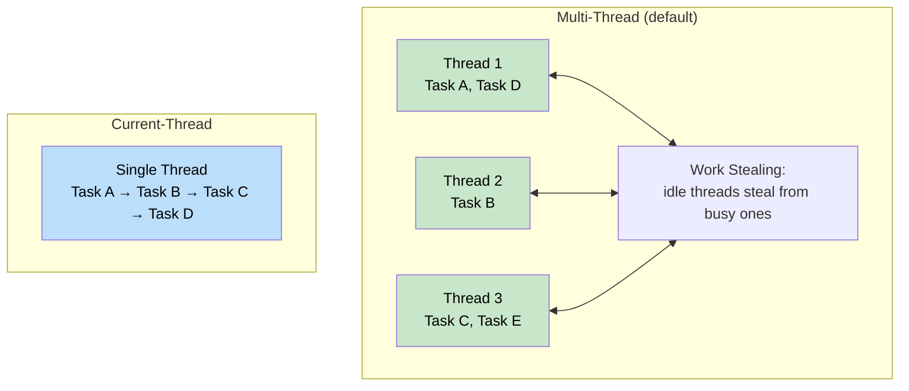
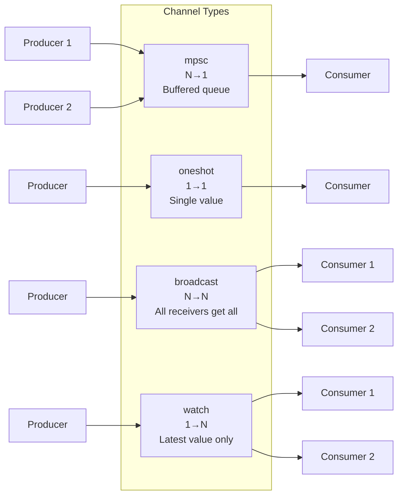
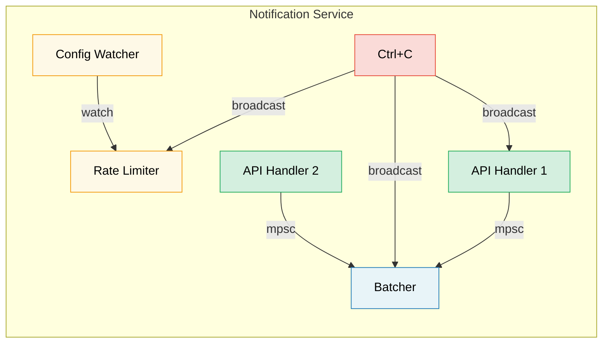

# 8. Tokio Deep Dive / 8. Tokio 深入解析 🟡

> **What you'll learn / 你将学到：**
> - Runtime flavors: multi-thread vs current-thread and when to use each / 运行时变体：多线程与单线程，以及各自的适用场景
> - `tokio::spawn`, the `'static` requirement, and `JoinHandle` / `tokio::spawn`、`'static` 约束以及 `JoinHandle`
> - Task cancellation semantics (cancel-on-drop) / 任务取消语义（drop 时取消）
> - Sync primitives: Mutex, RwLock, Semaphore, and all four channel types / 同步原语：Mutex、RwLock、Semaphore 以及四种通道类型

## Runtime Flavors: Multi-Thread vs Current-Thread / 运行时变体：多线程与单线程

Tokio offers two runtime configurations:

Tokio 提供了两种运行时配置：

```rust
// Multi-threaded (default with #[tokio::main])
// Uses a work-stealing thread pool — tasks can move between threads
// 多线程（#[tokio::main] 默认配置）
// 使用工作窃取线程池 —— 任务可以在不同线程间移动
#[tokio::main]
async fn main() {
    // N worker threads (default = number of CPU cores)
    // Tasks are Send + 'static
    // N 个工作线程（默认 = CPU 核心数）
    // 任务必须满足 Send + 'static
}

// Current-thread — everything runs on one thread
// 单线程 —— 所有内容都在一个线程上运行
#[tokio::main(flavor = "current_thread")]
async fn main() {
    // Single-threaded — tasks don't need to be Send
    // Lighter weight, good for simple tools or WASM
    // 单线程 —— 任务不需要满足 Send
    // 更轻量，适用于简单工具或 WASM
}

// Manual runtime construction:
// 手动构建运行时：
let rt = tokio::runtime::Builder::new_multi_thread()
    .worker_threads(4)
    .enable_all()
    .build()
    .unwrap();

rt.block_on(async {
    println!("Running on custom runtime");
});
```



### tokio::spawn and the 'static Requirement / tokio::spawn 与 'static 约束

`tokio::spawn` puts a future onto the runtime's task queue. Because it might run on *any* worker thread at *any* time, the future must be `Send + 'static`:

`tokio::spawn` 将一个 future 放入运行时的任务队列。由于它可能在 *任何* 时间、在 *任何一个* 工作线程上运行，因此该 future 必须满足 `Send + 'static`：

```rust
use tokio::task;

async fn example() {
    let data = String::from("hello");

    // ✅ Works: move ownership into the task
    // ✅ 正常工作：将所有权 move 进入任务中
    let handle = task::spawn(async move {
        println!("{data}");
        data.len()
    });

    let len = handle.await.unwrap();
    println!("Length: {len}");
}

async fn problem() {
    let data = String::from("hello");

    // ❌ FAILS: data is borrowed, not 'static
    // ❌ 失败：data 是借用的，不是 'static
    // task::spawn(async {
    //     println!("{data}"); // borrows `data` — not 'static
    // });

    // ❌ FAILS: Rc is not Send
    // ❌ 失败：Rc 不是 Send
    // let rc = std::rc::Rc::new(42);
    // task::spawn(async move {
    //     println!("{rc}"); // Rc is !Send — can't cross thread boundary
    // });
}
```

**Why `'static`? / 为什么需要 `'static`？** The spawned task runs independently — it might outlive the scope that created it. The compiler can't prove the references will remain valid, so it requires owned data.

**为什么需要 `'static`？** 被派生的任务独立运行 —— 它可能会比创建它的作用域活得更久。编译器无法证明其引用的有效性，因此要求使用拥有所有权的数据。

**Why `Send`? / 为什么需要 `Send`？** The task might be resumed on a different thread than where it was suspended. All data held across `.await` points must be safe to send between threads.

**为什么需要 `Send`？** 任务可能会在与挂起时不同的线程上恢复执行。所有跨越 `.await` 点持有的数据都必须能够安全地在线程间发送。

```rust
// Common pattern: clone shared data into the task
// 常见模式：将共享数据克隆到任务中
let shared = Arc::new(config);

for i in 0..10 {
    let shared = Arc::clone(&shared); // Clone the Arc, not the data
                                       // 克隆 Arc，而不是克隆数据
    tokio::spawn(async move {
        process_item(i, &shared).await;
    });
}
```

### JoinHandle and Task Cancellation / JoinHandle 与任务取消

```rust
use tokio::task::JoinHandle;
use tokio::time::{sleep, Duration};

async fn cancellation_example() {
    let handle: JoinHandle<String> = tokio::spawn(async {
        sleep(Duration::from_secs(10)).await;
        "completed".to_string()
    });

    // Cancel the task by dropping the handle? NO — task keeps running!
    // 通过 drop 这个 handle 来取消任务？不 —— 任务会继续运行！
    // drop(handle); // Task continues in the background

    // To actually cancel, call abort():
    // 若要真正取消，请调用 abort()：
    handle.abort();

    // Awaiting an aborted task returns JoinError
    // 等待一个被中止的任务会返回 JoinError
    match handle.await {
        Ok(val) => println!("Got: {val}"),
        Err(e) if e.is_cancelled() => println!("Task was cancelled"),
        Err(e) => println!("Task panicked: {e}"),
    }
}
```

> **Important / 重要**：Dropping a `JoinHandle` does NOT cancel the task in tokio. The task becomes *detached* and keeps running. You must explicitly call `.abort()` to cancel it. This is different from dropping a `Future` directly, which does cancel/drop the underlying computation.
>
> **重要**：在 tokio 中，丢弃（drop） `JoinHandle` 并 *不会* 取消任务。任务会进入 *分离（detached）* 状态并继续运行。你必须显式调用 `.abort()` 才能取消它。这与直接丢弃一个 `Future` 不同，后者确实会取消/停止底层的计算。

### Tokio Sync Primitives / Tokio 同步原语

Tokio provides async-aware synchronization primitives. The key principle: **don't use `std::sync::Mutex` across `.await` points**.

Tokio 提供了异步感知的同步原语。核心原则是：**不要跨越 `.await` 点使用 `std::sync::Mutex`**。

```rust
use tokio::sync::{Mutex, RwLock, Semaphore, mpsc, oneshot, broadcast, watch};

// --- Mutex / 互斥锁 ---
// Async mutex: the lock() method is async and won't block the thread
// 异步互斥锁：lock() 方法是异步的，不会阻塞当前线程
let data = Arc::new(Mutex::new(vec![1, 2, 3]));
{
    let mut guard = data.lock().await; // Non-blocking lock
                                       // 非阻塞加锁
    guard.push(4);
} // Guard dropped here — lock released
  // guard 在此处 drop —— 锁被释放

// --- Channels / 通道 ---
// mpsc: Multiple producer, single consumer
// mpsc：多生产者，单消费者
let (tx, mut rx) = mpsc::channel::<String>(100); // Bounded buffer
                                                 // 有界缓冲区

tokio::spawn(async move {
    tx.send("hello".into()).await.unwrap();
});

let msg = rx.recv().await.unwrap();

// oneshot: Single value, single consumer
// oneshot：单值，单消费者
let (tx, rx) = oneshot::channel::<i32>();
tx.send(42).unwrap(); // No await needed — either sends or fails
let val = rx.await.unwrap();

// broadcast: Multiple producers, multiple consumers (all get every message)
// broadcast：多生产者，多消费者（所有人都会收到每一条消息）
let (tx, _) = broadcast::channel::<String>(100);
let mut rx1 = tx.subscribe();
let mut rx2 = tx.subscribe();

// watch: Single value, multiple consumers (only latest value)
// watch：单值，多消费者（只保留最新值）
let (tx, rx) = watch::channel(0u64);
tx.send(42).unwrap();
println!("Latest: {}", *rx.borrow());
```

> **Note:** `.unwrap()` is used for brevity throughout these channel examples. In production, handle send/receive errors gracefully — a failed `.send()` means the receiver was dropped, and a failed `.recv()` means the channel is closed.
>
> **注意**：在这些通道示例中，为了简洁使用了 `.unwrap()`。在生产环境中，请优雅地处理发送/接收错误 —— 发送失败意味着接收端已释放，接收失败意味着通道已关闭。



## Case Study: Choosing the Right Channel / 案例分析：选择合适的通道

| Requirement / 需求 | Channel / 通道 | Why / 原因 |
|-------------|---------|-----|
| API handlers → Batcher | `mpsc` (bounded) | N Producers, 1 Consumer. Bounded for backpressure / N 生产者，1 消费者。通过有界缓冲实现背压，防止 OOM |
| Config watcher → Rate limiter | `watch` | Only the latest config matters / 只有最新的配置才有意义。多个读取者（每个 worker）都能看到当前值 |
| Shutdown signal → All components | `broadcast` | Every component must receive the notification independently / 每个组件必须能独立收到关机通知 |
| Single health-check response | `oneshot` | Request/response pattern — one value, then done / 请求/响应模式 —— 一个值，发完即结束 |



<details>
<summary><strong>🏋️ Exercise: Build a Task Pool / 练习：构建任务池</strong> (点击展开）</summary>

**Challenge**: Build a function `run_with_limit` that accepts a list of async closures and a concurrency limit, executing at most N tasks simultaneously. Use `tokio::sync::Semaphore`.

**挑战**：构建一个 `run_with_limit` 函数，接收一系列异步闭包和一个并发限制，同时执行的任务数不超过 N。请使用 `tokio::sync::Semaphore`。

<details>
<summary>🔑 Solution / 参考答案</summary>

```rust
use std::future::Future;
use std::sync::Arc;
use tokio::sync::Semaphore;

async fn run_with_limit<F, Fut, T>(tasks: Vec<F>, limit: usize) -> Vec<T>
where
    F: FnOnce() -> Fut + Send + 'static,
    Fut: Future<Output = T> + Send + 'static,
    T: Send + 'static,
{
    let semaphore = Arc::new(Semaphore::new(limit));
    let mut handles = Vec::new();

    for task in tasks {
        let permit = Arc::clone(&semaphore);
        let handle = tokio::spawn(async move {
            let _permit = permit.acquire().await.unwrap();
            // Permit is held while task runs, then dropped
            // 任务运行时持有 permit，运行结束自动 drop
            task().await
        });
        handles.push(handle);
    }

    let mut results = Vec::new();
    for handle in handles {
        results.push(handle.await.unwrap());
    }
    results
}
```

**Key takeaway**: `Semaphore` is the standard way to limit concurrency in tokio. Each task acquires a permit before starting work. When the semaphore is full, new tasks wait asynchronously (non-blocking) until a slot opens.

**关键点**：`Semaphore` 是 tokio 中限制并发的标准方式。每个任务在开始工作前都会获取一个许可证。当信号量满时，新任务会以异步（非阻塞）方式等待，直到有空槽位放出。

</details>
</details>

> **Key Takeaways — Tokio Deep Dive / 关键要点：Tokio 深入解析**
> - Use `multi_thread` for servers (default); `current_thread` for CLI tools, tests, or `!Send` types / 服务器建议使用 `multi_thread`（默认）；CLI 工具、测试或 `!Send` 类型建议使用 `current_thread`
> - `tokio::spawn` requires `'static` futures — use `Arc` or channels to share data / `tokio::spawn` 要求 future 必须是 `'static` —— 使用 `Arc` 或通道共享数据
> - Dropping a `JoinHandle` does **not** cancel the task — call `.abort()` explicitly / 丢弃 `JoinHandle` **不会** 取消任务 —— 必须显式调用 `.abort()`
> - Choose sync primitives by need: `Mutex` for shared state, `Semaphore` for concurrency limits, `mpsc`/`oneshot`/`broadcast`/`watch` for communication / 按需选择同步原语：`Mutex` 用于共享状态，`Semaphore` 用于并发限制，四种通道用于通信

> **See also / 延伸阅读：** [Ch 9 — When Tokio Isn't the Right Fit / 第 9 章：Tokio 不适用的场景](ch09-when-tokio-isnt-the-right-fit.md) for alternatives to spawn, [Ch 12 — Common Pitfalls / 第 12 章：常见陷阱](ch12-common-pitfalls.md) for MutexGuard-across-await bugs

***


