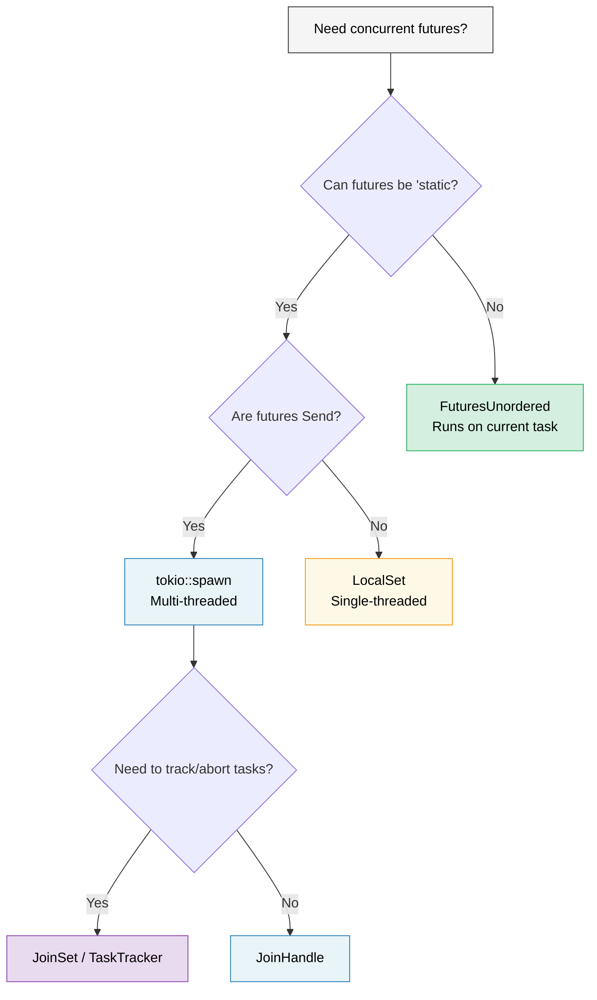

# 9. When Tokio Isn't the Right Fit / 9. Tokio 不适用的场景 🟡

> **What you'll learn / 你将学到：**
> - The `'static` problem: when `tokio::spawn` forces you into `Arc` everywhere / `'static` 问题：当 `tokio::spawn` 强制你在各处使用 `Arc` 时
> - `LocalSet` for `!Send` futures / 针对 `!Send` future 的 `LocalSet`
> - `FuturesUnordered` for borrow-friendly concurrency (no spawn needed) / 借用友好的并发工具 `FuturesUnordered`（无需 spawn）
> - `JoinSet` for managed task groups / 用于任务组管理的 `JoinSet`
> - Writing runtime-agnostic libraries / 编写运行时无关的库



## The 'static Future Problem / 'static Future 问题

Tokio's `spawn` requires `'static` futures. This means you can't borrow local data in spawned tasks:

Tokio 的 `spawn` 要求 future 必须是 `'static`。这意味着你不能在被派生的任务中借用局部数据：

```rust
async fn process_items(items: &[String]) {
    // ❌ Can't do this — items is borrowed, not 'static
    // ❌ 不能这样做 —— items 是借用的，不是 'static
    // for item in items {
    //     tokio::spawn(async {
    //         process(item).await;
    //     });
    // }

    // 😐 Workaround 1: Clone everything
    // 😐 方案 1：克隆所有数据
    for item in items {
        let item = item.clone();
        tokio::spawn(async move {
            process(&item).await;
        });
    }

    // 😐 Workaround 2: Use Arc
    // 😐 方案 2：使用 Arc
    let items = Arc::new(items.to_vec());
    for i in 0..items.len() {
        let items = Arc::clone(&items);
        tokio::spawn(async move {
            process(&items[i]).await;
        });
    }
}
```

This is annoying! In Go, you can just `go func() { use(item) }` with a closure. In Rust, the ownership system forces you to think about who owns what and how long it lives.

这确实很烦人！在 Go 语言中，你可以直接通过闭包 `go func() { use(item) }`。但在 Rust 中，所有权系统强制你思考谁拥有什么，以及它能活多久。

### Scoped Tasks and Alternatives / 作用域任务与替代方案

Several solutions exist for the `'static` problem:

针对 `'static` 问题，有几种解决方案：

```rust
// 1. tokio::task::LocalSet — run !Send futures on current thread
// 1. tokio::task::LocalSet —— 在当前线程运行 !Send 的 future
use tokio::task::LocalSet;

let local_set = LocalSet::new();
local_set.run_until(async {
    tokio::task::spawn_local(async {
        // Can use Rc, Cell, and other !Send types here
        // 此处可以使用 Rc、Cell 和其他 !Send 类型
        let rc = std::rc::Rc::new(42);
        println!("{rc}");
    }).await.unwrap();
}).await;

// 2. FuturesUnordered — concurrent without spawning
// 2. FuturesUnordered —— 无需 spawn 即可并发
use futures::stream::{FuturesUnordered, StreamExt};

async fn process_items(items: &[String]) {
    let futures: FuturesUnordered<_> = items
        .iter()
        .map(|item| async move {
            // ✅ Can borrow item — no spawn, no 'static needed!
            // ✅ 可以借用 item —— 无需 spawn，不需要满足 'static！
            process(item).await
        })
        .collect();

    // Drive all futures to completion
    // 推进所有 future 直至完成
    futures.for_each(|result| async {
        println!("Result: {result:?}");
    }).await;
}

// 3. tokio JoinSet (tokio 1.21+) — managed set of spawned tasks
// 3. tokio JoinSet (tokio 1.21+) —— 已分配任务的管理集合
use tokio::task::JoinSet;

async fn with_joinset() {
    let mut set = JoinSet::new();

    for i in 0..10 {
        set.spawn(async move {
            tokio::time::sleep(Duration::from_millis(100)).await;
            i * 2
        });
    }

    while let Some(result) = set.join_next().await {
        println!("Task completed: {:?}", result.unwrap());
    }
}
```

### Lightweight Runtimes for Libraries / 库的轻量级运行时

If you're writing a library — don't force users into tokio:

如果你正在编写一个库 —— 不要强迫用户使用 tokio：

```rust
// ❌ BAD: Library forces tokio on users
// ❌ 错误做法：库强制用户依赖 tokio
pub async fn my_lib_function() {
    tokio::time::sleep(Duration::from_secs(1)).await;
    // Now your users MUST use tokio
    // 现在你的用户必须使用 tokio 了
}

// ✅ GOOD: Library is runtime-agnostic
// ✅ 正确做法：库是运行时无关的
pub async fn my_lib_function() {
    // Use only types from std::future and futures crate
    // 仅使用来自 std::future 和 futures crate 的类型
    do_computation().await;
}

// ✅ GOOD: Accept a generic future for I/O operations
// ✅ 正确做法：为 I/O 操作接收泛型 future
pub async fn fetch_with_retry<F, Fut, T, E>(
    operation: F,
    max_retries: usize,
) -> Result<T, E>
where
    F: Fn() -> Fut,
    Fut: Future<Output = Result<T, E>>,
{
    for attempt in 0..max_retries {
        match operation().await {
            Ok(val) => return Ok(val),
            Err(e) if attempt == max_retries - 1 => return Err(e),
            Err(_) => continue,
        }
    }
    unreachable!()
}
```

> **Rule of thumb**: Libraries should depend on `futures` crate, not `tokio`. Applications should depend on `tokio` (or their chosen runtime). This keeps the ecosystem composable.
>
> **经验法则**：库应该依赖 `futures` crate，而不是 `tokio`。应用程序应该依赖 `tokio`（或其选择的运行时）。这样可以保持生态系统的可组合性。

<details>
<summary><strong>🏋️ Exercise: FuturesUnordered vs Spawn / 练习：FuturesUnordered 与 Spawn</strong> (点击展开)</summary>

**Challenge**: Write the same function two ways — once using `tokio::spawn` (requires `'static`) and once using `FuturesUnordered` (borrows data).

**挑战**：用两种方式编写同一个函数 —— 一次使用 `tokio::spawn`（要求 `'static`），一次使用 `FuturesUnordered`（允许借用数据）。

<details>
<summary>🔑 Solution / 参考答案</summary>

```rust
use futures::stream::{FuturesUnordered, StreamExt};
use tokio::time::{sleep, Duration};

// Version 1: tokio::spawn — requires 'static, must clone
// 版本 1: tokio::spawn —— 要求 'static，必须克隆数据
async fn lengths_with_spawn(items: &[String]) -> Vec<usize> {
    let mut handles = Vec::new();
    for item in items {
        let owned = item.clone(); // Must clone — spawn requires 'static
        handles.push(tokio::spawn(async move {
            sleep(Duration::from_millis(10)).await;
            owned.len()
        }));
    }

    let mut results = Vec::new();
    for handle in handles {
        results.push(handle.await.unwrap());
    }
    results
}

// Version 2: FuturesUnordered — borrows data, no clone needed
// 版本 2: FuturesUnordered —— 借用数据，无需克隆
async fn lengths_without_spawn(items: &[String]) -> Vec<usize> {
    let futures: FuturesUnordered<_> = items
        .iter()
        .map(|item| async move {
            sleep(Duration::from_millis(10)).await;
            item.len() // ✅ Borrows item — no clone!
                       // ✅ 借用 item —— 无需克隆！
        })
        .collect();

    futures.collect().await
}
```

**Key takeaway**: `FuturesUnordered` avoids the `'static` requirement by running all futures on the current task (no thread migration). The trade-off: all futures share one task — if one blocks, the others stall. Use `spawn` for CPU-heavy work that should run on separate threads.

**关键点**：`FuturesUnordered` 通过在当前任务中运行所有 future（不涉及线程迁移）来规避 `'static` 约束。权衡之处：所有 future 共享同一个任务 —— 如果其中一个阻塞，其他的也会停滞。对于应该在独立线程运行的 CPU 密集型工作，请使用 `spawn`。

</details>
</details>

> **Key Takeaways — When Tokio Isn't the Right Fit / 关键要点：Tokio 不适用的场景**
> - `FuturesUnordered` runs futures concurrently on the current task — no `'static` requirement / `FuturesUnordered` 在当前任务中并发运行 future —— 无需 `'static` 约束
> - `LocalSet` enables `!Send` futures on a single-threaded executor / `LocalSet` 允许在单线程执行器上运行 `!Send` 的 future
> - `JoinSet` (tokio 1.21+) provides managed task groups with automatic cleanup / `JoinSet` (tokio 1.21+) 提供了带自动清理功能的受管任务组
> - For libraries: depend only on `std::future::Future` + `futures` crate, not tokio directly / 对于库：仅依赖 `std::future::Future` + `futures` crate，不要直接依赖 tokio

> **See also / 延伸阅读：** [Ch 8 — Tokio Deep Dive / 第 8 章：Tokio 深入解析](ch08-tokio-deep-dive.md) for when spawn is the right tool, [Ch 11 — Streams / 第 11 章：流](ch11-streams-and-asynciterator.md) for `buffer_unordered()` as another concurrency limiter

***


