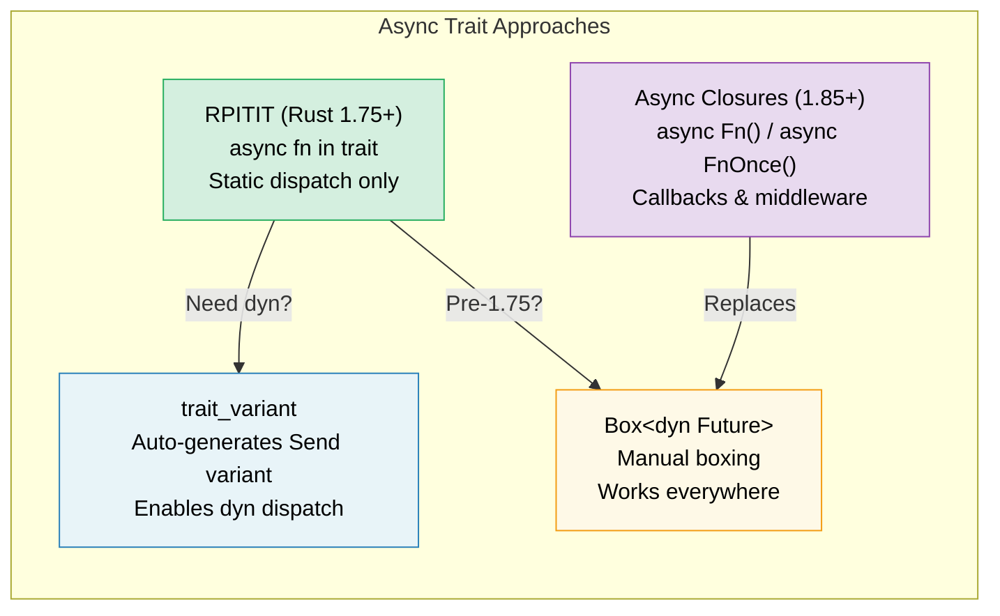

# 10. Async Traits / 10. 异步 Trait 🟡

> **What you'll learn / 你将学到：**
> - Why async methods in traits took years to stabilize / 为什么 trait 中的异步方法花了数年才稳定
> - RPITIT: native async trait methods (Rust 1.75+) / RPITIT：原生异步 trait 方法 (Rust 1.75+)
> - The dyn dispatch challenge and `trait_variant` workaround / dyn 分发挑战与 `trait_variant` 变通方案
> - Async closures (Rust 1.85+): `async Fn()` and `async FnOnce()` / 异步闭包 (Rust 1.85+)：`async Fn()` 和 `async FnOnce()`



## The History: Why It Took So Long / 历史回顾：为何耗时弥久

Async methods in traits were Rust's most requested feature for years. The problem:

Trait 中的异步方法多年来一直是 Rust 用户最渴望的特性。问题在于：

```rust
// This didn't compile until Rust 1.75 (Dec 2023):
// 在 Rust 1.75（2023 年 12 月）之前，这段代码无法编译：
trait DataStore {
    async fn get(&self, key: &str) -> Option<String>;
}
// Why? Because async fn returns `impl Future<Output = T>`,
// and `impl Trait` in trait return position wasn't supported.
// 为什么？因为 async fn 返回的是 `impl Future<Output = T>`，
// 而当时并不支持在 trait 的返回值位置使用 `impl Trait`。
```

The fundamental challenge: when a trait method returns `impl Future`, each implementor returns a *different concrete type*. The compiler needs to know the size of the return type, but trait methods are dynamically dispatched.

根本挑战在于：当一个 trait 方法返回 `impl Future` 时，每个实现者返回的都是 *不同的具体类型*。编译器通常需要知道返回类型的大小，但 trait 方法往往是动态分发的（dynamic dispatch）。

### RPITIT: Return Position Impl Trait in Trait / RPITIT：即 Trait 中返回值位置的 Impl Trait

Since Rust 1.75, this just works for static dispatch:

从 Rust 1.75 开始，原生异步方法在静态分发下已经可以正常工作了：

```rust
trait DataStore {
    async fn get(&self, key: &str) -> Option<String>;
    // Desugars to:
    // 解糖后等价于：
    // fn get(&self, key: &str) -> impl Future<Output = Option<String>>;
}

struct InMemoryStore {
    data: std::collections::HashMap<String, String>,
}

impl DataStore for InMemoryStore {
    async fn get(&self, key: &str) -> Option<String> {
        self.data.get(key).cloned()
    }
}

// ✅ Works with generics (static dispatch):
// ✅ 适用于泛型（静态分发）：
async fn lookup<S: DataStore>(store: &S, key: &str) {
    if let Some(val) = store.get(key).await {
        println!("{key} = {val}");
    }
}
```

### dyn Dispatch and Send Bounds / dyn 分发与 Send 约束

The limitation: you can't use `dyn DataStore` directly because the compiler doesn't know the size of the returned future:

局限性：你不能直接使用 `dyn DataStore`，因为编译器不知道返回的 future 的大小：

```rust
// ❌ Doesn't work:
// ❌ 无法工作：
// async fn lookup_dyn(store: &dyn DataStore, key: &str) { ... }
// Error: the trait `DataStore` is not dyn-compatible because method `get`
//        is `async`

// ✅ Workaround: Return a boxed future
// ✅ 方案：返回手动装箱的 future
trait DynDataStore {
    fn get(&self, key: &str) -> Pin<Box<dyn Future<Output = Option<String>> + Send + '_>>;
}

// Or use the trait_variant macro (see below)
// 或者使用 trait_variant 宏（见后文）
```

**The Send problem / Send 问题**: In multi-threaded runtimes, spawned tasks must be `Send`. But async trait methods don't automatically add `Send` bounds:

**Send 问题**：在多线程运行时中，派生的任务必须满足 `Send`。但异步 trait 方法并不会自动添加 `Send` 约束：

```rust
trait Worker {
    async fn run(&self); // Future might or might not be Send
                         // Future 可能满足也可能不满足 Send
}

struct MyWorker;

impl Worker for MyWorker {
    async fn run(&self) {
        // If this uses !Send types, the future is !Send
        // 如果这里使用了 !Send 类型，生成的 future 也是 !Send
        let rc = std::rc::Rc::new(42);
        some_work().await;
        println!("{rc}");
    }
}

// ❌ This fails if the future isn't Send:
// ❌ 如果 future 不是 Send，这行代码会报错：
// tokio::spawn(worker.run()); // Requires Send + 'static
```

### The trait_variant Crate / trait_variant 库

The `trait_variant` crate (from the Rust async working group) generates a `Send` variant automatically:

`trait_variant` 库（由 Rust 异步小组开发）可以自动生成一个满足 `Send` 约束的变体：

```rust
// Cargo.toml: trait-variant = "0.1"

#[trait_variant::make(SendDataStore: Send)]
trait DataStore {
    async fn get(&self, key: &str) -> Option<String>;
    async fn set(&self, key: &str, value: String);
}

// Now you have two traits:
// - DataStore: no Send bound on the futures
// - SendDataStore: all futures are Send
// 现在你有了两个 trait：
// - DataStore：对 future 没有 Send 约束
// - SendDataStore：所有 future 都强制满足 Send

// Use SendDataStore when you need to spawn:
// 当你需要 spawn 时使用 SendDataStore：
async fn spawn_lookup(store: Arc<dyn SendDataStore>) {
    tokio::spawn(async move {
        store.get("key").await;
    });
}
```

### Quick Reference: Async Traits / 速查表：异步 Trait

| Approach / 方案 | Static Dispatch / 静态分发 | Dynamic Dispatch / 动态分发 | Send | Syntax Overhead / 语法开销 |
|----------|:---:|:---:|:---:|---|
| Native `async fn` in trait | ✅ | ❌ | Implicit / 隐式 | None / 无 |
| `trait_variant` | ✅ | ✅ | Explicit / 显式 | `#[trait_variant::make]` |
| Manual `Box::pin` | ✅ | ✅ | Explicit / 显式 | High / 较高 |
| `async-trait` crate | ✅ | ✅ | `#[async_trait]` | Medium / 中等 |

> **Recommendation**: For new code (Rust 1.75+), use native async traits with `trait_variant` when you need `dyn` dispatch. The `async-trait` crate is still widely used but boxes every future — the native approach is zero-cost for static dispatch.
>
> **建议**：对于新项目（Rust 1.75+），请使用原生的异步 trait；如果需要 `dyn` 分发，配合 `trait_variant` 使用。`async-trait` 库虽然仍被广泛使用，但它会装箱每个 future，而原生方案在静态分发下是零成本的。

### Async Closures (Rust 1.85+) / 异步闭包 (Rust 1.85+)

Since Rust 1.85, `async closures` are stable — closures that capture their environment and return a future:

从 Rust 1.85 开始，`异步闭包` 已稳定 —— 即捕获环境并返回 future 的闭包：

```rust
// After 1.85: async closures just work
// 1.85 之后：异步闭包正式可用
let fetchers: Vec<_> = urls.iter().map(|url| {
    async move || { reqwest::get(url).await }
    // ↑ This is an async closure — captures url, returns a Future
    // ↑ 这是一个异步闭包 —— 捕获 url，返回一个 Future
}).collect();
```

Async closures implement the new `AsyncFn`, `AsyncFnMut`, and `AsyncFnOnce` traits, which mirror `Fn`, `FnMut`, `FnOnce`:

异步闭包实现了新的 `AsyncFn`、`AsyncFnMut` 和 `AsyncFnOnce` trait，它们镜像了传统的 `Fn`、`FnMut` 和 `FnOnce`：

```rust
// Generic function accepting an async closure
// 接收异步闭包的泛型函数
async fn retry<F>(max: usize, f: F) -> Result<String, Error>
where
    F: AsyncFn() -> Result<String, Error>,
{
    for _ in 0..max {
        if let Ok(val) = f().await {
            return Ok(val);
        }
    }
    f().await
}
```

> **Migration tip**: If you have code using `Fn() -> impl Future<Output = T>`, consider switching to `AsyncFn() -> T` for cleaner signatures.
>
> **迁移建议**：如果你有的代码使用了 `Fn() -> impl Future<Output = T>`，可以考虑切换到 `AsyncFn() -> T` 以获得更简洁的签名。

<details>
<summary><strong>🏋️ Exercise: Design an Async Service Trait / 练习：设计一个异步服务 Trait</strong> (点击展开)</summary>

**Challenge**: Design a `Cache` trait with async `get` and `set` methods. Implement it twice: once with a `HashMap` (in-memory) and once with a simulated Redis backend.

**挑战**：设计一个包含异步 `get` 和 `set` 方法的 `Cache` trait。分别实现两次：一次使用 `HashMap`（内存版），一次模拟 Redis 后端。

<details>
<summary>🔑 Solution / 参考答案</summary>

```rust
use std::collections::HashMap;
use tokio::sync::Mutex;
use tokio::time::{sleep, Duration};

trait Cache {
    async fn get(&self, key: &str) -> Option<String>;
    async fn set(&self, key: &str, value: String);
}

// --- In-memory implementation / 内存实现 ---
struct MemoryCache {
    store: Mutex<HashMap<String, String>>,
}

impl Cache for MemoryCache {
    async fn get(&self, key: &str) -> Option<String> {
        self.store.lock().await.get(key).cloned()
    }

    async fn set(&self, key: &str, value: String) {
        self.store.lock().await.insert(key.to_string(), value);
    }
}

// --- Simulated Redis implementation / 模拟 Redis 实现 ---
struct RedisCache {
    store: Mutex<HashMap<String, String>>,
    latency: Duration,
}

impl Cache for RedisCache {
    async fn get(&self, key: &str) -> Option<String> {
        sleep(self.latency).await; // Simulate network round-trip / 模拟网络往返
        self.store.lock().await.get(key).cloned()
    }

    async fn set(&self, key: &str, value: String) {
        sleep(self.latency).await;
        self.store.lock().await.insert(key.to_string(), value);
    }
}
```

**Key takeaway**: The same generic function works with both implementations through static dispatch. No boxing, no allocation overhead.

**关键点**：同一个泛型函数可以通过静态分发与两种实现协同工作。没有装箱，也没有额外的分配开销。

</details>
</details>

> **Key Takeaways — Async Traits / 关键要点：异步 Trait**
> - Since Rust 1.75, you can write `async fn` directly in traits (no `#[async_trait]` crate needed) / 从 Rust 1.75 开始，你可以直接在 trait 中编写 `async fn`（无需 `#[async_trait]` 库）
> - `trait_variant::make` auto-generates a `Send` variant for dynamic dispatch / `trait_variant::make` 可为动态分发自动生成 `Send` 变体
> - Async closures (`async Fn()`) stabilized in 1.85 — use for callbacks and middleware / 异步闭包 (`async Fn()`) 在 1.85 稳定 —— 适用于回调和中间件
> - Prefer static dispatch (`<S: Service>`) over `dyn` for performance-critical code / 对于性能敏感的代码，优先选择静态分发 (`<S: Service>`) 而非 `dyn`

> **See also / 延伸阅读：** [Ch 13 — Production Patterns / 第 13 章：生产模式](ch13-production-patterns.md) for Tower's `Service` trait, [Ch 6 — Building Futures by Hand / 第 6 章：手动构建 Future](ch06-building-futures-by-hand.md) for manual trait implementations

***


