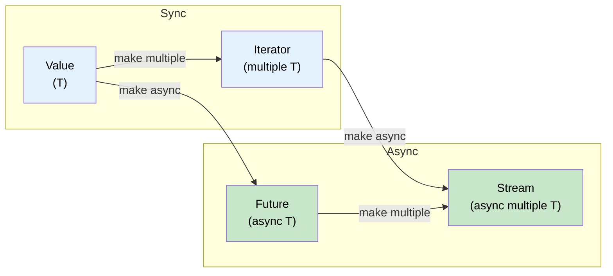

# 11. Streams and AsyncIterator / 11. 流与异步迭代器 🟡

> **What you'll learn / 你将学到：**
> - The `Stream` trait: async iteration over multiple values / `Stream` trait：对多个值进行异步迭代
> - Creating streams: `stream::iter`, `async_stream`, `unfold` / 创建流：`stream::iter`、`async_stream`、`unfold`
> - Stream combinators: `map`, `filter`, `buffer_unordered`, `fold` / 流组合器：`map`、`filter`、`buffer_unordered`、`fold`
> - Async I/O traits: `AsyncRead`, `AsyncWrite`, `AsyncBufRead` / 异步 I/O trait：`AsyncRead`、`AsyncWrite`、`AsyncBufRead`

## Stream Trait Overview / 流 Trait 概览

A `Stream` is to `Iterator` what `Future` is to a single value — it yields multiple values asynchronously:

`Stream` 之于 `Iterator`，正如 `Future` 之于单个值 —— 它异步地产生多个值：

```rust
// std::iter::Iterator (synchronous, multiple values)
// std::iter::Iterator（同步，多个值）
trait Iterator {
    type Item;
    fn next(&mut self) -> Option<Self::Item>;
}

// futures::Stream (async, multiple values)
// futures::Stream（异步，多个值）
trait Stream {
    type Item;
    fn poll_next(self: Pin<&mut Self>, cx: &mut Context<'_>) -> Poll<Option<Self::Item>>;
}
```



### Creating Streams / 创建流

```rust
use futures::stream::{self, StreamExt};
use tokio::time::{interval, Duration};
use tokio_stream::wrappers::IntervalStream;

// 1. From an iterator / 从迭代器转换
let s = stream::iter(vec![1, 2, 3]);

// 2. From an async generator (using async_stream crate) / 从异步生成器（使用 async-stream 库）
// Cargo.toml: async-stream = "0.3"
use async_stream::stream;

fn countdown(from: u32) -> impl futures::Stream<Item = u32> {
    stream! {
        for i in (0..=from).rev() {
            tokio::time::sleep(Duration::from_millis(500)).await;
            yield i;
        }
    }
}

// 3. From a tokio interval / 从 tokio 定时器
let tick_stream = IntervalStream::new(interval(Duration::from_secs(1)));

// 4. From a channel receiver (tokio_stream::wrappers) / 从通道接收端
let (tx, rx) = tokio::sync::mpsc::channel::<String>(100);
let rx_stream = tokio_stream::wrappers::ReceiverStream::new(rx);

// 5. From unfold (generate from async state) / 从 unfold（从异步状态生成）
let s = stream::unfold(0u32, |state| async move {
    if state >= 5 {
        None // Stream ends / 流结束
    } else {
        let next = state + 1;
        Some((state, next)) // yield `state`, new state is `next` / 产出 `state`，新状态为 `next`
    }
});
```

### Consuming Streams / 消费流

```rust
use futures::stream::{self, StreamExt};

async fn stream_examples() {
    let s = stream::iter(vec![1, 2, 3, 4, 5]);

    // for_each — process each item / 处理每一项
    s.for_each(|x| async move {
        println!("{x}");
    }).await;

    // map + collect / 映射 + 收集
    let doubled: Vec<i32> = stream::iter(vec![1, 2, 3])
        .map(|x| x * 2)
        .collect()
        .await;

    // filter / 过滤
    let evens: Vec<i32> = stream::iter(1..=10)
        .filter(|x| futures::future::ready(x % 2 == 0))
        .collect()
        .await;

    // buffer_unordered — process N items concurrently / 并发处理 N 个项
    let results: Vec<_> = stream::iter(vec!["url1", "url2", "url3"])
        .map(|url| async move {
            // Simulate HTTP fetch / 模拟 HTTP 请求
            tokio::time::sleep(Duration::from_millis(100)).await;
            format!("response from {url}")
        })
        .buffer_unordered(10) // Up to 10 concurrent fetches / 最多 10 个并发请求
        .collect()
        .await;

    // take, skip, zip, chain — just like Iterator / 与迭代器类似
    let first_three: Vec<i32> = stream::iter(1..=100)
        .take(3)
        .collect()
        .await;
}
```

### Comparison with C# IAsyncEnumerable / 与 C# IAsyncEnumerable 的比较

| Feature / 特性 | Rust `Stream` | C# `IAsyncEnumerable<T>` |
|---------|--------------|--------------------------|
| **Syntax / 语法** | `stream! { yield x; }` | `await foreach` / `yield return` |
| **Cancellation / 取消** | Drop the stream / 丢弃流 | `CancellationToken` |
| **Backpressure / 背压** | Consumer controls poll rate / 消费者控制轮询速率 | Consumer controls `MoveNextAsync` / 消费者控制 `MoveNextAsync` |
| **Built-in / 内置支持** | No (needs `futures` crate) / 否（需要 `futures` 库） | Yes (since C# 8.0) / 是（自 C# 8.0 起） |
| **Combinators / 组合器** | `.map()`, `.filter()`, `.buffer_unordered()` | LINQ + `System.Linq.Async` |
| **Error handling / 错误处理** | `Stream<Item = Result<T, E>>` | Throw in async iterator / 异步迭代器中抛异常 |

```rust
// Rust: Stream of database rows / Rust：数据库行流
// NOTE: try_stream! (not stream!) is required when using ? inside the body.
// 注意：如果在函数体中使用 ?，需要使用 try_stream! 而不是 stream!。
fn get_users(db: &Database) -> impl Stream<Item = Result<User, DbError>> + '_ {
    try_stream! {
        let mut cursor = db.query("SELECT * FROM users").await?;
        while let Some(row) = cursor.next().await {
            yield User::from_row(row?);
        }
    }
}

// Consume: / 消费：
let mut users = pin!(get_users(&db));
while let Some(result) = users.next().await {
    match result {
        Ok(user) => println!("{}", user.name),
        Err(e) => eprintln!("Error: {e}"),
    }
}
```

<details>
<summary><strong>🏋️ Exercise: Build an Async Stats Aggregator / 练习：构建异步统计聚合器</strong> (点击展开)</summary>

**Challenge**: Given a stream of sensor readings `Stream<Item = f64>`, write an async function that consumes the stream and returns `(count, min, max, average)`. Use `StreamExt` combinators — don't just collect into a Vec.

**挑战**：给定一个传感器读数流 `Stream<Item = f64>`，编写一个异步函数来消费该流，并返回 `(count, min, max, average)`（计数、最小值、最大值、平均值）。请使用 `StreamExt` 组合器 —— 不要只是简单地 collect 到 Vec 中。

<details>
<summary>🔑 Solution / 参考答案</summary>

```rust
use futures::stream::{self, StreamExt};

struct Stats {
    count: usize,
    min: f64,
    max: f64,
    sum: f64,
}

impl Stats {
    fn average(&self) -> f64 {
        if self.count == 0 { 0.0 } else { self.sum / self.count as f64 }
    }
}

async fn compute_stats<S: futures::Stream<Item = f64> + Unpin>(stream: S) -> Stats {
    stream
        .fold(
            Stats { count: 0, min: f64::INFINITY, max: f64::NEG_INFINITY, sum: 0.0 },
            |mut acc, value| async move {
                acc.count += 1;
                acc.min = acc.min.min(value);
                acc.max = acc.max.max(value);
                acc.sum += value;
                acc
            },
        )
        .await
}
```

**Key takeaway**: Stream combinators like `.fold()` process items one-at-a-time without collecting into memory — essential for processing large or unbounded data streams.

**关键点**：像 `.fold()` 这样的流组合器会逐项处理数据，而无需将其全部载入内存 —— 这对于处理大规模或无界数据流至关重要。

</details>
</details>

### Async I/O Traits: AsyncRead, AsyncWrite, AsyncBufRead / 异步 I/O Trait

Just as `std::io::Read`/`Write` are the foundation of synchronous I/O, their async counterparts are the foundation of async I/O. These traits are provided by `tokio::io` (or `futures::io` for runtime-agnostic code):

就像 `std::io::Read`/`Write` 是同步 I/O 的基石，其对应的异步版本则是异步 I/O 的核心。这些 trait 由 `tokio::io` 提供（或在运行时无关的代码中使用 `futures::io`）：

```rust
// tokio::io — the async versions of std::io traits
// tokio::io —— std::io trait 的异步版本

/// Read bytes from a source asynchronously / 从源异步读取字节
pub trait AsyncRead {
    fn poll_read(
        self: Pin<&mut Self>,
        cx: &mut Context<'_>,
        buf: &mut ReadBuf<'_>,  // Tokio's safe wrapper around uninitialized memory
                                  // Tokio 用于处理未初始化内存的安全封装
    ) -> Poll<io::Result<()>>;
}

/// Write bytes to a sink asynchronously / 向接收端异步写入字节
pub trait AsyncWrite {
    fn poll_write(
        self: Pin<&mut Self>,
        cx: &mut Context<'_>,
        buf: &[u8],
    ) -> Poll<io::Result<usize>>;

    fn poll_flush(self: Pin<&mut Self>, cx: &mut Context<'_>) -> Poll<io::Result<()>>;
    fn poll_shutdown(self: Pin<&mut Self>, cx: &mut Context<'_>) -> Poll<io::Result<()>>;
}
```

**In practice**, you rarely call these `poll_*` methods directly. Instead, use the extension traits `AsyncReadExt` and `AsyncWriteExt` which provide `.await`-friendly helper methods:

**在实践中**，你很少直接调用这些 `poll_*` 方法。相反，你会使用扩展 trait `AsyncReadExt` 和 `AsyncWriteExt`，它们提供了支持 `.await` 的便捷方法：

```rust
use tokio::io::{AsyncReadExt, AsyncWriteExt, AsyncBufReadExt};
use tokio::net::TcpStream;
use tokio::io::BufReader;

async fn io_examples() -> tokio::io::Result<()> {
    let mut stream = TcpStream::connect("127.0.0.1:8080").await?;

    // AsyncWriteExt: write_all, write_u32, write_buf, etc.
    stream.write_all(b"GET / HTTP/1.0\r\n\r\n").await?;

    // AsyncReadExt: read, read_exact, read_to_end, read_to_string
    let mut response = Vec::new();
    stream.read_to_end(&mut response).await?;

    // AsyncBufReadExt: read_line, lines(), split()
    let file = tokio::fs::File::open("config.txt").await?;
    let reader = BufReader::new(file);
    let mut lines = reader.lines();
    while let Some(line) = lines.next_line().await? {
        println!("{line}");
    }

    Ok(())
}
```

| Sync Trait / 同步 Trait | Async Trait (tokio) / 异步 (tokio) | Async Trait (futures) / 异步 (futures) | Extension Trait / 扩展 Trait |
|-----------|--------------------|-----------------------|----------------|
| `std::io::Read` | `tokio::io::AsyncRead` | `futures::io::AsyncRead` | `AsyncReadExt` |
| `std::io::Write` | `tokio::io::AsyncWrite` | `futures::io::AsyncWrite` | `AsyncWriteExt` |
| `std::io::BufRead` | `tokio::io::AsyncBufRead` | `futures::io::AsyncBufRead` | `AsyncBufReadExt` |
| `std::io::Seek` | `tokio::io::AsyncSeek` | `futures::io::AsyncSeek` | `AsyncSeekExt` |

> **tokio vs futures I/O traits**: They're similar but not identical — tokio's `AsyncRead` uses `ReadBuf` (handles uninitialized memory safely), while `futures::AsyncRead` uses `&mut [u8]`. Use `tokio_util::compat` to convert between them.
>
> **tokio 对比 futures I/O trait**：它们相似但不完全相同 —— tokio 的 `AsyncRead` 使用 `ReadBuf`（能安全处理未初始化的内存），而 `futures::AsyncRead` 使用 `&mut [u8]`。可以使用 `tokio_util::compat` 在两者之间进行转换。

<details>
<summary><strong>🏋️ Exercise: Build an Async Line Counter / 练习：构建异步行计数器</strong> (点击展开)</summary>

**Challenge**: Write an async function that takes any `AsyncBufRead` source and returns the number of non-empty lines.

**挑战**：编写一个异步函数，接收任何 `AsyncBufRead` 源，并返回其中非空行的数量。

<details>
<summary>🔑 Solution / 参考答案</summary>

```rust
use tokio::io::AsyncBufReadExt;

async fn count_non_empty_lines<R: tokio::io::AsyncBufRead + Unpin>(
    reader: R,
) -> tokio::io::Result<usize> {
    let mut lines = reader.lines();
    let mut count = 0;
    while let Some(line) = lines.next_line().await? {
        if !line.is_empty() {
            count += 1;
        }
    }
    Ok(count)
}
```

**Key takeaway**: By programming against `AsyncBufRead` instead of a concrete type, your I/O code is reusable across files, sockets, pipes, and even in-memory buffers.

**关键点**：通过面向 `AsyncBufRead` 编程而不是具体类型，你的 I/O 代码可以在文件、socket、管道甚至内存缓冲区之间无缝复用。

</details>
</details>

> **Key Takeaways — Streams and AsyncIterator / 关键要点：流与异步迭代器**
> - `Stream` is the async equivalent of `Iterator` — yields `Poll::Ready(Some(item))` or `Poll::Ready(None)` / `Stream` 是 `Iterator` 的异步等价版本 —— 它产出 `Poll::Ready(Some(item))` 或 `Poll::Ready(None)`
> - `.buffer_unordered(N)` processes N stream items concurrently — the key concurrency tool for streams / `.buffer_unordered(N)` 合发处理 N 个流项 —— 这是流并发的核心工具
> - `async_stream::stream!` is the easiest way to create custom streams (uses `yield`) / `async_stream::stream!` 是创建自定义流最简单的方式（使用 `yield`）
> - `AsyncRead`/`AsyncBufRead` enable generic, reusable I/O code across files, sockets, and pipes / `AsyncRead`/`AsyncBufRead` 使得在文件、socket 和管道间编写通用、可复用的 I/O 代码成为可能

> **See also / 延伸阅读：** [Ch 9 — When Tokio Isn't the Right Fit / 第 9 章：Tokio 不适用的场景](ch09-when-tokio-isnt-the-right-fit.md) for `FuturesUnordered` (related pattern), [Ch 13 — Production Patterns / 第 13 章：生产模式](ch13-production-patterns.md) for backpressure with bounded channels

***


