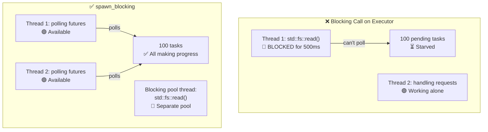

# 12. Common Pitfalls / 12. 常见陷阱 🔴

> **What you'll learn / 你将学到：**
> - 9 common async Rust bugs and how to fix each one / 9 种常见的异步 Rust Bug 及其修复方法
> - Why blocking the executor is the #1 mistake (and how `spawn_blocking` fixes it) / 为什么阻塞执行器是头号错误（以及 `spawn_blocking` 如何修复它）
> - Cancellation hazards: what happens when a future is dropped mid-await / 取消隐患：当 future 在 await 中途被 drop 时会发生什么
> - Debugging: `tokio-console`, `tracing`, `#[instrument]` / 调试工具：`tokio-console`、`tracing`、`#[instrument]`
> - Testing: `#[tokio::test]`, `time::pause()`, trait-based mocking / 测试：`#[tokio::test]`、`time::pause()`、基于 trait 的 Mock

## Blocking the Executor / 阻塞执行器

The #1 mistake in async Rust: running blocking code on the async executor thread. This starves other tasks.

异步 Rust 中的头号错误：在异步执行器线程上运行阻塞代码。这会导致其他任务由于得不到调度而“饿死”。

```rust
// ❌ WRONG: Blocks the entire executor thread
// ❌ 错误：阻塞了整个执行器线程
async fn bad_handler() -> String {
    let data = std::fs::read_to_string("big_file.txt").unwrap(); // BLOCKS!
                                                                    // 阻塞！
    process(&data)
}

// ✅ CORRECT: Offload blocking work to a dedicated thread pool
// ✅ 正确：将阻塞工作卸载到专门的线程池
async fn good_handler() -> String {
    let data = tokio::task::spawn_blocking(|| {
        std::fs::read_to_string("big_file.txt").unwrap()
    }).await.unwrap();
    process(&data)
}

// ✅ ALSO CORRECT: Use tokio's async fs
// ✅ 同样正确：使用 tokio 的异步文件系统接口
async fn also_good_handler() -> String {
    let data = tokio::fs::read_to_string("big_file.txt").await.unwrap();
    process(&data)
}
```



### std::thread::sleep vs tokio::time::sleep

```rust
// ❌ WRONG: Blocks the executor thread for 5 seconds
// ❌ 错误：阻塞执行器线程 5 秒钟
async fn bad_delay() {
    std::thread::sleep(Duration::from_secs(5)); // Thread can't poll anything else!
                                                // 线程无法轮询任何其他任务！
}

// ✅ CORRECT: Yields to the executor, other tasks can run
// ✅ 正确：礼让执行器，允许其他任务运行
async fn good_delay() {
    tokio::time::sleep(Duration::from_secs(5)).await; // Non-blocking!
                                                       // 非阻塞！
}
```

### Holding MutexGuard Across .await / 跨越 .await 持有 MutexGuard

```rust
use std::sync::Mutex; // std Mutex — NOT async-aware
                       // 标准库 Mutex —— 无法感知异步

// ❌ WRONG: MutexGuard held across .await
// ❌ 错误：跨越 .await 持有 MutexGuard
async fn bad_mutex(data: &Mutex<Vec<String>>) {
    let mut guard = data.lock().unwrap();
    guard.push("item".into());
    some_io().await; // 💥 Guard is held here — blocks other threads from locking!
                     // 💥 此处仍持有 guard —— 会阻止其他线程加锁！
    guard.push("another".into());
}
// Also: std::sync::MutexGuard is !Send, so this won't compile
// with tokio's multi-threaded runtime.

// ✅ FIX 1: Scope the guard to drop before .await
// ✅ 修复 1：缩减 guard 作用域，使其在 .await 前释放
async fn good_mutex_scoped(data: &Mutex<Vec<String>>) {
    {
        let mut guard = data.lock().unwrap();
        guard.push("item".into());
    } // Guard dropped here / Guard 在此释放
    some_io().await; // Safe — lock is released / 安全 —— 锁已释放
    {
        let mut guard = data.lock().unwrap();
        guard.push("another".into());
    }
}

// ✅ FIX 2: Use tokio::sync::Mutex (async-aware)
// ✅ 修复 2：使用 tokio::sync::Mutex (支持异步)
use tokio::sync::Mutex as AsyncMutex;

async fn good_async_mutex(data: &AsyncMutex<Vec<String>>) {
    let mut guard = data.lock().await; // Async lock — doesn't block the thread
                                       // 异步锁 —— 不会阻塞线程
    guard.push("item".into());
    some_io().await; // OK — tokio Mutex guard is Send
                     // 没问题 —— tokio Mutex 的 guard 是满足 Send 的
    guard.push("another".into());
}
```

> **When to use which Mutex / 何时使用哪种 Mutex**：
> - `std::sync::Mutex`: Short critical sections with no `.await` inside / 临界区非常短，且内部没有 `.await`
> - `tokio::sync::Mutex`: When you must hold the lock across `.await` points / 必须跨越 `.await` 点持有锁时
> - `parking_lot::Mutex`: Drop-in `std` replacement, faster, smaller, still no `.await` / 标准库的直接替代方案，更快，更小，但仍不能在内部使用 `.await`

### Cancellation Hazards / 取消隐患

Dropping a future cancels it — but this can leave things in an inconsistent state:

丢弃（Drop）一个 future 即意味着取消它 —— 但这可能会导致状态不一致：

```rust
// ❌ DANGEROUS: Resource leak on cancellation
// ❌ 危险：取消时可能发生资源泄漏/数据丢失
async fn transfer(from: &Account, to: &Account, amount: u64) {
    from.debit(amount).await;  // If cancelled HERE... / 如果在此处被取消...
    to.credit(amount).await;   // ...money vanishes! / ...钱就不翼而飞了！
}

// ✅ SAFE: Make operations atomic or use compensation
// ✅ 安全：使操作具有原子性或使用补偿机制
async fn safe_transfer(from: &Account, to: &Account, amount: u64) -> Result<(), Error> {
    // Use a database transaction (all-or-nothing)
    // 使用数据库事务（全成功或全失败）
    let tx = db.begin_transaction().await?;
    tx.debit(from, amount).await?;
    tx.credit(to, amount).await?;
    tx.commit().await?; // Only commits if everything succeeded
                        // 仅当所有操作都成功时才提交
    Ok(())
}

// ✅ ALSO SAFE: Use tokio::select! with cancellation awareness
// ✅ 同样安全：使用 tokio::select! 并具备取消感知能力
tokio::select! {
    result = transfer(from, to, amount) => {
        // Transfer completed
        // 传输完成
    }
    _ = shutdown_signal() => {
        // Don't cancel mid-transfer — let it finish
        // Or: roll back explicitly
        // 不要在中途取消传输 —— 让它完成
        // 或者：显式回滚
    }
}
```

### No Async Drop / 没有异步 Drop

Rust's `Drop` trait is synchronous — you **cannot** `.await` inside `drop()`. This is a frequent source of confusion:

Rust 的 `Drop` trait 是同步的 —— 你 **不能** 在 `drop()` 内部使用 `.await`。这是非常典型的困惑来源：

```rust
struct DbConnection { /* ... */ }

impl Drop for DbConnection {
    fn drop(&mut self) {
        // ❌ Can't do this — drop() is sync!
        // ❌ 不能这样做 —— drop() 是同步的！
        // self.connection.shutdown().await;

        // ✅ Workaround 1: Spawn a cleanup task (fire-and-forget)
        // ✅ 方案 1：派生一个清理任务（发完不理）
        let conn = self.connection.take();
        tokio::spawn(async move {
            let _ = conn.shutdown().await;
        });

        // ✅ Workaround 2: Use a synchronous close
        // ✅ 方案 2：使用同步关闭
        // self.connection.blocking_close();
    }
}
```

**Best practice / 最佳实践**：提供一个显式的 `async fn close(self)` 方法，并在文档中说明调用者应当使用它。仅将 `Drop` 用作兜底的安全网，而不要将其作为主要的清理路径。

### select! Fairness and Starvation / select! 公平性与饿死

```rust
use tokio::sync::mpsc;

// ❌ UNFAIR: busy_stream always wins, slow_stream starves
// ❌ 不公平：busy_stream 总是获胜，slow_stream 会饿死
async fn unfair(mut fast: mpsc::Receiver<i32>, mut slow: mpsc::Receiver<i32>) {
    loop {
        tokio::select! {
            Some(v) = fast.recv() => println!("fast: {v}"),
            Some(v) = slow.recv() => println!("slow: {v}"),
            // If both are ready, tokio randomly picks one.
            // But if `fast` is ALWAYS ready, `slow` rarely gets polled.
            // 如果两者都准备就绪，tokio 会随机选择一个。
            // 但如果 `fast` 总是准备就绪，`slow` 很少有机会被轮询。
        }
    }
}

// ✅ FAIR: Use biased select or drain in batches
// ✅ 公平：使用 biased 模式或分批处理
async fn fair(mut fast: mpsc::Receiver<i32>, mut slow: mpsc::Receiver<i32>) {
    loop {
        tokio::select! {
            biased; // Always check in order — explicit priority
                    // 总是按顺序检查 —— 显式优先级

            Some(v) = slow.recv() => println!("slow: {v}"),  // Priority! / 优先！
            Some(v) = fast.recv() => println!("fast: {v}"),
        }
    }
}
```

### Accidental Sequential Execution / 无意的顺序执行

```rust
// ❌ SEQUENTIAL: Takes 2 seconds total
// ❌ 顺序执行：总共耗时 2 秒
async fn slow() {
    let a = fetch("url_a").await; // 1 second
                                  // 1 秒
    let b = fetch("url_b").await; // 1 second (waits for a to finish first!)
                                  // 1 秒（等待 a 完成后才开始！）
}

// ✅ CONCURRENT: Takes 1 second total
// ✅ 并发执行：总共耗时 1 秒
async fn fast() {
    let (a, b) = tokio::join!(
        fetch("url_a"), // Both start immediately / 两者同时开始
        fetch("url_b"),
    );
}

// ✅ ALSO CONCURRENT: Using let + join
// ✅ 同样并发：使用 let + join
async fn also_fast() {
    let fut_a = fetch("url_a"); // Create future (lazy — not started yet)
                                // 创建 future（惰性 —— 尚未开始）
    let fut_b = fetch("url_b"); // Create future
                                // 创建 future
    let (a, b) = tokio::join!(fut_a, fut_b); // NOW both run concurrently
                                            // 现在两者并发运行
}
```

> **Trap / 陷阱**：`let a = fetch(url).await; let b = fetch(url).await;` 是串行的！
> The second `.await` doesn't start until the first finishes. Use `join!` or
> `spawn` for concurrency.
> 第二个 `.await` 直到第一个完成后才会开始。请使用 `join!` 或
> `spawn` 来实现真正的并发。

## Case Study: Debugging a Hung Production Service / 案例分析：调试卡死的生产服务

A real-world scenario: a service handles requests fine for 10 minutes, then stops responding. No errors in logs. CPU at 0%.

真实场景：一个服务在前 10 分钟运行良好，然后突然停止响应。日志中没有错误，CPU 占用率为 0%。

**Diagnosis steps / 诊断步骤：**

1. **Attach `tokio-console`** — reveals 200+ tasks stuck in `Pending` state / 挂载 `tokio-console` —— 发现 200 多个任务卡在 `Pending` 状态
2. **Check task details** — all waiting on the same `Mutex::lock().await` / 检查任务详情 —— 全部在等待同一个 `Mutex::lock().await`
3. **Root cause** — one task held a `std::sync::MutexGuard` across an `.await` and panicked, poisoning the mutex. All other tasks now fail on `lock().unwrap()`
   **根因** —— 某个任务在跨越 `.await` 时持有了 `std::sync::MutexGuard` 并发生了 panic，导致 mutex 被投毒（poisoning）。所有其他任务现在在 `lock().unwrap()` 上失败。

**The fix / 修复方案：**

| Before (broken) / 之前 (有问题) | After (fixed) / 之后 (已修复) |
|-----------------|---------------|
| `std::sync::Mutex` | `tokio::sync::Mutex` |
| `.lock().unwrap()` across `.await` | Scope lock before `.await` / 在 `.await` 之前缩小锁的作用域 |
| No timeout on lock acquisition | `tokio::time::timeout(dur, mutex.lock())` / 为加锁操作添加超时 |
| No recovery on poisoned mutex | `tokio::sync::Mutex` doesn't poison / `tokio::sync::Mutex` 不会投毒 |

**Prevention checklist / 预防清单：**
- [ ] Use `tokio::sync::Mutex` if the guard crosses any `.await` / 如果 guard 跨越任何 `.await`，请使用 `tokio::sync::Mutex`
- [ ] Add `#[tracing::instrument]` to async functions for span tracking / 为异步函数添加 `#[tracing::instrument]` 以进行 span 跟踪
- [ ] Run `tokio-console` in staging to catch hung tasks early / 在 staging 环境中运行 `tokio-console` 以尽早发现卡住的任务
- [ ] Add health check endpoints that verify task responsiveness / 添加健康检查端点以验证任务响应能力

<details>
<summary><strong>🏋️ Exercise: Spot the Bugs / 练习：找 Bug</strong> (click to expand / 点击展开)</summary>

**Challenge**: Find all the async pitfalls in this code and fix them.

**挑战**：找出这段代码中所有的异步陷阱并修复它们。

```rust
use std::sync::Mutex;

async fn process_requests(urls: Vec<String>) -> Vec<String> {
    let results = Mutex::new(Vec::new());
    
    for url in &urls {
        let response = reqwest::get(url).await.unwrap().text().await.unwrap();
        std::thread::sleep(std::time::Duration::from_millis(100)); // Rate limit
                                                                    // 限速
        let mut guard = results.lock().unwrap();
        guard.push(response);
        expensive_parse(&guard).await; // Parse all results so far
                                       // 解析目前所有结果
    }
    
    results.into_inner().unwrap()
}
```

<details>
<summary>🔑 Solution / 参考答案</summary>

**Bugs found / 发现的 Bug：**

1. **Sequential fetches** — URLs are fetched one at a time instead of concurrently
   **顺序抓取** —— URL 是一个接一个抓取的，而不是并发的
2. **`std::thread::sleep`** — Blocks the executor thread
   **`std::thread::sleep`** —— 阻塞了执行器线程
3. **MutexGuard held across `.await`** — `guard` is alive when `expensive_parse` is awaited
   **MutexGuard 跨越 `.await` 持有** —— 在 await `expensive_parse` 时，`guard` 依然存活
4. **No concurrency** — Should use `join!` or `FuturesUnordered`
   **没有并发** —— 应该使用 `join!` 或 `FuturesUnordered`

```rust
use tokio::sync::Mutex;
use std::sync::Arc;
use futures::stream::{self, StreamExt};

async fn process_requests(urls: Vec<String>) -> Vec<String> {
    // Fix 4: Process URLs concurrently with buffer_unordered
    // 修复 4：使用 buffer_unordered 并发处理 URL
    let results: Vec<String> = stream::iter(urls)
        .map(|url| async move {
            let response = reqwest::get(&url).await.unwrap().text().await.unwrap();
            // Fix 2: Use tokio::time::sleep instead of std::thread::sleep
            // 修复 2：使用 tokio::time::sleep 替代 std::thread::sleep
            tokio::time::sleep(std::time::Duration::from_millis(100)).await;
            response
        })
        .buffer_unordered(10) // Up to 10 concurrent requests
                              // 最多 10 个并发请求
        .collect()
        .await;

    // Fix 3: Parse after collecting — no mutex needed at all!
    // 修复 3：收集后解析 —— 完全不需要 mutex！
    for result in &results {
        expensive_parse(result).await;
    }

    results
}
```

**Key takeaway / 关键要点**：Often you can restructure async code to eliminate mutexes entirely. Collect results with streams/join, then process. Simpler, faster, no deadlock risk.
通常你可以重构异步代码以完全消除 mutex。使用 streams/join 收集结果，然后进行处理。这样更简单、更快，没有死锁风险。

</details>
</details>

---

### Debugging Async Code / 调试异步代码

Async stack traces are notoriously cryptic — they show the executor's poll loop rather than your logical call chain. Here are the essential debugging tools.

异步调用栈的跟踪记录是出了名的难懂 —— 它们显示的是执行器的轮询循环，而不是你的逻辑调用链。以下是必不可少的调试工具。

#### tokio-console: Real-Time Task Inspector / 任务实时检查器

[tokio-console](https://github.com/tokio-rs/console) gives you an `htop`-like view of every spawned task: its state, poll duration, waker activity, and resource usage.

[tokio-console](https://github.com/tokio-rs/console) 为你提供了一个类似于 `htop` 的界面，可以查看每一个派生的任务：其状态、轮询持续时间、唤醒器活动和资源使用情况。

```toml
# Cargo.toml
[dependencies]
console-subscriber = "0.4"
tokio = { version = "1", features = ["full", "tracing"] }
```

```rust
#[tokio::main]
async fn main() {
    console_subscriber::init(); // Replaces the default tracing subscriber
                                // 替换默认的 tracing 订阅者
    // ... rest of your application
    // ... 应用程序的其余部分
}
```

Then in another terminal:

然后在另一个终端中：

```bash
$ RUSTFLAGS="--cfg tokio_unstable" cargo run   # Required compile-time flag
                                               # 必需的编译时标志
$ tokio-console                                # Connects to 127.0.0.1:6669
                                               # 连接到 127.0.0.1:6669
```

#### tracing + #[instrument]: Structured Logging for Async / 异步结构化日志

The [`tracing`](https://docs.rs/tracing) crate understands `Future` lifetimes. Spans stay open across `.await` points, giving you a logical call stack even when the OS thread has moved on:

[`tracing`](https://docs.rs/tracing) 库能够理解 `Future` 的生命周期。Span 会跨越 `.await` 点保持开启状态，即使操作系统线程已经转移，也能为你提供逻辑调用栈：

```rust
use tracing::{info, instrument};

#[instrument(skip(db_pool), fields(user_id = %user_id))]
async fn handle_request(user_id: u64, db_pool: &Pool) -> Result<Response> {
    info!("looking up user");
    let user = db_pool.get_user(user_id).await?;  // span stays open across .await
                                                  // span 跨越 .await 保持开启
    info!(email = %user.email, "found user");
    let orders = fetch_orders(user_id).await?;     // still the same span
                                                   // 仍然是同一个 span
    Ok(build_response(user, orders))
}
```

Output (with `tracing_subscriber::fmt::json()`):

输出（使用 `tracing_subscriber::fmt::json()`）：

```json
{"timestamp":"...","level":"INFO","span":{"name":"handle_request","user_id":"42"},"message":"looking up user"}
{"timestamp":"...","level":"INFO","span":{"name":"handle_request","user_id":"42"},"fields":{"email":"a@b.com"},"message":"found user"}
```

#### Debugging Checklist / 调试清单

| Symptom / 症状 | Likely Cause / 可能原因 | Tool / 工具 |
|---------|-------------|------|
| Task hangs forever / 任务永久挂起 | Missing `.await` or deadlocked `Mutex` / 缺少 `.await` 或 `Mutex` 死锁 | `tokio-console` task view / `tokio-console` 任务视图 |
| Low throughput / 低吞吐量 | Blocking call on async thread / 异步线程上的阻塞调用 | `tokio-console` poll-time histogram / `tokio-console` 轮询时间直方图 |
| `Future is not Send` | Non-Send type held across `.await` / 跨越 `.await` 持有非 Send 类型 | Compiler error + `#[instrument]` to locate / 编译器错误 + `#[instrument]` 定位 |
| Mysterious cancellation / 神秘取消 | Parent `select!` dropped a branch / 父级 `select!` 丢弃了一个分支 | `tracing` span lifecycle events / `tracing` span 生命周期事件 |

> **Tip / 提示**：Enable `RUSTFLAGS="--cfg tokio_unstable"` to get task-level metrics
> in tokio-console. This is a compile-time flag, not a runtime one.
> 启用 `RUSTFLAGS="--cfg tokio_unstable"` 以在 tokio-console 中获取任务级指标。这是一个编译时标志，而不是运行时标志。

### Testing Async Code / 测试异步代码

Async code introduces unique testing challenges — you need a runtime, time control, and strategies for testing concurrent behavior.

异步代码带来了独特的测试挑战 —— 你需要运行时、时间控制以及测试并发行为的策略。

**Basic async tests** with `#[tokio::test]`:

使用 `#[tokio::test]` 编写基础异步测试：

```rust
// Cargo.toml
// [dev-dependencies]
// tokio = { version = "1", features = ["full", "test-util"] }

#[tokio::test]
async fn test_basic_async() {
    let result = fetch_data().await;
    assert_eq!(result, "expected");
}

// Single-threaded test (useful for !Send types):
// 单线程测试（对 !Send 类型有用）：
#[tokio::test(flavor = "current_thread")]
async fn test_single_threaded() {
    let rc = std::rc::Rc::new(42);
    let val = async { *rc }.await;
    assert_eq!(val, 42);
}

// Multi-threaded with explicit worker count:
// 多线程测试，带显式工作线程数：
#[tokio::test(flavor = "multi_thread", worker_threads = 2)]
async fn test_concurrent_behavior() {
    // Tests race conditions with real concurrency
    // 测试真实并发下的竞态条件
    let counter = std::sync::Arc::new(std::sync::atomic::AtomicU32::new(0));
    let c1 = counter.clone();
    let c2 = counter.clone();
    let (a, b) = tokio::join!(
        tokio::spawn(async move { c1.fetch_add(1, std::sync::atomic::Ordering::SeqCst) }),
        tokio::spawn(async move { c2.fetch_add(1, std::sync::atomic::Ordering::SeqCst) }),
    );
    a.unwrap();
    b.unwrap();
    assert_eq!(counter.load(std::sync::atomic::Ordering::SeqCst), 2);
}
```

**Time manipulation / 时间操控** — test timeouts without actually waiting:

**时间控制** —— 无需实际等待即可测试超时：

```rust
use tokio::time::{self, Duration, Instant};

#[tokio::test]
async fn test_timeout_behavior() {
    // Pause time — sleep() advances instantly, no real wall-clock delay
    // 暂停时间 —— sleep() 立即前进，没有实际的挂钟延迟
    time::pause();

    let start = Instant::now();
    time::sleep(Duration::from_secs(3600)).await; // "waits" 1 hour — takes 0ms
                                                  // “等待” 1 小时 —— 实际耗时 0ms
    assert!(start.elapsed() >= Duration::from_secs(3600));
    // Test ran in milliseconds, not an hour!
    // 测试在毫秒内运行，而不是一小时！
}

#[tokio::test]
async fn test_retry_timing() {
    time::pause();

    // Test that our retry logic waits the expected durations
    // 测试我们的重试逻辑等待了预期的持续时间
    let start = Instant::now();
    let result = retry_with_backoff(|| async {
        Err::<(), _>("simulated failure")
    }, 3, Duration::from_secs(1))
    .await;

    assert!(result.is_err());
    // 1s + 2s + 4s = 7s of backoff (exponential)
    // 1 秒 + 2 秒 + 4 秒 = 7 秒的退避（指数级）
    assert!(start.elapsed() >= Duration::from_secs(7));
}

#[tokio::test]
async fn test_deadline_exceeded() {
    time::pause();

    let result = tokio::time::timeout(
        Duration::from_secs(5),
        async {
            // Simulate slow operation
            // 模拟慢速操作
            time::sleep(Duration::from_secs(10)).await;
            "done"
        }
    ).await;

    assert!(result.is_err()); // Timed out
                              // 超时
}
```

**Mocking async dependencies** — use trait objects or generics:

**模拟异步依赖** —— 使用 trait 对象或泛型：

```rust
// Define a trait for the dependency:
// 定义依赖的 trait：
trait Storage {
    async fn get(&self, key: &str) -> Option<String>;
    async fn set(&self, key: &str, value: String);
}

// Production implementation:
// 生产实现：
struct RedisStorage { /* ... */ }
impl Storage for RedisStorage {
    async fn get(&self, key: &str) -> Option<String> {
        // Real Redis call
        // 真实的 Redis 调用
        todo!()
    }
    async fn set(&self, key: &str, value: String) {
        todo!()
    }
}

// Test mock:
// 测试 Mock：
struct MockStorage {
    data: std::sync::Mutex<std::collections::HashMap<String, String>>,
}

impl MockStorage {
    fn new() -> Self {
        MockStorage { data: std::sync::Mutex::new(std::collections::HashMap::new()) }
    }
}

impl Storage for MockStorage {
    async fn get(&self, key: &str) -> Option<String> {
        self.data.lock().unwrap().get(key).cloned()
    }
    async fn set(&self, key: &str, value: String) {
        self.data.lock().unwrap().insert(key.to_string(), value);
    }
}

// Tested function is generic over Storage:
// 被测函数是 Storage 的泛型：
async fn cache_lookup<S: Storage>(store: &S, key: &str) -> String {
    match store.get(key).await {
        Some(val) => val,
        None => {
            let val = "computed".to_string();
            store.set(key, val.clone()).await;
            val
        }
    }
}

#[tokio::test]
async fn test_cache_miss_then_hit() {
    let mock = MockStorage::new();

    // First call: miss → computes and stores
    // 第一次调用：未命中 → 计算并存储
    let val = cache_lookup(&mock, "key1").await;
    assert_eq!(val, "computed");

    // Second call: hit → returns stored value
    // 第二次调用：命中 → 返回存储的值
    let val = cache_lookup(&mock, "key1").await;
    assert_eq!(val, "computed");
    assert!(mock.data.lock().unwrap().contains_key("key1"));
}
```

**Testing channels and task communication / 测试通道和任务通信**：

```rust
#[tokio::test]
async fn test_producer_consumer() {
    let (tx, mut rx) = tokio::sync::mpsc::channel(10);

    tokio::spawn(async move {
        for i in 0..5 {
            tx.send(i).await.unwrap();
        }
        // tx dropped here — channel closes
        // tx 在此被 drop —— 通道关闭
    });

    let mut received = Vec::new();
    while let Some(val) = rx.recv().await {
        received.push(val);
    }

    assert_eq!(received, vec![0, 1, 2, 3, 4]);
}
```

| Test Pattern / 测试模式 | When to Use / 何时使用 | Key Tool / 关键工具 |
|-------------|-------------|----------|
| `#[tokio::test]` | All async tests / 所有异步测试 | `tokio = { features = ["macros", "rt"] }` |
| `time::pause()` | Testing timeouts, retries, periodic tasks / 测试超时、重试、周期性任务 | `tokio::time::pause()` |
| Trait mocking / Trait 模拟 | Testing business logic without I/O / 在没有 I/O 的情况下测试业务逻辑 | Generic `<S: Storage>` / 泛型 `<S: Storage>` |
| `current_thread` flavor / `current_thread` 模式 | Testing `!Send` types or deterministic scheduling / 测试 `!Send` 类型或确定性调度 | `#[tokio::test(flavor = "current_thread")]` |
| `multi_thread` flavor / `multi_thread` 模式 | Testing race conditions / 测试竞态条件 | `#[tokio::test(flavor = "multi_thread")]` |

> **Key Takeaways — Common Pitfalls / 关键要点：常见陷阱**
> - Never block the executor — use `spawn_blocking` for CPU/sync work / 永远不要阻塞执行器 —— 对 CPU 密集型/同步工作使用 `spawn_blocking`
> - Never hold a `MutexGuard` across `.await` — scope locks tightly or use `tokio::sync::Mutex` / 永远不要跨越 `.await` 持有 `MutexGuard` —— 严格控制锁的作用域或使用 `tokio::sync::Mutex`
> - Cancellation drops the future instantly — use "cancel-safe" patterns for partial operations / 取消会立即 drop future —— 对部分操作使用“取消安全”模式
> - Use `tokio-console` and `#[tracing::instrument]` for debugging async code / 使用 `tokio-console` 和 `#[tracing::instrument]` 调试异步代码
> - Test async code with `#[tokio::test]` and `time::pause()` for deterministic timing / 使用 `#[tokio::test]` 和 `time::pause()` 测试异步代码以实现确定性计时

> **See also / 延伸阅读：** [Ch 8 — Tokio Deep Dive / 第 8 章：Tokio 深入解析](ch08-tokio-deep-dive.md) for sync primitives, [Ch 13 — Production Patterns / 第 13 章：生产模式](ch13-production-patterns.md) for graceful shutdown and structured concurrency

***
