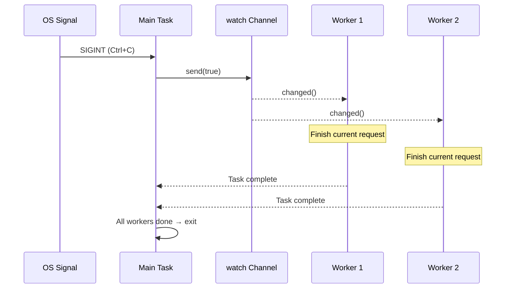

# 13. Production Patterns / 13. 生产模式 🔴

> **What you'll learn / 你将学到：**
> - Graceful shutdown with `watch` channels and `select!` / 使用 `watch` 通道和 `select!` 实现优雅停机
> - Backpressure: bounded channels prevent OOM / 背压机制：有界通道防止内存溢出 (OOM)
> - Structured concurrency: `JoinSet` and `TaskTracker` / 结构化并发：`JoinSet` 和 `TaskTracker`
> - Timeouts, retries, and exponential backoff / 超时、重试与指数级退避
> - Error handling: `thiserror` vs `anyhow`, the double-`?` pattern / 错误处理：`thiserror` 对比 `anyhow`，“双问号”模式
> - Tower: the middleware pattern used by axum, tonic, and hyper / Tower：axum、tonic 和 hyper 使用的中间件模式

## Graceful Shutdown / 优雅停机

Production servers must shut down cleanly — finish in-flight requests, flush buffers, close connections:

生产环境的服务器必须能够干净地关闭 —— 完成正在进行的请求、刷新缓冲区、关闭连接：

```rust
use tokio::signal;
use tokio::sync::watch;

async fn main_server() {
    // Create a shutdown signal channel / 创建一个停机信号通道
    let (shutdown_tx, shutdown_rx) = watch::channel(false);

    // Spawn the server / 启动服务器
    let server_handle = tokio::spawn(run_server(shutdown_rx.clone()));

    // Wait for Ctrl+C / 等待 Ctrl+C 信号
    signal::ctrl_c().await.expect("Failed to listen for Ctrl+C");
    println!("Shutdown signal received, finishing in-flight requests...");

    // Notify all tasks to shut down / 通知所有任务关闭
    shutdown_tx.send(true).unwrap();

    // Wait for server to finish (with timeout) / 等待服务器完成（带超时限制）
    match tokio::time::timeout(
        std::time::Duration::from_secs(30),
        server_handle,
    ).await {
        Ok(Ok(())) => println!("Server shut down gracefully"),
        Ok(Err(e)) => eprintln!("Server error: {e}"),
        Err(_) => eprintln!("Server shutdown timed out — forcing exit"),
    }
}
```



### Backpressure with Bounded Channels / 有界通道提供的背压机制

Unbounded channels can lead to OOM if the producer is faster than the consumer. Always use bounded channels in production:

如果不加限制，当生产者速度快于消费者时，无界通道会导致内存溢出（OOM）。在生产环境中，请务必使用有界通道：

```rust
use tokio::sync::mpsc;

async fn backpressure_example() {
    // Bounded channel: max 100 items buffered
    // 有界通道：缓冲区最多存放 100 个项
    let (tx, mut rx) = mpsc::channel::<WorkItem>(100);

    // Producer: slows down naturally when buffer is full
    // 生产者：当缓冲区满时会自动减速
    let producer = tokio::spawn(async move {
        for i in 0..1_000_000 {
            // send() is async — waits if buffer is full
            // send() 是异步的 —— 如果缓冲区满，它会等待
            // This creates natural backpressure! / 这就产生了天然的背压！
            tx.send(WorkItem { id: i }).await.unwrap();
        }
    });

    // Consumer: processes items at its own pace
    // 消费者：按自己的步调处理项
    let consumer = tokio::spawn(async move {
        while let Some(item) = rx.recv().await {
            process(item).await; // Slow processing is OK — producer waits
                                 // 即使处理很慢也没关系 —— 生产者会等待
        }
    });

    let _ = tokio::join!(producer, consumer);
}
```

### Structured Concurrency: JoinSet and TaskTracker / 结构化并发：JoinSet 与 TaskTracker

`JoinSet` groups related tasks and ensures they all complete:

`JoinSet` 可将相关任务分组，并确保它们全部完成：

```rust
use tokio::task::JoinSet;
use tokio::time::{sleep, Duration};

async fn structured_concurrency() {
    let mut set = JoinSet::new();

    // Spawn a batch of tasks / 派生一批任务
    for url in get_urls() {
        set.spawn(async move {
            fetch_and_process(url).await
        });
    }

    // Collect all results (order not guaranteed) / 收集所有结果（不保证顺序）
    let mut results = Vec::new();
    while let Some(result) = set.join_next().await {
        match result {
            Ok(Ok(data)) => results.push(data),
            Ok(Err(e)) => eprintln!("Task error: {e}"),
            Err(e) => eprintln!("Task panicked: {e}"),
        }
    }

    // ALL tasks are done here / 所有任务在此处均已完成
    println!("Processed {} items", results.len());
}
```

### Timeouts and Retries / 超时与重试

```rust
use tokio::time::{timeout, sleep, Duration};

// Simple timeout / 简单的超时处理
async fn with_timeout() -> Result<Response, Error> {
    match timeout(Duration::from_secs(5), fetch_data()).await {
        Ok(Ok(response)) => Ok(response),
        Ok(Err(e)) => Err(Error::Fetch(e)),
        Err(_) => Err(Error::Timeout),
    }
}

// Exponential backoff retry / 指数级退避重试
async fn retry_with_backoff<F, Fut, T, E>(
    max_attempts: u32,
    base_delay_ms: u64,
    operation: F,
) -> Result<T, E>
where
    F: Fn() -> Fut,
    Fut: std::future::Future<Output = Result<T, E>>,
    E: std::fmt::Display,
{
    let mut delay = Duration::from_millis(base_delay_ms);

    for attempt in 1..=max_attempts {
        match operation().await {
            Ok(result) => return Ok(result),
            Err(e) => {
                if attempt == max_attempts {
                    return Err(e);
                }
                sleep(delay).await;
                delay *= 2; // Exponential backoff / 指数级退避
            }
        }
    }
    unreachable!()
}
```

> **Production tip — add jitter / 生产环境提示 —— 加入抖动**：The function above uses pure exponential backoff, but in production many clients failing simultaneously will all retry at the same intervals (thundering herd). Add random *jitter* so retries spread out over time.
>
> **生产建议**：上述函数使用的是纯指数退避，但在生产环境中，如果许多客户端同时失败，它们可能会在相同的时间间隔重试（造成惊群效应）。请加入随机 **抖动（jitter）**，使重试在时间上分散开。

### Error Handling in Async Code / 异步代码中的错误处理

Async introduces unique error propagation challenges — spawned tasks create error boundaries, timeout errors wrap inner errors, and `?` interacts differently when futures cross task boundaries.

异步带来了独特的错误传播挑战 —— 派生的任务会创建错误边界，超时错误会包装内部错误，当 future 跨越任务边界时，`?` 的交互方式也会有所不同。

**`thiserror` vs `anyhow`** — choosing the right tool:

**`thiserror` 对比 `anyhow`** —— 选择合适的工具：

```rust
// thiserror: Define typed errors for libraries and public APIs
// thiserror：为库和公共 API 定义强类型错误
use thiserror::Error;

#[derive(Error, Debug)]
enum DiagError {
    #[error("IPMI command failed: {0}")]
    Ipmi(#[from] IpmiError),

    #[error("Sensor {sensor} out of range: {value}°C")]
    OverTemp { sensor: String, value: f64 },

    #[error("Operation timed out")]
    Timeout,
}

// anyhow: Quick error handling for applications and prototypes
// anyhow：用于应用程序和原型的快速错误处理
use anyhow::{Context, Result};

async fn run_diagnostics() -> Result<()> {
    let config = load_config()
        .await
        .context("Failed to load diagnostic config")?; // 添加上下文信息

    run_gpu_test(&config)
        .await
        .context("GPU diagnostic failed")?; // 链式添加上下文

    Ok(())
}
```

| Crate / 库 | Use When / 适用场景 | Error Type / 错误类型 | Matching / 匹配方式 |
|-------|----------|-----------|----------|
| `thiserror` | Library code, public APIs / 库代码、公共 API | `enum MyError { ... }` | `match err { MyError::Timeout => ... }` |
| `anyhow` | Applications, CLI tools / 应用程序、命令行工具 | `anyhow::Error` | `err.downcast_ref::<MyError>()` |

**The double-`?` pattern** with `tokio::spawn`:

使用了 `tokio::spawn` 的 **“双问号”模式**：

```rust
async fn spawn_with_errors() -> Result<String, AppError> {
    let handle = tokio::spawn(async {
        let resp = reqwest::get("https://example.com").await?;
        Ok::<_, reqwest::Error>(resp.text().await?)
    });

    // Double ?: First ? unwraps JoinError (task panic), second ? unwraps inner Result
    // 双问号：第一个 ? 解开 JoinError（任务崩溃），第二个 ? 解开内部的 Result
    let result = handle.await??;
    Ok(result)
}
```

### Tower: The Middleware Pattern / Tower：中间件模式

The [Tower](https://docs.rs/tower) crate defines a composable `Service` trait — the backbone of async middleware in Rust:

[Tower](https://docs.rs/tower) 库定义了一个可组合的 `Service` trait —— 这是 Rust 异步中间件的基石：

```rust
use tower::{ServiceBuilder, timeout::TimeoutLayer, limit::RateLimitLayer};
use std::time::Duration;

let service = ServiceBuilder::new()
    .layer(TimeoutLayer::new(Duration::from_secs(10)))       // Outermost: timeout / 最外层：超时
    .layer(RateLimitLayer::new(100, Duration::from_secs(1))) // Then: rate limit / 然后：限流
    .service(my_handler);                                     // Innermost: your code / 最内层：你的业务代码
```

**Why this matters**: If you've used ASP.NET or Express.js middleware, Tower is the Rust equivalent. It's how production Rust services add cross-cutting concerns without code duplication.

**为什么这很重要**：如果你使用过 ASP.NET 或 Express.js 的中间件，Tower 就是 Rust 中的对应方案。它是生产级 Rust 服务在不重复代码的情况下添加横切关注点的方式。

### Exercise: Graceful Shutdown with Worker Pool / 练习：带有工作池的优雅停机

<details>
<summary>🏋️ Exercise (click to expand / 点击展开)</summary>

**Challenge**: Build a task processor with a channel-based work queue, N worker tasks, and graceful shutdown on Ctrl+C. Workers should finish in-flight work before exiting.

**挑战**：构建一个任务处理器，包含基于通道的工作队列、N 个工作任务，并在收到 Ctrl+C 时实现优雅停机。工作任务应在退出前完成当前正在处理的工作。

<details>
<summary>🔑 Solution / 参考答案</summary>

```rust
use tokio::sync::{mpsc, watch};
use tokio::time::{sleep, Duration};

struct WorkItem { id: u64, payload: String }

#[tokio::main]
async fn main() {
    let (work_tx, work_rx) = mpsc::channel::<WorkItem>(100);
    let (shutdown_tx, shutdown_rx) = watch::channel(false);
    let work_rx = std::sync::Arc::new(tokio::sync::Mutex::new(work_rx));

    let mut handles = Vec::new();
    for id in 0..4 {
        let rx = work_rx.clone();
        let mut shutdown = shutdown_rx.clone();
        handles.push(tokio::spawn(async move {
            loop {
                let item = {
                    let mut rx = rx.lock().await;
                    tokio::select! {
                        item = rx.recv() => item,
                        _ = shutdown.changed() => {
                            if *shutdown.borrow() { None } else { continue }
                        }
                    }
                };
                match item {
                    Some(work) => {
                        println!("Worker {id}: processing {}", work.id);
                        sleep(Duration::from_millis(200)).await;
                    }
                    None => break,
                }
            }
        }));
    }

    // Submit work ... / 提交工作 ...

    // On Ctrl+C: signal shutdown, wait for workers
    // 在 Ctrl+C 时：发出停机信号，等待工作任务完成
    tokio::signal::ctrl_c().await.unwrap();
    shutdown_tx.send(true).unwrap();
    for h in handles { let _ = h.await; }
    println!("Shut down cleanly.");
}
```

</details>
</details>

> **Key Takeaways — Production Patterns / 关键要点：生产模式**
> - Use a `watch` channel + `select!` for coordinated graceful shutdown / 使用 `watch` 通道 + `select!` 进行协调一致的优雅停机
> - Bounded channels (`mpsc::channel(N)`) provide **backpressure** / 有界通道（`mpsc::channel(N)`）提供了 **背压 (backpressure)** 机制
> - `JoinSet` and `TaskTracker` provide **structured concurrency** / `JoinSet` 和 `TaskTracker` 为 Rust 带来了 **结构化并发 (structured concurrency)**
> - Always add timeouts to network operations / 务必为网络操作添加超时处理
> - Tower's `Service` trait is the standard middleware pattern / Tower 的 `Service` trait 是标准的中间件模式

> **See also / 延伸阅读：** [Ch 8 — Tokio Deep Dive / 第 8 章：Tokio 深入解析](ch08-tokio-deep-dive.md) for channels, [Ch 12 — Common Pitfalls / 第 12 章：常见陷阱](ch12-common-pitfalls.md) for cancellation hazards

***


