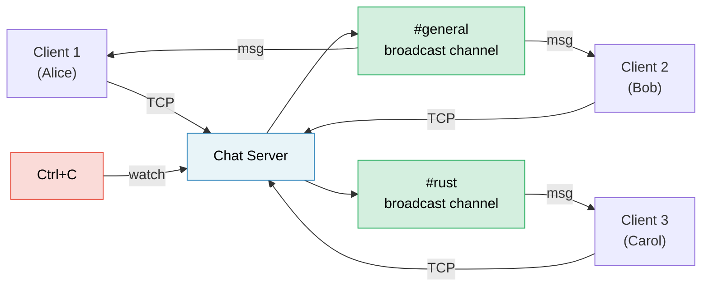

# Capstone Project: Async Chat Server / 终极项目：异步聊天服务器

This project integrates patterns from across the book into a single, production-style application. You'll build a **multi-room async chat server** using tokio, channels, streams, graceful shutdown, and proper error handling.

本项目将本书中提到的各种模式整合到一个生产风格的应用中。你将使用 tokio、通道、流、优雅停机以及完善的错误处理来构建一个 **多房间异步聊天服务器**。

**Estimated time / 预计耗时**：4–6 hours / 4-6 小时 | **Difficulty / 难度**：★★★

> **What you'll practice / 你将练习：**
> - `tokio::spawn` and the `'static` requirement (Ch 8) / `tokio::spawn` 及其 `'static` 要求（第 8 章）
> - Channels: `mpsc` for messages, `broadcast` for rooms, `watch` for shutdown (Ch 8) / 通道：用于消息的 `mpsc`、用于房间的 `broadcast`、用于停机的 `watch`（第 8 章）
> - Streams: reading lines from TCP connections (Ch 11) / 流：从 TCP 连接中读取行（第 11 章）
> - Common pitfalls: cancellation safety, MutexGuard across `.await` (Ch 12) / 常见陷阱：取消安全性、跨 `.await` 持有 MutexGuard（第 12 章）
> - Production patterns: graceful shutdown, backpressure (Ch 13) / 生产模式：优雅停机、背压（第 13 章）
> - Async traits for pluggable backends (Ch 10) / 异步 trait 用于可插拔后端（第 10 章）

## The Problem / 项目需求

Build a TCP chat server where:

构建一个满足以下要求的 TCP 聊天服务器：

1. **Clients** connect via TCP and join named rooms / **客户端**通过 TCP 连接并加入指定的房间
2. **Messages** are broadcast to all clients in the same room / **消息**会广播给同房间内的所有客户端
3. **Commands**: `/join <room>`, `/nick <name>`, `/rooms`, `/quit` / **命令**：加入房间、修改昵称、查看房间列表、退出
4. The server shuts down gracefully on Ctrl+C / 服务器在收到 Ctrl+C 时可以优雅地停机



## Step 1: Basic TCP Accept Loop / 第 1 步：基础 TCP 接收循环

Start with a server that accepts connections and echoes lines back:

首先实现一个能够接收连接并回显内容的服务器：

```rust
use tokio::io::{AsyncBufReadExt, AsyncWriteExt, BufReader};
use tokio::net::TcpListener;

#[tokio::main]
async fn main() -> anyhow::Result<()> {
    let listener = TcpListener::bind("127.0.0.1:8080").await?;
    println!("Chat server listening on :8080");

    loop {
        let (socket, addr) = listener.accept().await?;
        println!("[{addr}] Connected");

        tokio::spawn(async move {
            let (reader, mut writer) = socket.into_split();
            let mut reader = BufReader::new(reader);
            let mut line = String::new();

            loop {
                line.clear();
                match reader.read_line(&mut line).await {
                    Ok(0) | Err(_) => break,
                    Ok(_) => {
                        let _ = writer.write_all(line.as_bytes()).await;
                    }
                }
            }
            println!("[{addr}] Disconnected");
        });
    }
}
```

**Your job / 你的任务**：Verify this compiles and works with `telnet localhost 8080`. / 验证此代码可编译，并通过 `telnet localhost 8080` 进行测试。

## Step 2: Room State with Broadcast Channels / 第 2 步：使用广播通道管理房间状态

Each room is a `broadcast::Sender`. All clients in a room subscribe to receive messages.

每个房间都是一个 `broadcast::Sender`。房间内的所有客户端都订阅该通道以接收消息。

```rust
use std::collections::HashMap;
use std::sync::Arc;
use tokio::sync::{broadcast, RwLock};

type RoomMap = Arc<RwLock<HashMap<String, broadcast::Sender<String>>>>;

fn get_or_create_room(rooms: &mut HashMap<String, broadcast::Sender<String>>, name: &str) -> broadcast::Sender<String> {
    rooms.entry(name.to_string())
        .or_insert_with(|| {
            let (tx, _) = broadcast::channel(100); // 100-message buffer / 100 条消息的缓冲区
            tx
        })
        .clone()
}
```

**Your job / 你的任务**：Implement room state so that clients can join rooms and messages are broadcast to the sender's current room. / 实现房间状态管理，使客户端可以加入房间，且消息会广播给发送者所在的房间。

<details>
<summary>💡 Hint — Client task structure / 提示 —— 客户端任务结构</summary>

Each client task needs two concurrent loops / 每个客户端任务都需要两个并发循环：
1. **Read from TCP** → parse commands or broadcast to room / **从 TCP 读取** → 解析命令或广播到房间
2. **Read from broadcast receiver** → write to TCP / **从广播接收器读取** → 写入 TCP

Use `tokio::select!` to run both / 使用 `tokio::select!` 同时运行两者：

```rust
loop {
    tokio::select! {
        result = reader.read_line(&mut line) => { /* ... */ }
        result = room_rx.recv() => { /* ... */ }
    }
}
```

</details>

## Step 3: Commands / 第 3 步：指令系统

Implement the command protocol / 实现指令协议：

| Command / 命令 | Action / 动作 |
|---------|--------|
| `/join <room>` | Leave current room, join new room / 离开当前房间，加入新房间 |
| `/nick <name>` | Change display name / 修改显示昵称 |
| `/rooms` | List all active rooms / 列出所有活跃房间 |
| `/quit` | Disconnect gracefully / 优雅断开连接 |
| Anything else / 其他内容 | Broadcast as a chat message / 作为聊天消息广播 |

## Step 4: Graceful Shutdown / 第 4 步：优雅停机

Add Ctrl+C handling to stop accepting and exit cleanly. / 添加 Ctrl+C 处理逻辑以停止接收并平衡退出。

```rust
use tokio::sync::watch;

let (shutdown_tx, shutdown_rx) = watch::channel(false);

// In the accept loop / 在接收循环中：
loop {
    tokio::select! {
        result = listener.accept() => { /* ... */ }
        _ = tokio::signal::ctrl_c() => {
            shutdown_tx.send(true)?;
            break;
        }
    }
}
```

## Step 5: Error Handling and Edge Cases / 第 5 步：错误处理与边界情况

Production-harden the server / 强化服务器稳定性：

1. **Lagging receivers**: Handle `RecvError::Lagged(n)` if a slow client misses messages. / **滞后接收者**：如果慢速客户端遗漏了消息，请妥善处理 `RecvError::Lagged(n)`。
2. **Backpressure**: The broadcast channel buffer is bounded. / **背压**：广播通道的缓冲区是有界的。
3. **Timeout**: Disconnect clients that are idle for >5 minutes. / **超时**：断开空闲超过 5 分钟的客户端。

## Step 6: Integration Test / 第 6 步：集成测试

Write a test that starts the server, connects two clients, and verifies message delivery. / 编写一个测试，启动服务器并连接两个客户端，验证消息是否可以成功送达。

## Evaluation Criteria / 评估标准

| Criterion / 准则 | Target / 目标 |
|-----------|--------|
| Concurrency / 并发性 | Multiple clients in multiple rooms, no blocking / 多个房间、多个客户端，互不阻塞 |
| Correctness / 正确性 | Messages only go to clients in the same room / 消息仅发送给同房间的客户端 |
| Graceful shutdown / 优雅停机 | Ctrl+C drains messages and exits cleanly / Ctrl+C 后处理完消息并安全退出 |
| Error handling / 错误处理 | Lagged receivers, disconnections, timeouts handled / 处理好滞后、断连和超时 |

## Extension Ideas / 扩展思路

1. **Persistent history**: Store last N messages per room. / **持久化历史记录**：存储每个房间最后 N 条消息。
2. **WebSocket support**: Accept WebSocket clients using `tokio-tungstenite`. / **WebSocket 支持**：支持 WebSocket 客户端。
3. **TLS**: Add `tokio-rustls` for encrypted connections. / **TLS**：添加加密连接支持。

***
