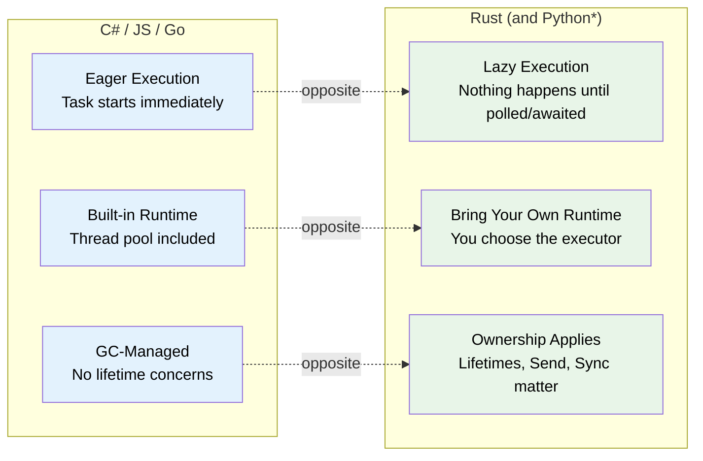
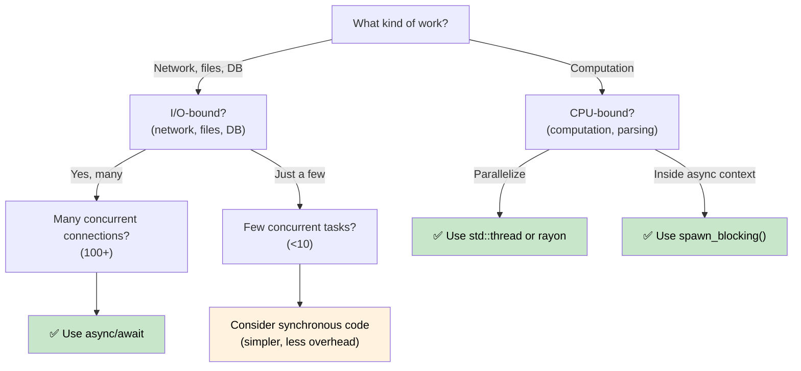

# 1. Why Async is Different in Rust 🟢

> **What you'll learn:**
> - Why Rust has no built-in async runtime (and what that means for you)
> - The three key properties: lazy execution, no runtime, zero-cost abstraction
> - When async is the right tool (and when it's slower)
> - How Rust's model compares to C#, Go, Python, and JavaScript

## The Fundamental Difference

Most languages with `async/await` hide the machinery. C# has the CLR thread pool. JavaScript has the event loop. Go has goroutines and a scheduler built into the runtime. Python has `asyncio`.

**Rust has nothing.**

There is no built-in runtime, no thread pool, no event loop. The `async` keyword is a zero-cost compilation strategy — it transforms your function into a state machine that implements the `Future` trait. Someone else (an *executor*) must drive that state machine forward.

### Three Key Properties of Rust Async



> \* Python coroutines are lazy like Rust futures — they don't execute until awaited or scheduled. However, Python still uses GC and has no ownership/lifetime concerns.

### No Built-In Runtime

```rust
// This compiles but does NOTHING:
async fn fetch_data() -> String {
    "hello".to_string()
}

fn main() {
    let future = fetch_data(); // Creates the Future, but doesn't execute it
    // future is just a struct sitting on the stack
    // No output, no side effects, nothing happens
    drop(future); // Silently dropped — work was never started
}
```

Compare with C# where `Task` starts eagerly:
```csharp
// C# — this immediately starts executing:
async Task<string> FetchData() => "hello";

var task = FetchData(); // Already running!
var result = await task; // Just waits for completion
```

### Lazy Futures vs Eager Tasks

This is the single most important mental shift:

| | C# / JavaScript | Python | Go | Rust |
|---|---|---|---|---|
| **Creation** | `Task` starts executing immediately | Coroutine is **lazy** — returns an object, doesn't run until awaited or scheduled | Goroutine starts immediately | `Future` does nothing until polled |
| **Dropping** | Detached task continues running | Unawaited coroutine is garbage-collected (with a warning) | Goroutine runs until return | Dropping a Future cancels it |
| **Runtime** | Built into the language/VM | `asyncio` event loop (must be explicitly started) | Built into the binary (M:N scheduler) | You choose (tokio, smol, etc.) |
| **Scheduling** | Automatic (thread pool) | Event loop + `await` or `create_task()` | Automatic (GMP scheduler) | Explicit (`spawn`, `block_on`) |
| **Cancellation** | `CancellationToken` (cooperative) | `Task.cancel()` (cooperative, raises `CancelledError`) | `context.Context` (cooperative) | Drop the future (immediate) |

```rust
// To actually RUN a future, you need an executor:
#[tokio::main]
async fn main() {
    let result = fetch_data().await; // NOW it executes
    println!("{result}");
}
```

### When to Use Async (and When Not To)



**Rule of thumb**: Async is for I/O concurrency (doing many things at once while waiting), not CPU parallelism (making one thing faster). If you have 10,000 network connections, async shines. If you're crunching numbers, use `rayon` or OS threads.

### When Async Can Be *Slower*

Async isn't free. For low-concurrency workloads, synchronous code can outperform async:

| Cost | Why |
|------|-----|
| **State machine overhead** | Each `.await` adds an enum variant; deeply nested futures produce large, complex state machines |
| **Dynamic dispatch** | `Box<dyn Future>` adds indirection and kills inlining |
| **Context switching** | Cooperative scheduling still has cost — the executor must manage a task queue, wakers, and I/O registrations |
| **Compile time** | Async code generates more complex types, slowing down compilation |
| **Debuggability** | Stack traces through state machines are harder to read (see Ch. 12) |

**Benchmarking guidance**: If fewer than ~10 concurrent I/O operations, profile before committing to async. A simple `std::thread::spawn` per connection scales fine to hundreds of threads on modern Linux.

### Exercise: When Would You Use Async?

<details>
<summary>🏋️ Exercise (click to expand)</summary>

For each scenario, decide whether async is appropriate and explain why:

1. A web server handling 10,000 concurrent WebSocket connections
2. A CLI tool that compresses a single large file
3. A service that queries 5 different databases and merges results
4. A game engine running a physics simulation at 60 FPS

<details>
<summary>🔑 Solution</summary>

1. **Async** — I/O-bound with massive concurrency. Each connection spends most time waiting for data. Threads would require 10K stacks.
2. **Sync/threads** — CPU-bound, single task. Async adds overhead with no benefit. Use `rayon` for parallel compression.
3. **Async** — Five concurrent I/O waits. `tokio::join!` runs all five queries simultaneously.
4. **Sync/threads** — CPU-bound, latency-sensitive. Async's cooperative scheduling could introduce frame jitter.

</details>
</details>

> **Key Takeaways — Why Async is Different**
> - Rust futures are **lazy** — they do nothing until polled by an executor
> - There is **no built-in runtime** — you choose (or build) your own
> - Async is a **zero-cost compilation strategy** that produces state machines
> - Async shines for **I/O-bound concurrency**; for CPU-bound work, use threads or rayon

> **See also:** [Ch 2 — The Future Trait](ch02-the-future-trait.md) for the trait that makes this all work, [Ch 7 — Executors and Runtimes](ch07-executors-and-runtimes.md) for choosing your runtime

***


