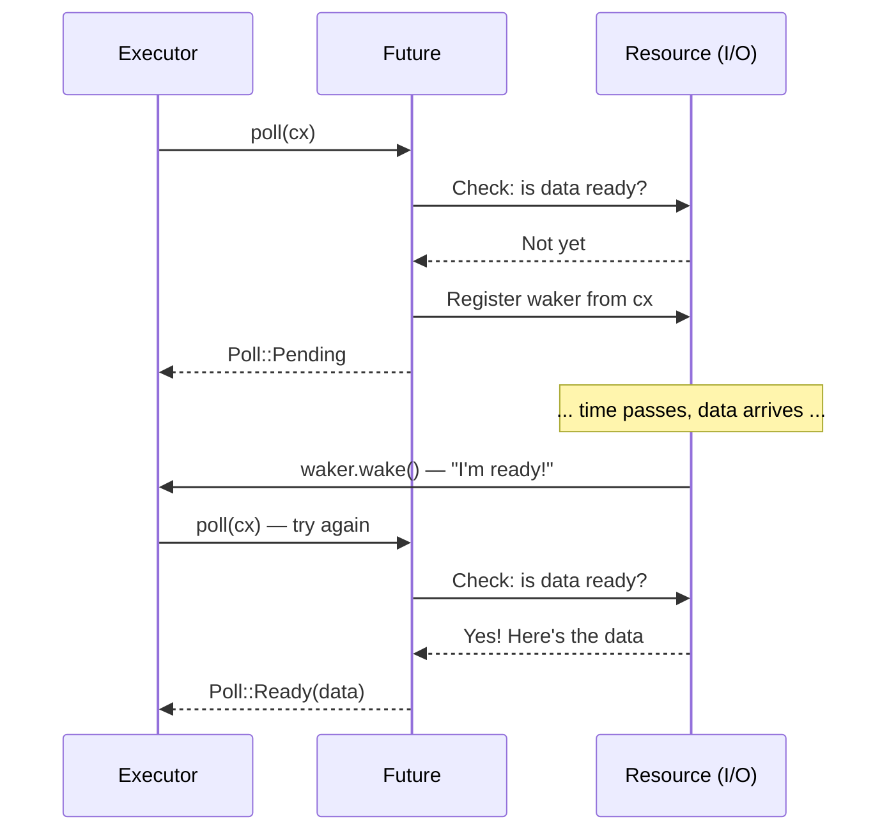

# 2. The Future Trait 🟡

> **What you'll learn:**
> - The `Future` trait: `Output`, `poll()`, `Context`, `Waker`
> - How a waker tells the executor "poll me again"
> - The contract: never call `wake()` = your program silently hangs
> - Implementing a real future by hand (`Delay`)

## Anatomy of a Future

Everything in async Rust ultimately implements this trait:

```rust
pub trait Future {
    type Output;

    fn poll(self: Pin<&mut Self>, cx: &mut Context<'_>) -> Poll<Self::Output>;
}

pub enum Poll<T> {
    Ready(T),   // The future has completed with value T
    Pending,    // The future is not ready yet — call me back later
}
```

That's it. A `Future` is anything that can be *polled* — asked "are you done yet?" — and responds with either "yes, here's the result" or "not yet, I'll wake you up when I'm ready."

### Output, poll(), Context, Waker



Let's break down each piece:

```rust
use std::future::Future;
use std::pin::Pin;
use std::task::{Context, Poll};

// A future that returns 42 immediately
struct Ready42;

impl Future for Ready42 {
    type Output = i32; // What the future eventually produces

    fn poll(self: Pin<&mut Self>, _cx: &mut Context<'_>) -> Poll<i32> {
        Poll::Ready(42) // Always ready — no waiting
    }
}
```

**The components**:
- **`Output`** — the type of value produced when the future completes
- **`poll()`** — called by the executor to check progress; returns `Ready(value)` or `Pending`
- **`Pin<&mut Self>`** — ensures the future won't be moved in memory (we'll cover why in Ch. 4)
- **`Context`** — carries the `Waker` so the future can signal the executor when it's ready to make progress

### The Waker Contract

The `Waker` is the callback mechanism. When a future returns `Pending`, it *must* arrange for `waker.wake()` to be called later — otherwise the executor will never poll it again and the program hangs.

```rust
use std::task::{Context, Poll, Waker};
use std::pin::Pin;
use std::future::Future;
use std::sync::{Arc, Mutex};
use std::thread;
use std::time::Duration;

/// A future that completes after a delay (toy implementation)
struct Delay {
    completed: Arc<Mutex<bool>>,
    waker_stored: Arc<Mutex<Option<Waker>>>,
    duration: Duration,
    started: bool,
}

impl Delay {
    fn new(duration: Duration) -> Self {
        Delay {
            completed: Arc::new(Mutex::new(false)),
            waker_stored: Arc::new(Mutex::new(None)),
            duration,
            started: false,
        }
    }
}

impl Future for Delay {
    type Output = ();

    fn poll(mut self: Pin<&mut Self>, cx: &mut Context<'_>) -> Poll<()> {
        // Check if already completed
        if *self.completed.lock().unwrap() {
            return Poll::Ready(());
        }

        // Store the waker so the background thread can wake us
        *self.waker_stored.lock().unwrap() = Some(cx.waker().clone());

        // Start the background timer on first poll
        if !self.started {
            self.started = true;
            let completed = Arc::clone(&self.completed);
            let waker = Arc::clone(&self.waker_stored);
            let duration = self.duration;

            thread::spawn(move || {
                thread::sleep(duration);
                *completed.lock().unwrap() = true;

                // CRITICAL: wake the executor so it polls us again
                if let Some(w) = waker.lock().unwrap().take() {
                    w.wake(); // "Hey executor, I'm ready — poll me again!"
                }
            });
        }

        Poll::Pending // Not done yet
    }
}
```

> **Key insight**: In C#, the TaskScheduler handles waking automatically.
> In Rust, **you** (or the I/O library you use) are responsible for calling
> `waker.wake()`. Forget it, and your program silently hangs.

### Exercise: Implement a CountdownFuture

<details>
<summary>🏋️ Exercise (click to expand)</summary>

**Challenge**: Implement a `CountdownFuture` that counts down from N to 0, printing the current count each time it's polled. When it reaches 0, it completes with `Ready("Liftoff!")`.

*Hint*: The future needs to store the current count and decrement it on each poll. Remember to always re-register the waker!

<details>
<summary>🔑 Solution</summary>

```rust
use std::future::Future;
use std::pin::Pin;
use std::task::{Context, Poll};

struct CountdownFuture {
    count: u32,
}

impl CountdownFuture {
    fn new(start: u32) -> Self {
        CountdownFuture { count: start }
    }
}

impl Future for CountdownFuture {
    type Output = &'static str;

    fn poll(mut self: Pin<&mut Self>, cx: &mut Context<'_>) -> Poll<Self::Output> {
        if self.count == 0 {
            println!("Liftoff!");
            Poll::Ready("Liftoff!")
        } else {
            println!("{}...", self.count);
            self.count -= 1;
            cx.waker().wake_by_ref(); // Schedule re-poll immediately
            Poll::Pending
        }
    }
}
```

**Key takeaway**: This future is polled once per count. Each time it returns `Pending`, it immediately wakes itself to be polled again. In production, you'd use a timer instead of busy-polling.

</details>
</details>

> **Key Takeaways — The Future Trait**
> - `Future::poll()` returns `Poll::Ready(value)` or `Poll::Pending`
> - A future must register a `Waker` before returning `Pending` — the executor uses it to know when to re-poll
> - `Pin<&mut Self>` guarantees the future won't be moved in memory (needed for self-referential state machines — see Ch 4)
> - Everything in async Rust — `async fn`, `.await`, combinators — is built on this one trait

> **See also:** [Ch 3 — How Poll Works](ch03-how-poll-works.md) for the executor loop, [Ch 6 — Building Futures by Hand](ch06-building-futures-by-hand.md) for more complex implementations

***


