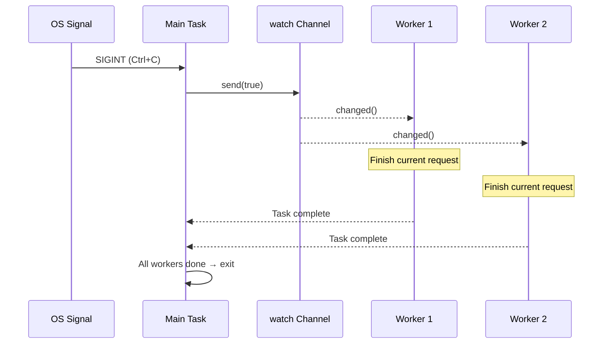

# 13. Production Patterns 🔴

> **What you'll learn:**
> - Graceful shutdown with `watch` channels and `select!`
> - Backpressure: bounded channels prevent OOM
> - Structured concurrency: `JoinSet` and `TaskTracker`
> - Timeouts, retries, and exponential backoff
> - Error handling: `thiserror` vs `anyhow`, the double-`?` pattern
> - Tower: the middleware pattern used by axum, tonic, and hyper

## Graceful Shutdown

Production servers must shut down cleanly — finish in-flight requests, flush buffers, close connections:

```rust
use tokio::signal;
use tokio::sync::watch;

async fn main_server() {
    // Create a shutdown signal channel
    let (shutdown_tx, shutdown_rx) = watch::channel(false);

    // Spawn the server
    let server_handle = tokio::spawn(run_server(shutdown_rx.clone()));

    // Wait for Ctrl+C
    signal::ctrl_c().await.expect("Failed to listen for Ctrl+C");
    println!("Shutdown signal received, finishing in-flight requests...");

    // Notify all tasks to shut down
    shutdown_tx.send(true).unwrap();

    // Wait for server to finish (with timeout)
    match tokio::time::timeout(
        std::time::Duration::from_secs(30),
        server_handle,
    ).await {
        Ok(Ok(())) => println!("Server shut down gracefully"),
        Ok(Err(e)) => eprintln!("Server error: {e}"),
        Err(_) => eprintln!("Server shutdown timed out — forcing exit"),
    }
}
```



### Backpressure with Bounded Channels

Unbounded channels can lead to OOM if the producer is faster than the consumer. Always use bounded channels in production:

```rust
use tokio::sync::mpsc;

async fn backpressure_example() {
    // Bounded channel: max 100 items buffered
    let (tx, mut rx) = mpsc::channel::<WorkItem>(100);

    // Producer: slows down naturally when buffer is full
    let producer = tokio::spawn(async move {
        for i in 0..1_000_000 {
            // send() is async — waits if buffer is full
            // This creates natural backpressure!
            tx.send(WorkItem { id: i }).await.unwrap();
        }
    });

    // Consumer: processes items at its own pace
    let consumer = tokio::spawn(async move {
        while let Some(item) = rx.recv().await {
            process(item).await; // Slow processing is OK — producer waits
        }
    });

    let _ = tokio::join!(producer, consumer);
}
```

### Structured Concurrency: JoinSet and TaskTracker

`JoinSet` groups related tasks and ensures they all complete:

```rust
use tokio::task::JoinSet;
use tokio::time::{sleep, Duration};

async fn structured_concurrency() {
    let mut set = JoinSet::new();

    // Spawn a batch of tasks
    for url in get_urls() {
        set.spawn(async move {
            fetch_and_process(url).await
        });
    }

    // Collect all results (order not guaranteed)
    let mut results = Vec::new();
    while let Some(result) = set.join_next().await {
        match result {
            Ok(Ok(data)) => results.push(data),
            Ok(Err(e)) => eprintln!("Task error: {e}"),
            Err(e) => eprintln!("Task panicked: {e}"),
        }
    }

    // ALL tasks are done here
    println!("Processed {} items", results.len());
}
```

### Timeouts and Retries

```rust
use tokio::time::{timeout, sleep, Duration};

// Simple timeout
async fn with_timeout() -> Result<Response, Error> {
    match timeout(Duration::from_secs(5), fetch_data()).await {
        Ok(Ok(response)) => Ok(response),
        Ok(Err(e)) => Err(Error::Fetch(e)),
        Err(_) => Err(Error::Timeout),
    }
}

// Exponential backoff retry
async fn retry_with_backoff<F, Fut, T, E>(
    max_attempts: u32,
    base_delay_ms: u64,
    operation: F,
) -> Result<T, E>
where
    F: Fn() -> Fut,
    Fut: std::future::Future<Output = Result<T, E>>,
    E: std::fmt::Display,
{
    let mut delay = Duration::from_millis(base_delay_ms);

    for attempt in 1..=max_attempts {
        match operation().await {
            Ok(result) => return Ok(result),
            Err(e) => {
                if attempt == max_attempts {
                    return Err(e);
                }
                sleep(delay).await;
                delay *= 2; // Exponential backoff
            }
        }
    }
    unreachable!()
}
```

> **Production tip — add jitter**: The function above uses pure exponential backoff, but in production many clients failing simultaneously will all retry at the same intervals (thundering herd). Add random *jitter* so retries spread out over time.

### Error Handling in Async Code

Async introduces unique error propagation challenges — spawned tasks create error boundaries, timeout errors wrap inner errors, and `?` interacts differently when futures cross task boundaries.

**`thiserror` vs `anyhow`** — choosing the right tool:

```rust
// thiserror: Define typed errors for libraries and public APIs
use thiserror::Error;

#[derive(Error, Debug)]
enum DiagError {
    #[error("IPMI command failed: {0}")]
    Ipmi(#[from] IpmiError),

    #[error("Sensor {sensor} out of range: {value}°C")]
    OverTemp { sensor: String, value: f64 },

    #[error("Operation timed out")]
    Timeout,
}

// anyhow: Quick error handling for applications and prototypes
use anyhow::{Context, Result};

async fn run_diagnostics() -> Result<()> {
    let config = load_config()
        .await
        .context("Failed to load diagnostic config")?; // 添加上下文信息

    run_gpu_test(&config)
        .await
        .context("GPU diagnostic failed")?; // 链式添加上下文

    Ok(())
}
```

| Crate | Use When | Error Type | Matching |
|-------|----------|-----------|----------|
| `thiserror` | Library code, public APIs | `enum MyError { ... }` | `match err { MyError::Timeout => ... }` |
| `anyhow` | Applications, CLI tools | `anyhow::Error` | `err.downcast_ref::<MyError>()` |

**The double-`?` pattern** with `tokio::spawn`:

```rust
async fn spawn_with_errors() -> Result<String, AppError> {
    let handle = tokio::spawn(async {
        let resp = reqwest::get("https://example.com").await?;
        Ok::<_, reqwest::Error>(resp.text().await?)
    });

    // Double ?: First ? unwraps JoinError (task panic), second ? unwraps inner Result
    let result = handle.await??;
    Ok(result)
}
```

### Tower: The Middleware Pattern

The [Tower](https://docs.rs/tower) crate defines a composable `Service` trait — the backbone of async middleware in Rust:

```rust
use tower::{ServiceBuilder, timeout::TimeoutLayer, limit::RateLimitLayer};
use std::time::Duration;

let service = ServiceBuilder::new()
    .layer(TimeoutLayer::new(Duration::from_secs(10)))       // Outermost: timeout
    .layer(RateLimitLayer::new(100, Duration::from_secs(1))) // Then: rate limit
    .service(my_handler);                                     // Innermost: your code
```

**Why this matters**: If you've used ASP.NET or Express.js middleware, Tower is the Rust equivalent. It's how production Rust services add cross-cutting concerns without code duplication.

### Exercise: Graceful Shutdown with Worker Pool

<details>
<summary>🏋️ Exercise</summary>

**Challenge**: Build a task processor with a channel-based work queue, N worker tasks, and graceful shutdown on Ctrl+C. Workers should finish in-flight work before exiting.

<details>
<summary>🔑 Solution</summary>

```rust
use tokio::sync::{mpsc, watch};
use tokio::time::{sleep, Duration};

struct WorkItem { id: u64, payload: String }

#[tokio::main]
async fn main() {
    let (work_tx, work_rx) = mpsc::channel::<WorkItem>(100);
    let (shutdown_tx, shutdown_rx) = watch::channel(false);
    let work_rx = std::sync::Arc::new(tokio::sync::Mutex::new(work_rx));

    let mut handles = Vec::new();
    for id in 0..4 {
        let rx = work_rx.clone();
        let mut shutdown = shutdown_rx.clone();
        handles.push(tokio::spawn(async move {
            loop {
                let item = {
                    let mut rx = rx.lock().await;
                    tokio::select! {
                        item = rx.recv() => item,
                        _ = shutdown.changed() => {
                            if *shutdown.borrow() { None } else { continue }
                        }
                    }
                };
                match item {
                    Some(work) => {
                        println!("Worker {id}: processing {}", work.id);
                        sleep(Duration::from_millis(200)).await;
                    }
                    None => break,
                }
            }
        }));
    }

    // Submit work ...

    // On Ctrl+C: signal shutdown, wait for workers
    tokio::signal::ctrl_c().await.unwrap();
    shutdown_tx.send(true).unwrap();
    for h in handles { let _ = h.await; }
    println!("Shut down cleanly.");
}
```

</details>
</details>

> **Key Takeaways — Production Patterns**
> - Use a `watch` channel + `select!` for coordinated graceful shutdown
> - Bounded channels (`mpsc::channel(N)`) provide **backpressure**
> - `JoinSet` and `TaskTracker` provide **structured concurrency**
> - Always add timeouts to network operations
> - Tower's `Service` trait is the standard middleware pattern

> **See also:** [Ch 8 — Tokio Deep Dive](ch08-tokio-deep-dive.md) for channels, [Ch 12 — Common Pitfalls](ch12-common-pitfalls.md) for cancellation hazards

***
