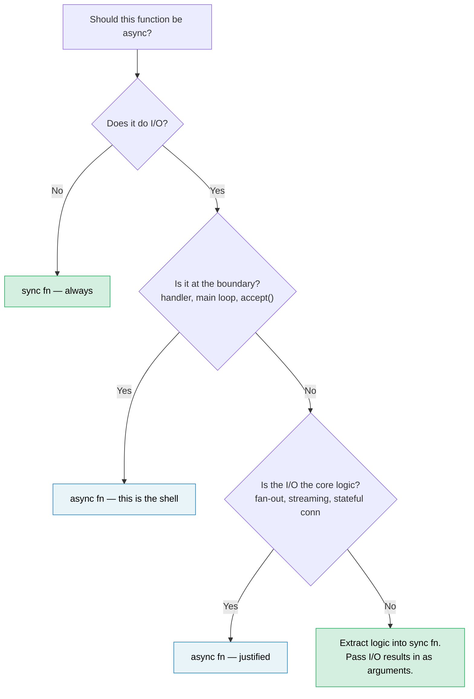

# 14. Async Is an Optimization, Not an Architecture 🔴

> **What you'll learn:**
> - Why async tends to contaminate entire codebases — and why that's a design flaw, not a feature
> - The "sync core, async shell" pattern for keeping most code testable and debuggable
> - How to handle the hard case: logic that *also* needs I/O
> - When `spawn_blocking` is a fix vs. a symptom
> - When async genuinely belongs in your core logic
> - Why sync-first libraries are more composable than async-first ones

You've now spent 13 chapters learning async Rust. Here's the most important thing the book hasn't told you: **most of your code shouldn't be async.**

## The Function Coloring Problem

Bob Nystrom's ["What Color is Your Function?"](https://journal.stuffwithstuff.com/2015/02/01/what-color-is-your-function/) identifies the core issue: async functions can call sync functions, but sync functions cannot call async functions. Once one function goes async, everything above it in the call chain must follow.

In Rust this is **worse** than in C# or JavaScript, because async doesn't just infect function signatures — it infects types:

| Sync code | Async equivalent | Why it's different |
|---|---|---|
| `fn process(&self)` | `async fn process(&self)` | Callers must be async too |
| `&mut T` | `Arc<Mutex<T>>` | Spawned tasks need `'static + Send` |
| `std::sync::Mutex` | `tokio::sync::Mutex` | Different type if held across `.await` |
| `impl Trait` return | `impl Future<Output = T> + Send` | Simpler since RPITIT (Rust 1.75, ch10), but still colored |
| `#[test]` | `#[tokio::test]` | Tests need a runtime |
| Stack trace: 5 frames | Stack trace: 25 frames | Half are runtime internals |

Every row is a decision someone must make, get right, and maintain — and none of it is about business logic. The industry is moving *away* from this: Java's Project Loom (virtual threads) and Go's goroutines both let you write synchronous-looking code that the runtime multiplexes cheaply. Rust chose explicit async for zero-cost control, but that control has a complexity cost that should be paid consciously, not by default.

## "But Threads Are Expensive"

The reflexive counter: "we need async because threads are expensive." Mostly wrong at the scale where most teams operate.

- **Stack memory:** Each OS thread reserves 8MB of virtual address space (Linux default), but the OS only commits pages as touched — a mostly-idle thread uses 20-80KB of physical memory.
- **Context switches:** ~1-5µs on modern hardware. At 50 concurrent requests, this is noise. At 100K switches/second, it's measurable.
- **Creation cost:** ~10-30µs per thread on Linux. A thread pool (rayon, `std::thread::scope`) amortizes this to zero.

The honest threshold where async earns its complexity is roughly **1K-10K concurrent mostly-idle connections** — the epoll/io_uring sweet spot where per-connection stacks become a real cost. Below that, a thread pool is simpler, faster to debug, and fast enough. Above that, async wins. Most services are below that.

## The Hard Example: Logic That Also Needs I/O

A trivial pure function — `fn add(a: i32, b: i32) -> i32` — obviously doesn't need async. That's not an interesting lesson. The interesting case is when business logic *seems* to need I/O in the middle: validation that checks inventory, pricing that queries an exchange rate, an order pipeline that looks up a customer.

Consider an order processing service. The async-everywhere version looks natural:

### Version A: Async Through the Core

```rust
// orders.rs — async all the way down

pub async fn process_order(order: Order) -> Result<Receipt, OrderError> {
    // Step 1: Validate — pure business rules, no I/O
    validate_items(&order)?;
    validate_quantities(&order)?;

    // Step 2: Check inventory — needs a database call
    let stock = inventory_client.check(&order.items).await?;
    if !stock.all_available() {
        return Err(OrderError::OutOfStock(stock.missing()));
    }

    // Step 3: Calculate pricing — pure math, but async because we're already here
    let pricing = calculate_pricing(&order, &stock);

    // Step 4: Apply discount — needs an external service call
    let discount = discount_service.lookup(order.customer_id).await?;
    let final_price = pricing.apply_discount(discount);

    // Step 5: Format receipt — pure
    Ok(Receipt::new(order, final_price))
}
```

This is *reasonable* async code. No `Arc<Mutex>` abuse — just sequential awaits. Most developers would write it this way and move on. But look at what happened: `validate_items`, `validate_quantities`, `calculate_pricing`, and `Receipt::new` are all pure functions that got dragged into an async context because steps 2 and 4 need I/O. The entire function must be async, its tests need a runtime, and every caller up the chain is now colored.

### Version B: Sync Core, Async Shell

The alternative: separate *what to decide* from *how to fetch*:

```rust
// core.rs — pure business logic, zero async, zero tokio dependency

pub fn validate_order(order: &Order) -> Result<ValidatedOrder, OrderError> {
    validate_items(order)?;
    validate_quantities(order)?;
    Ok(ValidatedOrder::from(order))
}

pub fn check_stock(
    order: &ValidatedOrder,
    stock: &StockResult,
) -> Result<StockedOrder, OrderError> {
    if !stock.all_available() {
        return Err(OrderError::OutOfStock(stock.missing()));
    }
    Ok(StockedOrder::from(order, stock))
}

pub fn finalize(
    order: &StockedOrder,
    discount: Discount,
) -> Receipt {
    let pricing = calculate_pricing(order);
    let final_price = pricing.apply_discount(discount);
    Receipt::new(order, final_price)
}
```

```rust
// shell.rs — thin async orchestrator
//
// Note: the `?` on network calls requires `impl From<reqwest::Error> for OrderError`
// (or a unified error enum). See ch12 for async error handling patterns.

use crate::core;

pub async fn process_order(order: Order) -> Result<Receipt, OrderError> {
    // Sync: validate
    let validated = core::validate_order(&order)?;

    // Async: fetch inventory (this is the shell's job)
    let stock = inventory_client.check(&validated.items).await?;

    // Sync: apply business rule to fetched data
    let stocked = core::check_stock(&validated, &stock)?;

    // Async: fetch discount
    let discount = discount_service.lookup(order.customer_id).await?;

    // Sync: finalize
    Ok(core::finalize(&stocked, discount))
}
```

The async shell is a **pipeline of fetch → decide → fetch → decide**. Each "decide" step is a sync function that takes the I/O result as input instead of reaching out for it.

### Testing the Difference

The sync core tests every business rule without a runtime or mocks:

```rust
#[test]
fn out_of_stock_rejects_order() {
    let order = validated_order(vec![item("widget", 10)]);
    let stock = stock_result(vec![("widget", 3)]); // only 3 available

    let result = core::check_stock(&order, &stock);
    assert_eq!(result.unwrap_err(), OrderError::OutOfStock(vec!["widget"]));
}

#[test]
fn discount_applied_correctly() {
    let order = stocked_order(100_00); // price in cents
    let receipt = core::finalize(&order, Discount::Percent(15));
    assert_eq!(receipt.final_price, 85_00);
}
```

The async shell gets a thinner *integration* test that verifies the wiring, not the logic:

```rust
#[tokio::test]
async fn process_order_integration() {
    let mock_inventory = mock_service(/* returns stock */);
    let mock_discounts = mock_service(/* returns 10% */);
    let receipt = process_order(sample_order()).await.unwrap();
    assert!(receipt.final_price > 0);
    // Logic correctness is already proven by core tests above
}
```

### Why This Matters

| Concern | Async through the core | Sync core + async shell |
|---|---|---|
| Business rules testable without runtime | No | **Yes** |
| Number of unit tests needing `#[tokio::test]` | All of them | **Only integration tests** |
| I/O failures entangled with logic errors | Yes — one `Result` type for both | **No** — sync returns logic errors, shell handles I/O errors |
| `validate_order` reusable in CLI / WASM / batch | No — pulls in tokio transitively | **Yes** — pure `fn` |
| Stack traces through business logic | Interleaved with runtime frames | **Clean** |
| Can swap HTTP client for gRPC later | Requires changing core functions | **Shell change only** |

The key insight: **the I/O calls in steps 2 and 4 don't *need* to be inside the business logic. They're inputs to it.** The sync core takes `StockResult` and `Discount` as arguments. Where those values came from — HTTP, gRPC, a test fixture, a cache — is the shell's concern.

## The `spawn_blocking` Smell

Chapter 12 introduced `spawn_blocking` as a fix for accidentally blocking the executor. That's the right fix when you have a one-off blocking call — `std::fs::read`, a compression library, a legacy FFI function.

But if you find yourself wrapping large sections of code in `spawn_blocking`:

```rust
async fn handler(req: Request) -> Response {
    // If this is your codebase, the boundary is in the wrong place
    tokio::task::spawn_blocking(move || {
        let validated = validate(&req);       // sync
        let enriched = enrich(validated);      // sync
        let result = process(enriched);        // sync
        let output = format_response(result);  // sync
        output
    }).await.unwrap()
}
```

...that's the codebase telling you: **this logic was never async to begin with.** You don't need `spawn_blocking` — you need a sync module that the async handler calls directly:

```rust
async fn handler(req: Request) -> Response {
    // validate → enrich → process → format are all sync.
    // No spawn_blocking needed — they're fast and CPU-light.
    let response = my_core::handle(req);
    response
}
```

Reserve `spawn_blocking` for genuinely heavy CPU work (parsing large payloads, image processing, compression) where the time cost would actually starve the executor. For ordinary business logic that runs in microseconds, a direct sync call is simpler and correct.

## Libraries: Sync First, Async Wrapper Optional

The boundary question is even more consequential for library authors. A sync library can be used from both sync and async callers:

```rust
// A sync library — usable everywhere
let report = my_lib::analyze(&data);

// Caller A: sync CLI
fn main() {
    let report = my_lib::analyze(&data);
    println!("{report}");
}

// Caller B: async handler, works fine
async fn handler() -> Json<Report> {
    let report = my_lib::analyze(&data); // sync call in async context — fine
    Json(report)
}

// Caller C: heavy analysis — caller decides to offload
async fn handler_heavy() -> Json<Report> {
    let data = data.clone();
    let report = tokio::task::spawn_blocking(move || {
        my_lib::analyze(&data) // caller controls the async boundary
    }).await.unwrap();
    Json(report)
}
```

An async library forces *all* callers into a runtime:

```rust
// An async library — only usable from async contexts
let report = my_lib::analyze(&data).await; // caller MUST be async

// Sync caller? Now you need block_on — and hope there's no nested runtime
let report = tokio::runtime::Runtime::new().unwrap().block_on(
    my_lib::analyze(&data)
); // fragile, panic-prone if already inside a runtime
```

**Default to sync APIs.** If your library does pure computation, data transformation, or parsing, there is no reason for it to be async. If it does I/O, consider offering a sync core with an optional async convenience layer behind a feature flag — let the caller own the boundary decision.

## When Async Belongs in the Core

Not everything can be cleanly separated. Async belongs in your core logic when:

- **Fan-out/fan-in is the logic.** If your business rule is "query 5 pricing services concurrently and return the cheapest," the concurrency *is* the logic, not plumbing. Forcing this through sync + threads is reinventing a worse async.

- **Streaming is the logic.** Processing a continuous event stream with backpressure — the stream management is non-trivial business logic, not just an I/O wrapper.

- **Long-lived stateful connections.** WebSocket handlers, gRPC bidirectional streams, and protocol state machines have state transitions inherently tied to I/O events. The capstone project in [ch17](ch17-capstone-project.md) — an async chat server — is exactly this case: concurrent connections, room-based fan-out, and graceful shutdown are fundamentally async work.

**The test:** if removing `async` from a function would require replacing it with threads, channels, or manual polling, then async is pulling its weight. If removing `async` would just mean deleting the keyword with no other changes, it never needed to be async.

## Decision Rule



> **Rule of thumb:** Start sync. Add async only at the outermost I/O boundary. Pull it inward only when you can articulate *which concurrent I/O operations* justify the complexity tax.

---

<details>
<summary><strong>🏋️ Exercise: Extract the Sync Core</strong> (click to expand)</summary>

The following axum handler has async contamination — business logic mixed with I/O. Refactor it into a sync core module and a thin async shell.

```rust
use axum::{Json, extract::Path};

async fn get_device_report(Path(device_id): Path<String>) -> Result<Json<Report>, AppError> {
    // Fetch raw telemetry from the device over HTTP
    let raw = reqwest::get(format!("http://bmc-{device_id}/telemetry"))
        .await?
        .json::<RawTelemetry>()
        .await?;

    // Business logic: convert raw sensor readings to calibrated values
    let mut readings = Vec::new();
    for sensor in &raw.sensors {
        let calibrated = (sensor.raw_value as f64) * sensor.scale + sensor.offset;
        if calibrated < sensor.min_valid || calibrated > sensor.max_valid {
            return Err(AppError::SensorOutOfRange {
                name: sensor.name.clone(),
                value: calibrated,
            });
        }
        readings.push(CalibratedReading {
            name: sensor.name.clone(),
            value: calibrated,
            unit: sensor.unit.clone(),
        });
    }

    // Business logic: classify device health
    let critical_count = readings.iter()
        .filter(|r| r.value > 90.0)
        .count();
    let health = if critical_count > 2 { Health::Critical }
                 else if critical_count > 0 { Health::Warning }
                 else { Health::Ok };

    // Fetch device metadata from inventory service
    let meta = reqwest::get(format!("http://inventory/devices/{device_id}"))
        .await?
        .json::<DeviceMetadata>()
        .await?;

    Ok(Json(Report {
        device_id,
        device_name: meta.name,
        health,
        readings,
        timestamp: chrono::Utc::now(),
    }))
}
```

**Your goals:**

1. Create `core.rs` with sync functions: `calibrate_sensors`, `classify_health`, and `build_report`
2. Create `shell.rs` with a thin async handler that fetches, then calls the sync core
3. Write `#[test]` (not `#[tokio::test]`) for: a sensor out of range, health classification thresholds, and a normal report

**Hints:**
- The sync core should take `RawTelemetry` and `DeviceMetadata` as inputs — it should never know those came from HTTP.
- You'll need to define small test helper functions (e.g., `raw_telemetry()`, `sensor()`, `reading()`, `device_meta()`) that construct test fixtures. Their signatures should be obvious from usage.

<details>
<summary>🔑 Solution</summary>

```rust
// core.rs — zero async dependency

pub fn calibrate_sensors(raw: &RawTelemetry) -> Result<Vec<CalibratedReading>, AppError> {
    raw.sensors.iter().map(|sensor| {
        let calibrated = (sensor.raw_value as f64) * sensor.scale + sensor.offset;
        if calibrated < sensor.min_valid || calibrated > sensor.max_valid {
            return Err(AppError::SensorOutOfRange {
                name: sensor.name.clone(),
                value: calibrated,
            });
        }
        Ok(CalibratedReading {
            name: sensor.name.clone(),
            value: calibrated,
            unit: sensor.unit.clone(),
        })
    }).collect()
}

pub fn classify_health(readings: &[CalibratedReading]) -> Health {
    let critical_count = readings.iter()
        .filter(|r| r.value > 90.0)
        .count();
    if critical_count > 2 { Health::Critical }
    else if critical_count > 0 { Health::Warning }
    else { Health::Ok }
}

pub fn build_report(
    device_id: String,
    readings: Vec<CalibratedReading>,
    meta: &DeviceMetadata,
) -> Report {
    Report {
        device_id,
        device_name: meta.name.clone(),
        health: classify_health(&readings),
        readings,
        timestamp: chrono::Utc::now(),
    }
}
```

```rust
// shell.rs — async boundary only

pub async fn get_device_report(
    Path(device_id): Path<String>,
) -> Result<Json<Report>, AppError> {
    let raw = reqwest::get(format!("http://bmc-{device_id}/telemetry"))
        .await?
        .json::<RawTelemetry>()
        .await?;

    let readings = core::calibrate_sensors(&raw)?;

    let meta = reqwest::get(format!("http://inventory/devices/{device_id}"))
        .await?
        .json::<DeviceMetadata>()
        .await?;

    Ok(Json(core::build_report(device_id, readings, &meta)))
}
```

```rust
// core_tests.rs — no runtime needed

// Test fixture helpers — construct data without any I/O
fn sensor(name: &str, raw_value: f64, valid_range: std::ops::Range<f64>) -> RawSensor {
    RawSensor {
        name: name.into(),
        raw_value,
        scale: 1.0,
        offset: 0.0,
        min_valid: valid_range.start,
        max_valid: valid_range.end,
        unit: "unit".into(),
    }
}

fn raw_telemetry(sensors: Vec<RawSensor>) -> RawTelemetry {
    RawTelemetry { sensors }
}

fn reading(name: &str, value: f64) -> CalibratedReading {
    CalibratedReading { name: name.into(), value, unit: "unit".into() }
}

fn device_meta(name: &str) -> DeviceMetadata {
    DeviceMetadata { name: name.into() }
}

#[test]
fn sensor_out_of_range_rejected() {
    let raw = raw_telemetry(vec![sensor("gpu_temp", 105.0, 0.0..100.0)]);
    let result = core::calibrate_sensors(&raw);
    assert!(matches!(result, Err(AppError::SensorOutOfRange { .. })));
}

#[test]
fn health_classification() {
    let readings = vec![
        reading("a", 50.0),  // ok
        reading("b", 95.0),  // critical
        reading("c", 91.0),  // critical
        reading("d", 92.0),  // critical
    ];
    assert_eq!(core::classify_health(&readings), Health::Critical);
}

#[test]
fn normal_report() {
    let raw = raw_telemetry(vec![sensor("fan_rpm", 3000.0, 0.0..10000.0)]);
    let readings = core::calibrate_sensors(&raw).unwrap();
    let meta = device_meta("gpu-node-42");
    let report = core::build_report("dev-1".into(), readings, &meta);
    assert_eq!(report.health, Health::Ok);
    assert_eq!(report.readings.len(), 1);
}
```

**What changed:** The async handler went from 30 lines of mixed logic and I/O to 8 lines of pure orchestration. The business rules (calibration math, range validation, health thresholds) are now tested with `#[test]`, run in milliseconds, and have zero dependency on tokio, reqwest, or any HTTP mock server.

</details>
</details>

---

> **Key Takeaways:**
>
> 1. Async is an **I/O multiplexing optimization**, not an application architecture. Most business logic is sync.
> 2. **Sync core, async shell:** keep business rules in pure sync functions that take I/O results as arguments. The async shell orchestrates fetches and calls the core.
> 3. If you're wrapping large blocks in `spawn_blocking`, **the boundary is in the wrong place** — refactor the logic into a sync module instead.
> 4. **Libraries should default to sync APIs.** An async library forces all callers into a runtime; a sync library lets the caller own the async boundary.
> 5. Async earns its keep for **fan-out/fan-in, streaming, and stateful connections** — the cases where the concurrency *is* the business logic.
>
> **See also:** [Ch12 — Common Pitfalls](ch12-common-pitfalls.md) (spawn_blocking as a tactical fix) · [Ch13 — Production Patterns](ch13-production-patterns.md) (backpressure, structured concurrency) · [Ch17 — Capstone: Async Chat Server](ch17-capstone-project.md) (a case where async is the right architecture)
