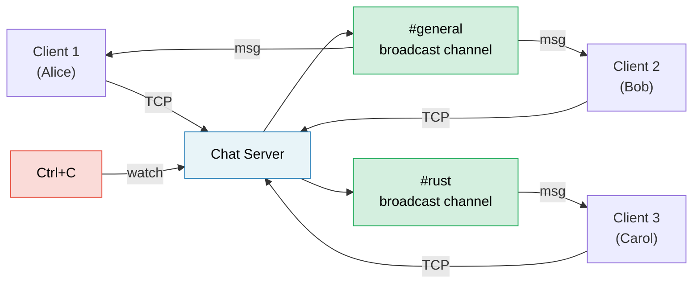

# Capstone Project: Async Chat Server 🔴

This project integrates patterns from across the book into a single, production-style application. You'll build a **multi-room async chat server** using tokio, channels, streams, graceful shutdown, and proper error handling.

**Estimated time**: 4–6 hours | **Difficulty**: ★★★

> **What you'll practice:**
> - `tokio::spawn` and the `'static` requirement (Ch 8)
> - Channels: `mpsc` for messages, `broadcast` for rooms, `watch` for shutdown (Ch 8)
> - Streams: reading lines from TCP connections (Ch 11)
> - Common pitfalls: cancellation safety, MutexGuard across `.await` (Ch 12)
> - Production patterns: graceful shutdown, backpressure (Ch 13)
> - Async traits for pluggable backends (Ch 10)

## The Problem

Build a TCP chat server where:
1. **Clients** connect via TCP and join named rooms
2. **Messages** are broadcast to all clients in the same room
3. **Commands**: `/join <room>`, `/nick <name>`, `/rooms`, `/quit`
4. The server shuts down gracefully on Ctrl+C



## Step 1: Basic TCP Accept Loop

Start with a server that accepts connections and echoes lines back:

```rust
use tokio::io::{AsyncBufReadExt, AsyncWriteExt, BufReader};
use tokio::net::TcpListener;

#[tokio::main]
async fn main() -> anyhow::Result<()> {
    let listener = TcpListener::bind("127.0.0.1:8080").await?;
    println!("Chat server listening on :8080");

    loop {
        let (socket, addr) = listener.accept().await?;
        println!("[{addr}] Connected");

        tokio::spawn(async move {
            let (reader, mut writer) = socket.into_split();
            let mut reader = BufReader::new(reader);
            let mut line = String::new();

            loop {
                line.clear();
                match reader.read_line(&mut line).await {
                    Ok(0) | Err(_) => break,
                    Ok(_) => {
                        let _ = writer.write_all(line.as_bytes()).await;
                    }
                }
            }
            println!("[{addr}] Disconnected");
        });
    }
}
```

**Your job**: Verify this compiles and works with `telnet localhost 8080`.

## Step 2: Room State with Broadcast Channels

Each room is a `broadcast::Sender`. All clients in a room subscribe to receive messages.

```rust
use std::collections::HashMap;
use std::sync::Arc;
use tokio::sync::{broadcast, RwLock};

type RoomMap = Arc<RwLock<HashMap<String, broadcast::Sender<String>>>>;

fn get_or_create_room(rooms: &mut HashMap<String, broadcast::Sender<String>>, name: &str) -> broadcast::Sender<String> {
    rooms.entry(name.to_string())
        .or_insert_with(|| {
            let (tx, _) = broadcast::channel(100); // 100-message buffer
            tx
        })
        .clone()
}
```

**Your job**: Implement room state so that clients can join rooms and messages are broadcast to the sender's current room.

<details>
<summary>💡 Hint — Client task structure</summary>

Each client task needs two concurrent loops:
1. **Read from TCP** → parse commands or broadcast to room
2. **Read from broadcast receiver** → write to TCP

Use `tokio::select!` to run both:

```rust
loop {
    tokio::select! {
        result = reader.read_line(&mut line) => { /* ... */ }
        result = room_rx.recv() => { /* ... */ }
    }
}
```

</details>

## Step 3: Commands

Implement the command protocol:

| Command | Action |
|---------|--------|
| `/join <room>` | Leave current room, join new room |
| `/nick <name>` | Change display name |
| `/rooms` | List all active rooms |
| `/quit` | Disconnect gracefully |
| Anything else | Broadcast as a chat message |

## Step 4: Graceful Shutdown

Add Ctrl+C handling to stop accepting and exit cleanly.

```rust
use tokio::sync::watch;

let (shutdown_tx, shutdown_rx) = watch::channel(false);

// In the accept loop:
loop {
    tokio::select! {
        result = listener.accept() => { /* ... */ }
        _ = tokio::signal::ctrl_c() => {
            shutdown_tx.send(true)?;
            break;
        }
    }
}
```

## Step 5: Error Handling and Edge Cases

Production-harden the server:

1. **Lagging receivers**: Handle `RecvError::Lagged(n)` if a slow client misses messages.
2. **Backpressure**: The broadcast channel buffer is bounded.
3. **Timeout**: Disconnect clients that are idle for >5 minutes.

## Step 6: Integration Test

Write a test that starts the server, connects two clients, and verifies message delivery.

## Evaluation Criteria

| Criterion | Target |
|-----------|--------|
| Concurrency | Multiple clients in multiple rooms, no blocking |
| Correctness | Messages only go to clients in the same room |
| Graceful shutdown | Ctrl+C drains messages and exits cleanly |
| Error handling | Lagged receivers, disconnections, timeouts handled |

## Extension Ideas

1. **Persistent history**: Store last N messages per room.
2. **WebSocket support**: Accept WebSocket clients using `tokio-tungstenite`.
3. **TLS**: Add `tokio-rustls` for encrypted connections.

***
