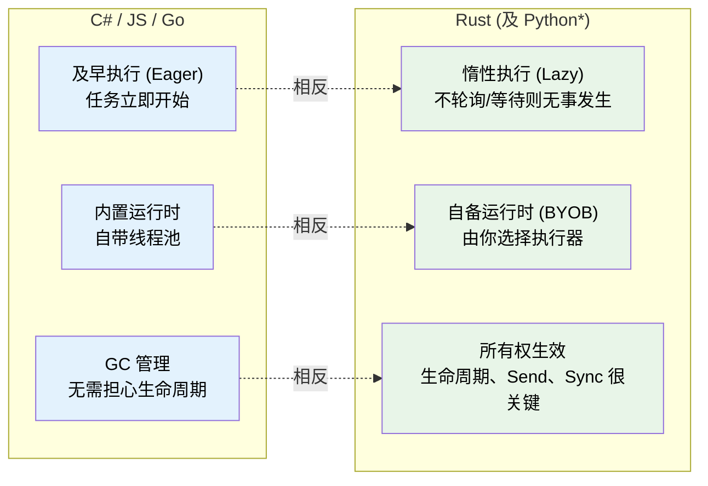
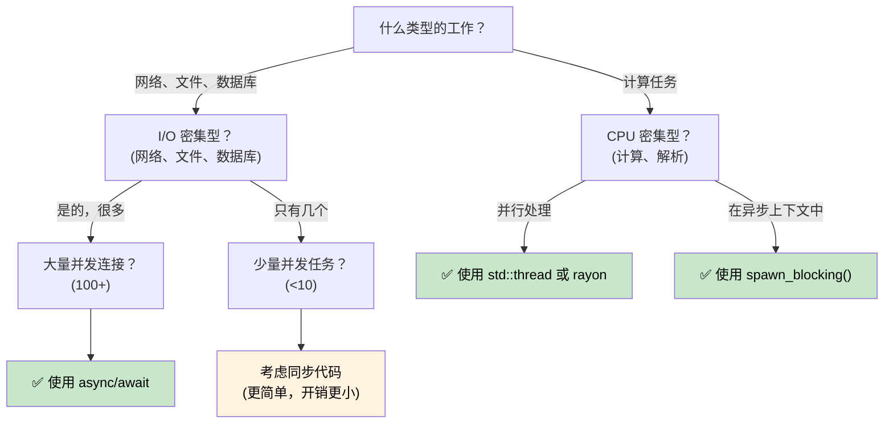

[English Original](../en/ch01-why-async-is-different-in-rust.md)

# 1. 为什么异步在 Rust 中不同 🟢

> **你将学到：**
> - 为什么 Rust 没有内置异步运行时（以及这对你意味着什么）
> - 三大关键特性：惰性执行、无内置运行时、零成本抽象
> - 何时异步是正确的工具（以及何时它反而更慢）
> - Rust 模型与 C#、Go、Python 及 JavaScript 的对比

## 根本区别

大多数带有 `async/await` 的语言都隐藏了其后的运作机制。C# 有 CLR 线程池；JavaScript 有事件循环（event loop）；Go 在运行时中内置了 goroutine 和调度器；Python 则有 `asyncio`。

**而 Rust 什么都没有。**

没有内置运行时，没有线程池，也没有事件循环。`async` 关键字是一种零成本编译策略 —— 它将你的函数转换为实现 `Future` trait 的状态机。必须由通过其他人（称为“执行器”，executor）来驱动该状态机向前运行。

### Rust 异步的三大关键特性



> \* Python 的协程（coroutine）像 Rust 的 future 一样是惰性的 —— 除非被 await 或调度，否则它们不会执行。然而，Python 仍使用 GC 且没有所有权/生命周期的概念。

### 无内置运行时

```rust
// 这段代码可以编译，但什么都不会做：
async fn fetch_data() -> String {
    "hello".to_string()
}

fn main() {
    let future = fetch_data(); // 创建了 Future，但并未执行
    // future 只是一个处于栈上的结构体
    // 没有输出，没有副作用，什么都没发生
    drop(future); // 被静默丢弃 —— 任务从未启动
}
```

对比 C# 中 `Task` 的及早执行：
```csharp
// C# —— 这会立即开始执行：
async Task<string> FetchData() => "hello";

var task = FetchData(); // 已经开始运行了！
var result = await task; // 仅仅是等待它完成
```

### 惰性 Future vs 及早 Task

这是最重要的一次思维转变：

| | C# / JavaScript | Python | Go | Rust |
|---|---|---|---|---|
| **创建时** | `Task` 立即开始执行 | 协程是**惰性**的 —— 返回一个对象，直到被 await 或调度才运行 | Goroutine 立即开始运行 | `Future` 在被轮询（poll）前无事发生 |
| **丢弃时** | 分离的任务继续运行 | 未被 await 的协程将被 GC 回收（带有警告） | Goroutine 持续运行直到返回 | 丢弃 Future 即意味着取消任务（立即生效） |
| **运行时** | 内置于语言/虚拟机 | `asyncio` 事件循环（必须显式启动） | 内置于二进制文件（M:N 调度器） | 你自己选（tokio, smol 等） |
| **调度** | 自动（线程池） | 事件循环 + `await` 或 `create_task()` | 自动（GMP 调度器） | 显式（`spawn`, `block_on`） |
| **取消** | `CancellationToken` (协作式) | `Task.cancel()` (协作式，抛出 `CancelledError`) | `context.Context` (协作式) | 丢弃 future (立即生效) |

```rust
// 要真正运行一个 future，你需要一个执行器：
#[tokio::main]
async fn main() {
    let result = fetch_data().await; // 现在它执行了
    println!("{result}");
}
```

### 何时使用异步（以及何时不用）



**经验法则**：异步适用于 I/O 并发（在等待时同时做很多事），而非 CPU 并行（让一件事跑得更快）。如果你有 10,000 个网络连接，异步大放异彩；如果你在处理海量数字计算，请使用 `rayon` 或操作系统线程。

### 为什么异步有时反而*更慢*

异步并非毫无代价。对于低并发负载，同步代码的性能可能优于异步代码：

| 成本 | 原因 |
|------|-----|
| **状态机开销** | 每个 `.await` 都会增加一个 enum 变体；深度嵌套的 future 会产生庞大且复杂的状态机 |
| **动态分发** | `Box<dyn Future>` 增加了间接寻址并破坏了内联（inlining） |
| **上下文切换** | 协作式调度仍有开销 —— 执行器必须管理任务队列、waker 和 I/O 注册 |
| **编译时间** | 异步代码会生成更复杂的类型，从而减慢编译速度 |
| **调试难度** | 穿过状态机的堆栈追踪更难阅读（见第 12 章） |

**基准测试建议**：如果并发 I/O 操作少于约 10 个，在决定使用异步前请先进行性能测试。在现代 Linux 上，每连接一个简单的 `std::thread::spawn` 可以轻松扩展到数百个线程。

### 练习：你会在什么时候使用异步？

<details>
<summary>🏋️ 练习（点击展开）</summary>

针对以下每个场景，决定使用异步是否合适，并说明原因：

1. 一个处理 10,000 个并发 WebSocket 连接的 Web 服务器
2. 一个压缩单个大文件的 CLI 工具
3. 一个查询 5 个不同数据库并合并结果的服务
4. 一个以 60 FPS 运行物理模拟的游戏引擎

<details>
<summary>🔑 答案</summary>

1. **异步** —— I/O 密集型且具有极高并发。每个连接大部分时间都在等待数据。线程将需要 10K 个栈空间。
2. **同步/线程** —— CPU 密集型，单一任务。异步只会增加开销而无收益。使用 `rayon` 进行并行压缩。
3. **异步** —— 五个并发的 I/O 等待。`tokio::join!` 可以同时运行这五个查询。
4. **同步/线程** —— CPU 密集型，对延迟敏感。异步的协作式调度可能会引入帧抖动（jitter）。

</details>
</details>

> **关键要诀 —— 为什么异步在 Rust 中不同**
> - Rust 的 future 是**惰性**的 —— 除非被执行器轮询，否则它们什么都不做
> - **没有内置运行时** —— 你可以根据需求选择（或构建）自己的运行时
> - 异步是一种**零成本编译策略**，最终生成状态机
> - 异步在 **I/O 密集型并发** 中表现卓越；对于 CPU 密集型工作，请使用线程或 rayon

> **另请参阅：** [第 2 章 —— Future Trait](ch02-the-future-trait.md) 了解使这一切运转的核心 trait，[第 7 章 —— 执行器与运行时](ch07-executors-and-runtimes.md) 了解如何选择运行时

***
