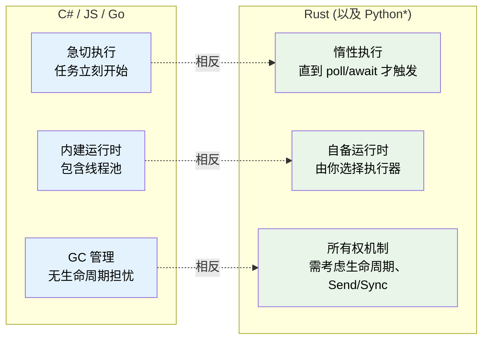
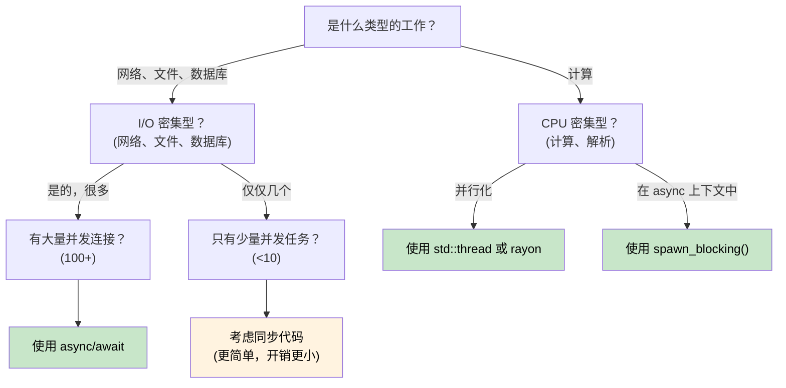

# 1. 为什么 Rust 中的 Async 与众不同 🟢

> **你将学到：**
> - 为什么 Rust 没有内建 async 运行时，以及这对你意味着什么
> - 三个关键特性：惰性执行、无内建运行时、零成本抽象
> - 什么时候应该用 async，什么时候它反而更慢
> - Rust 的模型与 C#、Go、Python、JavaScript 的对比

## 根本差异

大多数带有 `async/await` 的语言都会把底层机制隐藏起来。C# 有 CLR 线程池，JavaScript 有事件循环，Go 在运行时中内建 goroutine 与调度器，Python 有 `asyncio`。

**Rust 什么都没有。**

Rust 没有内建运行时、没有线程池、没有事件循环。`async` 关键字本质上是一种零成本编译策略，它会把函数转换成一个实现了 `Future` trait 的状态机。这个状态机必须由别的东西（也就是 *executor*，执行器）来驱动前进。

### Rust Async 的三个关键特性



> \* Python 的 coroutine 和 Rust 的 future 一样也是惰性的，只有在 `await` 或被调度时才会执行。但 Python 仍然依赖 GC，也没有所有权和生命周期问题。

### 没有内建运行时

```rust
// 这段代码可以编译，但什么都不会发生：
async fn fetch_data() -> String {
    "hello".to_string()
}

fn main() {
    let future = fetch_data(); // 创建了 Future，但并没有执行
    // future 只是一个放在栈上的结构体
    // 没有输出，没有副作用，什么都没发生
    drop(future); // 被静默丢弃，工作从未真正开始
}
```

对比 C#，`Task` 是急切启动的：

```csharp
// C# 中，这里会立刻开始执行：
async Task<string> FetchData() => "hello";

var task = FetchData(); // 已经在运行中了！
var result = await task; // 只是在等待完成
```

### 惰性 Future 与急切 Task

这是最重要的思维转变：

| | C# / JavaScript | Python | Go | Rust |
|---|---|---|---|---|
| **创建** | `Task` 会立刻开始执行 | Coroutine 是**惰性**的，返回对象但不会立刻执行 | Goroutine 立即开始 | `Future` 在被 `poll` 前什么都不做 |
| **丢弃** | 脱离引用后任务仍继续 | 未 await 的 coroutine 会被 GC 回收（伴随警告） | Goroutine 一直运行到返回 | 丢弃 Future 就等于取消它 |
| **运行时** | 内建于语言或虚拟机 | `asyncio` 事件循环（需显式启动） | 内建于二进制（M:N 调度） | 由你选择（tokio、smol 等） |
| **调度** | 自动（线程池） | 事件循环加 `await` 或 `create_task()` | 自动（GMP 调度器） | 显式（`spawn`、`block_on`） |
| **取消** | `CancellationToken`（协作式） | `Task.cancel()`（协作式，会抛 `CancelledError`） | `context.Context`（协作式） | 直接丢弃 future（立即取消） |

```rust
// 真正要运行 future，需要执行器：
#[tokio::main]
async fn main() {
    let result = fetch_data().await; // 现在它运行了
    println!("{result}");
}
```

### 什么时候该用 Async（以及什么时候不该用）



**经验法则**：Async 适用于 I/O 并发，也就是“等待时同时做很多事”，而不是 CPU 并行，也就是“把一件计算做得更快”。如果你要处理 10,000 个网络连接，async 会非常合适；如果你是在做重计算，请用 `rayon` 或操作系统线程。

### Async 什么时候可能更慢

Async 不是免费的。对于低并发工作负载，同步代码有时反而比 async 更快：

| 成本 | 原因 |
|------|-----|
| **状态机开销** | 每个 `.await` 都会增加状态，深层嵌套会生成很大、很复杂的状态机 |
| **动态分发** | `Box<dyn Future>` 会增加间接层并阻碍内联优化 |
| **上下文切换** | 协作式调度仍有代价，执行器需要维护任务队列、waker 与 I/O 注册 |
| **编译时间** | Async 代码会生成更复杂的类型，从而拖慢编译 |
| **可调试性** | 穿过状态机的调用栈更难读（见第 12 章） |

**性能建议**：如果并发 I/O 操作少于大约 10 个，在决定使用 async 之前先做性能分析。对于现代 Linux，简单地每个连接一个 `std::thread::spawn`，扩展到几百个线程通常也没有问题。

### 练习：你会在什么场景下使用 Async？

<details>
<summary>练习</summary>

请判断以下每个场景是否适合使用 async，并说明原因：

1. 一个需要处理 10,000 个并发 WebSocket 连接的 Web 服务器
2. 一个压缩单个大文件的命令行工具
3. 一个需要查询 5 个不同数据库并合并结果的服务
4. 一个以 60 FPS 运行物理模拟的游戏引擎

<details>
<summary>参考答案</summary>

1. **适合 Async**：典型 I/O 密集型且并发极高。每个连接大多数时间都在等待数据，若用线程则需要 10K 个线程栈。
2. **适合同步或线程**：这是 CPU 密集型单任务。Async 只会增加开销，没有收益。若要并行压缩，使用 `rayon`。
3. **适合 Async**：这里有五个可并发等待的 I/O 操作，可以用 `tokio::join!` 同时发起并等待。
4. **适合同步或线程**：这是 CPU 密集型且对延迟敏感的工作，协作式调度可能引入帧抖动。

</details>
</details>

> **关键要点：为什么 Async 在 Rust 中不同**
> - Rust future 是**惰性**的，在被执行器 `poll` 之前什么都不会做
> - Rust **没有内建运行时**，你需要自己选择（甚至自己实现）运行时
> - Async 是一种**零成本编译策略**，最终会生成状态机
> - Async 擅长 **I/O 并发**；对于 CPU 密集型任务，请使用线程或 rayon

> **延伸阅读：** [第 2 章：Future Trait](ch02-the-future-trait.md), [第 7 章：执行器与运行时](ch07-executors-and-runtimes.md)

***
