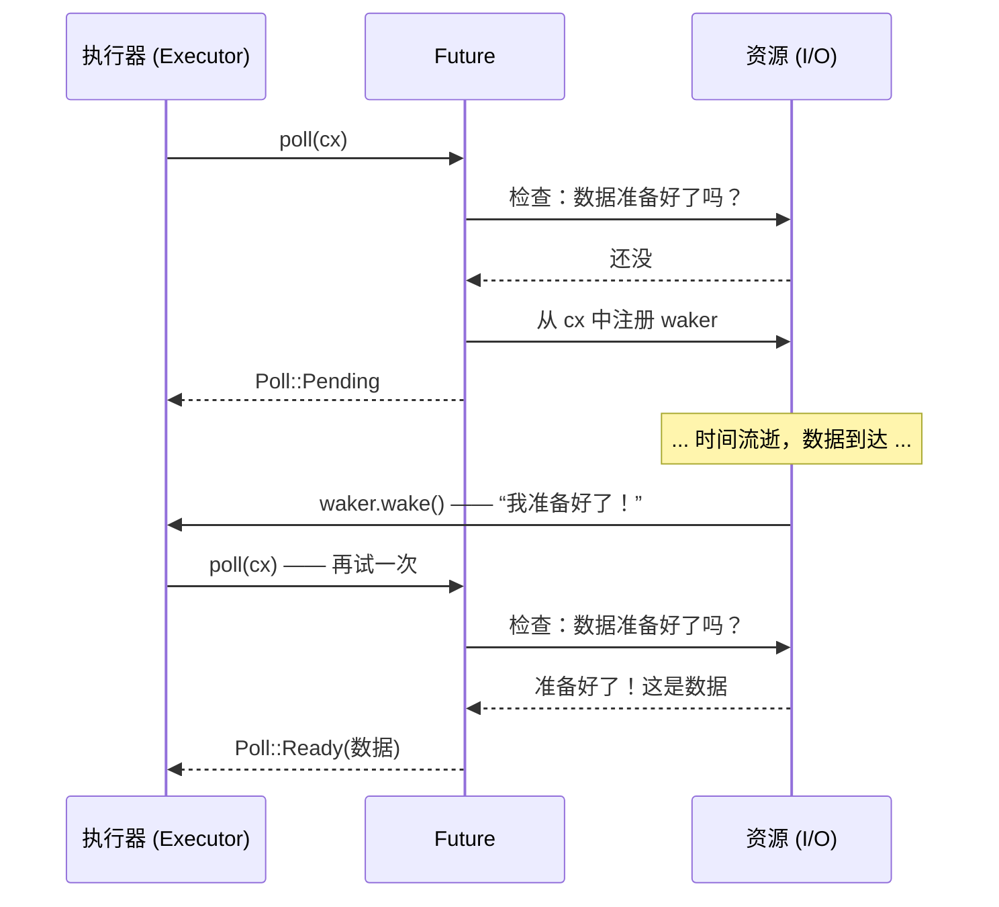

[English Original](../en/ch02-the-future-trait.md)

# 2. Future Trait 🟡

> **你将学到：**
> - `Future` trait 详解：`Output`、`poll()`、`Context`、`Waker`
> - Waker 如何告知执行器“再次轮询我”
> - 关键契约：永远不调用 `wake()` = 程序将静默挂起
> - 手动实现一个真实的 Future (`Delay`)

## Future 剖析

异步 Rust 中的所有内容最终都实现了这个 trait：

```rust
pub trait Future {
    type Output;

    fn poll(self: Pin<&mut Self>, cx: &mut Context<'_>) -> Poll<Self::Output>;
}

pub enum Poll<T> {
    Ready(T),   // Future 已完成，返回值为 T
    Pending,    // Future 尚未就绪 —— 稍后再来找我
}
```

就这么简单。一个 `Future` 就是任何可以被 *轮询*（poll）—— 即被询问“你做完了吗？” —— 并响应“做完了，这是结果”或“还没呢，等我准备好了会叫醒你”的对象。

### Output, poll(), Context, Waker



让我们拆解每个部分：

```rust
use std::future::Future;
use std::pin::Pin;
use std::task::{Context, Poll};

// 一个立即返回 42 的 future
struct Ready42;

impl Future for Ready42 {
    type Output = i32; // future 最终产出的类型

    fn poll(self: Pin<&mut Self>, _cx: &mut Context<'_>) -> Poll<i32> {
        Poll::Ready(42) // 总是就绪 —— 无需等待
    }
}
```

**组件解析**：
- **`Output`** —— future 完成时产生的值的类型。
- **`poll()`** —— 由执行器调用以检查进度；返回 `Ready(value)` 或 `Pending`。
- **`Pin<&mut Self>`** —— 确保 future 不会在内存中被移动（我们将在第 4 章探讨原因）。
- **`Context`** —— 携带 `Waker`，以便 future 在准备好取得进展时能信号通知执行器。

### Waker 契约

`Waker` 是回调机制。当一个 future 返回 `Pending` 时，它 *必须* 安排在稍后调用 `waker.wake()` —— 否则执行器将永远不会再次轮询它，程序就会挂起。

```rust
use std::task::{Context, Poll, Waker};
use std::pin::Pin;
use std::future::Future;
use std::sync::{Arc, Mutex};
use std::thread;
use std::time::Duration;

/// 一个在延迟后完成的 future（演示用实现）
struct Delay {
    completed: Arc<Mutex<bool>>,
    waker_stored: Arc<Mutex<Option<Waker>>>,
    duration: Duration,
    started: bool,
}

impl Delay {
    fn new(duration: Duration) -> Self {
        Delay {
            completed: Arc::new(Mutex::new(false)),
            waker_stored: Arc::new(Mutex::new(None)),
            duration,
            started: false,
        }
    }
}

impl Future for Delay {
    type Output = ();

    fn poll(mut self: Pin<&mut Self>, cx: &mut Context<'_>) -> Poll<()> {
        // 检查是否已经完成
        if *self.completed.lock().unwrap() {
            return Poll::Ready(());
        }

        // 存储 waker，以便后台线程能够唤醒我们
        *self.waker_stored.lock().unwrap() = Some(cx.waker().clone());

        // 在第一次轮询时启动后台计时器
        if !self.started {
            self.started = true;
            let completed = Arc::clone(&self.completed);
            let waker = Arc::clone(&self.waker_stored);
            let duration = self.duration;

            thread::spawn(move || {
                thread::sleep(duration);
                *completed.lock().unwrap() = true;

                // 关键点：唤醒执行器以便它再次轮询我们
                if let Some(w) = waker.lock().unwrap().take() {
                    w.wake(); // “嘿，执行器，我准备好了 —— 再次轮询我吧！”
                }
            });
        }

        Poll::Pending // 还没做完
    }
}
```

> **核心见解**：在 C# 中，TaskScheduler 会自动处理唤醒。而在 Rust 中，**你**（或你使用的 I/O 库）负责调用 `waker.wake()`。如果忘了这一步，你的程序就会静默挂起。

### 练习：实现一个倒计时 Future (CountdownFuture)

<details>
<summary>🏋️ 练习（点击展开）</summary>

**挑战**：实现一个 `CountdownFuture`，从 N 开始倒数到 0，并在每次被轮询时打印当前数值。当数到 0 时，它完成并返回 `Ready("Liftoff!")`。

*提示*：Future 需要存储当前计数值并在每次轮询时递减。记住一定要重新注册 waker！

<details>
<summary>🔑 答案</summary>

```rust
use std::future::Future;
use std::pin::Pin;
use std::task::{Context, Poll};

struct CountdownFuture {
    count: u32,
}

impl CountdownFuture {
    fn new(start: u32) -> Self {
        CountdownFuture { count: start }
    }
}

impl Future for CountdownFuture {
    type Output = &'static str;

    fn poll(mut self: Pin<&mut Self>, cx: &mut Context<'_>) -> Poll<Self::Output> {
        if self.count == 0 {
            println!("Liftoff!");
            Poll::Ready("Liftoff!")
        } else {
            println!("{}...", self.count);
            self.count -= 1;
            cx.waker().wake_by_ref(); // 立即安排再次轮询
            Poll::Pending
        }
    }
}
```

**关键总结**：这个 future 倒数一次就会被轮询一次。每当它返回 `Pending` 时，它会立即唤醒自己以便再次被轮询。在生产环境中，你会使用计时器而不是这种繁忙轮询（busy-polling）。

</details>
</details>

> **关键要诀 —— Future Trait**
> - `Future::poll()` 返回 `Poll::Ready(value)` 或 `Poll::Pending`
> - Future 在返回 `Pending` 前必须注册一个 `Waker` —— 执行器通过它知道何时重新轮询
> - `Pin<&mut Self>` 保证 future 不会在内存中被移动（自引用状态机所需 —— 见第 4 章）
> - 异步 Rust 中的一切 —— `async fn`、`.await`、组合器 —— 都建立在这一 trait 之上

> **另请参阅：** [第 3 章 —— Poll 如何工作](ch03-how-poll-works.md) 了解执行器循环，[第 6 章 —— 手动构建 Future](ch06-building-futures-by-hand.md) 了解更复杂的实现

***
