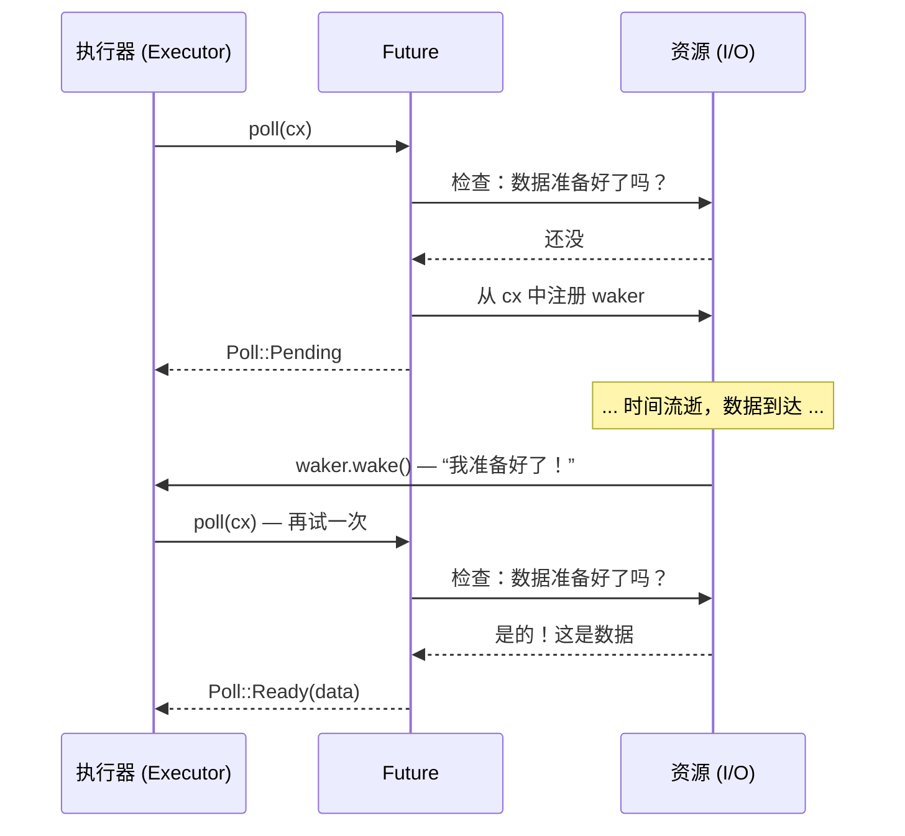

[English Original](../en/ch02-the-future-trait.md)

# 2. Future Trait 🟡

> **你将学到：**
> - `Future` trait 的组成：`Output`、`poll()`、`Context` 与 `Waker`
> - Waker 如何告知执行器“请再次轮询我”
> - 契约：如果不调用 `wake()`，程序就会静默挂起
> - 手写一个真实的 future（`Delay`）

## Future 的解剖

Async Rust 中的一切最终都实现了这个 trait：

```rust
pub trait Future {
    type Output;

    fn poll(self: Pin<&mut Self>, cx: &mut Context<'_>) -> Poll<Self::Output>;
}

pub enum Poll<T> {
    Ready(T),   // Future 已完成，返回值为 T
    Pending,    // Future 还没准备好 —— 请稍后再来轮询
}
```

就这么简单。`Future` 是任何可以被 *poll*（轮询）的对象 —— 即被询问“你做完了吗？” —— 并回答“做完了，这是结果”或“还没呢，等我准备好了会叫醒你”。

### Output、poll()、Context 与 Waker



让我们分解每个部分：

```rust
use std::future::Future;
use std::pin::Pin;
use std::task::{Context, Poll};

// 一个立即返回 42 的 future
struct Ready42;

impl Future for Ready42 {
    type Output = i32; // Future 最终产生的值类型

    fn poll(self: Pin<&mut Self>, _cx: &mut Context<'_>) -> Poll<i32> {
        Poll::Ready(42) // 总是就绪 —— 无需等待
    }
}
```

**各个组件说明**：
- **`Output`** — Future 完成时产生的值的类型。
- **`poll()`** — 由执行器调用以检查进度；返回 `Ready(value)` 或 `Pending`。
- **`Pin<&mut Self>`** — 确保 future 不会在内存中被移动（我们将在第 4 章解释原因）。
- **`Context`** — 携带 `Waker`，以便 future 在准备好继续时通知执行器。

### Waker 契约

`Waker` 是一种回调机制。当 future 返回 `Pending` 时，它 *必须* 安排在之后调用 `waker.wake()` —— 否则执行器永远不会再次轮询它，程序就会挂起。

```rust
use std::task::{Context, Poll, Waker};
use std::pin::Pin;
use std::future::Future;
use std::sync::{Arc, Mutex};
use std::thread;
use std::time::Duration;

/// 一个在延迟后完成的 future（演示版实现）
struct Delay {
    completed: Arc<Mutex<bool>>,
    waker_stored: Arc<Mutex<Option<Waker>>>,
    duration: Duration,
    started: bool,
}

impl Delay {
    fn new(duration: Duration) -> Self {
        Delay {
            completed: Arc::new(Mutex::new(false)),
            waker_stored: Arc::new(Mutex::new(None)),
            duration,
            started: false,
        }
    }
}

impl Future for Delay {
    type Output = ();

    fn poll(mut self: Pin<&mut Self>, cx: &mut Context<'_>) -> Poll<()> {
        // 检查是否已完成
        if *self.completed.lock().unwrap() {
            return Poll::Ready(());
        }

        // 存储 waker，以便后台线程可以唤醒我们
        *self.waker_stored.lock().unwrap() = Some(cx.waker().clone());

        // 在第一次轮询时启动后台定时器
        if !self.started {
            self.started = true;
            let completed = Arc::clone(&self.completed);
            let waker = Arc::clone(&self.waker_stored);
            let duration = self.duration;

            thread::spawn(move || {
                thread::sleep(duration);
                *completed.lock().unwrap() = true;

                // 关键点：唤醒执行器，由于它会再次轮询我们
                if let Some(w) = waker.lock().unwrap().take() {
                    w.wake(); // “嘿，执行器，我准备好了 —— 请再次轮询我！”
                }
            });
        }

        Poll::Pending // 还没做完
    }
}
```

> **关键洞察**：在 C# 中，TaskScheduler 会自动处理唤醒。而在 Rust 中，**你**（或者你使用的 I/O 库）负责调用 `waker.wake()`。如果忘了这一步，你的程序就会静默挂起。

### 练习：实现一个倒计时 Future

<details>
<summary>🏋️ 练习</summary>

**挑战**：实现一个 `CountdownFuture`，从 N 倒数到 0，每次被轮询时打印当前数值。当达到 0 时，返回 `Ready("Liftoff!")` 完成。

*提示*：Future 需要存储当前计数并在每次轮询时递减。记得一定要重新注册 waker！

<details>
<summary>🔑 参考答案</summary>

```rust
use std::future::Future;
use std::pin::Pin;
use std::task::{Context, Poll};

struct CountdownFuture {
    count: u32,
}

impl CountdownFuture {
    fn new(start: u32) -> Self {
        CountdownFuture { count: start }
    }
}

impl Future for CountdownFuture {
    type Output = &'static str;

    fn poll(mut self: Pin<&mut Self>, cx: &mut Context<'_>) -> Poll<Self::Output> {
        if self.count == 0 {
            println!("Liftoff!");
            Poll::Ready("Liftoff!")
        } else {
            println!("{}...", self.count);
            self.count -= 1;
            cx.waker().wake_by_ref(); // 立即安排再次轮询
            Poll::Pending
        }
    }
}
```

**关键点**：这个 future 每一跳会被轮询一次。每次返回 `Pending` 时，它都会立即唤醒自己以便再次被轮询。在生产环境中，你会使用定时器而不是这种忙碌轮询。

</details>
</details>

> **关键要点：Future Trait**
> - `Future::poll()` 返回 `Poll::Ready(value)` 或 `Poll::Pending`
> - Future 在返回 `Pending` 之前必须注册一个 `Waker` —— 执行器通过它知道何时重新轮询
> - `Pin<&mut Self>` 保证 future 不会在内存中移动（自引用状态机需要此特性 —— 见第 4 章）
> - Async Rust 中的一切 —— `async fn`、`.await`、组合器 —— 都构建在这一 trait 之上

> **延伸阅读：** [第 3 章：poll 的工作机制](ch03-how-poll-works.md) 了解执行器循环，[第 6 章：手写 Future](ch06-building-futures-by-hand.md) 了解更多复杂实现。

***
