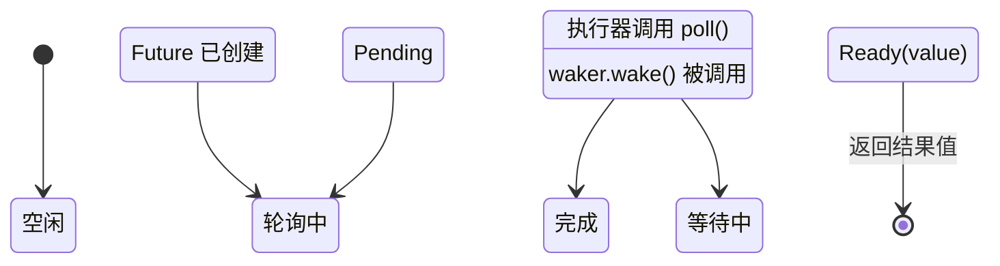

[English Original](../en/ch03-how-poll-works.md)

# 3. Poll 如何工作 🟡

> **你将学到：**
> - 执行器的轮询循环：poll → pending → wake → poll again
> - 如何从零开始构建一个极简执行器
> - 虚假唤醒（Spurious wake）规则及其重要意义
> - 实用辅助函数：`poll_fn()` 和 `yield_now()`

## 轮询状态机

执行器运行一个循环：轮询一个 future，如果返回 `Pending`，则将其挂起直到其 waker 被触发，然后再次进行轮询。这与操作系统线程由内核处理调度有着本质的区别。



> **重要提示：** 当处于 *等待中 (Waiting)* 状态时，future **必须**已经向 I/O 源注册了 waker。如果没有注册 = 永远挂起。

### 一个极简执行器

为了揭开执行器的神秘面纱，让我们构建一个最简单的执行器：

```rust
use std::future::Future;
use std::task::{Context, Poll, RawWaker, RawWakerVTable, Waker};
use std::pin::Pin;

/// 最简单的执行器：忙碌循环轮询直到 Ready
fn block_on<F: Future>(mut future: F) -> F::Output {
    // 将 future 固定在栈上
    // 安全性：在此之后 `future` 绝不会被移动 —— 我们只通过固定引用
    // 访问它，直到它完成。
    let mut future = unsafe { Pin::new_unchecked(&mut future) };

    // 创建一个无操作 (no-op) waker（只是持续轮询 —— 虽然低效但简单）
    fn noop_raw_waker() -> RawWaker {
        fn no_op(_: *const ()) {}
        fn clone(_: *const ()) -> RawWaker { noop_raw_waker() }
        let vtable = &RawWakerVTable::new(clone, no_op, no_op, no_op);
        RawWaker::new(std::ptr::null(), vtable)
    }

    // 安全性：noop_raw_waker() 返回一个带有正确虚表 (vtable) 的有效 RawWaker。
    let waker = unsafe { Waker::from_raw(noop_raw_waker()) };
    let mut cx = Context::from_waker(&waker);

    // 忙碌循环直到 future 完成
    loop {
        match future.as_mut().poll(&mut cx) {
            Poll::Ready(value) => return value,
            Poll::Pending => {
                // 真正的执行器会在这里挂起线程，并等待 waker.wake()
                // 我们这里只是简单地自旋并让出 CPU 片刻
                std::thread::yield_now();
            }
        }
    }
}

// 使用示例：
fn main() {
    let result = block_on(async {
        println!("来自微型执行器的问候！");
        42
    });
    println!("结果是: {result}");
}
```

> **切勿在生产环境中使用此代码！** 它采用忙碌循环，会浪费 CPU。真正的执行器（如 tokio, smol）会使用 `epoll`/`kqueue`/`io_uring` 来进入睡眠状态直到 I/O 就绪。但这展示了核心思想：执行器就是一个不断调用 `poll()` 的循环。

### 唤醒通知

真正的执行器是事件驱动的。当所有 future 都处于 `Pending` 状态时，执行器会进入休眠。Waker 则是一种中断机制：

```rust
// 真实执行器主循环的概念模型：
fn executor_loop(tasks: &mut TaskQueue) {
    loop {
        // 1. 轮询所有已被唤醒的任务
        while let Some(task) = tasks.get_woken_task() {
            match task.poll() {
                Poll::Ready(result) => task.complete(result),
                Poll::Pending => { /* 任务留在队列中，等待下一次唤醒 */ }
            }
        }

        // 2. 睡眠直到有事件唤醒我们（epoll_wait, kevent 等）
        //    这是 mio/polling 库发挥重要作用的地方
        tasks.wait_for_events(); // 阻塞直到发生 I/O 事件或 waker 被触发
    }
}
```

### 虚假唤醒 (Spurious Wakes)

即使 I/O 尚未准备好，future 也可能会被轮询。这被称为 *虚假唤醒*。Future 必须正确处理这种情况：

```rust
impl Future for MyFuture {
    type Output = Data;

    fn poll(self: Pin<&mut Self>, cx: &mut Context<'_>) -> Poll<Data> {
        // ✅ 正确做法：始终重新检查实际条件
        if let Some(data) = self.try_read_data() {
            Poll::Ready(data)
        } else {
            // 重新注册 waker（它可能已经发生了改变！）
            self.register_waker(cx.waker());
            Poll::Pending
        }

        // ❌ 错误做法：假设被轮询就意味着数据已就绪
        // let data = self.read_data(); // 可能会阻塞或发生 panic
        // Poll::Ready(data)
    }
}
```

**实现 `poll()` 的规则**：
1. **绝不阻塞** —— 如果未就绪，立即返回 `Pending`。
2. **始终重新注册 waker** —— waker 在两次轮询之间可能会发生改变。
3. **处理虚假唤醒** —— 检查实际条件，不要假定已就绪。
4. **不要在返回 `Ready` 后再次轮询** —— 这种行为是 **未定义规范** 的（可能会 panic、返回 `Pending` 或重复返回 `Ready`）。只有 `FusedFuture` 能保证完成后的轮询是安全的。

<details>
<summary><strong>🏋️ 实践任务：重新检查并思考倒计时练习</strong> (点击展开)</summary>

**挑战**：虽然上一章实现过类似的，但这里请注意其执行逻辑：实现一个 `CountdownFuture`，从 N 开始倒数到 0，将其作为副作用打印出来，当到 0 时，返回 `Ready("Liftoff!")`。

*提示*：它不需要真实的 I/O 源 —— 它可以在每次递减后使用 `cx.waker().wake_by_ref()` 立即唤醒自己。

<details>
<summary>🔑 参考方案</summary>

```rust
use std::future::Future;
use std::pin::Pin;
use std::task::{Context, Poll};

struct CountdownFuture {
    count: u32,
}

impl CountdownFuture {
    fn new(start: u32) -> Self {
        CountdownFuture { count: start }
    }
}

impl Future for CountdownFuture {
    type Output = &'static str;

    fn poll(mut self: Pin<&mut Self>, cx: &mut Context<'_>) -> Poll<Self::Output> {
        if self.count == 0 {
            Poll::Ready("Liftoff!")
        } else {
            println!("{}...", self.count);
            self.count -= 1;
            // 立即唤醒 —— 我们总是准备好取得进展
            cx.waker().wake_by_ref();
            Poll::Pending
        }
    }
}
```

**核心总结**：即使这个 future 总是准备好继续运行，它也会返回 `Pending` 以便在步骤之间让出控制权。它立即调用 `wake_by_ref()`，这样执行器就会立刻重新轮询它。这是协作式多任务的基础 —— 每个 future 都自愿让出执行权。

</details>
</details>

### 实用工具：`poll_fn` 和 `yield_now`

标准库和 tokio 提供了两个实用程序来避免编写完整的 `Future` 实现：

```rust
use std::future::poll_fn;
use std::task::Poll;

// poll_fn: 通过闭包创建一个一次性的 future
let value = poll_fn(|cx| {
    // 使用 cx.waker() 做些工作，返回 Ready 或 Pending
    Poll::Ready(42)
}).await;

// 现实场景：将基于回调的 API 桥接到异步环境中
async fn read_when_ready(source: &MySource) -> Data {
    poll_fn(|cx| source.poll_read(cx)).await
}
```

```rust
// yield_now: 自愿将控制权交给执行器
// 在计算密集型的异步循环中非常有用，可以避免饿死其他任务
async fn cpu_heavy_work(items: &[Item]) {
    for (i, item) in items.iter().enumerate() {
        process(item); // 繁重的 CPU 计算

        // 每处理 100 个条目，让出一次控制权以允许其他任务运行
        if i % 100 == 0 {
            tokio::task::yield_now().await;
        }
    }
}
```

> **何时使用 `yield_now()`**：如果你的异步函数在循环中进行 CPU 计算且没有任何 `.await` 点，它会独占执行器线程。定期插入 `yield_now().await` 以实现协作式多任务。

> **关键要诀 —— Poll 如何工作**
> - 执行器会反复对已被唤醒的 future 调用 `poll()`
> - Future 必须处理 **虚假唤醒** —— 始终重新检查实际条件
> - `poll_fn()` 允许你通过闭包创建临时 future
> - `yield_now()` 是计算密集型异步代码实现协作式调度的“逃生舱”

> **另请参阅：** [第 2 章 —— Future Trait](ch02-the-future-trait.md) 了解 trait 定义，[第 5 章 —— 揭秘状态机](ch05-the-state-machine-reveal.md) 了解编译器生成的代码

***
