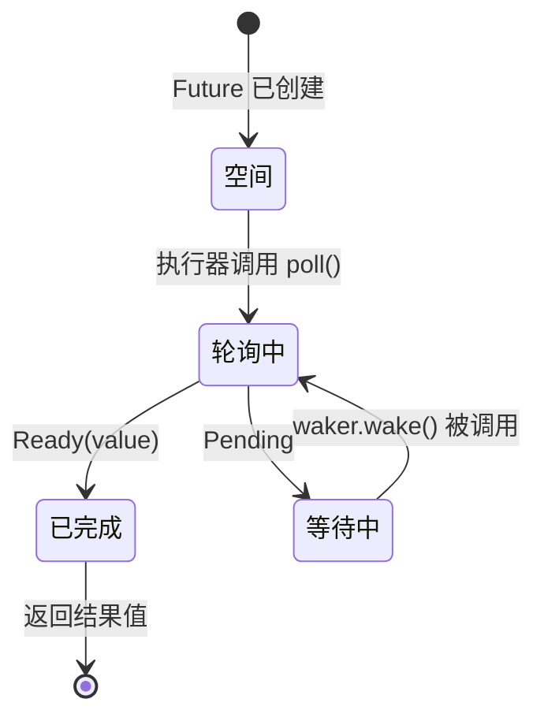

[English Original](../en/ch03-how-poll-works.md)

# 3. poll 的工作机制 🟡

> **你将学到：**
> - 执行器的轮询循环：poll → pending → wake → poll again
> - 如何从零构建一个最小执行器
> - 虚假唤醒规则及其重要性
> - 实用函数：`poll_fn()` 与 `yield_now()`

## 轮询状态机

执行器运行一个循环：轮询一个 future，如果返回 `Pending`，将由底层的 waker 进行信号传递，只有当 waker 被触发后，执行器才会再次对其进行轮询。这与操作系统线程有本质不同，后者由内核处理调度。



> **重要提示：** 当处于 *Waiting*（等待）状态时，future **必须** 已经向某个 I/O 源注册了 waker。如果没有注册，程序将永远挂起。

### 一个最小执行器

为了揭开执行器的神秘面纱，让我们构建一个最简单的执行器：

```rust
use std::future::Future;
use std::task::{Context, Poll, RawWaker, RawWakerVTable, Waker};
use std::pin::Pin;

/// 最简单的执行器：忙碌循环轮询直到 Ready
fn block_on<F: Future>(mut future: F) -> F::Output {
    // 在栈上固定 future
    // 安全性：`future` 在此之后不会再被移动 —— 
    // 我们只通过固定引用访问它，直到它完成。
    let mut future = unsafe { Pin::new_unchecked(&mut future) };

    // 创建一个空操作 waker（只是持续轮询 —— 效率低但简单）
    fn noop_raw_waker() -> RawWaker {
        fn no_op(_: *const ()) {}
        fn clone(_: *const ()) -> RawWaker { noop_raw_waker() }
        let vtable = &RawWakerVTable::new(clone, no_op, no_op, no_op);
        RawWaker::new(std::ptr::null(), vtable)
    }

    // 安全性：noop_raw_waker() 返回一个带有正确虚表的有效 RawWaker。
    let waker = unsafe { Waker::from_raw(noop_raw_waker()) };
    let mut cx = Context::from_waker(&waker);

    // 忙碌循环直到 future 完成
    loop {
        match future.as_mut().poll(&mut cx) {
            Poll::Ready(value) => return value,
            Poll::Pending => {
                // 真正的执行器会把线程挂起并等待 waker.wake() 
                // 我们只是简单地让出 CPU 时间片
                std::thread::yield_now();
            }
        }
    }
}

// 使用示例：
fn main() {
    let result = block_on(async {
        println!("来自迷你执行器的问候！");
        42
    });
    println!("得到结果: {result}");
}
```

> **不要在生产环境中使用它！** 它由忙碌循环（busy-loop）构成，会浪费大量 CPU。真实的执行器（如 tokio、smol）会使用 `epoll`/`kqueue`/`io_uring` 在 I/O 就绪前保持休眠。但这个例子展示了核心思想：执行器本质上就是一个调用 `poll()` 的循环。

### 唤醒通知

真实的执行器是事件驱动的。当所有 future 都处于 `Pending` 状态时，执行器会进入休眠。Waker 则是一种中断机制：

```rust
// 真实执行器主循环的概念模型：
fn executor_loop(tasks: &mut TaskQueue) {
    loop {
        // 1. 轮询所有已被唤醒的任务
        while let Some(task) = tasks.get_woken_task() {
            match task.poll() {
                Poll::Ready(result) => task.complete(result),
                Poll::Pending => { /* 任务留在队列中，等待唤醒 */ }
            }
        }

        // 2. 修眠直到有事件唤醒我们（如 epoll_wait、kevent 等）
        // 这是 mio/polling 库发挥作用的地方
        tasks.wait_for_events(); // 阻塞直到 I/O 事件发生或 waker 触发
    }
}
```

### 虚假唤醒 (Spurious Wakes)

即使 I/O 尚未就绪，future 也可能会被轮询。这被称为 *spurious wake*（虚假唤醒）。Future 必须正确处理这种情况：

```rust
impl Future for MyFuture {
    type Output = Data;

    fn poll(self: Pin<&mut Self>, cx: &mut Context<'_>) -> Poll<Data> {
        // ✅ 正确做法：始终重新检查实际条件
        if let Some(data) = self.try_read_data() {
            Poll::Ready(data)
        } else {
            // 重新注册 waker（它可能已经变了！）
            self.register_waker(cx.waker());
            Poll::Pending
        }

        // ❌ 错误做法：假设被轮询就意味着数据已就绪
        // let data = self.read_data(); // 可能会阻塞或 panic
        // Poll::Ready(data)
    }
}
```

**实现 `poll()` 的准则**：
1. **绝不阻塞** —— 如果尚未准备好，立即返回 `Pending`。
2. **始终重新注册 waker** —— waker 在轮询间隔中可能会发生变化。
3. **处理虚假唤醒** —— 检查真实条件，不要盲目假设已就绪。
4. **不要在 `Ready` 之后继续轮询** —— 这种行为是**未定义**的（可能会报错、返回 Pending 或重复 Ready）。只有 `FusedFuture` 明确保证完成后的安全性。

<details>
<summary><strong>🏋️ 练习：实现一个倒计时 Future</strong></summary>

**挑战**：实现一个 `CountdownFuture`，从 N 倒数到 0，并在每次轮询时通过副作用 *打印* 当前计数。当达到 0 时，返回 `Ready("Liftoff!")` 完成。（注：一个 `Future` 只产生 **一个** 最终值 —— 打印是副作用，而非产出值。关于多个异步值，请参见第 11 章中的 `Stream`。）

*提示*：这不需要真实的 I/O 源 —— 它可以每次递减后使用 `cx.waker().wake_by_ref()` 立即唤醒自己。

<details>
<summary>🔑 参考答案</summary>

```rust
use std::future::Future;
use std::pin::Pin;
use std::task::{Context, Poll};

struct CountdownFuture {
    count: u32,
}

impl CountdownFuture {
    fn new(start: u32) -> Self {
        CountdownFuture { count: start }
    }
}

impl Future for CountdownFuture {
    type Output = &'static str;

    fn poll(mut self: Pin<&mut Self>, cx: &mut Context<'_>) -> Poll<Self::Output> {
        if self.count == 0 {
            Poll::Ready("Liftoff!")
        } else {
            println!("{}...", self.count);
            self.count -= 1;
            // 立即唤醒 —— 我们随时准备好继续推进
            cx.waker().wake_by_ref();
            Poll::Pending
        }
    }
}

// 配合迷你执行器或 tokio 使用：
// let msg = block_on(CountdownFuture::new(5));
// 打印结果: 5... 4... 3... 2... 1...
// msg == "Liftoff!"
```

**关键点**：尽管这个 future 总是可以继续推进，但它仍返回 `Pending` 以便在步骤之间让出控制权。它调用 `wake_by_ref()`，因此执行器会马上再次轮询它。这是协作式多任务的基础 —— 每个 future 都会主动让步。

</details>
</details>

### 实用工具：`poll_fn` 与 `yield_now`

来自标准库和 tokio 的两个实用工具，可以避免编写完整的 `Future` 实现：

```rust
use std::future::poll_fn;
use std::task::Poll;

// poll_fn: 从闭包创建一个一次性的 future
let value = poll_fn(|cx| {
    // 使用 cx.waker() 做些工作，返回 Ready 或 Pending
    Poll::Ready(42)
}).await;

// 实际用途：将基于回调的 API 桥接到异步环境
async fn read_when_ready(source: &MySource) -> Data {
    poll_fn(|cx| source.poll_read(cx)).await
}
```

```rust
// yield_now: 主动向执行器让出控制权
// 在计算密集型的异步循环中非常有用，可以避免其他任务被“饿死”
async fn cpu_heavy_work(items: &[Item]) {
    for (i, item) in items.iter().enumerate() {
        process(item); // 密集的 CPU 工作

        // 每处理 100 个条目，让出执行权给其他任务
        if i % 100 == 0 {
            tokio::task::yield_now().await;
        }
    }
}
```

> **何时使用 `yield_now()`**：如果你的异步函数在循环中执行大量计算且没有任何 `.await` 点，它将霸占执行器线程。定期插入 `yield_now().await` 可以启用协作式多任务。

> **关键要点：poll 的工作机制**
> - 执行器会对被唤醒的 future 反复调用 `poll()`。
> - Future 必须处理**虚假唤醒** —— 始终重新检查实际条件。
> - `poll_fn()` 允许你从闭包快捷创建 future。
> - `yield_now()` 是计算密集型异步代码的协作式调度“逃脱口”。

> **延伸阅读：** [第 2 章：Future Trait](ch02-the-future-trait.md) 了解 trait 定义，[第 5 章：状态机真相](ch05-the-state-machine-reveal.md) 了解编译器生成的细节。

***
