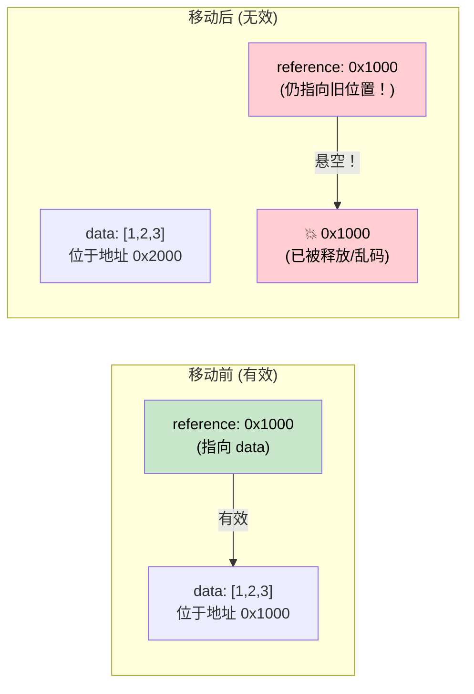

[English Original](../en/ch04-pin-and-unpin.md)

# 4. Pin 与 Unpin 🔴

> **你将学到：**
> - 为什么自引用结构体在内存中被移动时会崩溃
> - `Pin<P>` 保证了什么，以及它如何防止移动
> - 三种实用的固定（pinning）模式：`Box::pin()`、`tokio::pin!()`、`Pin::new()`
> - 何时 `Unpin` 提供了一个“逃生舱”

## 为什么需要 Pin

这是异步 Rust 中最令人困惑的概念。让我们循序渐进地建立直觉。

### 问题所在：自引用结构体 (Self-Referential Structs)

当编译器将 `async fn` 转换为状态机时，该状态机可能包含对其自身字段的引用。这创建了一个 *自引用结构体* —— 如果在内存中移动它，就会使这些内部引用失效。

```rust
// 编译器为以下代码生成的简化版本：
// async fn example() {
//     let data = vec![1, 2, 3];
//     let reference = &data;       // 指向其上方的 data
//     use_ref(reference).await;
// }

// 变成类似这样的结构：
enum ExampleStateMachine {
    State0 {
        data: Vec<i32>,
        // reference: &Vec<i32>,  // 问题：指向了上方的 `data`
        //                        // 如果此结构体移动了，指针就会悬空！
    },
    State1 {
        data: Vec<i32>,
        reference: *const Vec<i32>, // 指向 data 字段的内部指针
    },
    Complete,
}
```



### 实践中的自引用

这并非学术性的担忧。每一个跨越 `.await` 点持有引用的 `async fn` 都会创建一个自引用状态机：

```rust
async fn problematic() {
    let data = String::from("hello");
    let slice = &data[..]; // slice 借用了 data
    
    some_io().await; // <-- .await 点：状态机同时存储了 data 和 slice
    
    println!("{slice}"); // await 之后使用了该引用
}
// 生成的状态机拥有 `data: String` 和 `slice: &str`
// 其中 slice 指向 data 内部。移动状态机 = 悬空指针。
```

### Pin 的实际应用

`Pin<P>` 是一个包装器，用于防止移动指针所指向的值：

```rust
use std::pin::Pin;

let mut data = String::from("hello");

// 固定它 —— 现在它不能被移动了
let pinned: Pin<&mut String> = Pin::new(&mut data);

// 仍可使用它：
println!("{}", pinned.as_ref().get_ref()); // "hello"

// 但我们无法取回 &mut String（那将允许使用 mem::swap 等操作）：
// let mutable: &mut String = Pin::into_inner(pinned); // 仅当 String: Unpin 时才行
// String 是 Unpin 的，所以这对于 String 其实是可行的。
// 但对于自引用状态机（它们是 !Unpin 的），这会被阻止。
```

在实际代码中，你主要在三个地方遇到 Pin：

```rust
// 1. poll() 的签名 —— 所有的 future 都是通过 Pin 进行 poll 的
fn poll(self: Pin<&mut Self>, cx: &mut Context<'_>) -> Poll<Output>;

// 2. Box::pin() —— 在堆上分配并固定一个 future
let future: Pin<Box<dyn Future<Output = i32>>> = Box::pin(async { 42 });

// 3. tokio::pin!() —— 在栈上固定一个 future
tokio::pin!(my_future);
// 现在 my_future 的类型为: Pin<&mut impl Future>
```

### Unpin 逃生舱

Rust 中的大多数类型都是 `Unpin` 的 —— 它们不包含自引用，因此固定对它们来说是无操作。只有编译器生成的（源自 `async fn` 的）状态机是 `!Unpin` 的。

```rust
// 这些都是 Unpin 的 —— 固定它们没有什么特别的：
// i32, String, Vec<T>, HashMap<K,V>, Box<T>, &T, &mut T

// 这些是 !Unpin 的 —— 必须在 poll 之前固定：
// 由 `async fn` 和 `async {}` 生成的状态机

// 实践建议：
// 如果你手动编写一个 Future 且它没有自引用，
// 请实现 Unpin 以使其更易于使用：
impl Unpin for MySimpleFuture {} // “我很安全，随便动，信我”
```

### 快速参考

| 对象 | 场景 | 方式 |
|------|------|-----|
| 在堆上固定 Future | 存储在集合中，从函数返回 | `Box::pin(future)` |
| 在栈上固定 Future | 在 `select!` 中局部使用或手动轮询 | `tokio::pin!(future)` 或 `pin-utils` 中的 `pin_mut!` |
| 函数签名中的 Pin | 接收固定的 Future | `future: Pin<&mut F>` |
| 要求 Unpin | 在创建后需要移动 Future 时 | `F: Future + Unpin` |

<details>
<summary><strong>🏋️ 实践任务：Pin 与移动</strong> (点击展开)</summary>

**挑战**：以下代码片段中哪些可以编译？对于无法编译的，说明原因并修复它。

```rust
// 片段 A
let fut = async { 42 };
let pinned = Box::pin(fut);
let moved = pinned; // 移动 Box
let result = moved.await;

// 片段 B
let fut = async { 42 };
tokio::pin!(fut);
let moved = fut; // 移动固定的 future
let result = moved.await;

// 片段 C
use std::pin::Pin;
let mut fut = async { 42 };
let pinned = Pin::new(&mut fut);
```

<details>
<summary>🔑 参考方案</summary>

**片段 A**：✅ **可以编译。** `Box::pin()` 将 future 放在堆上。移动 `Box` 移动的是*指针*，而不是 future 本身。Future 仍固定在堆上的位置。

**片段 B**：✅ **可以编译。** `tokio::pin!` 将 future 固定到栈上并重新将 `fut` 绑定为 `Pin<&mut ...>`。`let moved = fut` 移动的是 **`Pin` 包装器**（一个指针），而不是底层的 future —— future 仍固定在栈上。这就像 `Box::pin`：移动 `Box` 不会移动堆分配。注意，`fut` 在移动后会被消费，之后只能使用 `moved`：
```rust
let fut = async { 42 };
tokio::pin!(fut);
let moved = fut;        // 移动 Pin<&mut> 包装器 —— 没问题
// fut.await;           // ❌ 错误：fut 已被移动
let result = moved.await; // ✅ 改用 moved
```

**片段 C**：❌ **无法编译。** `Pin::new()` 要求 `T: Unpin`。Async 代码块生成的是 `!Unpin` 类型。**修复方法**：使用 `Box::pin()` 或 `unsafe Pin::new_unchecked()`：
```rust
let fut = async { 42 };
let pinned = Box::pin(fut); // 堆上固定 —— 对 !Unpin 有效
```

**核心总结**：`Box::pin()` 是固定 `!Unpin` future 的安全且简便的方法。`tokio::pin!()` 在栈上固定 —— 你可以移动 `Pin<&mut>` 包装器（它只是个指针），但底层的 future 保持不动。`Pin::new()` 仅适用于 `Unpin` 类型。

</details>
</details>

> **关键要诀 —— Pin 与 Unpin**
> - `Pin<P>` 是一个包装器，用于 **防止被指向的对象被移动** —— 这对自引用状态机至关重要
> - `Box::pin()` 是在堆上固定 future 的安全且默认的首选方式
> - `tokio::pin!()` 在栈上固定 —— 你可以移动 `Pin<&mut>` 包装器，但底层的 future 保持不动
> - `Unpin` 是一个自动 trait：实现了 `Unpin` 的类型即使在被固定时也可以被移动（大多数类型都是 `Unpin` 的；async 块则不是）

> **另请参阅：** [第 2 章 —— Future Trait](ch02-the-future-trait.md) 了解 poll 中的 `Pin<&mut Self>`，[第 5 章 —— 揭秘状态机](ch05-the-state-machine-reveal.md) 了解为什么异步状态机是自引用的

***
