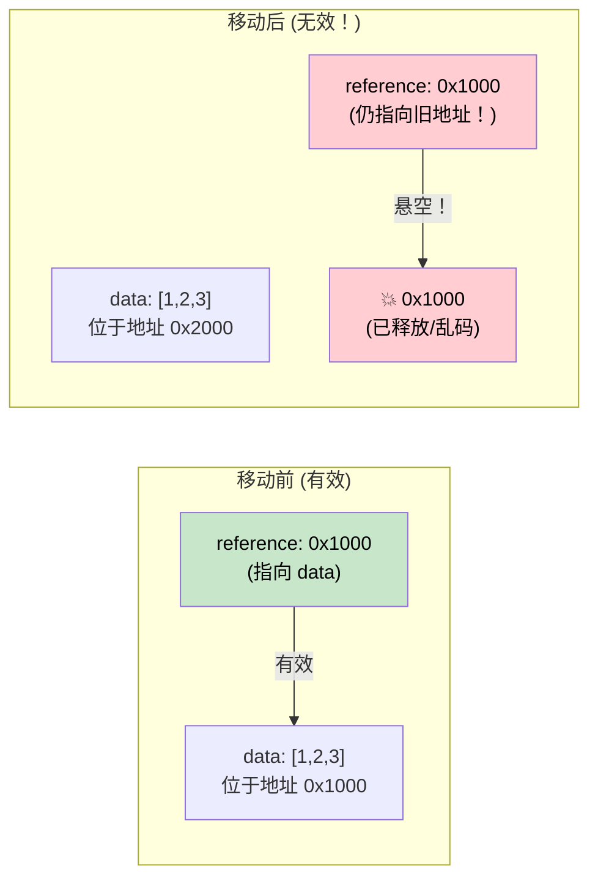

[English Original](../en/ch04-pin-and-unpin.md)

# 4. Pin 与 Unpin 🔴

> **你将学到：**
> - 为什么自引用结构体在内存中移动时会崩溃
> - `Pin<P>` 保证了什么，以及它是如何防止移动的
> - 三种实用的 Pin 模式：`Box::pin()`、`tokio::pin!()`、`Pin::new()`
> - 什么时候 `Unpin` 可以作为“逃生口”

## 为什么需要 Pin

这是 async Rust 中最令人困惑的概念。让我们循序渐进地建立直觉。

### 问题所在：自引用结构体

当编译器将 `async fn` 转换为状态机时，该状态机可能包含对其自身字段的引用。这创建了一个 *self-referential struct*（自引用结构体）—— 在内存中移动它会导致这些内部引用失效。

```rust
// 编译器为以下代码生成的（简化版）代码：
// async fn example() {
//     let data = vec![1, 2, 3];
//     let reference = &data;       // 指向上方的 data
//     use_ref(reference).await;
// }

// 会变成类似下面的样子：
enum ExampleStateMachine {
    State0 {
        data: Vec<i32>,
        // reference: &Vec<i32>,  // 问题：指向上方的 `data`
        //                        // 如果这个结构体移动了，指针就会失效！
    },
    State1 {
        data: Vec<i32>,
        reference: *const Vec<i32>, // 指向 data 字段的内部指针
    },
    Complete,
}
```



### 自引用结构体

这不仅仅是一个理论问题。每一个跨越 `.await` 点持有引用的 `async fn` 都会创建一个自引用的状态机：

```rust
async fn problematic() {
    let data = String::from("hello");
    let slice = &data[..]; // slice 借用了 data
    
    some_io().await; // <-- .await 点：状态机同时存储了 data 和 slice
    
    println!("{slice}"); // await 之后使用该引用
}
// 生成的状态机包含 `data: String` 和 `slice: &str`，其中 slice 指向 data 内部。
// 移动该状态机将导致指针悬空。
```

### Pin 的实践

`Pin<P>` 是一个包装器，用于防止移动指针所指向的值：

```rust
use std::pin::Pin;

let mut data = String::from("hello");

// 固定它 —— 现在它不能被移动了
let pinned: Pin<&mut String> = Pin::new(&mut data);

// 仍可以正常使用：
println!("{}", pinned.as_ref().get_ref()); // "hello"

// 但我们无法拿回 &mut String（那将允许 mem::swap 等移动操作）：
// let mutable: &mut String = Pin::into_inner(pinned); // 仅当 String: Unpin 时才可行
```

在实际代码中，你主要在三个地方遇到 Pin：

```rust
// 1. poll() 签名 —— 所有 future 都是通过 Pin 进行轮询的
fn poll(self: Pin<&mut Self>, cx: &mut Context<'_>) -> Poll<Output>;

// 2. Box::pin() —— 在堆上分配并固定一个 future
let future: Pin<Box<dyn Future<Output = i32>>> = Box::pin(async { 42 });

// 3. tokio::pin!() —— 在栈上固定一个 future
tokio::pin!(my_future);
// 此时 my_future 类型变为: Pin<&mut impl Future>
```

### Unpin 逃生口

Rust 中的大多数类型都是 `Unpin` —— 它们不包含自引用，因此固定（pinning）操作对它们没有实际约束。只有编译器生成的（来自 `async fn`）状态机是 `!Unpin`。

```rust
// 这些都是 Unpin —— 固定它们没有什么特别之处：
// i32, String, Vec<T>, HashMap<K,V>, Box<T>, &T, &mut T

// 这些是 !Unpin —— 它们在轮询之前必须被固定：
// 由 `async fn` 和 `async {}` 生成的状态机

// 实际影响：
// 如果你手写一个 Future 且它没有自引用，请实现 Unpin 以方便使用：
impl Unpin for MySimpleFuture {} // “我很安全，随便移动我”
```

### 快速参考

| 操作目标 | 适用场景 | 实现方式 |
|------|------|-----|
| 在堆上固定 future | 存储在集合中、从函数返回 | `Box::pin(future)` |
| 在栈上固定 future | 在 `select!` 中局部使用或手动轮询 | `tokio::pin!(future)` |
| 函数签名中的 Pin | 接收已固定的 future | `future: Pin<&mut F>` |
| 要求 Unpin | 需要在创建后移动 future 时 | `F: Future + Unpin` |

<details>
<summary><strong>🏋️ 练习：Pin 与移动</strong></summary>

**挑战**：以下哪些代码片段可以编译？对于不能编译的，请解释原因并修复它。

```rust
// 片段 A
let fut = async { 42 };
let pinned = Box::pin(fut);
let moved = pinned; // 移动这个 Box
let result = moved.await;

// 片段 B
let fut = async { 42 };
tokio::pin!(fut);
let moved = fut; // 尝试移动已固定的 future
let result = moved.await;

// 片段 C
use std::pin::Pin;
let mut fut = async { 42 };
let pinned = Pin::new(&mut fut);
```

<details>
<summary>🔑 参考答案</summary>

**片段 A**：✅ **可编译。** `Box::pin()` 将 future 放在堆上。移动 `Box` 只是移动了 *指针*，而不是 future 本身。Future 在其固定的堆地址上保持不动。

**片段 B**：❌ **不可编译。** `tokio::pin!` 将 future 固定在栈上，并将 `fut` 重新绑定为 `Pin<&mut ...>`。你不能从固定引用中移出。**修复方案**：不要移动它 —— 直接就地使用即可：
```rust
let fut = async { 42 };
tokio::pin!(fut);
let result = fut.await; // 直接使用，不要重新赋值
```

**片段 C**：❌ **不可编译。** `Pin::new()` 要求 `T: Unpin`。异步块生成的是 `!Unpin` 类型。**修复方案**：使用 `Box::pin()` 或 `unsafe Pin::new_unchecked()`：
```rust
let fut = async { 42 };
let pinned = Box::pin(fut); // 堆固定 —— 适用于 !Unpin 类型
```

**关键点**：`Box::pin()` 是固定 `!Unpin` future 的最安全方法。`tokio::pin!()` 用于栈固定，但之后不可移动。`Pin::new()` 仅适用于平凡的 `Unpin` 类型。

</details>
</details>

> **关键要点：Pin 与 Unpin**
> - `Pin<P>` 是一个包装器，**防止所指对象在内存中被移动** —— 这对于自引用状态机至关重要。
> - `Box::pin()` 是在堆上固定 future 的标准且简便的做法。
> - `tokio::pin!()` 在栈上固定 —— 开销更小，但之后 future 无法移动。
> - `Unpin` 是一个自动实现的 Trait：大多数普通类型都是 `Unpin`；而异步块则明确是 `!Unpin`。

> **延伸阅读：** [第 2 章：Future Trait](ch02-the-future-trait.md) 了解 poll 中的 `Pin<&mut Self>`，[第 5 章：状态机真相](ch05-the-state-machine-reveal.md) 了解为什么异步状态机是自引用的。

***
