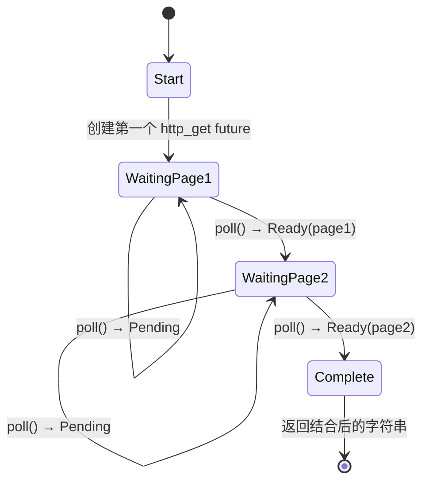

[English Original](../en/ch05-the-state-machine-reveal.md)

# 5. 状态机真相 🟢

> **你将学到：**
> - 编译器如何将 `async fn` 转换为枚举状态机
> - 源码与生成的各状态之间的对照分析
> - 为什么 `async fn` 中巨大的栈分配会导致 future 体积膨胀
> - Drop 优化：不再需要的值会立即被释放

## 编译器究竟生成了什么

当你编写 `async fn` 时，编译器会将你看起来像是顺序执行的代码转换为基于枚举的状态机。理解这一转换过程是掌握 async Rust 性能特性以及理解其设计哲学的关键。

### 源码与状态机对照

```rust
// 你写的源码：
async fn fetch_two_pages() -> String {
    let page1 = http_get("https://example.com/a").await;
    let page2 = http_get("https://example.com/b").await;
    format!("{page1}\n{page2}")
}
```

编译器生成的模型在概念上类似于以下代码：

```rust
enum FetchTwoPagesStateMachine {
    // 状态 0：准备为 page1 调用 http_get
    Start,

    // 状态 1：等待 page1，持有相应的 future
    WaitingPage1 {
        fut1: HttpGetFuture,
    },

    // 状态 2：拿到 page1，等待 page2
    WaitingPage2 {
        page1: String,
        fut2: HttpGetFuture,
    },

    // 终止状态
    Complete,
}

impl Future for FetchTwoPagesStateMachine {
    type Output = String;

    fn poll(mut self: Pin<&mut Self>, cx: &mut Context<'_>) -> Poll<String> {
        loop {
            match self.as_mut().get_mut() {
                Self::Start => {
                    let fut1 = http_get("https://example.com/a");
                    *self.as_mut().get_mut() = Self::WaitingPage1 { fut1 };
                }
                Self::WaitingPage1 { fut1 } => {
                    let page1 = match Pin::new(fut1).poll(cx) {
                        Poll::Ready(v) => v,
                        Poll::Pending => return Poll::Pending,
                    };
                    let fut2 = http_get("https://example.com/b");
                    *self.as_mut().get_mut() = Self::WaitingPage2 { page1, fut2 };
                }
                Self::WaitingPage2 { page1, fut2 } => {
                    let page2 = match Pin::new(fut2).poll(cx) {
                        Poll::Ready(v) => v,
                        Poll::Pending => return Poll::Pending,
                    };
                    let result = format!("{page1}\n{page2}");
                    *self.as_mut().get_mut() = Self::Complete;
                    return Poll::Ready(result);
                }
                Self::Complete => panic!("polled after completion"),
            }
        }
    }
}
```

> **注意**：这种“脱糖 (desugaring)”是 *概念性* 的。真实的编译器输出会使用 `unsafe` 投影 —— 这里显示的 `get_mut()` 需要 `Unpin` 才能调用，但生成的异步状态机实际上是 `!Unpin` 的。这里的目的是阐明状态是如何转换的。



> **各状态存储的内容：**
> - **WaitingPage1** — 存储 `fut1: HttpGetFuture`（此时还没开始分配 page2）。
> - **WaitingPage2** — 存储 `page1: String` 和 `fut2: HttpGetFuture`（此时 `fut1` 已经被销毁释放）。

### 为什么这对性能至关重要

**零成本**：状态机是一个分配在栈上的枚举。每一个 future 都没有默认的堆分配，没有 GC 压力，没有装箱（boxing）—— 除非你显式使用 `Box::pin()`。

**尺寸 (Size)**：枚举的大小取决于它所有变体中最大的那一个。每个 `.await` 都会创建一个新变体。这意味着：

```rust
async fn small() {
    let a: u8 = 0;
    yield_now().await;
    let b: u8 = 0;
    yield_now().await;
}
// 尺寸很小，基本就是变体最大值 + 判别码

async fn big() {
    let buf: [u8; 1_000_000] = [0; 1_000_000]; // 在栈上分配了 1MB！
    some_io().await;
    process(&buf);
}
// 尺寸巨大 ≈ 1MB + 内部 future。
// ⚠️ 警告：不要在异步函数中在栈上分配巨大的数组！请改用 Vec<u8> 或 Box<[u8]>。
```

**Drop 优化**：当状态机发生迁移时，它会销毁不再需要的值。在上例中，当我们切换到 `WaitingPage2` 时，`fut1` 会被立即 Drop。

> **实践法则**：在 `async fn` 中使用巨大的栈空间会导致生成的 future 体积剧增。如果你在异步代码中遇到栈溢出，请检查是否有大数组。如有必要，使用 `Box::pin()` 将子任务放到堆上。

### 练习：解析状态机

<details>
<summary>🏋️ 练习</summary>

**挑战**：分析以下异步函数，描述编译器生成的枚举。它有多少个状态？每个状态大约需要存储什么？

```rust
async fn pipeline(url: &str) -> Result<usize, Error> {
    let response = fetch(url).await?;
    let body = response.text().await?;
    let parsed = parse(body).await?;
    Ok(parsed.len())
}
```

<details>
<summary>🔑 参考答案</summary>

包含五个主要状态：

1. **Start** — 记录初始化信息，如 `url`。
2. **WaitingFetch** — 存储 `url` 指针和 `fetch` 执行中的 future。
3. **WaitingText** — 存储返回的 `response` 和解析文本的 future。
4. **WaitingParse** — 存储 `body` 字符串和解析逻辑的 future。
5. **Done** — 任务结束。

每个 `.await` 都会导致状态的分裂。`?` 操作符提供了提前返回的路径，但并不增加枚举状态的数量 —— 它只是在 `Poll::Ready` 返回值上加了一层 `match` 逻辑。

</details>
</details>

> **关键要点：状态机真相**
> - `async fn` 会被编译为一个枚举，每个 `.await` 对应一个状态变体。
> - Future 的**物理尺寸**取决于所有状态中最大的那一个 —— 巨大的局部变量会撑爆尺寸。
> - 编译器会自动处理状态切换时的 **Drop** 动作。
> - 当 future 体积过大影响性能或导致栈溢出时，请考虑使用 `Box::pin()`。

> **延伸阅读：** [第 4 章：Pin 与 Unpin](ch04-pin-and-unpin.md) 了解为什么生成的枚举必须被固定，[第 6 章：手写 Future](ch06-building-futures-by-hand.md) 尝试自己手写这种状态机。

***
