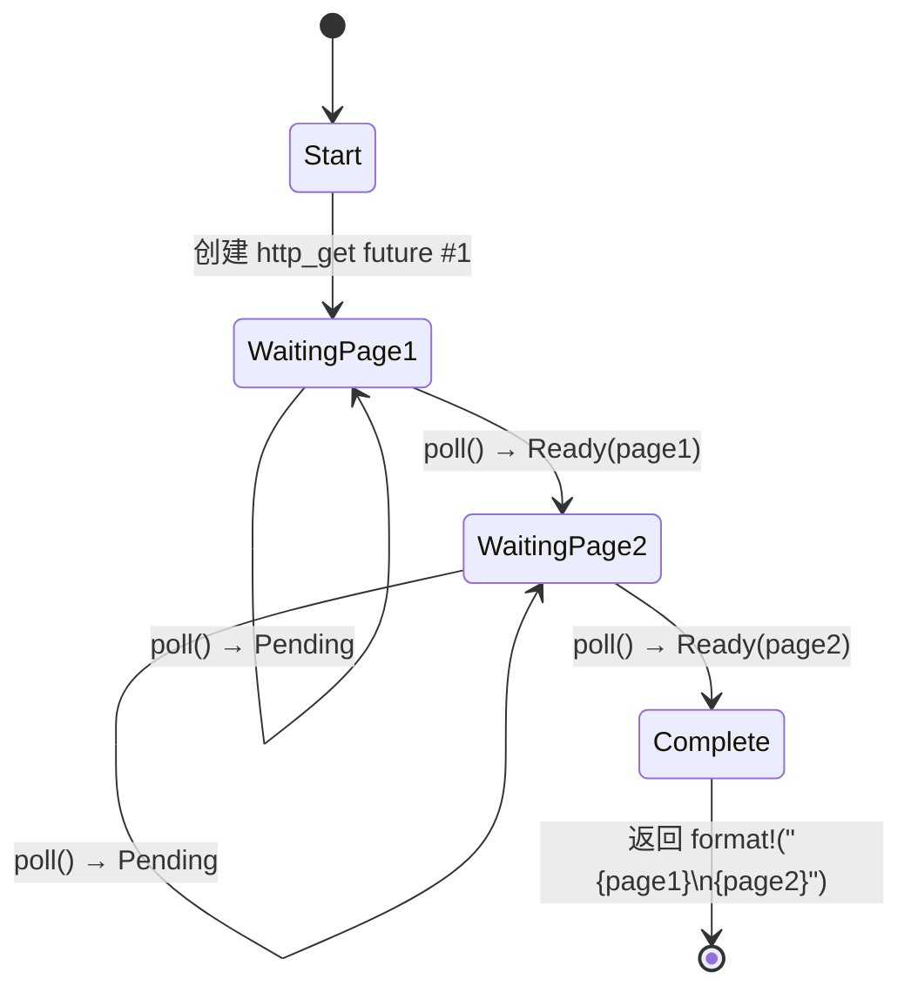

[English Original](../en/ch05-the-state-machine-reveal.md)

# 5. 揭秘状态机 🟢

> **你将学到：**
> - 编译器如何将 `async fn` 转换为基于枚举的状态机
> - 源码 vs 生成状态的对比展示
> - 为什么 `async fn` 中的巨量栈分配会使 future 体积爆炸
> - Drop 优化：变量在不再被需要时立即被释放

## 编译器实际生成了什么

当你编写 `async fn` 时，编译器会将你看起来是顺序执行的代码转换为基于枚举（enum）的状态机。理解这一转换过程是理解异步 Rust 性能特性及其许多奇特行为的关键。

### 对比展示：async fn vs 状态机

```rust
// 你编写的代码：
async fn fetch_two_pages() -> String {
    let page1 = http_get("https://example.com/a").await;
    let page2 = http_get("https://example.com/b").await;
    format!("{page1}\n{page2}")
}
```

编译器生成的代码逻辑上类似于这样：

```rust
enum FetchTwoPagesStateMachine {
    // 状态 0：准备调用 http_get 获取 page1
    Start,

    // 状态 1：等待 page1，持有其 future
    WaitingPage1 {
        fut1: HttpGetFuture,
    },

    // 状态 2：拿到 page1，等待 page2
    WaitingPage2 {
        page1: String,
        fut2: HttpGetFuture,
    },

    // 终止状态
    Complete,
}

impl Future for FetchTwoPagesStateMachine {
    type Output = String;

    fn poll(mut self: Pin<&mut Self>, cx: &mut Context<'_>) -> Poll<String> {
        loop {
            match self.as_mut().get_mut() {
                Self::Start => {
                    let fut1 = http_get("https://example.com/a");
                    *self.as_mut().get_mut() = Self::WaitingPage1 { fut1 };
                }
                Self::WaitingPage1 { fut1 } => {
                    let page1 = match Pin::new(fut1).poll(cx) {
                        Poll::Ready(v) => v,
                        Poll::Pending => return Poll::Pending,
                    };
                    let fut2 = http_get("https://example.com/b");
                    *self.as_mut().get_mut() = Self::WaitingPage2 { page1, fut2 };
                }
                Self::WaitingPage2 { page1, fut2 } => {
                    let page2 = match Pin::new(fut2).poll(cx) {
                        Poll::Ready(v) => v,
                        Poll::Pending => return Poll::Pending,
                    };
                    let result = format!("{page1}\n{page2}");
                    *self.as_mut().get_mut() = Self::Complete;
                    return Poll::Ready(result);
                }
                Self::Complete => panic!("在完成后继续分发轮询"),
            }
        }
    }
}
```

> **注意**：上述脱糖过程是 *概念性* 的。真实的编译器输出使用 `unsafe` 的固定投影（pin projections）—— 这里展示的 `get_mut()` 调用需要 `Unpin` 约束，但异步状态机是 `!Unpin` 的。本例旨在阐明状态转换过程，而非生成可直接编译的代码。



> **状态内容解析：**
> - **WaitingPage1** —— 存储 `fut1: HttpGetFuture`（page2 尚未被分配空间）。
> - **WaitingPage2** —— 存储 `page1: String` 和 `fut2: HttpGetFuture`（此时 `fut1` 已经被丢弃）。

### 为什么这对于性能至关重要

**零成本**：状态机是一个栈分配的枚举。每个 future 不需要堆分配，没有垃圾回收器，没有装箱（boxing）—— 除非你显式使用 `Box::pin()`。

**体积（Size）**：枚举的大小是其所有变体中最大的那个。每个 `.await` 点都会创建一个新的枚举变体。这意味着：

```rust
async fn small() {
    let a: u8 = 0;
    yield_now().await;
    let b: u8 = 0;
    yield_now().await;
}
// 大小 ≈ max(size_of(u8), size_of(u8)) + 判别码 + 内部 future 大小
//      ≈ 非常小!

async fn big() {
    let buf: [u8; 1_000_000] = [0; 1_000_000]; // 栈上的 1MB 缓冲区！
    some_io().await;
    process(&buf);
}
// 大小 ≈ 1MB + 内部 future 的大小
// ⚠️ 绝不要在异步函数中在栈上分配巨大的缓冲区！
// 请改用 Vec<u8> 或 Box<[u8]>。
```

**Drop 优化**：当状态机发生转换时，它会丢弃不再需要的变量。在上面的例子中，当我们从 `WaitingPage1` 转换为 `WaitingPage2` 时，`fut1` 会被丢弃 —— 编译器会自动插入 drop 操作。

> **实践准则**：`async fn` 中的大型栈分配会导致 future 的体积爆炸。如果你在异步代码中看到栈溢出（stack overflow），请检查是否有大型数组或深度嵌套的 future。必要时使用 `Box::pin()` 在堆上分配子 future。

### 练习：预测状态机

<details>
<summary>🏋️ 练习（点击展开）</summary>

**挑战**：给定以下异步函数，勾勒出编译器生成的动态状态机。它有多少个状态（枚举变体）？每个状态中存储了哪些值？

```rust
async fn pipeline(url: &str) -> Result<usize, Error> {
    let response = fetch(url).await?;
    let body = response.text().await?;
    let parsed = parse(body).await?;
    Ok(parsed.len())
}
```

<details>
<summary>🔑 答案</summary>

共有五个状态：

1. **Start** —— 存储 `url`
2. **WaitingFetch** —— 存储 `url` 和 `fetch` 返回的 future
3. **WaitingText** —— 存储 `response` 和 `text()` 返回的 future
4. **WaitingParse** —— 存储 `body` 和 `parse` 返回的 future
5. **Done** —— 返回 `Ok(parsed.len())`

每个 `.await` 都会创建一个让出点 (yield point) = 一个新的枚举变体。`?` 增加了早期退出路径，但并不会增加额外的状态 —— 它只是对 `Poll::Ready` 值的一个 `match` 操作。

</details>
</details>

> **关键要诀 —— 揭秘状态机**
> - `async fn` 编译为一个枚举，每个 `.await` 点对应一个变体
> - Future 的 **体积** = 所有变体大小的最大值 —— 巨型栈变量会使其变大
> - 编译器在状态转换时会自动插入 **drop** 操作
> - 当 future 体积成为问题时，请使用 `Box::pin()` 或改为堆分配

> **另请参阅：** [第 4 章 —— Pin 与 Unpin](ch04-pin-and-unpin.md) 了解为什么生成的枚举需要固定，[第 6 章 —— 手动构建 Future](ch06-building-futures-by-hand.md) 尝试自己构建这些状态机

***
