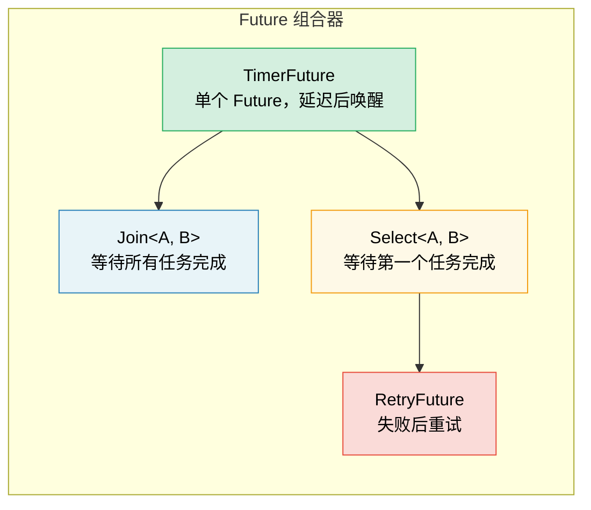

# 6. 手写 Future 🟡

> **你将学到：**
> - 基于线程唤醒实现 `TimerFuture`
> - 构建 `Join` 组合器：并发运行两个 future
> - 构建 `Select` 组合器：让两个 future 竞速
> - 组合器如何层层嵌套 —— 万物皆可 Future

## 一个简单的定时器 Future

现在让我们从零开始构建真实且有用的 future。这将巩固第 2 至第 5 章中的理论知识。

### TimerFuture：一个完整示例

```rust
use std::future::Future;
use std::pin::Pin;
use std::sync::{Arc, Mutex};
use std::task::{Context, Poll, Waker};
use std::thread;
use std::time::{Duration, Instant};

pub struct TimerFuture {
    shared_state: Arc<Mutex<SharedState>>,
}

struct SharedState {
    completed: bool,
    waker: Option<Waker>,
}

impl TimerFuture {
    pub fn new(duration: Duration) -> Self {
        let shared_state = Arc::new(Mutex::new(SharedState {
            completed: false,
            waker: None,
        }));

        // 派生一个线程，在指定时长后设置 completed=true
        let thread_shared_state = Arc::clone(&shared_state);
        thread::spawn(move || {
            thread::sleep(duration);
            let mut state = thread_shared_state.lock().unwrap();
            state.completed = true;
            if let Some(waker) = state.waker.take() {
                waker.wake(); // 通知执行器
            }
        });

        TimerFuture { shared_state }
    }
}

impl Future for TimerFuture {
    type Output = ();

    fn poll(self: Pin<&mut Self>, cx: &mut Context<'_>) -> Poll<()> {
        let mut state = self.shared_state.lock().unwrap();
        if state.completed {
            Poll::Ready(())
        } else {
            // 存储 waker 以便计时器线程可以唤醒我们
            // 重要提示：务必更新 waker —— 执行器可能会在不同次轮询中传入不同的 waker
            state.waker = Some(cx.waker().clone());
            Poll::Pending
        }
    }
}

// 使用方式：
// async fn example() {
//     println!("计时器开始...");
//     TimerFuture::new(Duration::from_secs(2)).await;
//     println!("计时器结束!");
// }
//
// ⚠️ 这个实现会为每个计时器派生一个操作系统线程 —— 仅用于学习。
// 在生产环境中请使用 `tokio::time::sleep`，它后端由高效的时间轮算法驱动，不需要额外线程。
```

### Join：并发运行两个 Future

`Join` 会同时轮询多个 future，并在它们 *全部* 完成之后才算完成。这正是 `tokio::join!` 宏背后的逻辑：

```rust
use std::future::Future;
use std::pin::Pin;
use std::task::{Context, Poll};

/// 并发轮询两个 future，并以元组形式返回两个结果
pub struct Join<A, B>
where
    A: Future,
    B: Future,
{
    a: MaybeDone<A>,
    b: MaybeDone<B>,
}

enum MaybeDone<F: Future> {
    Pending(F),
    Done(F::Output),
    Taken, // 结果已被提取
}

impl<A, B> Join<A, B>
where
    A: Future,
    B: Future,
{
    pub fn new(a: A, b: B) -> Self {
        Join {
            a: MaybeDone::Pending(a),
            b: MaybeDone::Pending(b),
        }
    }
}

impl<A, B> Future for Join<A, B>
where
    A: Future + Unpin,
    B: Future + Unpin,
{
    type Output = (A::Output, B::Output);

    fn poll(mut self: Pin<&mut Self>, cx: &mut Context<'_>) -> Poll<Self::Output> {
        // 如果 A 还没完，轮询 A
        if let MaybeDone::Pending(ref mut fut) = self.a {
            if let Poll::Ready(val) = Pin::new(fut).poll(cx) {
                self.a = MaybeDone::Done(val);
            }
        }

        // 如果 B 还没完，轮询 B
        if let MaybeDone::Pending(ref mut fut) = self.b {
            if let Poll::Ready(val) = Pin::new(fut).poll(cx) {
                self.b = MaybeDone::Done(val);
            }
        }

        // 两个都完了吗？
        match (&self.a, &self.b) {
            (MaybeDone::Done(_), MaybeDone::Done(_)) => {
                // 提取结果
                let a_val = match std::mem::replace(&mut self.a, MaybeDone::Taken) {
                    MaybeDone::Done(v) => v,
                    _ => unreachable!(),
                };
                let b_val = match std::mem::replace(&mut self.b, MaybeDone::Taken) {
                    MaybeDone::Done(v) => v,
                    _ => unreachable!(),
                };
                Poll::Ready((a_val, b_val))
            }
            _ => Poll::Pending, // 至少有一个还在等待中
        }
    }
}

// 使用示例：
// let (page1, page2) = Join::new(
//     http_get("https://example.com/a"),
//     http_get("https://example.com/b"),
// ).await;
// 两个请求并发运行！
```

> **关键洞察**：这里的“并发”是指 *在同一线程上交替执行*。`Join` 本身并不派生线程 —— 它只是在一次 `poll()` 调用中先后去问各个 sub-future。这是典型的协作式多任务。



### Select：让两个 Future 竞速

当 *其中之一* 率先完成时，`Select` 就会完成，并丢弃剩下的那一个：

```rust
use std::future::Future;
use std::pin::Pin;
use std::task::{Context, Poll};

pub enum Either<A, B> {
    Left(A),
    Right(B),
}

/// 返回最先完成的那个 future 的结果，并丢弃另一个
pub struct Select<A, B> {
    a: A,
    b: B,
}

impl<A, B> Select<A, B>
where
    A: Future + Unpin,
    B: Future + Unpin,
{
    pub fn new(a: A, b: B) -> Self {
        Select { a, b }
    }
}

impl<A, B> Future for Select<A, B>
where
    A: Future + Unpin,
    B: Future + Unpin,
{
    type Output = Either<A::Output, B::Output>;

    fn poll(mut self: Pin<&mut Self>, cx: &mut Context<'_>) -> Poll<Self::Output> {
        // 先轮询 A
        if let Poll::Ready(val) = Pin::new(&mut self.a).poll(cx) {
            return Poll::Ready(Either::Left(val));
        }

        // 再轮询 B
        if let Poll::Ready(val) = Pin::new(&mut self.b).poll(cx) {
            return Poll::Ready(Either::Right(val));
        }

        Poll::Pending
    }
}
```

> **公平性注意**：我们的 `Select` 总是优先轮询 A —— 如果两者同时就绪，A 永远胜出。Tokio 的 `select!` 宏内部会随机打乱顺序以保证公平性。

<details>
<summary><strong>🏋️ 练习：实现一个 RetryFuture</strong> (点击展开)</summary>

**挑战**：实现一个 `RetryFuture<F, Fut>`，它接收一个生产函数 `F: Fn() -> Fut`，在内部 future 返回 `Err` 时自动重试，最多重试 N 次。

*提示*：你需要维护“重试次数”以及“当前正在尝试的那个 future”的状态。

<details>
<summary>🔑 参考答案</summary>

```rust
use std::future::Future;
use std::pin::Pin;
use std::task::{Context, Poll};

pub struct RetryFuture<F, Fut, T, E>
where
    F: Fn() -> Fut,
    Fut: Future<Output = Result<T, E>> + Unpin,
{
    factory: F,
    current: Option<Fut>,
    remaining: usize,
    last_error: Option<E>,
}

impl<F, Fut, T, E> RetryFuture<F, Fut, T, E>
where
    F: Fn() -> Fut,
    Fut: Future<Output = Result<T, E>> + Unpin,
{
    pub fn new(max_attempts: usize, factory: F) -> Self {
        let current = Some((factory)());
        RetryFuture {
            factory,
            current,
            remaining: max_attempts.saturating_sub(1),
            last_error: None,
        }
    }
}

impl<F, Fut, T, E> Future for RetryFuture<F, Fut, T, E>
where
    F: Fn() -> Fut + Unpin,
    Fut: Future<Output = Result<T, E>> + Unpin,
    T: Unpin,
    E: Unpin,
{
    type Output = Result<T, E>;

    fn poll(mut self: Pin<&mut Self>, cx: &mut Context<'_>) -> Poll<Self::Output> {
        loop {
            if let Some(ref mut fut) = self.current {
                match Pin::new(fut).poll(cx) {
                    Poll::Ready(Ok(val)) => return Poll::Ready(Ok(val)),
                    Poll::Ready(Err(e)) => {
                        self.last_error = Some(e);
                        if self.remaining > 0 {
                            self.remaining -= 1;
                            self.current = Some((self.factory)());
                            // 继续循环，立即轮询新的 future
                        } else {
                            return Poll::Ready(Err(self.last_error.take().unwrap()));
                        }
                    }
                    Poll::Pending => return Poll::Pending,
                }
            } else {
                return Poll::Ready(Err(self.last_error.take().unwrap()));
            }
        }
    }
}
```

**关键总结**：Retry future 本身就是一个更高阶的状态机：它持有当前的尝试，并在失败时创建新的子 future。这就是组合器的工作模式：一切皆 Future，层层嵌套。

</details>
</details>

> **关键要点：手写 Future**
> - Future 包含三个支柱：状态、`poll()` 实现、waker 注册。
> - `Join` 会“广撒网”式轮询；`Select` 则是在竞速中择优。
> - 组合器也是 Future —— 异步编程就像是套娃，你可以无限嵌套组合。
> - 亲自手写组合器能极大增进理解，但在正式项目中请主要依赖 `tokio::join!`/`select!`。

> **延伸阅读：** [第 2 章：Future Trait](ch02-the-future-trait.md) 了解 Trait 的定义；[第 8 章：Tokio 深入解析](ch08-tokio-deep-dive.md) 了解生产级的组合宏。

***
