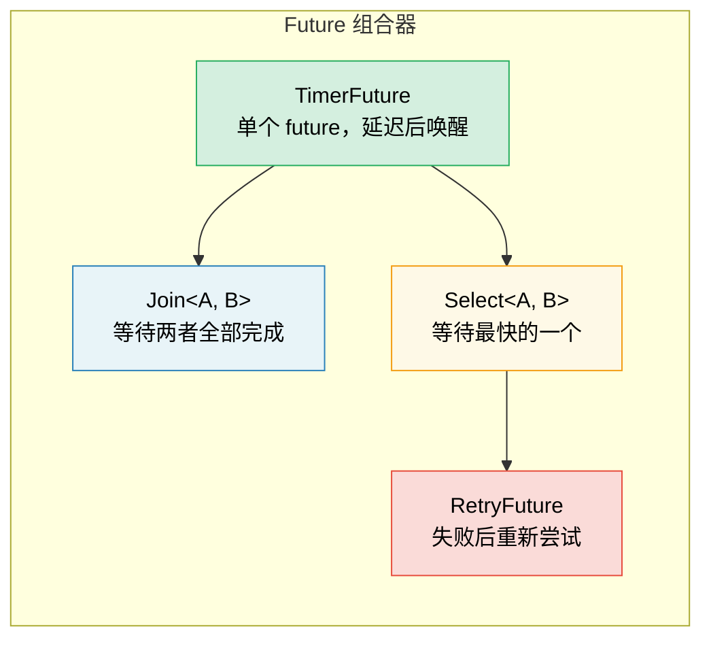

[English Original](../en/ch06-building-futures-by-hand.md)

# 6. 手动构建 Future 🟡

> **你将学到：**
> - 实现一个基于线程唤醒的 `TimerFuture`
> - 构建 `Join` 组合器：并发运行两个 future
> - 构建 `Select` 组合器：竞速运行两个 future
> - 组合器如何进行复合 —— 万物皆可 Future

## 一个简单的计时器 Future

现在让我们从头开始构建一些真实且有用的 future。这将进一步巩固第 2-5 章中的理论知识。

### TimerFuture：一个完整的例子

```rust
use std::future::Future;
use std::pin::Pin;
use std::sync::{Arc, Mutex};
use std::task::{Context, Poll, Waker};
use std::thread;
use std::time::{Duration, Instant};

pub struct TimerFuture {
    shared_state: Arc<Mutex<SharedState>>,
}

struct SharedState {
    completed: bool,
    waker: Option<Waker>,
}

impl TimerFuture {
    pub fn new(duration: Duration) -> Self {
        let shared_state = Arc::new(Mutex::new(SharedState {
            completed: false,
            waker: None,
        }));

        // 派生一个线程，在持续时间结束后设置 completed=true
        let thread_shared_state = Arc::clone(&shared_state);
        thread::spawn(move || {
            thread::sleep(duration);
            let mut state = thread_shared_state.lock().unwrap();
            state.completed = true;
            if let Some(waker) = state.waker.take() {
                waker.wake(); // 通知执行器
            }
        });

        TimerFuture { shared_state }
    }
}

impl Future for TimerFuture {
    type Output = ();

    fn poll(self: Pin<&mut Self>, cx: &mut Context<'_>) -> Poll<()> {
        let mut state = self.shared_state.lock().unwrap();
        if state.completed {
            Poll::Ready(())
        } else {
            // 存储 waker，以便计时器线程可以唤醒我们
            // 重要：始终更新 waker —— 执行器可能会在两次轮询之间更改它
            state.waker = Some(cx.waker().clone());
            Poll::Pending
        }
    }
}

// 使用示例：
// async fn example() {
//     println!("开始计时...");
//     TimerFuture::new(Duration::from_secs(2)).await;
//     println!("计时结束！");
// }
//
// ⚠️ 这种做法会为每个计时器派生一个操作系统线程 —— 仅用于学习，
// 在生产环境中请使用 `tokio::time::sleep`，它基于共享的
// 时间轮（timer wheel）实现，且不需要额外的线程。
```

### Join：并发运行两个 Future

`Join` 组合器会轮询两个 future，并仅在 *两者* 都完成时才宣告完成。这也是 `tokio::join!` 宏内部的工作原理：

```rust
use std::future::Future;
use std::pin::Pin;
use std::task::{Context, Poll};

/// 并发轮询两个 future，以元组形式返回两者的结果
pub struct Join<A, B>
where
    A: Future,
    B: Future,
{
    a: MaybeDone<A>,
    b: MaybeDone<B>,
}

enum MaybeDone<F: Future> {
    Pending(F),
    Done(F::Output),
    Taken, // 结果已被提取
}

// MaybeDone<F> 存储了 F::Output，编译器无法证明其即使在 F: Unpin 时也是 Unpin。
// 由于我们只针对 Unpin 的 future 使用 Join，且从不对字段进行固定投影 (pin-project)，
// 手动实现 Unpin 是安全的，这使我们能在 poll() 中调用 self.get_mut()。
impl<A: Future + Unpin, B: Future + Unpin> Unpin for Join<A, B> {}

impl<A, B> Join<A, B>
where
    A: Future,
    B: Future,
{
    pub fn new(a: A, b: B) -> Self {
        Join {
            a: MaybeDone::Pending(a),
            b: MaybeDone::Pending(b),
        }
    }
}

impl<A, B> Future for Join<A, B>
where
    A: Future + Unpin,
    B: Future + Unpin,
{
    type Output = (A::Output, B::Output);

    fn poll(self: Pin<&mut Self>, cx: &mut Context<'_>) -> Poll<Self::Output> {
        let this = self.get_mut();

        // 如果 A 尚未完成，轮询 A
        if let MaybeDone::Pending(ref mut fut) = this.a {
            if let Poll::Ready(val) = Pin::new(fut).poll(cx) {
                this.a = MaybeDone::Done(val);
            }
        }

        // 如果 B 尚未完成，轮询 B
        if let MaybeDone::Pending(ref mut fut) = this.b {
            if let Poll::Ready(val) = Pin::new(fut).poll(cx) {
                this.b = MaybeDone::Done(val);
            }
        }

        // 两者都完成了吗？
        match (&this.a, &this.b) {
            (MaybeDone::Done(_), MaybeDone::Done(_)) => {
                // 提取两者的结果
                let a_val = match std::mem::replace(&mut this.a, MaybeDone::Taken) {
                    MaybeDone::Done(v) => v,
                    _ => unreachable!(),
                };
                let b_val = match std::mem::replace(&mut this.b, MaybeDone::Taken) {
                    MaybeDone::Done(v) => v,
                    _ => unreachable!(),
                };
                Poll::Ready((a_val, b_val))
            }
            _ => Poll::Pending, // 至少有一个仍在等待中
        }
    }
}

// 使用示例（async 代码块是 !Unpin 的，所以需要用 Box::pin 包装）：
// let (page1, page2) = Join::new(
//     Box::pin(http_get("https://example.com/a")),
//     Box::pin(http_get("https://example.com/b")),
// ).await;
// 两个请求开始并发运行！
```

> **核心见解**：这里的“并发”是指 *在同一个线程上交替执行*。`Join` 并没有派生线程 —— 它只是在同一次 `poll()` 调用中先后轮询两个 future。这是协作式并发，而非并行。



### Select：竞速运行两个 Future

当 *其中任意一个* future 先完成时，`Select` 就会宣告完成（另一个将被丢弃）：

```rust
use std::future::Future;
use std::pin::Pin;
use std::task::{Context, Poll};

pub enum Either<A, B> {
    Left(A),
    Right(B),
}

/// 返回最先完成的那个 future 的结果；丢弃另一个
pub struct Select<A, B> {
    a: A,
    b: B,
}

impl<A, B> Select<A, B>
where
    A: Future + Unpin,
    B: Future + Unpin,
{
    pub fn new(a: A, b: B) -> Self {
        Select { a, b }
    }
}

impl<A, B> Future for Select<A, B>
where
    A: Future + Unpin,
    B: Future + Unpin,
{
    type Output = Either<A::Output, B::Output>;

    fn poll(mut self: Pin<&mut Self>, cx: &mut Context<'_>) -> Poll<Self::Output> {
        // 先轮询 A
        if let Poll::Ready(val) = Pin::new(&mut self.a).poll(cx) {
            return Poll::Ready(Either::Left(val));
        }

        // 再轮询 B
        if let Poll::Ready(val) = Pin::new(&mut self.b).poll(cx) {
            return Poll::Ready(Either::Right(val));
        }

        Poll::Pending
    }
}

// 配合超时机制的使用示例：
// match Select::new(http_get(url), TimerFuture::new(timeout)).await {
//     Either::Left(response) => println!("获得响应: {}", response),
//     Either::Right(()) => println!("请求超时！"),
// }
```

> **关于公平性的说明**：我们的 `Select` 总是先轮询 A —— 如果两者同时就绪，A 总是会胜出。Tokio 的 `select!` 宏会随机化轮询顺序，以确保公平性。

<details>
<summary><strong>🏋️ 实践任务：构建一个 RetryFuture</strong> (点击展开)</summary>

**挑战**：构建一个 `RetryFuture<F, Fut>`，它接收一个闭包 `F: Fn() -> Fut`。如果内部生成的 future 返回 `Err`，则重试最多 N 次。它应该返回第一个 `Ok` 结果或最后一次的 `Err` 结果。

*提示*：你需要为“当前正在运行的尝试”和“所有尝试已耗尽”建立状态。

<details>
<summary>🔑 参考方案</summary>

```rust
use std::future::Future;
use std::pin::Pin;
use std::task::{Context, Poll};

pub struct RetryFuture<F, Fut, T, E>
where
    F: Fn() -> Fut,
    Fut: Future<Output = Result<T, E>> + Unpin,
{
    factory: F,
    current: Option<Fut>,
    remaining: usize,
    last_error: Option<E>,
}

impl<F, Fut, T, E> RetryFuture<F, Fut, T, E>
where
    F: Fn() -> Fut,
    Fut: Future<Output = Result<T, E>> + Unpin,
{
    pub fn new(max_attempts: usize, factory: F) -> Self {
        let current = Some((factory)());
        RetryFuture {
            factory,
            current,
            remaining: max_attempts.saturating_sub(1),
            last_error: None,
        }
    }
}

impl<F, Fut, T, E> Future for RetryFuture<F, Fut, T, E>
where
    F: Fn() -> Fut + Unpin,
    Fut: Future<Output = Result<T, E>> + Unpin,
    T: Unpin,
    E: Unpin,
{
    type Output = Result<T, E>;

    fn poll(mut self: Pin<&mut Self>, cx: &mut Context<'_>) -> Poll<Self::Output> {
        loop {
            if let Some(ref mut fut) = self.current {
                match Pin::new(fut).poll(cx) {
                    Poll::Ready(Ok(val)) => return Poll::Ready(Ok(val)),
                    Poll::Ready(Err(e)) => {
                        self.last_error = Some(e);
                        if self.remaining > 0 {
                            self.remaining -= 1;
                            self.current = Some((self.factory)());
                            // 立即进入大循环以轮询新创建的 future
                        } else {
                            return Poll::Ready(Err(self.last_error.take().unwrap()));
                        }
                    }
                    Poll::Pending => return Poll::Pending,
                }
            } else {
                return Poll::Ready(Err(self.last_error.take().unwrap()));
            }
        }
    }
}

// 使用示例：
// let result = RetryFuture::new(3, || async {
//     http_get("https://flaky-server.com/api").await
// }).await;
```

**核心总结**：Retry future 本身也是一个状态机：它持有当前的尝试，并在失败时创建新的内部 future。这就是组合器的复合方式 —— “嵌套到底”。

</details>
</details>

> **关键要诀 —— 手动构建 Future**
> - 一个 Future 需要三样东西：状态、`poll()` 实现以及 waker 注册
> - `Join` 轮询两个子 future；`Select` 返回先完成的那个的结果
> - 组合器本身也是包装了其他 future 的 future —— 万物皆可 Future
> - 手动构建 Future 虽能提供深刻洞见，但在生产环境中请使用 `tokio::join!`/`select!`

> **另请参阅：** [第 2 章 —— Future Trait](ch02-the-future-trait.md) 了解 trait 定义，[第 8 章 —— Tokio 深度探索](ch08-tokio-deep-dive.md) 了解生产级的替代方案

***
