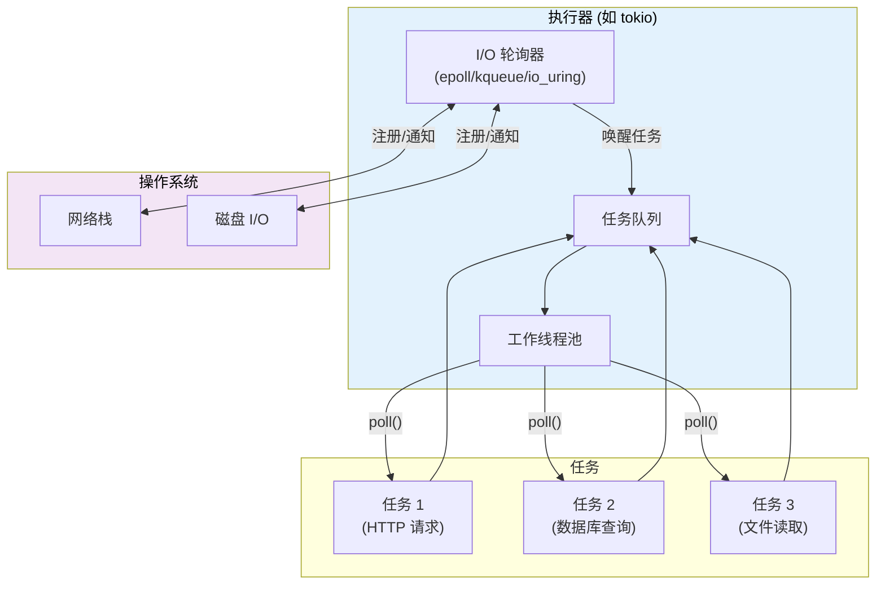
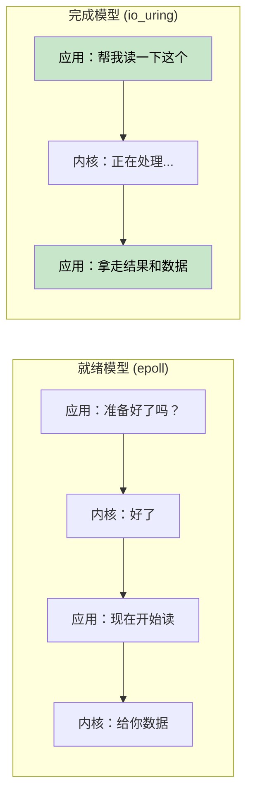
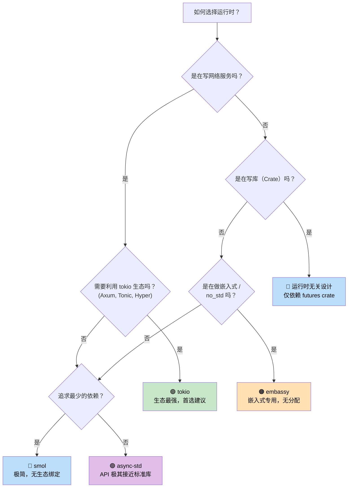

# 7. 执行器与运行时 🟡

> **你将学到：**
> - 执行器的核心职责：轮询 + 高效休眠
> - 六大主流运行时：mio、io_uring、tokio、async-std、smol、embassy
> - 选型决策树
> - 为什么运行时无关（runtime-agnostic）的设计至关重要

## 执行器是做什么的

一个执行器有两项核心任务：

1. 当 future 准备好继续推进时，对其进行 **Poll（轮询）**。
2. 当暂时没有 future 就绪时，利用操作系统的 I/O 通知 API 进行 **高效休眠**。



### mio：底层基石

[mio](https://github.com/tokio-rs/mio) (Metal I/O) 并不是一个执行器 —— 它是 Rust 生态中最底层的跨平台 I/O 通知库。它封装了 `epoll` (Linux)、`kqueue` (macOS/BSD) 和 IOCP (Windows)。

```rust
// mio 的概念性用法：
use mio::{Events, Interest, Poll, Token};
use mio::net::TcpListener;

let mut poll = Poll::new()?;
let mut events = Events::with_capacity(128);

let mut server = TcpListener::bind("0.0.0.0:8080")?;
poll.registry().register(&mut server, Token(0), Interest::READABLE)?;

// 事件循环 —— 阻塞直到有事件发生
loop {
    poll.poll(&mut events, None)?; // 高效休眠，直到 I/O 就绪
    for event in events.iter() {
        match event.token() {
            Token(0) => { /* 监听到新连接 */ }
            _ => { /* 其他 I/O 已就绪 */ }
        }
    }
}
```

大多数开发者不会直接调用 mio —— tokio 和 smol 都在底层帮你处理好了。

### io_uring：基于完成通知的未来

Linux 的 `io_uring`（内核 5.1+）代表了从“就绪通知（readiness-based）”到“完成通知（completion-based）”的范式转变：

```text
就绪模型 (epoll / mio / tokio):
  1. 询问：“这个 socket 可读吗？”         → epoll_wait()
  2. 内核：“是的，就绪了”                → 发出 EPOLLIN 事件
  3. 应用： 调用 read(fd, buf)           → 此时数据才拷贝到用户态

完成模型 (io_uring):
  1. 提交：“请把这个 socket 的数据读到这个缓冲区” → 提交 SQE
  2. 内核： 在后台默默完成异步读取
  3. 应用： 收到“读取已完成”的通知并直接使用数据    → 获取 CQE
```



**所有权挑战**：io_uring 要求内核在异步操作期间拥有缓冲区的所有权。这与 Rust 标准的 `AsyncRead`（它通过借用 `&mut [u8]` 工作）不匹配。因此 `tokio-uring` 引入了新的模式：

```rust
// 标准 tokio (就绪型) —— 借用缓冲区：
let n = stream.read(&mut buf).await?;

// tokio-uring (完成型) —— 转移所有权：
let (result, buf) = stream.read(buf).await; // buf 被 move 进去，操作完再 move 返回
```

| 维度 | epoll (tokio) | io_uring (tokio-uring) |
|--------|--------------|----------------------|
| **模型** | 就绪通知 (Readiness) | 完成通知 (Completion) |
| **系统调用** | epoll_wait + read/write | 批处理 SQE/CQE 环 |
| **缓冲区所有权** | 应用持有 (借用) | 发生所有权转移 (Move) |
| **平台支持** | 跨平台 | 仅限 Linux 5.1+ |
| **零拷贝** | 较难 (存在用户态拷贝) | 原生支持 (注册缓冲区) |
| **成熟度** | 生产级首选 | 开发中/实验性 |

> **何时选择 io_uring**：当你开发高性能文件服务、数据库、或需要处理数十万并发的代理服务器，且系统调用开销已成为瓶颈时。对于绝大多数普通应用，标准的 tokio (epoll) 已经足够强大。

### tokio：功能最全的运行时

Rust 生态中的绝对主流。Axum, Hyper, Tonic 以及大部分知名开源库都基于它构建。

```rust
#[tokio::main]
async fn main() {
    // 启动一个带工作窃取调度器的多线程运行时
    let handle = tokio::spawn(async {
        tokio::time::sleep(std::time::Duration::from_secs(1)).await;
        "任务完成"
    });

    let result = handle.await.unwrap();
    println!("{result}");
}
```

### async-std：拟物化的标准库

旨在提供标准库 `std` 的异步镜像。API 风格非常接近标准库，对新手友好。

### smol：极简主义

轻量、零依赖。非常适合那些不想把用户强行绑定到 tokio 庞大生态中的库开发者。

### embassy：为嵌入式而生 (no_std)

专为微控制器设计。没有堆分配，不需要 `std` 支持。

## 运行时决策树



<details>
<summary><strong>🏋️ 练习：跨运行时对比</strong> (点击展开)</summary>

**挑战**：尝试用三种不同的运行时编写同一段逻辑（等待两个异步操作完成）。

<details>
<summary>🔑 参考答案</summary>

```rust
// tokio 版本
#[tokio::main]
async fn main() {
    let (r1, r2) = tokio::join!(task1(), task2());
}

// smol 版本
fn main() {
    smol::block_on(async {
        let (r1, r2) = futures_lite::future::zip(task1(), task2()).await;
    });
}

// async-std 版本
#[async_std::main]
async fn main() {
    let (r1, r2) = futures::future::join(task1(), task2()).await;
}
```

**关键总结**：业务代码往往是跨运行时的，唯一的不同是程序的“入口”和具体的计时器/IO 实现。

</details>
</details>

> **关键要点：执行器与运行时**
> - 执行器的核心是：在被唤醒时去轮询，在空闲时去睡觉。
> - **tokio** 是业界标准；**smol** 追求精简；**embassy** 专注底层硬件。
> - 尽量让你的库（Library）逻辑依赖于 `std::future::Future`，而不是特定的运行时。
> - io_uring 是未来的性能高峰，但目前还在成长中。

> **延伸阅读：** [第 8 章：Tokio 深入解析](ch08-tokio-deep-dive.md)；[第 9 章：Tokio 不适用的场景](ch09-when-tokio-isnt-the-right-fit.md)。

***
