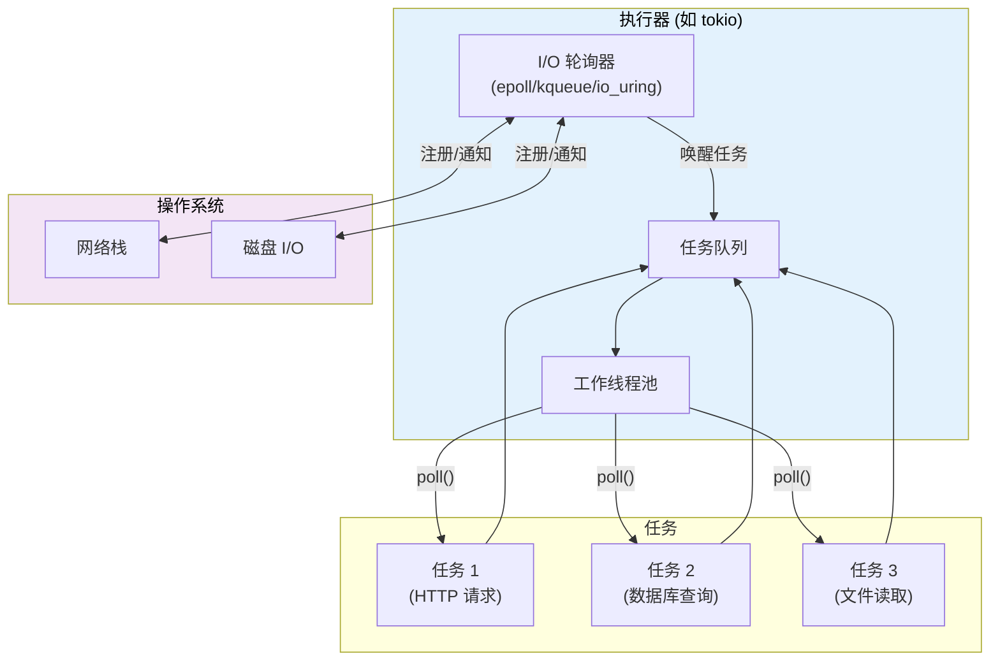
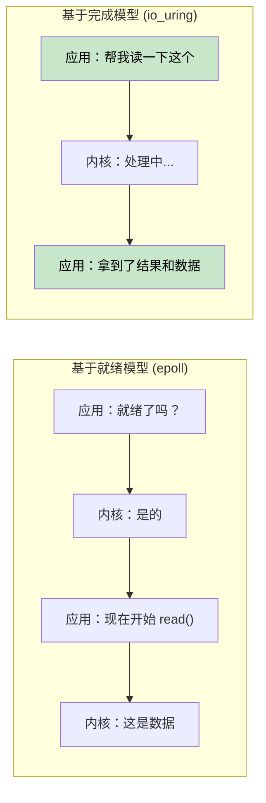
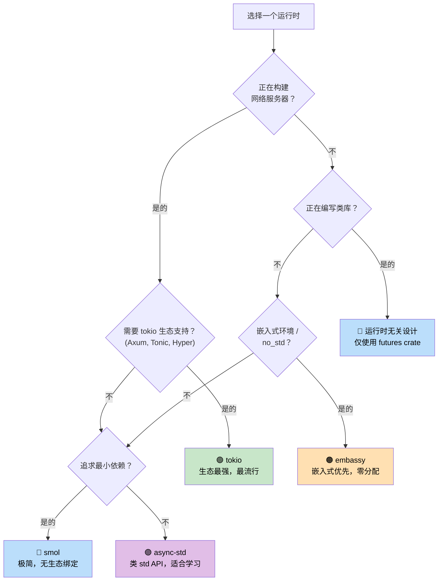

[English Original](../en/ch07-executors-and-runtimes.md)

# 7. 执行器与运行时 🟡

> **你将学到：**
> - 执行器的职责：轮询 + 高效睡眠
> - 六大主流运行时：mio, io_uring, tokio, async-std, smol, embassy
> - 选择合适运行时的决策树
> - 为什么运行时无关（runtime-agnostic）的库设计至关重要

## 执行器的职责

执行器有两个主要任务：
1. **轮询 Future**：当它们准备好取得进展时进行轮询。
2. **高效睡眠**：当没有 Future 就绪时，利用操作系统的 I/O 通知 API 进入休眠状态。



### mio：基础层

[mio](https://github.com/tokio-rs/mio) (Metal I/O) 并不是一个执行器 —— 它是最底层的跨平台 I/O 通知库。它封装了 `epoll` (Linux)、`kqueue` (macOS/BSD) 和 IOCP (Windows)。

```rust
// mio 使用示意（简化版）：
use mio::{Events, Interest, Poll, Token};
use mio::net::TcpListener;

let mut poll = Poll::new()?;
let mut events = Events::with_capacity(128);

let mut server = TcpListener::bind("0.0.0.0:8080")?;
poll.registry().register(&mut server, Token(0), Interest::READABLE)?;

// 事件循环 —— 阻塞直到有事发生
loop {
    poll.poll(&mut events, None)?; // 进入睡眠直到发生 I/O 事件
    for event in events.iter() {
        match event.token() {
            Token(0) => { /* 服务器有一个新连接 */ }
            _ => { /* 其他 I/O 已就绪 */ }
        }
    }
}
```

大多数开发者从不直接接触 mio —— tokio 和 smol 都是在其之上构建的。

### io_uring：基于“完成”通知的 Future

Linux 的 `io_uring` (内核 5.1+) 代表了从 mio/epoll 使用的基于“就绪”通知的 I/O 模型的一次根本性转变：

```text
基于“就绪”模型 (epoll / mio / tokio):
  1. 询问：“这个 socket 可读吗？”       → epoll_wait()
  2. 内核：“是的，它就绪了”             → EPOLLIN 事件
  3. 应用： read(fd, buf)               → 仍可能由于各种原因发生短暂阻塞！

基于“完成”模型 (io_uring):
  1. 提交：“从这个 socket 读取数据到此缓冲区” → SQE (提交队列条目)
  2. 内核：后台异步执行读取操作
  3. 应用：获取包含数据及其结果的完成通知    → CQE (完成队列条目)
```



**所有权挑战**：io_uring 要求内核在操作完成前拥有缓冲区的所有权。这与 Rust 标准的 `AsyncRead` trait 存在冲突，因为后者只是借用缓冲区。这就是为什么 `tokio-uring` 拥有不同的 I/O trait：

```rust
// 标准 tokio (基于就绪) —— 借用缓冲区：
let n = stream.read(&mut buf).await?;  // buf 被借用

// tokio-uring (基于完成) —— 获取缓冲区所有权：
let (result, buf) = stream.read(buf).await;  // buf 被 move 进去，随后返回
let n = result?;
```

```rust
// Cargo.toml: tokio-uring = "0.5"
// 注意：仅限 Linux 且要求内核 5.1+

fn main() {
    tokio_uring::start(async {
        let file = tokio_uring::fs::File::open("data.bin").await.unwrap();
        let buf = vec![0u8; 4096];
        let (result, buf) = file.read_at(buf, 0).await;
        let bytes_read = result.unwrap();
        println!("读取了 {} 字节: {:?}", bytes_read, &buf[..bytes_read]);
    });
}
```

| 维度 | epoll (tokio) | io_uring (tokio-uring) |
|--------|--------------|----------------------|
| **模型** | 就绪通知 (Readiness) | 完成通知 (Completion) |
| **系统调用** | epoll_wait + read/write | 批处理 SQE/CQE 环 |
| **缓冲区所有权** | 应用保留所有权 (&mut buf) | 所有权转移 (move buf) |
| **支持平台** | Linux, macOS, Windows | 仅限较新版本的 Linux |
| **零拷贝** | 否（存在用户态拷贝） | 是（通过注册缓冲区实现） |
| **成熟度** | 生产级就绪 | 实验阶段 |

> **何时使用 io_uring**：在系统调用开销成为瓶颈的高吞吐量文件 I/O 或网络场景（如数据库、存储引擎、承载 100k+ 连接的代理）。对于大多数应用，使用 epoll 的标准 tokio 依然是最佳选择。

### tokio：功能完备的运行时

Rust 生态中占统治地位的异步运行时。Axum, Hyper, Tonic 以及大部分生产环境中的 Rust 服务器都在使用它。

```rust
// Cargo.toml:
// [dependencies]
// tokio = { version = "1", features = ["full"] }

#[tokio::main]
async fn main() {
    // 派生一个带有任务窃取调度器的多线程运行时
    let handle = tokio::spawn(async {
        tokio::time::sleep(std::time::Duration::from_secs(1)).await;
        "完成"
    });

    let result = handle.await.unwrap();
    println!("{result}");
}
```

**tokio 特性**：计时器、I/O (TCP/UDP/Unix 域套接字)、信号处理、同步原语 (Mutex, RwLock, Semaphore, 通道)、文件系统、进程管理、以及 tracing 监控集成。

### async-std：标准库镜像

通过异步版本镜像了 `std` 的 API。虽然不如 tokio 流行，但对初学者来说更简单直观。

```rust
// Cargo.toml:
// [dependencies]
// async-std = { version = "1", features = ["attributes"] }

#[async_std::main]
async fn main() {
    use async_std::fs;
    let content = fs::read_to_string("hello.txt").await.unwrap();
    println!("{content}");
}
```

### smol：极简主义运行时

小型、零依赖的异步运行时。非常适合希望支持异步但又不想引入庞大 tokio 依赖的类库。

```rust
// Cargo.toml:
// [dependencies]
// smol = "2"

fn main() {
    smol::block_on(async {
        let result = smol::unblock(|| {
            // 在线程池中运行阻塞代码
            std::fs::read_to_string("hello.txt")
        }).await.unwrap();
        println!("{result}");
    });
}
```

### embassy：嵌入式异步 (no_std)

专为嵌入式系统设计的异步运行时。无需堆分配，无需 `std` 库支持。

```rust
// 在单片机上运行 (例如 STM32, nRF52, RP2040)
#[embassy_executor::main]
async fn main(spawner: embassy_executor::Spawner) {
    // 使用 async/await 闪烁 LED —— 无需传统的 RTOS！
    let mut led = Output::new(p.PA5, Level::Low, Speed::Low);
    loop {
        led.set_high();
        Timer::after(Duration::from_millis(500)).await;
        led.set_low();
        Timer::after(Duration::from_millis(500)).await;
    }
}
```

### 运行时决策树



### 运行时对比表

| 特性 | tokio | async-std | smol | embassy |
|---------|-------|-----------|------|---------|
| **生态系统** | 统治级别 | 较小 | 极小 | 嵌入式 |
| **多线程支持** | ✅ 任务窃取调度 | ✅ | ✅ | ❌ (通常单核) |
| **no_std 支持** | ❌ | ❌ | ❌ | ✅ |
| **计时器** | ✅ 内置 | ✅ 内置 | 通过 `async-io` | ✅ 基于 HAL |
| **I/O** | ✅ 自有抽象 | ✅ std 镜像 | 通过 `async-io` | ✅ HAL 驱动 |
| **通道 (Channels)** | ✅ 类型丰富 | ✅ | 通过 `async-channel` | ✅ |
| **学习曲线** | 中等 | 低 | 低 | 较高 (涉及硬体) |
| **二进制体积** | 较大 | 中等 | 小 | 极小 |

<details>
<summary><strong>🏋️ 实践任务：运行时对比实操</strong> (点击展开)</summary>

**挑战**：使用三种不同的运行时（tokio, smol, 以及 async-std）编写同一个程序。程序要求：
1. 获取一个 URL（通过 sleep 模拟）
2. 读取一个文件（通过 sleep 模拟）
3. 打印两个结果

该练习旨在证明：异步业务逻辑代码是完全相同的 —— 只有运行时的启动设置有所不同。

<details>
<summary>🔑 参考方案</summary>

```rust
// ----- tokio 版本 -----
// Cargo.toml: tokio = { version = "1", features = ["full"] }
#[tokio::main]
async fn main() {
    let (url_result, file_result) = tokio::join!(
        async {
            tokio::time::sleep(std::time::Duration::from_millis(100)).await;
            "来自 URL 的响应"
        },
        async {
            tokio::time::sleep(std::time::Duration::from_millis(50)).await;
            "文件内容"
        },
    );
    println!("URL: {url_result}, 文件: {file_result}");
}

// ----- smol 版本 -----
// Cargo.toml: smol = "2", futures-lite = "2"
fn main() {
    smol::block_on(async {
        let (url_result, file_result) = futures_lite::future::zip(
            async {
                smol::Timer::after(std::time::Duration::from_millis(100)).await;
                "来自 URL 的响应"
            },
            async {
                smol::Timer::after(std::time::Duration::from_millis(50)).await;
                "文件内容"
            },
        ).await;
        println!("URL: {url_result}, 文件: {file_result}");
    });
}

// ----- async-std 版本 -----
// Cargo.toml: async-std = { version = "1", features = ["attributes"] }
#[async_std::main]
async fn main() {
    let (url_result, file_result) = futures::future::join(
        async {
            async_std::task::sleep(std::time::Duration::from_millis(100)).await;
            "来自 URL 的响应"
        },
        async {
            async_std::task::sleep(std::time::Duration::from_millis(50)).await;
            "文件内容"
        },
    ).await;
    println!("URL: {url_result}, 文件: {file_result}");
}
```

**核心总结**：跨运行时的异步业务逻辑几乎完全一致。只有入口点和计时器/IO API 存在差异。这就是为什么编写运行时无关（runtime-agnostic）的库（仅依赖 `std::future::Future`）具有重要价值。

</details>
</details>

> **关键要诀 —— 执行器与运行时**
> - 执行器的核心工作：在任务唤醒时进行轮询，并利用 OS I/O API 实现高效睡眠。
> - **tokio** 是服务器端的默认选择；**smol** 适用于极致轻盈的需求；**embassy** 则是嵌入式的首选。
> - 业务逻辑应当依赖 `std::future::Future`，而非特定的运行时环境。
> - io_uring 是 Linux 高性能 I/O 的未来，但目前生态系统仍在不断完善中。

> **另请参阅：** [第 8 章 —— Tokio 深度探索](ch08-tokio-deep-dive.md) 了解 tokio 细节，[第 9 章 —— 当 Tokio 不适用时](ch09-when-tokio-isnt-the-right-fit.md) 了解替代方案。

***
