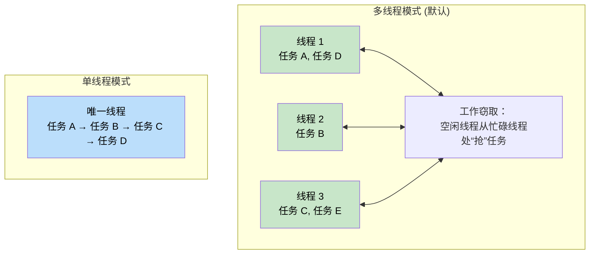

[English Original](../en/ch08-tokio-deep-dive.md)

# 8. Tokio 深入解析 🟡

> **你将学到：**
> - 运行时变体：多线程与单线程，以及各自的适用场景
> - `tokio::spawn`、`'static` 约束以及 `JoinHandle`
> - 任务取消语义（drop 与 abort 的区别）
> - 同步原语：Mutex、RwLock、Semaphore 以及四种通道类型

## 运行时变体：多线程与单线程

Tokio 提供了两种主要的运行时配置：

```rust
// 多线程（#[tokio::main] 默认配置）
// 使用工作窃取（work-stealing）线程池 —— 任务可以在不同工作线程间移动
#[tokio::main]
async fn main() {
    // 默认 N 个工作线程（通常等于 CPU 核心数）
    // 此处的任务必须满足 Send + 'static 约束
}

// 单线程 —— 所有内容都在主线程上运行
#[tokio::main(flavor = "current_thread")]
async fn main() {
    // 单线程环境下，任务不需要满足 Send
    // 更轻量，适用于简单 CLI 工具或 WASM
}

// 手动构建运行时示例：
let rt = tokio::runtime::Builder::new_multi_thread()
    .worker_threads(4)
    .enable_all()
    .build()
    .unwrap();

rt.block_on(async {
    println!("在自定义运行时中运行");
});
```



### tokio::spawn 与 'static 约束

`tokio::spawn` 将一个 future 放入运行时的任务队列。由于它可能在 *任何* 时间、由 *任何一个* 执行线程来处理，因此该 future 必须满足 `Send + 'static`：

```rust
use tokio::task;

async fn example() {
    let data = String::from("hello");

    // ✅ 正确：使用 move 将所有权转入任务
    let handle = task::spawn(async move {
        println!("{data}");
        data.len()
    });

    let len = handle.await.unwrap();
    println!("长度: {len}");
}

async fn problem() {
    let data = String::from("hello");

    // ❌ 失败：data 是借用的，不满足 'static
    // task::spawn(async {
    //     println!("{data}"); // 借用了 `data` —— 非 'static
    // });

    // ❌ 失败：Rc 不是 Send，无法跨线程
    // let rc = std::rc::Rc::new(42);
    // task::spawn(async move {
    //     println!("{rc}"); // Rc 无法在线程间移动
    // });
}
```

**为什么需要 `'static`？** 因为被 spawn 的任务是独立运行的 —— 它可能会比创建它的函数作用域活得更久。编译器无法静态证明引用的有效性，因此强制要求拥有所有权的数据。

**为什么需要 `Send`？** 任务可能会在线程 A 挂起，然后在线程 B 恢复执行。因此，所有跨越 `.await` 点持有的数据都必须能在线程间安全传递。

### JoinHandle 与任务取消

```rust
use tokio::task::JoinHandle;
use tokio::time::{sleep, Duration};

async fn cancellation_example() {
    let handle: JoinHandle<String> = tokio::spawn(async {
        sleep(Duration::from_secs(10)).await;
        "已完成".to_string()
    });

    // 仅仅 drop 这个 handle 就能取消任务吗？不，任务会继续在后台运行！
    // drop(handle); // 任务变成了“分离”状态

    // 若要真正取消，必须显式调用 abort()：
    handle.abort();

    // 等待一个被中止的任务会返回一个 JoinError
    match handle.await {
        Ok(val) => println!("得到结果: {val}"),
        Err(e) if e.is_cancelled() => println!("任务已取消"),
        Err(e) => println!("任务 Panic 了: {e}"),
    }
}
```

> **重要**：在 Tokio 中，丢失 `JoinHandle` 引用 **并不** 意味着任务取消。任务会继续执行。这与直接丢弃（drop）一个 `Future` 不同（后者会立即停止计算）。

### Tokio 同步原语

Tokio 提供了专门针对异步环境优化的同步原语。最核心的一条法则是：**不要跨越 `.await` 点持有 `std::sync::Mutex` 的锁**。

```rust
use tokio::sync::{Mutex, RwLock, Semaphore, mpsc, oneshot, broadcast, watch};

// --- Mutex / 互斥锁 ---
let data = Arc::new(Mutex::new(vec![1, 2, 3]));
{
    let mut guard = data.lock().await; // 异步加锁，不会阻塞操作系统线程
    guard.push(4);
} // guard 在此释放，锁也随之释放

// --- Channels / 通道 ---
// mpsc: 多生产者，单消费者。通常建议使用有界（bounded）通道。
let (tx, mut rx) = mpsc::channel::<String>(100);

// oneshot: 单个值，单个消费者（适合请求-响应模式）。
let (tx, rx) = oneshot::channel::<i32>();

// broadcast: 多消费者，每个人都会收到每一条广播消息。
let (tx, _) = broadcast::channel::<String>(100);

// watch: 适合分发状态。消费者只看得到最新值，旧值可能被覆盖。
let (tx, rx) = watch::channel(0u64);
```

### 通道选择指南

| 需求场景 | 推荐通道 | 理由 |
|-------------|---------|-----|
| 各个 Handler 发送日志给收集器 | `mpsc` (有界) | 多对一模式。有界缓冲提供背压控制。 |
| 配置分发给各个工作单元 | `watch` | 只有最新配置有意义，工作单元只需看当前状态。 |
| 系统全体关机信号 | `broadcast` | 每个人都要独立收到同一个通知。 |
| 单次健康检查的结果回传 | `oneshot` | 一锤子买卖，发完即止。 |

<details>
<summary><strong>🏋️ 练习：构建并发限制器</strong> (点击展开)</summary>

**挑战**：实现一个 `run_with_limit` 函数，它可以并发运行一组任务，但同时运行的数量不能超过 N。

<details>
<summary>🔑 参考答案</summary>

```rust
use std::future::Future;
use std::sync::Arc;
use tokio::sync::Semaphore;

async fn run_with_limit<F, Fut, T>(tasks: Vec<F>, limit: usize) -> Vec<T>
where
    F: FnOnce() -> Fut + Send + 'static,
    Fut: Future<Output = T> + Send + 'static,
    T: Send + 'static,
{
    let semaphore = Arc::new(Semaphore::new(limit));
    let mut handles = Vec::new();

    for task in tasks {
        let permit = Arc::clone(&semaphore);
        let handle = tokio::spawn(async move {
            let _permit = permit.acquire().await.unwrap(); // 获取许可证
            task().await // 执行任务，任务结束后 permit 自动释放
        });
        handles.push(handle);
    }

    let mut results = Vec::new();
    for h in handles {
        results.push(h.await.unwrap());
    }
    results
}
```

**关键总结**：`Semaphore`（信号量）是控制并发规模的标准工具。新任务在信号量满时会以非阻塞方式挂起。

</details>
</details>

> **关键要点：Tokio 深入解析**
> - 服务器后端首选 `multi_thread`，简单工具可选 `current_thread`。
> - `tokio::spawn` 的任务必须是独立的（'static），建议通过 `Arc` 共享状态。
> - 想要停止被 spawn 的任务？请通过 `JoinHandle` 调用 `.abort()`。
> - 不要用 std 互斥锁包围 await 点，请改用 `tokio::sync::Mutex`。

> **延伸阅读：** [第 9 章：Tokio 不适用的场景](ch09-when-tokio-isnt-the-right-fit.md)；[第 12 章：常见陷阱](ch12-common-pitfalls.md) 了解锁死等典型 Bug。

***
