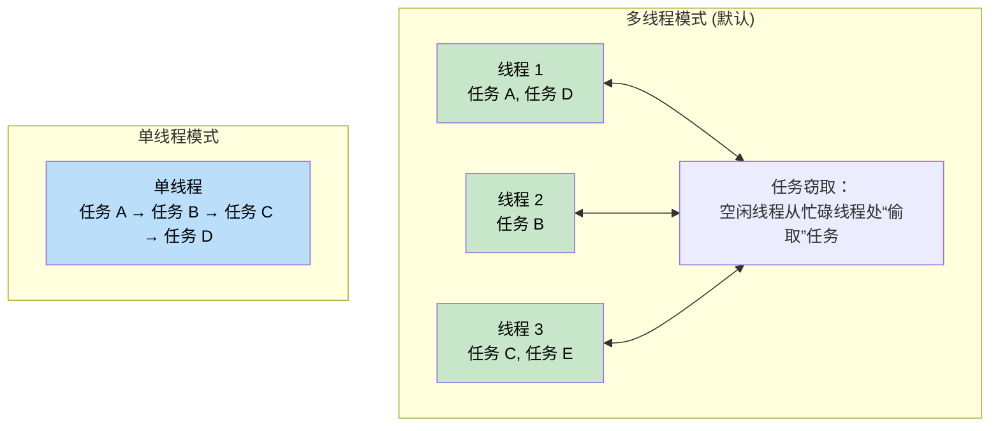
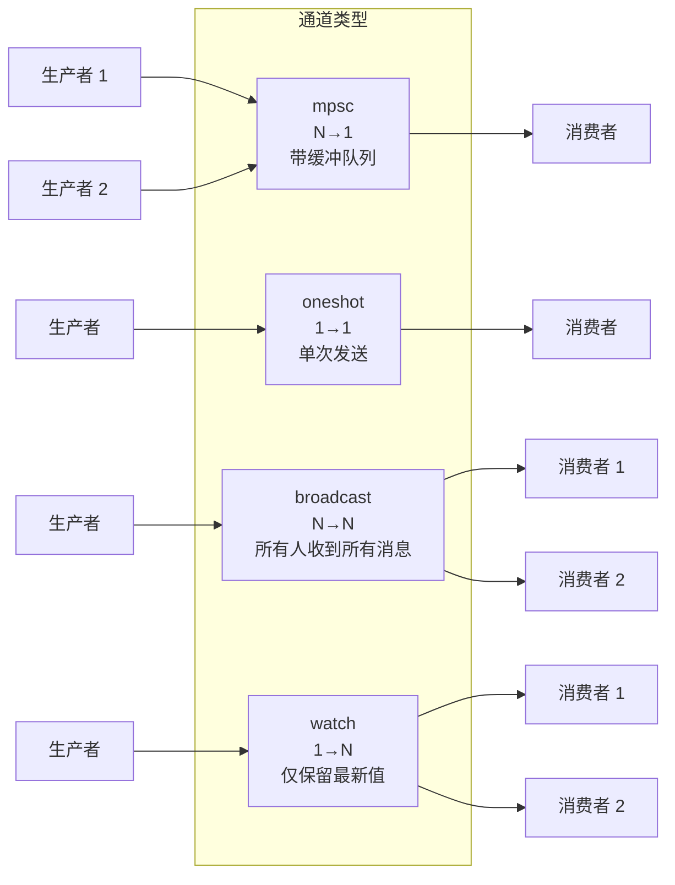
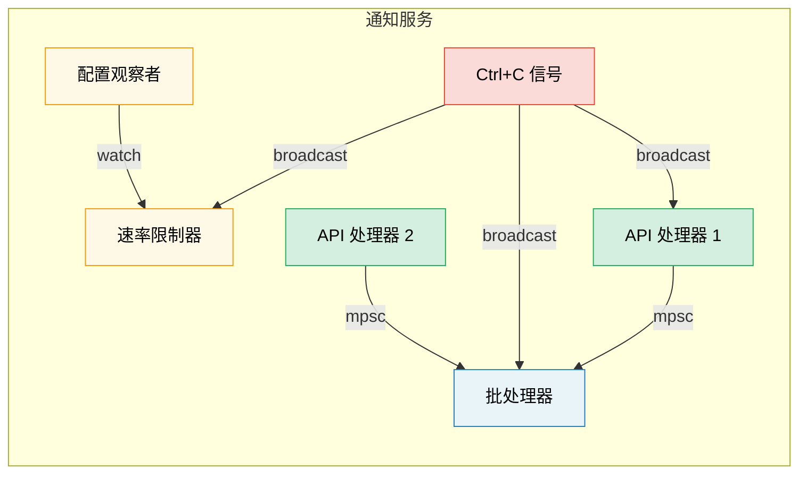

[English Original](../en/ch08-tokio-deep-dive.md)

# 8. Tokio 深度探索 🟡

> **你将学到：**
> - 运行时类型（Runtime Flavors）：多线程 vs 单线程模式及其适用场景
> - `tokio::spawn`、`'static` 约束以及 `JoinHandle`
> - 任务取消语义（丢弃即取消吗？）
> - 同步原语：Mutex、RwLock、Semaphore 以及四种通道（channel）类型

## 运行时类型：多线程 vs 单线程

Tokio 提供了两种运行时配置：

```rust
// 多线程模式（#[tokio::main] 的默认值）
// 使用任务窃取（work-stealing）线程池 —— 任务可以在线程间移动
#[tokio::main]
async fn main() {
    // N 个工作线程（默认等于 CPU 核心数）
    // 任务必须满足 Send + 'static
}

// 单线程模式（Current-thread） —— 所有内容都在一个线程上运行
#[tokio::main(flavor = "current_thread")]
async fn main() {
    // 单线程运行 —— 任务不需要满足 Send 约束
    // 更轻量，适合简单的工具或 WASM
}

// 手动构建运行时：
let rt = tokio::runtime::Builder::new_multi_thread()
    .worker_threads(4)
    .enable_all()
    .build()
    .unwrap();

rt.block_on(async {
    println!("在自定义运行时中运行");
});
```



### tokio::spawn 与 'static 约束

`tokio::spawn` 将一个 future 放入运行时的任务队列。由于它可能在 *任何* 时间运行在 *任何* 工作线程上，因此该 future 必须满足 `Send + 'static`：

```rust
use tokio::task;

async fn example() {
    let data = String::from("hello");

    // ✅ 可行：将所有权 move 进任务中
    let handle = task::spawn(async move {
        println!("{data}");
        data.len()
    });

    let len = handle.await.unwrap();
    println!("长度: {len}");
}

async fn problem() {
    let data = String::from("hello");

    // ❌ 失败：data 是被借用的，不是 'static
    // task::spawn(async {
    //     println!("{data}"); // 借用了 `data` —— 非 'static
    // });

    // ❌ 失败：Rc 不是 Send 的
    // let rc = std::rc::Rc::new(42);
    // task::spawn(async move {
    //     println!("{rc}"); // Rc 是 !Send 的 —— 不能跨线程边界
    // });
}
```

**为什么需要 `'static`？** 被派生（spawn）的任务是独立运行的 —— 它可能会比创建它的作用域活得更久。编译器无法证明引用会一直有效，因此要求拥有所有权的数据。

**为什么需要 `Send`？** 任务可能会在被挂起的线程之外的另一个线程上恢复执行。所有跨越 `.await` 点持有的数据都必须能安全地在线程间传递。

```rust
// 常见模式：克隆共享数据到任务中
let shared = Arc::new(config);

for i in 0..10 {
    let shared = Arc::clone(&shared); // 克隆的是 Arc，不是内部数据
    tokio::spawn(async move {
        process_item(i, &shared).await;
    });
}
```

### JoinHandle 与任务取消

```rust
use tokio::task::JoinHandle;
use tokio::time::{sleep, Duration};

async fn cancellation_example() {
    let handle: JoinHandle<String> = tokio::spawn(async {
        sleep(Duration::from_secs(10)).await;
        "已完成".to_string()
    });

    // 丢弃 handle 就能取消任务吗？不能 —— 任务会继续运行！
    // drop(handle); // 任务在后台继续

    // 要真正取消，请调用 abort()：
    handle.abort();

    // 等待一个被中止的任务会返回 JoinError
    match handle.await {
        Ok(val) => println!("获得: {val}"),
        Err(e) if e.is_cancelled() => println!("任务已取消"),
        Err(e) => println!("任务发生 panic: {e}"),
    }
}
```

> **重要提示**：在 tokio 中，丢弃 `JoinHandle` 并不会取消任务。任务会变为“分离”状态并在后台继续运行。你必须显式调用 `.abort()` 来取消它。这与直接丢弃一个 `Future` 不同（后者确实会取消/丢弃底层的计算）。

### Tokio 同步原语

Tokio 提供了异步感知的同步原语。核心原则：**不要在跨越 `.await` 点时使用 `std::sync::Mutex`**。

```rust
use tokio::sync::{Mutex, RwLock, Semaphore, mpsc, oneshot, broadcast, watch};

// --- Mutex ---
// 异步 Mutex：lock() 方法是异步的，不会阻塞当前线程
let data = Arc::new(Mutex::new(vec![1, 2, 3]));
{
    let mut guard = data.lock().await; // 非阻塞锁
    guard.push(4);
} // guard 被丢弃 —— 锁被释放

// --- 通道 (Channels) ---
// mpsc：多生产者，单消费者
let (tx, mut rx) = mpsc::channel::<String>(100); // 带缓冲队列

tokio::spawn(async move {
    tx.send("hello".into()).await.unwrap();
});

let msg = rx.recv().await.unwrap();

// oneshot：单次发送，单消费者
let (tx, rx) = oneshot::channel::<i32>();
tx.send(42).unwrap(); // 无需 await —— 要么发送成功，要么报错
let val = rx.await.unwrap();

// broadcast：多生产者，多消费者（所有人都会收到每一条消息）
let (tx, _) = broadcast::channel::<String>(100);
let mut rx1 = tx.subscribe();
let mut rx2 = tx.subscribe();

// watch：单生产者，多消费者（仅保留最新值）
let (tx, rx) = watch::channel(0u64);
tx.send(42).unwrap();
println!("最新值: {}", *rx.borrow());
```

> **注意**：为了简洁，这些通道示例中使用了 `.unwrap()`。在生产环境中，请优雅地处理发送/接收错误 —— `.send()` 失败通常意味着接收方已被丢弃，`.recv()` 失败则意味着通道已关闭。



## 案例分析：为通知服务选择正确的通道

你正在构建一个通知服务，其中：
- 多个 API 处理器产生事件
- 单个后台任务进行批处理并发送
- 一个配置观察者在运行时更新速率限制
- 一个停机信号必须传达至所有组件

**各场景应使用哪种通道？**

| 需求 | 通道 | 原因 |
|-------------|---------|-----|
| API 处理器 → 批处理器 | `mpsc` (带缓冲) | N 个生产者，1 个消费者。带缓冲可提供背压（backpressure）—— 如果批处理器处理太慢，API 处理器会随之减速而不会内存溢出 |
| 配置观察者 → 速率限制器 | `watch` | 只有最新的配置才有意义。多个读取者（每个工作单元）只需要看到当前值 |
| 停机信号 → 所有组件 | `broadcast` | 每个组件都必须独立接收到停机通知 |
| 单次健康检查响应 | `oneshot` | 请求/响应模式 —— 一个值，发完即结束 |



<details>
<summary><strong>🏋️ 实践任务：构建一个任务池</strong> (点击展开)</summary>

**挑战**：编写一个函数 `run_with_limit`，它接收一组异步闭包和一个并发限制值，确保同时执行的任务不超过 N 个。使用 `tokio::sync::Semaphore`。

<details>
<summary>🔑 参考方案</summary>

```rust
use std::future::Future;
use std::sync::Arc;
use tokio::sync::Semaphore;

async fn run_with_limit<F, Fut, T>(tasks: Vec<F>, limit: usize) -> Vec<T>
where
    F: FnOnce() -> Fut + Send + 'static,
    Fut: Future<Output = T> + Send + 'static,
    T: Send + 'static,
{
    let semaphore = Arc::new(Semaphore::new(limit));
    let mut handles = Vec::new();

    for task in tasks {
        let permit = Arc::clone(&semaphore);
        let handle = tokio::spawn(async move {
            let _permit = permit.acquire().await.unwrap();
            // 任务运行时持有许可证，完成后自动释放
            task().await
        });
        handles.push(handle);
    }

    let mut results = Vec::new();
    for handle in handles {
        results.push(handle.await.unwrap());
    }
    results
}

// 使用示例：
// let tasks: Vec<_> = urls.into_iter().map(|url| {
//     move || async move { fetch(url).await }
// }).collect();
// let results = run_with_limit(tasks, 10).await; // 最多 10 个并发
```

**核心总结**：`Semaphore` 是 tokio 中限制并发的标准方式。每个任务在开始工作前获取一个许可证。当信号量满员时，新任务会异步等待（非阻塞）直到有空位放出。

</details>
</details>

> **关键要诀 —— Tokio 深度探索**
> - 服务器端使用 `multi_thread`（默认）；CLI 工具、测试或处理 `!Send` 类型时使用 `current_thread`。
> - `tokio::spawn` 要求 `'static` future —— 使用 `Arc` 或通道来共享数据。
> - 丢弃 `JoinHandle` **不会**取消任务 —— 请显式调用 `.abort()`。
> - 根据需求选择同步原语：共享状态用 `Mutex`，限制并发用 `Semaphore`，组件间通信则在 `mpsc`/`oneshot`/`broadcast`/`watch` 中按需挑选。

> **另请参阅：** [第 9 章 —— 当 Tokio 不适用时](ch09-when-tokio-isnt-the-right-fit.md) 寻找 spawn 的替代方案，[第 12 章 —— 常见陷阱](ch12-common-pitfalls.md) 了解跨 await 持有 MutexGuard 的潜在漏洞。

***
