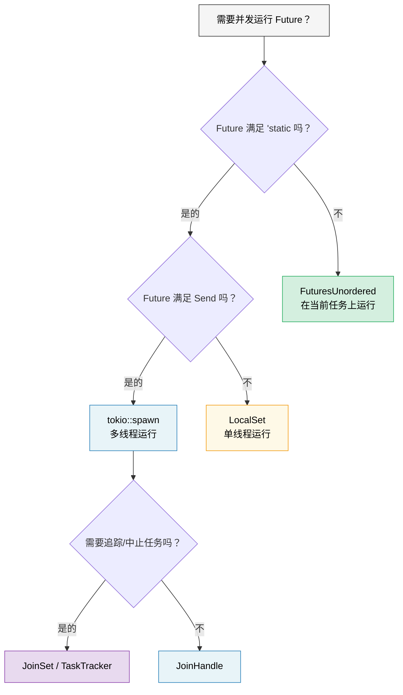

[English Original](../en/ch09-when-tokio-isnt-the-right-fit.md)

# 9. 当 Tokio 不适用时 🟡

> **你将学到：**
> - `'static` 难题：为什么 `tokio::spawn` 总是逼你到处使用 `Arc`
> - 适用于 `!Send` 类型 future 的 `LocalSet`
> - 借用友好型并发：无需使用 spawn 的 `FuturesUnordered`
> - 用于管理任务组的 `JoinSet`
> - 编写运行时无关（runtime-agnostic）的库



## `'static` Future 难题

Tokio 的 `spawn` 要求传入的 future 必须满足 `'static` 约束。这意味着你无法在被派生（spawn）的任务中借用局部数据：

```rust
async fn process_items(items: &[String]) {
    // ❌ 无法执行 —— items 是借用的，不是 'static
    // for item in items {
    //     tokio::spawn(async {
    //         process(item).await;
    //     });
    // }

    // 😐 方案 1：克隆所有内容
    for item in items {
        let item = item.clone();
        tokio::spawn(async move {
            process(&item).await;
        });
    }

    // 😐 方案 2：使用 Arc
    let items = Arc::new(items.to_vec());
    for i in 0..items.len() {
        let items = Arc::clone(&items);
        tokio::spawn(async move {
            process(&items[i]).await;
        });
    }
}
```

这确实很烦人！在 Go 语言中，你可以直接使用闭包 `go func() { use(item) }`。而在 Rust 中，所有权系统强制你必须思考谁拥有什么、以及它能活多久。

### `tokio::spawn` 的替代方案

并非所有问题都需要 `spawn`。这里有三个工具，它们分别解决了 *不同* 的约束：

```rust
// 1. FuturesUnordered —— 完全避开了 'static 约束（无需 spawn！）
use futures::stream::{FuturesUnordered, StreamExt};

async fn process_items(items: &[String]) {
    let futures: FuturesUnordered<_> = items
        .iter()
        .map(|item| async move {
            // ✅ 可以借用 item —— 无需 spawn，无需满足 'static！
            process(item).await
        })
        .collect();

    // 驱动所有 future 直至完成
    futures.for_each(|result| async move {
        println!("结果: {result:?}");
    }).await;
}

// 2. tokio::task::LocalSet —— 在当前线程运行 !Send 的 future
//    ⚠️ 仍需满足 'static —— 它解决了 Send 难题而非 'static 难题
use tokio::task::LocalSet;

let local_set = LocalSet::new();
local_set.run_until(async {
    tokio::task::spawn_local(async {
        // 这里可以使用 Rc, Cell 以及其他 !Send 类型
        let rc = std::rc::Rc::new(42);
        println!("{rc}");
    }).await.unwrap();
}).await;

// 3. tokio JoinSet (tokio 1.21+) —— 被派生任务的管理集合
//    ⚠️ 仍需满足 'static + Send —— 它解决了任务“管理”难题，
//    而非 'static 难题。在追踪、中止和汇聚动态任务组时非常有用。
use tokio::task::JoinSet;

async fn with_joinset() {
    let mut set = JoinSet::new();

    for i in 0..10 {
        // i 是 Copy 的且已被 move 进闭包 —— 本身就是 'static 的。
        // 对于借用的数据，你仍需使用 Arc 或克隆。
        set.spawn(async move {
            tokio::time::sleep(Duration::from_millis(100)).await;
            i * 2
        });
    }

    while let Some(result) = set.join_next().await {
        println!("任务完成: {:?}", result.unwrap());
    }
}
```

> **哪个工具解决哪个难题？**
>
> | 遇到的约束 | 工具 | 能避开 `'static` 吗？ | 能避开 `Send` 吗？ |
> |---|---|---|---|
> | 无法让 future 满足 `'static` | `FuturesUnordered` | ✅ 是 | ✅ 是 |
> | 满足 `'static` 但不满足 `Send` | `LocalSet` | ❌ 否 | ✅ 是 |
> | 需要追踪/中止已派生的任务 | `JoinSet` | ❌ 否 | ❌ 否 |

### 为类库提供轻量级运行时支持

如果你正在编写类库 —— 请不要强迫用户使用 tokio：

```rust
// ❌ 错误做法：库强迫用户使用 tokio
pub async fn my_lib_function() {
    tokio::time::sleep(Duration::from_secs(1)).await;
    // 现在你的用户“必须”使用 tokio 才能运行
}

// ✅ 正确做法：库是运行时无关的
pub async fn my_lib_function() {
    // 仅使用来自 std::future 和 futures crate 的类型
    do_computation().await;
}

// ✅ 正确做法：为 I/O 操作接收泛型类型的 future
pub async fn fetch_with_retry<F, Fut, T, E>(
    operation: F,
    max_retries: usize,
) -> Result<T, E>
where
    F: Fn() -> Fut,
    Fut: Future<Output = Result<T, E>>,
{
    for attempt in 0..max_retries {
        match operation().await {
            Ok(val) => return Ok(val),
            Err(e) if attempt == max_retries - 1 => return Err(e),
            Err(_) => continue,
        }
    }
    unreachable!()
}
```

> **经验法则**：类库应当依赖 `futures` crate，而非直接依赖 `tokio`。二进制应用程序则应当依赖 `tokio`（或自选的运行时）。这样能保持生态系统的可组合性。

<details>
<summary><strong>🏋️ 实践任务：FuturesUnordered vs Spawn</strong> (click to expand)</summary>

**挑战**：用两种方式编写同一个函数 —— 一次使用 `tokio::spawn`（要求 `'static`），另一次使用 `FuturesUnordered`（支持借用）。该函数接收 `&[String]`，在模拟异步查找后返回每个字符串的长度。

对比：哪种方法需要 `.clone()`？哪种可以直接借用输入的切片？

<details>
<summary>🔑 参考方案</summary>

```rust
use futures::stream::{FuturesUnordered, StreamExt};
use tokio::time::{sleep, Duration};

// 版本 1：tokio::spawn —— 要求 'static，必须克隆
async fn lengths_with_spawn(items: &[String]) -> Vec<usize> {
    let mut handles = Vec::new();
    for item in items {
        let owned = item.clone(); // 必须克隆 —— spawn 要求满足 'static
        handles.push(tokio::spawn(async move {
            sleep(Duration::from_millis(10)).await;
            owned.len()
        }));
    }

    let mut results = Vec::new();
    for handle in handles {
        results.push(handle.await.unwrap());
    }
    results
}

// 版本 2：FuturesUnordered —— 支持借用，无需克隆
async fn lengths_without_spawn(items: &[String]) -> Vec<usize> {
    let futures: FuturesUnordered<_> = items
        .iter()
        .map(|item| async move {
            sleep(Duration::from_millis(10)).await;
            item.len() // ✅ 直接借用 item —— 无需克隆！
        })
        .collect();

    futures.collect().await
}

#[tokio::test]
async fn test_both_versions() {
    let items = vec!["hello".into(), "world".into(), "rust".into()];

    let v1 = lengths_with_spawn(&items).await;
    // 注意：v1 保留了插入顺序（顺序 Join）

    let mut v2 = lengths_without_spawn(&items).await;
    v2.sort(); // FuturesUnordered 按完成顺序返回结果

    assert_eq!(v1, vec![5, 5, 4]);
    assert_eq!(v2, vec![4, 5, 5]);
}
```

**核心总结**：`FuturesUnordered` 通过在当前任务（而非线程迁移后的任务）上运行所有 future 来避开 `'static` 约束。权衡在于：所有 future 共享同一个任务 —— 如果其中一个发生阻塞，其余的都会停滞。对于应该运行在独立线程上的 CPU 密集型工作，仍请使用 `spawn`。

</details>
</details>

> **关键要诀 —— 当 Tokio 不适用时**
> - `FuturesUnordered` 在当前任务上并发运行多个 future —— 无需 `'static` 约束。
> - `LocalSet` 允许在单线程执行器上运行 `!Send` 类型的 future。
> - `JoinSet` (tokio 1.21+) 提供了带有自动清理功能的任务管理组。
> - 类库开发者：请仅依赖 `std::future::Future` + `futures` 包，不要直接绑定 tokio。

> **另请参阅：** [第 8 章 —— Tokio 深度探索](ch08-tokio-deep-dive.md) 了解何时 spawn 是正确之选，[第 11 章 —— 流 (Streams)](ch11-streams-and-asynciterator.md) 了解 `buffer_unordered()` 这一并发限制器。

***
