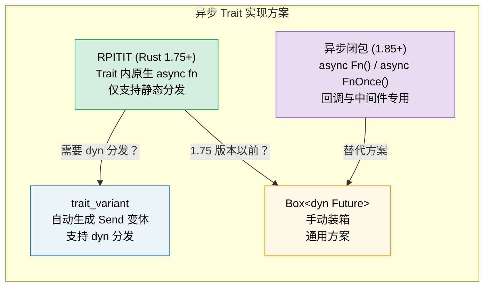

# 10. 异步 Trait 🟡

> **你将学到：**
> - 为什么 trait 中的异步方法花了数年才稳定
> - RPITIT：原生异步 trait 方法 (Rust 1.75+)
> - dyn 分发挑战与 `trait_variant` 变通方案
> - 异步闭包 (Rust 1.85+)：`async Fn()` 和 `async FnOnce()`



## 历史回顾：为什么它这么难？

异步 Trait 曾是 Rust 生态中呼声最高也最难实现的特性。

```rust
// 在 Rust 1.75 之前，这行不通：
trait DataStore {
    async fn get(&self, key: &str) -> Option<String>;
}
// 原因是 async fn 隐式返回 impl Future，
// 而 Rust 以前不支持在 Trait 级别处理这种未定大小的返回类型。
```

根本挑战在于：每个实现者（impl）返回的 Future 具体类型都不同，但在动态分发（dyn）时，编译器需要一致的大小描述。

### RPITIT：Trait 里的原生异步方法

自 Rust 1.75 起，你可以在静态分发的场景下直接使用异步方法：

```rust
trait DataStore {
    async fn get(&self, key: &str) -> Option<String>;
}

struct InMemoryStore {
    data: std::collections::HashMap<String, String>,
}

impl DataStore for InMemoryStore {
    async fn get(&self, key: &str) -> Option<String> {
        self.data.get(key).cloned()
    }
}

// ✅ 静态分发配合泛型使用，完美运行：
async fn lookup<S: DataStore>(store: &S, key: &str) {
    if let Some(val) = store.get(key).await {
        println!("{key} = {val}");
    }
}
```

### dyn 分发与 Send 约束

原生方案的限制在于：你不能直接把 `dyn DataStore` 当作类型使用（除非该方法不涉及异步）。

**Send 难题**：在多线程运行时（如 Tokio）中，异步任务必须是 `Send`。但 Trait 里的 `async fn` 默认并不会给返回的 Future 加上 `Send` 约束，这会导致你无法 `spawn` 这些任务。

### trait_variant：解决 dyn 与 Send 的利器

官方异步小组提供的 `trait_variant` 可以自动帮你生成带 `Send` 约束的变体：

```rust
// Cargo.toml: trait-variant = "0.1"

#[trait_variant::make(SendDataStore: Send)]
trait DataStore {
    async fn get(&self, key: &str) -> Option<String>;
}

// 现在你有了：
// 1. DataStore (原始版)
// 2. SendDataStore (Future 强制满足 Send 的版本，可用于 spawn)
```

### 异步 Trait 方案选型

| 方案 | 静态分发 | 动态分发 | Send 约束 | 运行时开销 |
|----------|:---:|:---:|:---:|---|
| 原生 `async fn` | ✅ | ❌ | 隐式 | 零成本 |
| `trait_variant` | ✅ | ✅ | 显式指定 | 零成本 |
| `async-trait` 库 | ✅ | ✅ | 自动检测 | 存在装箱损耗 (Box) |

> **建议**：新项目（Rust 1.75+）优先用原生写法。只有当你确实需要 `dyn` 对象或者是追求简便时，才考虑 `trait_variant` 或 `async-trait`。

### 异步闭包 (Rust 1.85+)

从 Rust 1.85 开始，原生异步闭包终于稳定了。它们能捕获环境并直接返回一个待执行的 Future：

```rust
// 1.85 之后：异步闭包正式成为一等公民
let fetcher = async move || {
    reqwest::get("https://rust-lang.org").await
};
```

异步闭包对应了新的 `AsyncFn` / `AsyncFnMut` / `AsyncFnOnce` 系列 Trait。

<details>
<summary><strong>🏋️ 练习：设计一个缓存 Trait</strong> (点击展开)</summary>

**挑战**：设计一个通用的 `Cache` trait，包含异步的 `get` 和 `set`，并尝试分别为内存版和模拟的网络版（带延迟）编写实现。

<details>
<summary>🔑 参考答案</summary>

```rust
use tokio::time::{sleep, Duration};

trait Cache {
    async fn get(&self, key: &str) -> Option<String>;
    async fn set(&self, key: &str, value: String);
}

// 模拟带延迟的网络版缓存
struct RedisCache {
    latency: Duration,
}

impl Cache for RedisCache {
    async fn get(&self, key: &str) -> Option<String> {
        sleep(self.latency).await; // 模拟网络耗时
        Some("cached_value".to_string())
    }

    async fn set(&self, key: &str, value: String) {
        sleep(self.latency).await;
    }
}
```

</details>
</details>

> **关键要点：异步 Trait**
> - Rust 1.75+ 支持在 Trait 中直接定义 `async fn`。
> - 在处理 `dyn` 分发时，编译器要求额外的变通方案（如 `trait_variant`）。
> - 异步闭包在 1.85 稳定，非常适合用作中间件或灵活的回调。
> - 静态分发（泛型）在性能上最优，因为它避免了 Future 的动态装箱分配。

> **延伸阅读：** [第 13 章：生产模式](ch13-production-patterns.md) 了解 Tower 的 Service 设计；[第 6 章：手写 Future](ch06-building-futures-by-hand.md) 深入理解底层原理。

***
