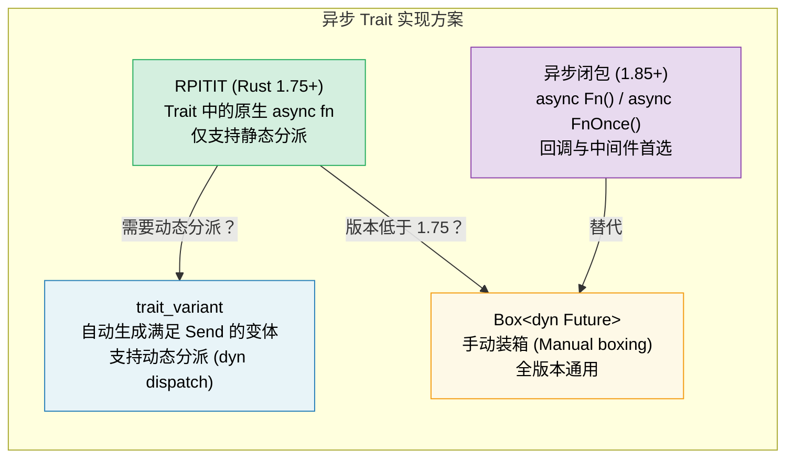

[English Original](../en/ch10-async-traits.md)

# 10. 异步 Trait 🟡

> **你将学到：**
> - 为什么 Trait 中的异步方法花了数年才稳定下来
> - RPITIT：原生异步 Trait 方法（Rust 1.75+）
> - 动态分派 (dyn dispatch) 的挑战及 `trait_variant` 解决方案
> - 异步闭包 (Rust 1.85+)：`async Fn()` 与 `async FnOnce()`



## 背景：为什么它花了这么久？

Trait 中的异步方法多年来一直是 Rust 用户最期待的特性。其难点在于：

```rust
// 在 Rust 1.75 (2023年12月) 之前，这段代码无法编译：
trait DataStore {
    async fn get(&self, key: &str) -> Option<String>;
}
// 原因：async fn 返回的是 `impl Future<Output = T>`，
// 而当时 Trait 的返回位置并不支持 `impl Trait`。
```

根本挑战在于：当 Trait 方法返回 `impl Future` 时，每个实现者返回的其实都是 *不同的具体类型*。编译器需要知道返回类型的大小，但 Trait 方法往往涉及动态分派。

### RPITIT: Return Position Impl Trait in Trait

自 Rust 1.75 起，原生异步 Trait 已支持静态分派：

```rust
trait DataStore {
    async fn get(&self, key: &str) -> Option<String>;
    // 脱糖后等价于：
    // fn get(&self, key: &str) -> impl Future<Output = Option<String>>;
}

struct InMemoryStore {
    data: std::collections::HashMap<String, String>,
}

impl DataStore for InMemoryStore {
    async fn get(&self, key: &str) -> Option<String> {
        self.data.get(key).cloned()
    }
}

// ✅ 配合泛型使用（静态分派）：
async fn lookup<S: DataStore>(store: &S, key: &str) {
    if let Some(val) = store.get(key).await {
        println!("{key} = {val}");
    }
}
```

### 动态分派 (dyn dispatch) 与 Send 约束

局限性：你不能直接使用 `dyn DataStore`，因为编译器不知道返回的 future 的具体体积：

```rust
// ❌ 无法运行：
// async fn lookup_dyn(store: &dyn DataStore, key: &str) { ... }
// 错误信息：trait `DataStore` 不满足“dyn 兼容性”，因为其方法 `get` 是异步的

// ✅ 解决方案：返回一个装箱后的 future
trait DynDataStore {
    fn get(&self, key: &str) -> Pin<Box<dyn Future<Output = Option<String>> + Send + '_>>;
}

// 或者使用 trait_variant 宏（见下文）
```

**Send 难题**：在多线程运行时中，派生的任务必须满足 `Send`。但异步 Trait 方法并不会自动添加 `Send` 约束：

```rust
trait Worker {
    async fn run(self); // 该 future 可能是也可能不是 Send 的
}

struct MyWorker;

impl Worker for MyWorker {
    async fn run(self) {
        // 如果使用了 !Send 类型，整个 future 就是 !Send 的
        let rc = std::rc::Rc::new(42);
        some_work().await;
        println!("{rc}");
    }
}

// ❌ 报错，因为 future 内部包含 Rc，不满足 Send 约束：
// tokio::spawn(worker.run()); // 要求 Send + 'static

// 注意：这里我们使用 `self` (所有权) 是因为 tokio::spawn 
// 还要求 'static 约束。
```

### trait_variant Crate

`trait_variant` crate（由 Rust 异步工作小组发布）可以自动生成一个满足 `Send` 的变体：

```rust
// Cargo.toml: trait-variant = "0.1"

#[trait_variant::make(SendDataStore: Send)]
trait DataStore {
    async fn get(&self, key: &str) -> Option<String>;
    async fn set(&self, key: &str, value: String);
}

// 现在你拥有了两个 Trait：
// - DataStore：其 future 没有 Send 约束
// - SendDataStore：所有 future 都必须满足 Send 约束
// 两者拥有相同的方法，实现者通常只需实现 DataStore。
// 如果其 future 满足 Send，则会自动获得对 SendDataStore 的实现。

// 当你需要 spawn 任务时，使用 SendDataStore：
async fn spawn_lookup(store: Arc<dyn SendDataStore>) {
    tokio::spawn(async move {
        store.get("key").await;
    });
}
```

### 快速参考：异步 Trait

| 方案 | 静态分派 | 动态分派 | Send 约束 | 语法负担 |
|----------|:---:|:---:|:---:|---|
| 原生 `async fn` | ✅ | ❌ | 隐式 | 无 |
| `trait_variant` | ✅ | ✅ | 显式 | `#[trait_variant::make]` |
| 手动 `Box::pin` | ✅ | ✅ | 显式 | 高 |
| `async-trait` 包 | ✅ | ✅ | `#[async_trait]` | 中等（过程宏） |

> **建议**：对于新代码（Rust 1.75+），优先使用原生异步 Trait。如果需要 `dyn` 分派，配合 `trait_variant` 使用。虽然 `async-trait` 包仍被广泛使用，但它会对每个 future 进行装箱，而原生方案对于静态分派是零成本的。

### 异步闭包 (Async Closures, Rust 1.85+)

自 Rust 1.85 起，`异步闭包` 已稳定 —— 它们可以捕获环境变量并返回一个 future：

```rust
// 1.85 之前：繁琐的变通方案
let urls = vec!["https://a.com", "https://b.com"];
let fetchers: Vec<_> = urls.iter().map(|url| {
    let url = url.to_string();
    // 返回一个非异步闭包，内部返回一个异步块
    move || async move { reqwest::get(&url).await }
}).collect();

// 1.85 之后：异步闭包直接可用
let fetchers: Vec<_> = urls.iter().map(|url| {
    async move || { reqwest::get(url).await }
    // ↑ 这是一个异步闭包 —— 捕获 url，返回一个 Future
}).collect();
```

异步闭包实现了新的 `AsyncFn`、`AsyncFnMut` 和 `AsyncFnOnce` trait，它们镜像了对应的 `Fn` 系列 trait：

```rust
// 接收异步闭包的泛型函数
async fn retry<F>(max: usize, f: F) -> Result<String, Error>
where
    F: AsyncFn() -> Result<String, Error>,
{
    for _ in 0..max {
        if let Ok(val) = f().await {
            return Ok(val);
        }
    }
    f().await
}
```

> **迁移提示**：如果你仍在使用 `Fn() -> impl Future<Output = T>`，可以考虑换成 `AsyncFn() -> T` 以获得更简洁的签名。

<details>
<summary><strong>🏋️ 实践任务：设计一个异步缓存服务 Trait</strong> (点击展开)</summary>

**挑战**：设计一个带有异步 `get` 和 `set` 方法的 `Cache` trait。分别提供两个实现：一个基于 `HashMap`（内存存储），另一个模拟 Redis 后端（使用 `tokio::time::sleep` 模拟网络延迟）。编写一个能同时兼容两者的泛型函数。

<details>
<summary>🔑 参考方案</summary>

```rust
use std::collections::HashMap;
use std::sync::Arc;
use tokio::sync::Mutex;
use tokio::time::{sleep, Duration};

trait Cache {
    async fn get(&self, key: &str) -> Option<String>;
    async fn set(&self, key: &str, value: String);
}

// --- 内存缓存轴实现 ---
struct MemoryCache {
    store: Mutex<HashMap<String, String>>,
}

impl MemoryCache {
    fn new() -> Self {
        MemoryCache {
            store: Mutex::new(HashMap::new()),
        }
    }
}

impl Cache for MemoryCache {
    async fn get(&self, key: &str) -> Option<String> {
        self.store.lock().await.get(key).cloned()
    }

    async fn set(&self, key: &str, value: String) {
        self.store.lock().await.insert(key.to_string(), value);
    }
}

// --- 模拟 Redis 实现 ---
struct RedisCache {
    store: Mutex<HashMap<String, String>>,
    latency: Duration,
}

impl RedisCache {
    fn new(latency_ms: u64) -> Self {
        RedisCache {
            store: Mutex::new(HashMap::new()),
            latency: Duration::from_millis(latency_ms),
        }
    }
}

impl Cache for RedisCache {
    async fn get(&self, key: &str) -> Option<String> {
        sleep(self.latency).await; // 模拟网络往返
        self.store.lock().await.get(key).cloned()
    }

    async fn set(&self, key: &str, value: String) {
        sleep(self.latency).await;
        self.store.lock().await.insert(key.to_string(), value);
    }
}

// --- 兼容任意 Cache 的泛型函数 ---
async fn cache_demo<C: Cache>(cache: &C, label: &str) {
    cache.set("greeting", "Hello, async!".into()).await;
    let val = cache.get("greeting").await;
    println!("[{label}] greeting = {val:?}");
}

#[tokio::main]
async fn main() {
    let mem = MemoryCache::new();
    cache_demo(&mem, "memory").await;

    let redis = RedisCache::new(50);
    cache_demo(&redis, "redis").await;
}
```

**核心总结**：同一个泛型函数通过静态分派完美支持两种不同的异步实现。没有装箱，没有额外的分配开销。

</details>
</details>

> **关键要诀 —— 异步 Trait**
> - 自 Rust 1.75 起，可以直接在 Trait 中编写 `async fn`。
> - `trait_variant::make` 宏在支持动态分派的同时能自动生成 `Send` 变体。
> - 异步闭包 (`async Fn()`) 在 1.85 稳定 —— 它是回调和中间件的首选语法。
> - 在性能敏感的代码中，优先使用静态分派 (`<S: Service>`) 而非 `dyn` 动态分派。

> **另请参阅：** [第 13 章 —— 生产模式](ch13-production-patterns.md) 了解 Tower 的 `Service` trait，[第 6 章 —— 手动构建 Future](ch06-building-futures-by-hand.md) 了解手动实现方案。

***
