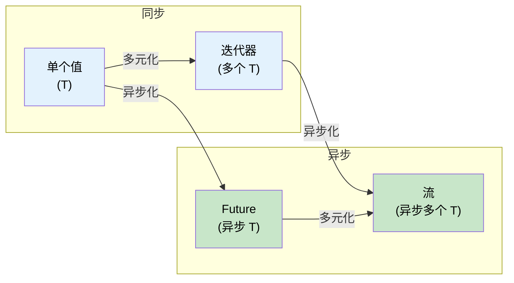

[English Original](../en/ch11-streams-and-asynciterator.md)

# 11. 流与异步迭代器 🟡

> **你将学到：**
> - `Stream` trait：对多个值进行异步迭代
> - 创建流：`stream::iter`、`async_stream`、`unfold`
> - 流组合器：`map`、`filter`、`buffer_unordered`、`fold`
> - 异步 I/O trait：`AsyncRead`、`AsyncWrite`、`AsyncBufRead`

## 流 Trait 概览

`Stream` 之于 `Iterator`，正如 `Future` 之于单个值 —— 它能异步地产生多个值：

```rust
// std::iter::Iterator (同步，产生多个值)
trait Iterator {
    type Item;
    fn next(&mut self) -> Option<Self::Item>;
}

// futures::Stream (异步，产生多个值)
trait Stream {
    type Item;
    fn poll_next(self: Pin<&mut Self>, cx: &mut Context<'_>) -> Poll<Option<Self::Item>>;
}
```



### 创建流

```rust
use futures::stream::{self, StreamExt};
use tokio::time::{interval, Duration};
use tokio_stream::wrappers::IntervalStream;

// 1. 从迭代器转换
let s = stream::iter(vec![1, 2, 3]);

// 2. 使用生成器语法 (需要 async-stream 库)
use async_stream::stream;

fn countdown(from: u32) -> impl futures::Stream<Item = u32> {
    stream! {
        for i in (0..=from).rev() {
            tokio::time::sleep(Duration::from_millis(500)).await;
            yield i;
        }
    }
}

// 3. 从频道接收端转换
let (tx, rx) = tokio::sync::mpsc::channel::<String>(100);
let rx_stream = tokio_stream::wrappers::ReceiverStream::new(rx);

// 4. 使用 unfold 从异步状态生成
let s = stream::unfold(0u32, |state| async move {
    if state >= 5 {
        None // 流结束
    } else {
        let next = state + 1;
        Some((state, next)) // 产出当前 state，下一次状态为 next
    }
});
```

### 消费与操作流

```rust
use futures::stream::{self, StreamExt};

async fn stream_examples() {
    let s = stream::iter(vec![1, 2, 3, 4, 5]);

    // map + collect：异步映射并收集结果
    let doubled: Vec<i32> = stream::iter(vec![1, 2, 3])
        .map(|x| x * 2)
        .collect()
        .await;

    // buffer_unordered：并发处理 N 个项
    // 这是流处理中最强大的工具之一，能有效利用并发
    let results: Vec<_> = stream::iter(vec!["url1", "url2", "url3"])
        .map(|url| async move {
            // 模拟异步下载
            tokio::time::sleep(Duration::from_millis(100)).await;
            format!("Fetched {url}")
        })
        .buffer_unordered(10) // 同时运行最多 10 个下载任务
        .collect()
        .await;
}
```

### 与 C# IAsyncEnumerable 的对比

| 特性 | Rust `Stream` | C# `IAsyncEnumerable<T>` |
|---------|--------------|--------------------------|
| **语法** | `stream! { yield x; }` | `await foreach` / `yield return` |
| **取消** | 丢弃（Drop）这个流即可 | 使用 `CancellationToken` |
| **背压控制** | 由消费者的 poll 速率决定 | 由 `MoveNextAsync` 调用决定 |
| **组合器** | `.map()`, `.buffer_unordered()` 等 | LINQ 或 `System.Linq.Async` |

### 异步 I/O Trait：AsyncRead, AsyncWrite

正如同步 I/O 依赖 `Read`/`Write`，异步 I/O 依赖其异步变体。主要由 `tokio::io` 提供：

```rust
use tokio::io::{AsyncReadExt, AsyncWriteExt};
use tokio::net::TcpStream;

async fn io_example() -> tokio::io::Result<()> {
    let mut stream = TcpStream::connect("127.0.0.1:8080").await?;

    // 使用 AsyncWriteExt 提供的便捷方法
    stream.write_all(b"Hello").await?;

    // 使用 AsyncReadExt 提供的便捷方法
    let mut buf = Vec::new();
    stream.read_to_end(&mut buf).await?;
    
    Ok(())
}
```

<details>
<summary><strong>🏋️ 练习：实现异步聚合器</strong> (点击展开)</summary>

**挑战**：给定一个传感器读数流 `Stream<Item = f64>`，在不加载到内存（Vec）的前提下，计算平均值。

<details>
<summary>🔑 参考答案</summary>

```rust
use futures::stream::{self, StreamExt};

async fn compute_average<S: Stream<Item = f64> + Unpin>(stream: S) -> f64 {
    let (sum, count) = stream
        .fold((0.0, 0), |(sum, count), val| async move {
            (sum + val, count + 1)
        })
        .await;

    if count == 0 { 0.0 } else { sum / count as f64 }
}
```

**核心逻辑**：使用 `.fold()` 可以流式处理数据，无论流有多大，内存占用始终保持恒定。

</details>
</details>

> **关键要点：流与异步 I/O**
> - `Stream` 是异步版的迭代器，用于处理多个异步产生的数值。
> - `buffer_unordered` 是流并发的核心，能让你轻松控制并发度。
> - `AsyncRead`/`AsyncWrite` 封装了底层的异步读写逻辑，配合各种 Ext 扩展使用最方便。
> - 处理大批量数据或网络协议时，`Stream` 和异步 I/O 设计能极大降低内存开销。

> **延伸阅读：** [第 9 章：Tokio 不适应场景](ch09-when-tokio-isnt-the-right-fit.md)；[第 13 章：生产模式](ch13-production-patterns.md)。

***
