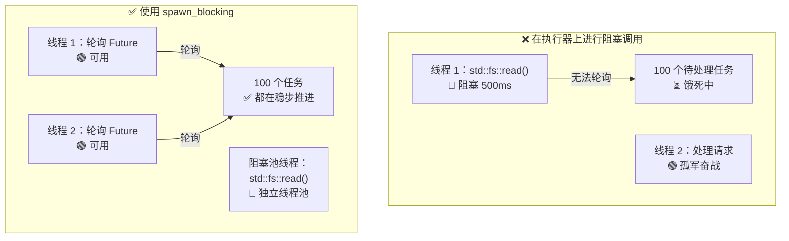

[English Original](../en/ch12-common-pitfalls.md)

# 12. 常见陷阱 🔴

> **你将学到：**
> - 9 种常见的异步 Rust Bug 及其修复方案
> - 为什么“阻塞执行器”是头号错误（以及 `spawn_blocking` 如何修复它）
> - 取消（Cancellation）带来的隐患：Future 在 await 中点被丢弃时会发生什么
> - 调试利器：`tokio-console`、`tracing`、`#[instrument]`
> - 测试技巧：`#[tokio::test]`、`time::pause()`、基于 Trait 的 Mock 模拟

## 阻塞执行器 (Blocking the Executor)

异步 Rust 中的头号错误：在异步执行器线程上运行阻塞代码。这会导致其他任务被“饿死”。

```rust
// ❌ 错误做法：阻塞了整个执行器线程
async fn bad_handler() -> String {
    let data = std::fs::read_to_string("big_file.txt").unwrap(); // 阻塞！
    process(&data)
}

// ✅ 正确做法：将阻塞工作转移到专门的线程池
async fn good_handler() -> String {
    let data = tokio::task::spawn_blocking(|| {
        std::fs::read_to_string("big_file.txt").unwrap()
    }).await.unwrap();
    process(&data)
}

// ✅ 同样正确：使用 tokio 的异步文件 I/O
async fn also_good_handler() -> String {
    let data = tokio::fs::read_to_string("big_file.txt").await.unwrap();
    process(&data)
}
```



### std::thread::sleep vs tokio::time::sleep

```rust
// ❌ 错误做法：阻塞执行器线程 5 秒钟
async fn bad_delay() {
    std::thread::sleep(Duration::from_secs(5)); // 线程无法轮询其他任何任务！
}

// ✅ 正确做法：让出执行权，其他任务可以继续运行
async fn good_delay() {
    tokio::time::sleep(Duration::from_secs(5)).await; // 非阻塞！
}
```

### 跨 .await 持有 MutexGuard

```rust
use std::sync::Mutex; // std Mutex —— 非异步感知的

// ⚠️ 危险：跨 .await 持有 MutexGuard
async fn bad_mutex(data: &Mutex<Vec<String>>) {
    let mut guard = data.lock().unwrap();
    guard.push("条目".into());
    some_io().await; // 锁在此处被持有 —— 阻止了其他线程获取锁！
    guard.push("另一个".into());
}
// 注意：即便如此，这段代码仍能编译通过！std::sync::MutexGuard 虽然是 !Send 的，
// 但编译器只在当你将 Future 传递给要求满足 Send 约束的函数时（如 tokio::spawn）
// 才会进行强制检查。直接调用 bad_mutex(...).await 是没问题的。
// 然而，tokio::spawn(bad_mutex(data)) 将会报 Send 约束错误。
```

**为什么这通常是个问题** —— 虽然并不绝对：

跨 `.await` 持有 `std::sync::Mutex` 会在 I/O 期间阻塞 **操作系统线程**，防止执行器在该线程上轮询其他任务。对于简短的临界区，这很浪费；对于长耗时的 I/O，这就是性能陷阱。

**然而**，有时你 *必须* 跨 `.await` 持有锁 —— 就像数据库事务在读取和提交之间必须持锁一样。单纯地丢弃并重新获取锁会引入 **TOCTOU（检查时间到使用时间）竞态条件**：另一个任务可能会在你的两个临界区之间修改数据。正确的修复方案取决于具体用例：

```rust
// 选项 1：收窄锁的作用域 —— 适用于操作相互独立的情况
async fn scoped_mutex(data: &Mutex<Vec<String>>) {
    {
        let mut guard = data.lock().unwrap();
        guard.push("条目".into());
    } // 锁在此处释放
    some_io().await; // 锁已释放 —— 其他任务可以推进
    {
        let mut guard = data.lock().unwrap();
        guard.push("另一个".into());
    }
}
// ⚠️ 注意：另一个任务可能在两个段落之间锁定并修改 Vec。
//    如果两次 push 操作是独立的，这没问题；但如果“另一个”依赖于“条目”设置的状态，则会有问题。

// 选项 2：使用 tokio::sync::Mutex —— 跨 .await 持锁且不阻塞操作系统线程。
//          当你需要在跨 await 点时进行事务性的“读取-修改-写入”操作时，这是最佳选择。
use tokio::sync::Mutex as AsyncMutex;

async fn async_mutex(data: &AsyncMutex<Vec<String>>) {
    let mut guard = data.lock().await; // 异步锁 —— 不阻塞线程
    guard.push("条目".into());
    some_io().await; // 没问题 —— tokio Mutex 的 guard 是满足 Send 约束的
    guard.push("另一个".into());
    // 锁在全程被持有 —— 无 TOCTOU 竞态，无线程阻塞。
}
```

> **Mutex 选型指南**：
> - `std::sync::Mutex`：内部不含 `.await` 的简短临界区。
> - `tokio::sync::Mutex`：需要跨越 `.await` 持有锁（如事务语义、避免 TOCTOU 竞态）。
> - `parking_lot::Mutex`：std 的高性能替代品，更小更快，同样不建议跨 `.await` 使用。
>
> **经验法则**：不要为了避开 `.await` 而盲目切割临界区。请思考这两个段落是否真的相互独立。如果第二部分依赖于第一部分的状态，请使用 `tokio::sync::Mutex` 或重新设计数据流。

### 取消隐患 (Cancellation Hazards)

丢弃一个 Future 意味着将其取消 —— 但这可能导致状态不一致：

```rust
// ❌ 危险：取消可能导致资源泄漏
async fn transfer(from: &Account, to: &Account, amount: u64) {
    from.debit(amount).await;  // 如果在此处被取消...
    to.credit(amount).await;   // ...钱就凭空消失了！
}

// ✅ 安全：使操作具备原子性或使用补偿机制
async fn safe_transfer(from: &Account, to: &Account, amount: u64) -> Result<(), Error> {
    // 使用数据库事务（要么全部成功，要么全部失败）
    let tx = db.begin_transaction().await?;
    tx.debit(from, amount).await?;
    tx.credit(to, amount).await?;
    tx.commit().await?; // 只有所有工作都成功才会提交
    Ok(())
}

// ✅ 同样安全：利用 tokio::select! 及其取消意识
tokio::select! {
    result = transfer(from, to, amount) => {
        // 转账完成
    }
    _ = shutdown_signal() => {
        // 不要中途取消转账 —— 哪怕关机也让它跑完
        // 或者：显式进行回滚
    }
}
```

### 无异步 Drop (No Async Drop)

Rust 的 `Drop` trait 是同步的 —— 你 **不能** 在 `drop()` 内部使用 `.await`。这是新手的常见痛点：

```rust
struct DbConnection { /* ... */ }

impl Drop for DbConnection {
    fn drop(&mut self) {
        // ❌ 无法执行 —— drop() 是同步的！
        // self.connection.shutdown().await;

        // ✅ 方案 1：派生一个清理任务（发完即忘模式）
        let conn = self.connection.take();
        tokio::spawn(async move {
            let _ = conn.shutdown().await;
        });

        // ✅ 方案 2：使用同步关闭方法
        // self.connection.blocking_close();
    }
}
```

**最佳实践**：提供一个显式的 `async fn close(self)` 方法，并指导调用者优先使用它。仅将 `Drop` 作为最后的安全防护网，而不是主要的清理路径。

### select! 的公平性与饥饿问题

```rust
use tokio::sync::mpsc;

// ❌ 不公平：fast 总是胜出，slow 会被渴死
async fn unfair(mut fast: mpsc::Receiver<i32>, mut slow: mpsc::Receiver<i32>) {
    loop {
        tokio::select! {
            Some(v) = fast.recv() => println!("来自快车道: {v}"),
            Some(v) = slow.recv() => println!("来自慢车道: {v}"),
            // 如果两者都就绪，tokio 会随机选一个。
            // 但如果 fast 始终有数据，slow 被轮询到的概率极低。
        }
    }
}

// ✅ 公平：使用偏向性模式（biased）或按批次处理
async fn fair(mut fast: mpsc::Receiver<i32>, mut slow: mpsc::Receiver<i32>) {
    loop {
        tokio::select! {
            biased; // 总是按顺序检查 —— 设置显式优先级

            Some(v) = slow.recv() => println!("来自慢车道: {v}"),  // 优先级！
            Some(v) = fast.recv() => println!("来自快车道: {v}"),
        }
    }
}
```

### 意外的顺序执行

```rust
// ❌ 顺序执行：总耗时 2 秒
async fn slow() {
    let a = fetch("url_a").await; // 耗时 1 秒
    let b = fetch("url_b").await; // 又耗时 1 秒（必须等 a 完事！）
}

// ✅ 并发执行：总耗时 1 秒
async fn fast() {
    let (a, b) = tokio::join!(
        fetch("url_a"), // 两者立即开始
        fetch("url_b"),
    );
}

// ✅ 同样是并发：预先创建 Future
async fn also_fast() {
    let fut_a = fetch("url_a"); // 创建 Future（惰性，尚未开始）
    let fut_b = fetch("url_b"); // 创建 Future
    let (a, b) = tokio::join!(fut_a, fut_b); // 现在两者并发运行
}
```

> **陷阱**：`let a = fetch(url).await; let b = fetch(url).await;` 是顺序执行的！第二个 `.await` 在第一个完成前根本不会启动。追求并发请使用 `join!` 或 `spawn`。

## 案例分析：调试一个挂起的生产服务

真实场景：一个服务运行 10 分钟后表现良好，随后停止响应。日志中无错误。CPU 占用率为 0%。

**诊断步骤：**

1. **接入 `tokio-console`** —— 发现 200 多个任务卡在 `Pending` 状态。
2. **查看任务详情** —— 全都在等待同一个 `Mutex::lock().await`。
3. **根因分析** —— 某个任务在持有一个 `std::sync::MutexGuard` 期间发生了 `.await` 并随后 panic，导致 mutex 被毒化（poisoned）。所有其他任务现在在调用 `lock().unwrap()` 时全部失败。

**修复：**

| 修复前 (受损) | 修复后 (完好) |
|-----------------|---------------|
| `std::sync::Mutex` | `tokio::sync::Mutex` |
| 跨 `.await` 调用 `.lock().unwrap()` | 在 `.await` 前局部化锁的作用域 |
| 获取锁时无超时机制 | `tokio::time::timeout(dur, mutex.lock())` |
| 无法从毒化锁中恢复 | `tokio::sync::Mutex` 不会发生毒化 |

**防范核查清单：**
- [ ] 如果锁引用跨越了 `.await`，请使用 `tokio::sync::Mutex`。
- [ ] 为异步函数添加 `#[tracing::instrument]` 以进行跨度追踪（span tracking）。
- [ ] 在预发布环境运行 `tokio-console` 以尽早发现挂起的任务。
- [ ] 添加健康检查端点，定期核查任务的响应能力。

<details>
<summary><strong>🏋️ 实践任务：找出 Bug 所在</strong> (点击展开)</summary>

**挑战**：找出这段代码中所有的异步陷阱并修复它们。

```rust
use std::sync::Mutex;

async fn process_requests(urls: Vec<String>) -> Vec<String> {
    let results = Mutex::new(Vec::new());
    
    for url in &urls {
        let response = reqwest::get(url).await.unwrap().text().await.unwrap();
        std::thread::sleep(std::time::Duration::from_millis(100)); // 速率限制
        let mut guard = results.lock().unwrap();
        guard.push(response);
        expensive_parse(&guard).await; // 解析目前所有的结果
    }
    
    results.into_inner().unwrap()
}
```

<details>
<summary>🔑 参考方案</summary>

**发现的 Bug：**

1. **顺序获取** —— URL 是一条接一条获取的，没有并发。
2. **使用了 `std::thread::sleep`** —— 阻塞了执行器线程。
3. **跨 `.await` 持有 MutexGuard** —— 在 await `expensive_parse` 时 `guard` 依然存活。
4. **缺乏并发设计** —— 应使用 `join!` 或 `FuturesUnordered`。

**修复方案：**

```rust
use tokio::sync::Mutex;
use std::sync::Arc;
use futures::stream::{self, StreamExt};

async fn process_requests(urls: Vec<String>) -> Vec<String> {
    // 修复 4：使用 buffer_unordered 并发处理 URL
    let results: Vec<String> = stream::iter(urls)
        .map(|url| async move {
            let response = reqwest::get(&url).await.unwrap().text().await.unwrap();
            // 修复 2：使用 tokio::time::sleep 代替 std::thread::sleep
            tokio::time::sleep(std::time::Duration::from_millis(100)).await;
            response
        })
        .buffer_unordered(10) // 最多 10 个并发请求
        .collect()
        .await;

    // 修复 3：收集完再解析 —— 完全不需要 mutex 了！
    for result in &results {
        expensive_parse(result).await;
    }

    results
}
```

**核心总结**：通常你可以通过重构异步代码来完全消除对 Mutex 的需求。利用流（Stream）或 join 来汇总结果，然后再统一处理。这样更简单、更快，且无死锁风险。

</details>
</details>

---

### 调试异步代码

异步堆栈追踪（Stack traces）因其难懂而闻名 —— 它们展现的是执行器的轮询循环，而非你的逻辑调用链。以下是必备的调试工具。

#### tokio-console：实时任务检查器

[tokio-console](https://github.com/tokio-rs/console) 提供了类似 `htop` 的界面，展示每个被派生任务的状态、轮询时长、waker 活动以及资源占用。

```toml
# Cargo.toml
[dependencies]
console-subscriber = "0.4"
tokio = { version = "1", features = ["full", "tracing"] }
```

```rust
#[tokio::main]
async fn main() {
    console_subscriber::init(); // 替换默认的 tracing 订阅器
    // ... 应用其余部分
}
```

随后在另一个终端运行：

```bash
$ RUSTFLAGS="--cfg tokio_unstable" cargo run   # 必需的编译标志
$ tokio-console                                # 连接至 127.0.0.1:6669
```

#### tracing + #[instrument]：异步结构化日志

[`tracing`](https://docs.rs/tracing) 包能理解 `Future` 的全生命周期。Span 会跨越 `.await` 点保持开启，即使操作系统线程已经切换，你依然能获得逻辑上的调用栈信息：

```rust
use tracing::{info, instrument};

#[instrument(skip(db_pool), fields(user_id = %user_id))]
async fn handle_request(user_id: u64, db_pool: &Pool) -> Result<Response> {
    info!("查询用户中");
    let user = db_pool.get_user(user_id).await?;  // Span 在跨越 await 时保持有效
    info!(email = %user.email, "找到用户");
    let orders = fetch_orders(user_id).await?;     // 依然在同一个 Span 内
    Ok(build_response(user, orders))
}
```

#### 调试核查清单

| 症状 | 可能原因 | 推荐工具 |
|---------|-------------|------|
| 任务永久挂起 | 漏掉了 `.await` 或发生了 `Mutex` 死锁 | `tokio-console` 任务视图 |
| 吞吐量极低 | 在异步线程上进行了阻塞调用 | `tokio-console` 轮询耗时直方图 |
| `Future is not Send` | 跨 `.await` 持有了非 Send 类型 | 编译器报错 + `#[instrument]` 定位 |
| 神秘的任务取消现象 | 父级 `select!` 丢弃了某个分支 | `tracing` Span 生命周期事件 |

---

### 测试异步代码

异步代码由于涉及到运行时、时间控制及并发行为，其测试具有独特挑战。

**基础异步测试** 使用 `#[tokio::test]`：

```rust
// Cargo.toml
// [dev-dependencies]
// tokio = { version = "1", features = ["full", "test-util"] }

#[tokio::test]
async fn test_basic_async() {
    let result = fetch_data().await;
    assert_eq!(result, "预期值");
}
```

**时间操控** —— 无需真实等待即可测试超时：

```rust
use tokio::time::{self, Duration, Instant};

#[tokio::test]
async fn test_timeout_behavior() {
    // 暂停时间 —— sleep() 会立即推进，无真实物理时间延迟
    time::pause();

    let start = Instant::now();
    time::sleep(Duration::from_secs(3600)).await; // 模拟“运行”了 1 小时，实际耗时 0ms
    assert!(start.elapsed() >= Duration::from_secs(3600));
}
```

**模拟异步依赖** —— 使用 Trait 代码或泛型：

```rust
trait Storage {
    async fn get(&self, key: &str) -> Option<String>;
    async fn set(&self, key: &str, value: String);
}

// 编写针对 Storage 泛型的功能函数...
async fn cache_lookup<S: Storage>(store: &S, key: &str) -> String { ... }

#[tokio::test]
async fn test_cache_logic() {
    let mock = MockStorage::new(); // 实现 Storage 的内存 mock
    let val = cache_lookup(&mock, "key1").await;
    assert_eq!(val, "预期数据");
}
```

> **关键要诀 —— 常见陷阱**
> - **绝不要阻塞执行器** —— 对计算/同步阻塞操作使用 `spawn_blocking`。
> - **绝不要跨 .await 持有 MutexGuard** —— 应该收紧锁作用域或使用 `tokio::sync::Mutex`。
> - **取消会立即丢弃 Future** —— 对部分操作使用“取消安全”的模式或事务。
> - 使用 **tokio-console** 和 **tracing** 辅助调试。
> - 使用 **#[tokio::test]** 和 **time::pause()** 实现确定性的时序测试。

> **另请参阅：** [第 8 章 —— Tokio 深度探索](ch08-tokio-deep-dive.md) 了解同步原语，[第 13 章 —— 生产模式](ch13-production-patterns.md) 了解优雅停机与结构化并发。

***
