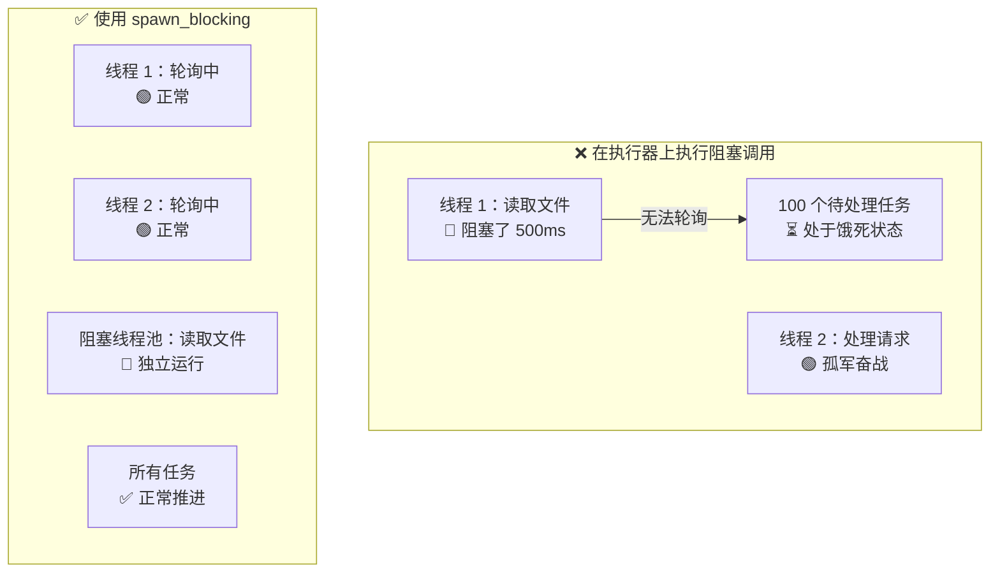

[English Original](../en/ch12-common-pitfalls.md)

# 12. 常见陷阱 🔴

> **你将学到：**
> - 9 种常见的异步 Rust Bug 及其修复方法
> - 为什么阻塞执行器是头号错误（以及 `spawn_blocking` 如何修复它）
> - 取消隐患：当 future 在 await 中途被丢弃时会发生什么
> - 调试工具：`tokio-console`、`tracing`、`#[instrument]`
> - 异步测试：`#[tokio::test]`、时间操纵、Mock 策略

## 阻塞执行器

异步 Rust 中的头号禁忌：在异步执行器线程上运行阻塞（blocking）代码。这会导致线程被占用，从而使其他成百上千个任务因为得不到调度而“饿死”。

```rust
// ❌ 错误：阻塞了整个执行器线程
async fn bad_handler() -> String {
    let data = std::fs::read_to_string("big_file.txt").unwrap(); // 阻塞！
    process(&data)
}

// ✅ 正确：将阻塞工作移交给专门的线程池
async fn good_handler() -> String {
    let data = tokio::task::spawn_blocking(|| {
        std::fs::read_to_string("big_file.txt").unwrap()
    }).await.unwrap();
    process(&data)
}
```



### std::thread::sleep vs tokio::time::sleep

```rust
// ❌ 错误：阻塞执行器线程，使其无法处理任何任务
async fn bad_delay() {
    std::thread::sleep(Duration::from_secs(5));
}

// ✅ 正确：非阻塞休眠，礼让执行器去处理其他任务
async fn good_delay() {
    tokio::time::sleep(Duration::from_secs(5)).await;
}
```

### 跨越 .await 持有 MutexGuard

```rust
use std::sync::Mutex;

// ❌ 错误：在 await 期间持有 std 互斥锁
async fn bad_mutex(data: &Mutex<Vec<String>>) {
    let mut guard = data.lock().unwrap();
    some_io().await; // 💥 如果这里挂起了，其他线程将永远拿不到锁！
    guard.push("done".into());
}

// ✅ 修复：使用异步感知的互斥锁
use tokio::sync::Mutex as AsyncMutex;

async fn good_async_mutex(data: &AsyncMutex<Vec<String>>) {
    let mut guard = data.lock().await; // 异步加锁
    some_io().await; // 安全：Tokio 的锁允许在 await 期间转移
    guard.push("done".into());
}
```

## 案例分析：调试卡死的生产服务

一个真实案例：某服务运行 10 分钟后突然停止响应。日志全无报错，CPU 占用率为 0%。

**诊断过程：**

1. **挂载 `tokio-console`**：发现几百个任务卡在 `Pending` 状态。
2. **定位细节**：发现大家都卡在同一个 `Mutex::lock().await`。
3. **查明根因**：某个任务在跨越 `.await` 时持有 `std::sync::MutexGuard` 并发生了 Panic，导致锁被“投毒”，进而由于异步任务的调度特性导致全局死锁。

**修复方案：** 严格遵循“锁的作用域不跨越 await”原则，或全面切为 `tokio::sync::Mutex`。

<details>
<summary><strong>🏋️ 练习：找 Bug</strong> (点击展开)</summary>

**挑战**：指出下面代码中隐藏的 3 个异步陷阱。

```rust
async fn process(urls: Vec<String>) {
    let results = std::sync::Mutex::new(vec![]);
    for url in urls {
        let resp = reqwest::get(url).await.unwrap().text().await.unwrap();
        std::thread::sleep(std::time::Duration::from_millis(10));
        results.lock().unwrap().push(resp);
    }
}
```

<details>
<summary>🔑 参考答案</summary>

1. **顺序执行**：URL 抓取是串行的，没有利用并发。
2. **阻塞调用**：使用了 `std::thread::sleep` 而非 `tokio::time::sleep`。
3. **潜在死锁**：虽然此例中逻辑非常简单，但在更复杂的 `lock()` 场景下容易引发执行器死锁。

</details>
</details>

## 调试与测试

### 调试工具：Tokio Console
`tokio-console` 就像异步世界的 `htop`，能让你实时看到每个任务的运行状况、被唤醒频率以及阻塞时长。

### 时间操纵测试
在测试中使用 `time::pause()`，可以让 `sleep(1小时)` 在毫秒内执行完成。

```rust
#[tokio::test]
async fn test_timeout() {
    tokio::time::pause(); // 暂停时间
    let start = Instant::now();
    tokio::time::sleep(Duration::from_secs(60)).await;
    assert!(start.elapsed() >= Duration::from_secs(60)); // 几乎瞬间完成！
}
```

> **关键要点：常见陷阱**
> - 绝对不要在异步代码里使用会阻塞线程的操作（如 std 的读写、sleep）。
> - 谨慎对待锁：尽量减小锁的作用域，或者使用异步锁。
> - 善用 `tracing` 和 `tokio-console` 来追踪那些“不知为何卡住”的任务。
> - 异步测试中，通过暂停时间可以极大地加速回归测试。

> **延伸阅读：** [第 8 章：Tokio 深入解析](ch08-tokio-deep-dive.md)；[第 13 章：生产模式](ch13-production-patterns.md)。

***
