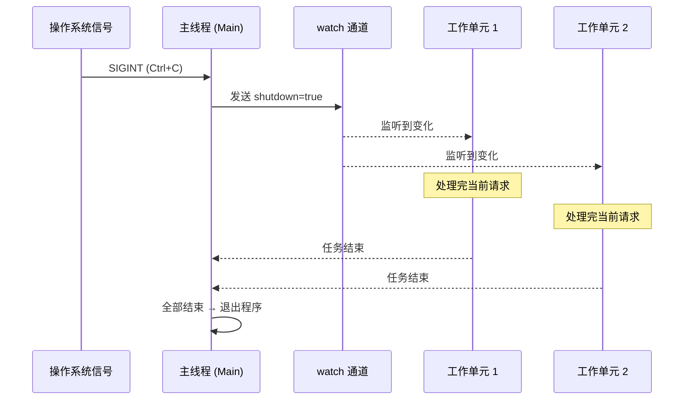

# 13. 生产模式 🔴

> **你将学到：**
> - 使用 `watch` 通道和 `select!` 实现优雅停机（Graceful Shutdown）
> - 背压机制：有界通道防止内存溢出 (OOM)
> - 结构化并发：`JoinSet` 和 `TaskTracker`
> - 超时、重试与指数级退避
> - 错误处理：`thiserror` 对比 `anyhow`，“双问号”模式
> - Tower：axum、tonic 和 hyper 使用的中间件模式

## 优雅停机

生产环境的服务器必须能“体面”地关闭 —— 即在退出前完成正在进行的请求、刷新缓冲区、并安全关闭连接：

```rust
use tokio::signal;
use tokio::sync::watch;

async fn main_server() {
    // 1. 创建停机信号通道
    let (shutdown_tx, shutdown_rx) = watch::channel(false);

    // 2. 启动核心服务
    let server_handle = tokio::spawn(run_server(shutdown_rx.clone()));

    // 3. 阻塞等待 Ctrl+C 信号
    signal::ctrl_c().await.expect("无法监听 Ctrl+C");
    println!("收到停机指令，正在处理剩余请求...");

    // 4. 通知所有关联任务开始关闭
    shutdown_tx.send(true).unwrap();

    // 5. 等待服务彻底结束（带超时保护）
    let _ = tokio::time::timeout(Duration::from_secs(30), server_handle).await;
}
```



### 有界通道提供的背压机制

生产者速度远快于消费者时，如果不加限制会导致内存无限膨胀。在生产环境中，**请务必使用有界通道**：

```rust
use tokio::sync::mpsc;

async fn backpressure_demo() {
    // 有界通道：缓冲区最多存放 100 个元素
    let (tx, mut rx) = mpsc::channel::<Data>(100);

    // 当缓存区满时，tx.send().await 会自动挂起，直到 rx 取走数据
    // 这就是天然的背压（Backpressure）
    tokio::spawn(async move {
        for i in 0..10000 {
            tx.send(Data(i)).await.unwrap(); 
        }
    });
}
```

### 结构化并发：JoinSet

`JoinSet` 是管理一组相关任务的现代方式，它能确保任务不会“走丢”：

```rust
use tokio::task::JoinSet;

async fn batch_process() {
    let mut set = JoinSet::new();

    for url in urls {
        set.spawn(fetch(url)); // 批量派生
    }

    // 逐个回收结果（不论顺序）
    while let Some(res) = set.join_next().await {
        println!("得到结果: {:?}", res);
    }
}
```

### 超时与重试

```rust
use tokio::time::{timeout, sleep, Duration};

// 带有指数退避的重试
async fn retry_request() {
    let mut delay = Duration::from_millis(100);
    for _ in 0..3 {
        match timeout(Duration::from_secs(5), do_work()).await {
            Ok(Ok(res)) => return Ok(res),
            _ => {
                sleep(delay).await;
                delay *= 2; // 指数级增加等待时间
            }
        }
    }
}
```

> **生产提示**：建议在重试中加入随机**抖动（Jitter）**，防止成千上万个客户端在同一时刻发起重试（惊群效应）。

### 错误处理最佳实践

**`thiserror` vs `anyhow`**：

- **`thiserror`**：适用于**编写库**（Library），可以定义清晰的错误类型供用户匹配。
- **`anyhow`**：适用于**应用程序**（App），因为它足够灵活，能快速包装任何类型的错误。

**双问号模式**：
在 `tokio::spawn` 场景下，第一个问号解开“任务是否正常运行（有无 panic）”，第二个问号解开“业务逻辑是否成功”。
```rust
let res = handle.await??;
```

### Tower：工业级中间件模式

如果你用过 Axum 或 Hyper，你其实已经在用 Tower 了。它通过 `Service` 抽象让你能像搭积木一样组合功能：

```rust
let service = ServiceBuilder::new()
    .layer(TimeoutLayer::new(Duration::from_secs(10))) // 超时中间件
    .layer(RateLimitLayer::new(100, Duration::from_secs(1))) // 限流中间件
    .service(my_api_handler);
```

<details>
<summary><strong>🏋️ 练习：实现带优雅停机的工作池</strong> (点击展开)</summary>

**挑战**：实现一个任务处理器，它会启动 4 个 Worker，且在收到关闭指令时，Worker 必须处理完手中已领取的任务再退出。

<details>
<summary>🔑 参考答案</summary>

```rust
// 核心逻辑是让 Worker 使用 select! 监听：
// 1. 新任务通道
// 2. 关闭信号 watch
// 只有当两者都表示“没活了且要关机”时才 break loop。
```

</details>
</details>

> **关键要点：生产模式**
> - 使用 `watch` + `select!` 实现有秩序的停机。
> - 有界通道是系统稳定性的保障，它能提供天然的流控能力。
> - `JoinSet` 为 Rust 带来了更严谨的结构化并发管理。
> - 库开发用 `thiserror`，应用开发用 `anyhow`。

> **延伸阅读：** [第 8 章：Tokio 深入解析](ch08-tokio-deep-dive.md)；[第 12 章：常见陷阱](ch12-common-pitfalls.md)。

***
