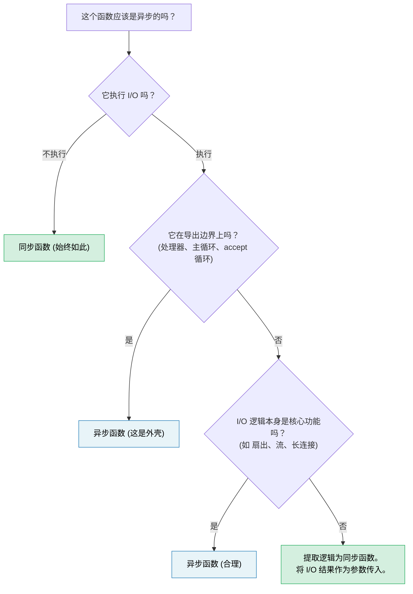

[English Original](../en/ch14-async-is-an-optimization-not-an-architecture.md)

# 14. 异步是手段而非目的 🔴

> **你将学到：**
> - 为什么异步倾向于污染整个代码库 —— 以及为什么这其实是设计上的失策，而非特性
> - “同步核心，异步外壳”模式：让绝大部分代码保持可测试与易调试性
> - 如何处理棘手情况：那些 *同时* 需要进行 I/O 的逻辑
> - `spawn_blocking` 究竟是救急良药还是架构缺陷的征兆
> - 什么时候异步才真正属于你的核心逻辑
> - 为什么“同步优先”的库比“异步优先”的库更具组合性

你已经补完了 13 个章节来学习异步 Rust。现在，我要告诉你全书最重要的一点：**你的大部分代码都不应该是异步的。**

## 函数着色问题 (The Function Coloring Problem)

Bob Nystrom 的名篇 [“你的函数是什么颜色？”](https://journal.stuffwithstuff.com/2015/02/01/what-color-is-your-function/) 指出了核心矛盾：异步函数可以调用同步函数，但同步函数无法直接调用异步函数。一旦某个函数变成了异步，其调用链上方的所有函数都必须随之改变。

在 Rust 中，这比 C# 或 JavaScript 还要 **严重**，因为异步不仅会感染函数签名，还会感染类型系统：

| 同步代码 | 异步等效代码 | 差异所在 |
|---|---|---|
| `fn process(&self)` | `async fn process(&self)` | 调用方也必须是异步的 |
| `&mut T` | `Arc<Mutex<T>>` | 派生任务需要满足 `'static + Send` |
| `std::sync::Mutex` | `tokio::sync::Mutex` | 若跨越 `.await` 持有，则类型不同 |
| `impl Trait` 返回值 | `impl Future<Output = T> + Send` | 虽有 RPITIT (1.75+) 简化，但仍带“颜色” |
| `#[test]` | `#[tokio::test]` | 测试需要运行时环境 |
| 栈追踪：5 帧 | 栈追踪：25 帧 | 其中一半是运行时内部逻辑 |

每一行差异都代表着开发者必须做出的决策和维护成本 —— 而这些都与业务逻辑本身无关。整个行业正在试图 *摆脱* 这种现状：Java 的 Project Loom (虚拟线程) 和 Go 的 goroutine 都能让你编写同步风格的代码，而运行时在高并发下仍能高效复用线程。Rust 选择显式异步是为了实现零成本控制，但这种控制带来的复杂性成本应当由开发者有意识地去“支付”，而非作为默认设置。

## “但是线程很贵”

一个常见的本能反驳是：“我们需要异步，因为线程太贵了。” 在大多数团队所面对的规模下，这个观点基本是错误的。

- **栈内存**：每个 OS 线程会在虚拟内存中预留 8MB 空间（Linux 默认），但 OS 只有在线程真正触及时才会分配物理页 —— 一个基本空闲的线程实际仅占用 20-80KB 物理内存。
- **上下文切换**：在现代硬件上约为 1-5µs。在 50 个并发请求的规模下，这完全是杂音。只有当每秒发生 10 万次切换时，它才会有明显影响。
- **创建成本**：Linux 上每线程约 10-30µs。通过线程池（rayon 或 `std::thread::scope`）可以将其摊销为零。

异步真正能够抵消其复杂性成本的门槛，大约在 **1,000 到 10,000 个并发连接** 左右 —— 这是 epoll/io_uring 的核心战场。在此规模之下，用线程池更简单、更易调试且速度足够快。在此规模之上，异步才是赢家。而绝大多数服务都处于这一门槛之下。

## 案例分析：同步核心，异步外壳

一个简单的纯函数 —— `fn add(a: i32, b: i32)` —— 显然不需要异步。但有趣的情况是：当业务规则看起来 *必须* 在中途执行 I/O 时 —— 比如校验逻辑需要检查库存、定价逻辑需要查询汇率、订单流水线需要查询客户信息。

考虑一个订单处理服务。全异步版本看起来很“自然”：

### 方案 A：全异步核心（Async all the way down）

```rust
// orders.rs —— 异步逻辑贯穿始终

pub async fn process_order(order: Order) -> Result<Receipt, OrderError> {
    // 步骤 1: 校验 —— 纯逻辑，无 I/O
    validate_items(&order)?;
    validate_quantities(&order)?;

    // 步骤 2: 检查库存 —— 需要数据库调用
    let stock = inventory_client.check(&order.items).await?;
    if !stock.all_available() {
        return Err(OrderError::OutOfStock(stock.missing()));
    }

    // 步骤 3: 计算定价 —— 纯数学运算，但因为环境是异步的，所以也是异步环境
    let pricing = calculate_pricing(&order, &stock);

    // 步骤 4: 应用折扣 —— 需要外部服务调用
    let discount = discount_service.lookup(order.customer_id).await?;
    let final_price = pricing.apply_discount(discount);

    // 步骤 5: 生成收据 —— 纯逻辑
    Ok(Receipt::new(order, final_price))
}
```

这是一段 *合理* 的异步代码。没有滥用 `Arc<Mutex>`，只有顺序调用。大多数开发者会直接这样写。但请看发生了什么：`validate_items`、`calculate_pricing` 和 `Receipt::new` 这些原本纯粹的函数，仅仅因为步骤 2 和 4 需要 I/O，便全都被卷进了异步语境。整个函数变成了异步，测试需要运行时，调用链上方也全被染色了。

### 方案 B：同步核心，异步外壳 (Sync Core, Async Shell)

替代方案：将 *如何决策* 与 *如何获取数据* 分离开来：

```rust
// core.rs —— 纯业务逻辑，零异步，零 tokio 依赖

pub fn validate_order(order: &Order) -> Result<ValidatedOrder, OrderError> {
    validate_items(order)?;
    validate_quantities(order)?;
    Ok(ValidatedOrder::from(order))
}

pub fn check_stock(
    order: &ValidatedOrder,
    stock: &StockResult,
) -> Result<StockedOrder, OrderError> {
    if !stock.all_available() {
        return Err(OrderError::OutOfStock(stock.missing()));
    }
    Ok(StockedOrder::from(order, stock))
}

pub fn finalize(
    order: &StockedOrder,
    discount: Discount,
) -> Receipt {
    let pricing = calculate_pricing(order);
    let final_price = pricing.apply_discount(discount);
    Receipt::new(order, final_price)
}
```

```rust
// shell.rs —— 薄薄的异步编排层

use crate::core;

pub async fn process_order(order: Order) -> Result<Receipt, OrderError> {
    // 同步：执行校验
    let validated = core::validate_order(&order)?;

    // 异步：获取库存（这是“外壳”的工作）
    let stock = inventory_client.check(&validated.items).await?;

    // 同步：将业务规则应用到获取的数据上
    let stocked = core::check_stock(&validated, &stock)?;

    // 异步：获取折扣
    let discount = discount_service.lookup(order.customer_id).await?;

    // 同步：完成结算
    Ok(core::finalize(&stocked, discount))
}
```

**异步外壳就是一个“获取数据 → 决策 → 获取数据 → 决策”的管道。** 每一个“决策（decide）”步骤都是一个同步函数，它将 I/O 结果作为输入参数，而不是自己伸手去库里拿。

### 测试差异对比

同步核心不需要运行时或 mock 即可测试每一项业务规则：

```rust
#[test]
fn out_of_stock_rejects_order() {
    let order = validated_order(vec![item("零件", 10)]);
    let stock = stock_result(vec![("零件", 3)]); // 仅存 3 个

    let result = core::check_stock(&order, &stock);
    assert_eq!(result.unwrap_err(), OrderError::OutOfStock(vec!["零件"]));
}

#[test]
fn discount_applied_correctly() {
    let order = stocked_order(100_00); // 单位为分
    let receipt = core::finalize(&order, Discount::Percent(15));
    assert_eq!(receipt.final_price, 85_00);
}
```

异步外壳只需要一个薄薄的 *集成测试* 来验证线路是否接通，而不需要验证业务逻辑的正误：

```rust
#[tokio::test]
async fn process_order_integration() {
    let mock_inventory = mock_service(/* 返回库存 */);
    let mock_discounts = mock_service(/* 返回 10% 折扣 */);
    let receipt = process_order(sample_order()).await.unwrap();
    assert!(receipt.final_price > 0);
    // 逻辑的正确性已由上方的核心代码测试证明
}
```

### 为什么这很重要

| 关注点 | 异步逻辑贯穿核心 | 同步核心 + 异步外壳 |
|---|---|---|
| 业务规则无需运行时即可测试 | 否 | **是** |
| 需要 `#[tokio::test]` 的单元测试数量 | 全部 | **仅限集成测试** |
| I/O 故障与逻辑错误耦合 | 是 —— 两者共用一个 `Result` | **否** —— 同步代码返回逻辑错误，外壳专门处理 I/O 错误 |
| 业务逻辑可在 CLI / WASM / 批处理中复用 | 难 —— 会传递性地引入 tokio | **易** —— 纯函数 |
| 业务逻辑中的栈追踪 | 夹杂大量运行时帧 | **非常整洁** |
| 未来将 HTTP 客户端改为 gRPC | 需要修改核心函数 | **仅需修改外壳** |

核心洞察：**步骤 2 和 4 中的 I/O 调用不需要出现在业务逻辑内部，它们应该是业务逻辑的输入。** 同步核心接收 `StockResult` 和 `Discount` 作为参数。至于这些值是从 HTTP、gRPC、缓存还是测试桩中来的，那是“外壳”该关心的事。

## `spawn_blocking` 的坏味道

之前章节介绍了 `spawn_blocking` 用于修复意外阻塞执行器的问题。当你面对一次性的阻塞调用时 —— 如 `std::fs::read`、压缩库、遗留的 FFI 函数 —— 它是正确的修复手段。

但如果你发现自己将大段代码包装在 `spawn_blocking` 中：

```rust
async fn handler(req: Request) -> Response {
    // 如果你的代码库到处都是这种结构，说明架构边界划错地方了
    tokio::task::spawn_blocking(move || {
        let validated = validate(&req);       // 同步
        let enriched = enrich(validated);      // 同步
        let result = process(enriched);        // 同步
        let output = format_response(result);  // 同步
        output
    }).await.unwrap()
}
```

这说明：**这段逻辑从一开始就不需要异步。** 你不需要 `spawn_blocking` —— 你需要的是一个能被异步处理器直接调用的同步模块。

请将 `spawn_blocking` 留给真正的重型 CPU 工作（如大文件解析、图像处理、数据压缩），因为这类任务的时间开销确实会饿死执行器。对于那些运行时间仅为几微秒的普通业务逻辑，直接进行同步调用更简单、更正确。

## 库作者：同步优先，异步可选

代码边界问题对库作者而言影响更为深远。一个同步的库可以被同步和异步调用方灵活使用：

```rust
// 同步库 —— 处处可用
let report = my_lib::analyze(&data);

// 调用方 A: 同步 CLI 工具
fn main() {
    let report = my_lib::analyze(&data);
    println!("{report}");
}

// 调用方 B: 异步处理器 —— 完美兼容
async fn handler() -> Json<Report> {
    let report = my_lib::analyze(&data); // 异步语境下的同步调用 —— 没问题
    Json(report)
}

// 调用方 C: 繁重分析 —— 由调用方决定是否转移至独立线程
async fn handler_heavy() -> Json<Report> {
    let data = data.clone();
    let report = tokio::task::spawn_blocking(move || {
        my_lib::analyze(&data) // 调用方自主控制异步边界
    }).await.unwrap();
    Json(report)
}
```

而一个异步库则强迫 *所有* 调用方都必须载入一个运行时：

```rust
// 异步库 —— 只能在异步语境下使用
let report = my_lib::analyze(&data).await; // 调用方必须是异步的

// 同步调用方？现在你得使用 block_on —— 还要祈祷没有嵌套运行时的冲突
let report = tokio::runtime::Runtime::new().unwrap().block_on(
    my_lib::analyze(&data)
); // 脆弱且在嵌套环境下极易引发 panic
```

**默认提供同步 API。** 如果你的库执行的是纯粹的计算、数据转换或解析，完全没有理由写成异步。如果涉及 I/O，考虑提供一个同步核心，并在功能标志（feature flag）后提供一个可选的异步便捷层 —— 让调用方来决定是否跨越异步边界。

## 何时异步才真正属于核心？

并不是所有东西都能被简单分离。在以下情况，异步理应出现在核心逻辑中：

- **并发“扇出/扇入（Fan-out/Fan-in）”本身就是逻辑所在**：如果业务规则是“同时向 5 个定价服务发起查询并返回最低价”，那么这种并发本身就是核心逻辑，而非繁事。
- **流式处理（Streaming）逻辑**：带有背压（backpressure）控制的持续事件流处理。
- **长连接与有状态协议**：WebSocket 处理器、gRPC 双向流以及协议状态机。第 17 章中的聊天服务器正是此类。

**测试准则**：如果从一个函数中移除 `async` 关键字会导致你必须用线程、通道或手动轮询来替换它，那么异步就是值得的。如果移除 `async` 只是删掉了一个关键字，逻辑本身毫无变化，那它本就不该是异步。

## 决策规则



> **经验法则**：从同步开始。仅在最外层的 I/O 边界处添加异步。仅当你能明确说出 *哪些并发 I/O 操作* 抵消了由于函数着色带来的复杂性成本时，才将其向内层推进。

---

<details>
<summary><strong>🏋️ 实践任务：提取同步核心</strong> (点击展开)</summary>

以下是一个 axum 处理器，由于业务逻辑与 I/O 混杂，导致了严重的异步污染。请将其重构为一个“同步核心模块”和一个“薄异步外壳”。

```rust
use axum::{Json, extract::Path};

async fn get_device_report(Path(device_id): Path<String>) -> Result<Json<Report>, AppError> {
    // 通过 HTTP 从设备获取原始遥测数据
    let raw = reqwest::get(format!("http://bmc-{device_id}/telemetry"))
        .await?
        .json::<RawTelemetry>()
        .await?;

    // 业务逻辑：将原始传感器读数转换为校准值
    let mut readings = Vec::new();
    for sensor in &raw.sensors {
        let calibrated = (sensor.raw_value as f64) * sensor.scale + sensor.offset;
        if calibrated < sensor.min_valid || calibrated > sensor.max_valid {
            return Err(AppError::SensorOutOfRange {
                name: sensor.name.clone(),
                value: calibrated,
            });
        }
        readings.push(CalibratedReading {
            name: sensor.name.clone(),
            value: calibrated,
            unit: sensor.unit.clone(),
        });
    }

    // 业务逻辑：评估设备健康状况
    let critical_count = readings.iter()
        .filter(|r| r.value > 90.0)
        .count();
    let health = if critical_count > 2 { Health::Critical }
                 else if critical_count > 0 { Health::Warning }
                 else { Health::Ok };

    // 从库存服务获取设备元数据
    let meta = reqwest::get(format!("http://inventory/devices/{device_id}"))
        .await?
        .json::<DeviceMetadata>()
        .await?;

    Ok(Json(Report {
        device_id,
        device_name: meta.name,
        health,
        readings,
        timestamp: chrono::Utc::now(),
    }))
}
```

**你的目标：**

1. 创建 `core.rs`，包含同步函数：`calibrate_sensors`、`classify_health` 和 `build_report`。
2. 创建 `shell.rs`，包含轻量级异步处理器，负责数据获取并调用同步核心。
3. 编写 `#[test]`（而非 `#[tokio::test]`）来验证：传感器超限、健康分类阈值以及生成报告的正确性。

<details>
<summary>🔑 参考方案</summary>

```rust
// core.rs —— 零异步依赖

pub fn calibrate_sensors(raw: &RawTelemetry) -> Result<Vec<CalibratedReading>, AppError> {
    raw.sensors.iter().map(|sensor| {
        let calibrated = (sensor.raw_value as f64) * sensor.scale + sensor.offset;
        if calibrated < sensor.min_valid || calibrated > sensor.max_valid {
            return Err(AppError::SensorOutOfRange {
                name: sensor.name.clone(),
                value: calibrated,
            });
        }
        Ok(CalibratedReading {
            name: sensor.name.clone(),
            value: calibrated,
            unit: sensor.unit.clone(),
        })
    }).collect()
}

pub fn classify_health(readings: &[CalibratedReading]) -> Health {
    let critical_count = readings.iter().filter(|r| r.value > 90.0).count();
    if critical_count > 2 { Health::Critical }
    else if critical_count > 0 { Health::Warning }
    else { Health::Ok }
}

pub fn build_report(
    device_id: String,
    readings: Vec<CalibratedReading>,
    meta: &DeviceMetadata,
) -> Report {
    Report {
        device_id,
        device_name: meta.name.clone(),
        health: classify_health(&readings),
        readings,
        timestamp: chrono::Utc::now(),
    }
}
```

```rust
// shell.rs —— 仅作为异步边界

pub async fn get_device_report(
    Path(device_id): Path<String>,
) -> Result<Json<Report>, AppError> {
    let raw = reqwest::get(format!("http://bmc-{device_id}/telemetry"))
        .await?.json::<RawTelemetry>().await?;

    let readings = core::calibrate_sensors(&raw)?;

    let meta = reqwest::get(format!("http://inventory/devices/{device_id}"))
        .await?.json::<DeviceMetadata>().await?;

    Ok(Json(core::build_report(device_id, readings, &meta)))
}
```

**变化点：** 异步处理器从 30 行逻辑与 I/O 混杂的代码变成了 8 行纯粹的流程编排。所有业务规则（校准、范围校验、健康阈值）现在都通过 `#[test]` 进行测试，在毫秒内即可跑完，且完全不依赖 tokio、reqwest 或任何 HTTP mock 服务器。

</details>
</details>

---

> **关键要诀：**
>
> 1. 异步是一种 **I/O 复用优化**，而非应用架构模式。绝大部分业务逻辑应当是同步的。
> 2. **同步核心，异步外壳：** 将业务规则保存在纯函数中，并将 I/O 结果作为参数传入。异步外壳负责编排数据获取并调用核心逻辑。
> 3. 如果你发现自己在用 `spawn_blocking` 包裹大段逻辑，说明 **边界划分错了** —— 请将其重构为同步模块。
> 4. **库设计应首选同步 API。** 异步库会强迫所有调用方绑定运行时；同步库则将选择权交由调用方。
> 5. 异步在 **扇出/扇入、并发流和有状态长连接** 场景下实至名归 —— 在这些场景下，并发本身就是业务。

> **另请参阅：** [第 12 章 —— 常见陷阱](ch12-common-pitfalls.md)（spawn_blocking 的战术用法）· [第 13 章 —— 生产模式](ch13-production-patterns.md)（背压、结构化并发）· [第 17 章 —— 实战项目：异步聊天服务器](ch17-capstone-project.md)（异步架构的正确应用实例）

***
