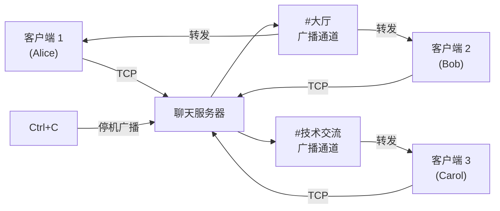

[English Original](../en/ch16-capstone-project.md)

# 终极项目：异步聊天服务器 🔴

本项目将本书中提到的各种模式整合到一个生产级别的应用中。你将使用 tokio、通道、流、优雅停机以及完善的错误处理来构建一个 **多房间异步聊天服务器**。

**预计耗时**：4–6 小时 | **难度**：★★★

> **你将练习：**
> - `tokio::spawn` 及其 `'static` 要求（第 8 章）
> - 通道：用于消息的 `mpsc`、用于房间广播的 `broadcast`、用于停机的 `watch`（第 8 章）
> - 流：从 TCP 连接中高效读取行（第 11 章）
> - 常见陷阱：取消安全性、跨 `.await` 持锁风险（第 12 章）
> - 生产模式：优雅停机、背压控制（第 13 章）
> - 使用异步 Trait 设计后端接口（第 10 章）

## 项目目标

构建一个满足以下要求的 TCP 聊天服务器：

1. **多房间支持**：客户端连接后可以加入不同的聊天房间。
2. **消息广播**：某人发送消息，同房间内的所有人都能收到。
3. **指令支持**：支持 `/join <房间名>`、`/nick <昵称>`、`/rooms`（查看列表）、`/quit`。
4. **安全退出**：按下 Ctrl+C 后，服务器应处理完现有消息再退出。



## 第 1 步：TCP 监听与接收

首先实现一个基础的服务器，它能接受连接并将你发送的任何行原样回传（Echo）。

```rust
use tokio::io::{AsyncBufReadExt, AsyncWriteExt, BufReader};
use tokio::net::TcpListener;

#[tokio::main]
async fn main() -> anyhow::Result<()> {
    let listener = TcpListener::bind("127.0.0.1:8080").await?;
    println!("聊天服务器已启动，监听端口 :8080");

    loop {
        let (socket, addr) = listener.accept().await?;
        tokio::spawn(async move {
            // 处理逻辑 ...
        });
    }
}
```

## 第 2 步：房间状态管理

使用 `broadcast` 通道代表房间。每个加入房间的客户端都会获得一个 `Receiver`。

```rust
use std::collections::HashMap;
use tokio::sync::{broadcast, RwLock};

// 使用 RwLock 保护全局房间列表
type RoomMap = Arc<RwLock<HashMap<String, broadcast::Sender<String>>>>;
```

## 第 3 步：指令系统

你需要解析客户端输入的以 `/` 开头的文本，并执行相应的逻辑（如切换房间、更改昵称等）。

## 第 4 步：处理滞后与背压

如果某个客户端网络极慢，它可能会在 `broadcast` 通道中“掉队”。你需要处理 `RecvError::Lagged(n)` 错误，并考虑是否断开该客户端或跳过消息。

## 评估标准

- **并发性能**：是否能同时处理成百上千个连接且不卡顿？
- **资源清理**：客户端断开后，对应的资源（通道订阅等）是否被及时释放？
- **一致性**：消息是否被正确限制在房间内？
- **健壮性**：非法指令、网络连接重置等边界情况是否处理妥当？

***
