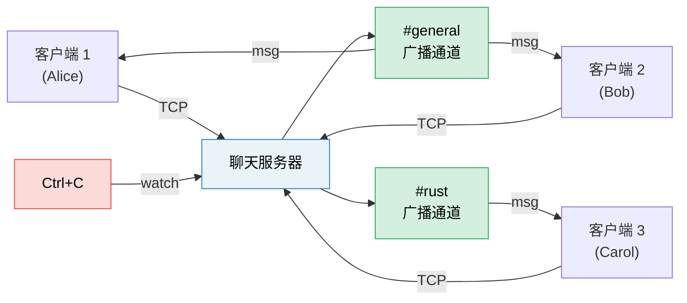

[English Original](../en/ch17-capstone-project.md)

# 终极实战项目：异步聊天服务器

这个项目将书中各章节的模式整合到一个单体、生产级的应用程序中。你将构建一个**多聊天室异步聊天服务器**，综合运用 tokio、通道（channels）、流（streams）、优雅停机（graceful shutdown）以及完善的错误处理。

**预计耗时**：4–6 小时 | **难度**：★★★

> **你将实践的内容：**
> - `tokio::spawn` 及其 `'static` 约束 (第 8 章)
> - 通道：`mpsc` 处理消息，`broadcast` 处理房间，`watch` 处理停机 (第 8 章)
> - 流：从 TCP 连接中读取行内容 (第 11 章)
> - 常见陷阱：取消安全性、跨 `.await` 持有 MutexGuard (第 12 章)
> - 生产模式：优雅停机、背压控制 (第 13 章)
> - 异步 Trait 用于插件化后端 (第 10 章)

## 问题描述

构建一个 TCP 聊天服务器，具备以下功能：

1. **客户端**通过 TCP 连接并加入指定的命名聊天室。
2. **消息**会广播给同一房间内的所有客户端。
3. **命令支持**：`/join <room>`, `/nick <name>`, `/rooms`, `/quit`。
4. **服务器停机**：在按下 Ctrl+C 时实现优雅停机 —— 完成剩余消息的发送。



## 第 1 步：基础 TCP 接收循环

从一个能接收连接并回显内容的服务器开始：

```rust
use tokio::io::{AsyncBufReadExt, AsyncWriteExt, BufReader};
use tokio::net::TcpListener;

#[tokio::main]
async fn main() -> anyhow::Result<()> {
    let listener = TcpListener::bind("127.0.0.1:8080").await?;
    println!("聊天服务器已在 8080 端口启动");

    loop {
        let (socket, addr) = listener.accept().await?;
        println!("[{addr}] 已连接");

        tokio::spawn(async move {
            let (reader, mut writer) = socket.into_split();
            let mut reader = BufReader::new(reader);
            let mut line = String::new();

            loop {
                line.clear();
                match reader.read_line(&mut line).await {
                    Ok(0) | Err(_) => break,
                    Ok(_) => {
                        let _ = writer.write_all(line.as_bytes()).await;
                    }
                }
            }
            println!("[{addr}] 已断开连接");
        });
    }
}
```

**任务**：验证此段代码可编译，并能通过 `telnet localhost 8080` 正常工作。

## 第 2 步：使用广播通道管理房间状态

每个房间对应一个 `broadcast::Sender`。房间内的所有客户端都通过订阅来接收消息。

```rust
use std::collections::HashMap;
use std::sync::Arc;
use tokio::sync::{broadcast, RwLock};

type RoomMap = Arc<RwLock<HashMap<String, broadcast::Sender<String>>>>;

fn get_or_create_room(rooms: &mut HashMap<String, broadcast::Sender<String>>, name: &str) -> broadcast::Sender<String> {
    rooms.entry(name.to_string())
        .or_insert_with(|| {
            let (tx, _) = broadcast::channel(100); // 100 条消息的缓冲区
            tx
        })
        .clone()
}
```

**任务**：实现房间状态管理，确保：
- 客户端初始加入 `#general` 房间。
- `/join <room>` 命令可实现房间切换（退订旧房间，订阅新房间）。
- 消息能广播至发送者当前所在房间的所有客户端。

<details>
<summary>💡 提示 —— 客户端任务结构</summary>

每个客户端任务需要两个并发循环：
1. **从 TCP 读取** → 解析命令或广播至房间。
2. **从广播接收端读取** → 写入 TCP。

利用 `tokio::select!` 同时运行两者：

```rust
loop {
    tokio::select! {
        result = reader.read_line(&mut line) => {
            // 解析命令或广播消息
        }
        result = room_rx.recv() => {
            // 接收到广播并转发给客户端
        }
    }
}
```

</details>

## 第 3 步：命令系统

实现命令协议：

| 命令 | 行为 |
|---------|--------|
| `/join <room>` | 离开当前房间，加入新房间，并同步发布通知消息 |
| `/nick <name>` | 修改显示名称 |
| `/rooms` | 列出所有活跃房间及人数 |
| `/quit` | 优雅断开连接 |
| 其他内容 | 作为聊天消息进行广播 |

**任务**：从输入行解析命令。对于 `/rooms`，需读取 `RoomMap` —— 利用 `RwLock::read()` 以避免阻塞其他客户端。

## 第 4 步：优雅停机

加入 Ctrl+C 处理机制，确保服务器：
1. 停止接收新连接。
2. 向所有房间发送“服务器正在停机...”的消息。
3. 等待待处理的消息排空。
4. 干净地退出。

## 第 5 步：错误处理与边界情况

强化服务器的健壮性：

1. **处理滞后接收端**：如果某个客户端过慢导致丢失消息，`broadcast::recv()` 会返回 `RecvError::Lagged(n)`。请优雅地处理该错误（记录日志并继续，不要崩溃）。
2. **昵称校验**：拒绝空名或过长的昵称。
3. **背压控制**：广播通道缓冲区是有界的。如果某客户端跟不上进度，会触发 `Lagged` 错误。
4. **超时机制**：断开空闲超过 5 分钟的客户端连接。

## 第 6 步：集成测试

编写测试用例：启动服务器，连接两个客户端，并验证消息是否能准确送达。

## 评估标准

| 标准 | 目标 |
|-----------|--------|
| 并发能力 | 多房间多客户端并发，无阻塞 |
| 正确性 | 消息仅发送至同房间客户端 |
| 优雅停机 | Ctrl+C 能干净退出并完成残留消息发送 |
| 错误处理 | 正确处理滞后接收端、断连及超时 |
| 代码组织 | 实现逻辑与网络层的清晰分离 |

***
