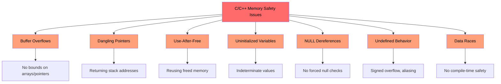
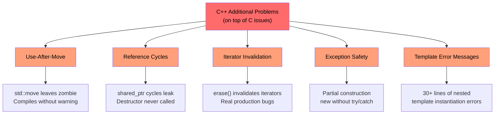

# 1.1 Why C/C++ Developers Need Rust / 1.1 为什么 C/C++ 开发者需要 Rust

> **What you'll learn / 你将学到：**
> - The full list of problems Rust eliminates — memory safety, undefined behavior, data races, and more / Rust 消除了哪些问题：内存安全、未定义行为、数据竞争等完整清单
> - Why `shared_ptr`, `unique_ptr`, and other C++ mitigations are bandaids, not solutions / 为什么 `shared_ptr`、`unique_ptr` 及其他 C++ 缓解手段只是“创可贴”，而非根本解决方案
> - Concrete C and C++ vulnerability examples that are structurally impossible in safe Rust / 具体的 C 和 C++ 漏洞示例，以及为什么它们在安全 Rust 中在结构上是不可能出现的

> **Want to skip straight to code? / 想直接看代码？** Jump to [Show me some code / 少说多练：先看代码](ch02-getting-started.md#enough-talk-already-show-me-some-code)

## What Rust Eliminates — The Complete List / Rust 消除了什么 —— 完整清单

Before diving into examples, here's the executive summary. Safe Rust **structurally prevents** every issue in this list — not through discipline, tooling, or code review, but through the type system and compiler:

在深入查看示例之前，先看下这份概要总结。安全 Rust 在**结构上防止**了下表中的每一个问题 —— 这不是通过开发者的自觉、工具或代码审查来实现的，而是通过类型系统和编译器强制保证的：

| **Eliminated Issue / 消除的问题** | **C** | **C++** | **How Rust Prevents It / Rust 如何预防** |
|----------------------|:-----:|:-------:|--------------------------|
| Buffer overflows / underflows / 缓冲区溢出 / 欠载 | ✅ | ✅ | All arrays, slices, and strings carry bounds; indexing is checked at runtime / 所有数组、切片和字符串都带有边界信息；索引在运行时会进行检查 |
| Memory leaks (no GC needed) / 内存泄漏（无需 GC） | ✅ | ✅ | `Drop` trait = RAII done right; automatic cleanup, no Rule of Five / `Drop` trait = 做对了的 RAII；自动清理，无需 Rule of Five |
| Dangling pointers / 悬垂指针 | ✅ | ✅ | Lifetime system proves references outlive their referent at compile time / 生命周期系统在编译期证明引用的存活时间长于其指向的对象 |
| Use-after-free / 释放后使用 | ✅ | ✅ | Ownership system makes this a compile error / 所有权系统让这种行为成为编译错误 |
| Use-after-move / move 后继续使用 | — | ✅ | Moves are **destructive** — the original binding ceases to exist / 移动是**破坏性**的 —— 原始绑定将不复存在 |
| Uninitialized variables / 未初始化变量 | ✅ | ✅ | All variables must be initialized before use; compiler enforces it / 所有变量必须在初始化后才能使用；由编译器强制执行 |
| Integer overflow / underflow UB / 整数溢出 / 欠载导致的未定义行为 | ✅ | ✅ | Debug builds panic on overflow; release builds wrap (defined behavior either way) / 调试编译在溢出时会 panic；发布编译会回绕（无论哪种都是定义的行为） |
| NULL pointer dereferences / SEGVs / 空指针解引用 / 段错误 | ✅ | ✅ | No null pointers; `Option<T>` forces explicit handling / 不存在空指针；`Option<T>` 强制要求显式处理 |
| Data races / 数据竞争 | ✅ | ✅ | `Send`/`Sync` traits + borrow checker make data races a compile error / `Send`/`Sync` trait + 借用检查器让数据竞争成为编译错误 |
| Uncontrolled side-effects / 不受控的副作用 | ✅ | ✅ | Immutability by default; mutation requires explicit `mut` / 默认不可变；修改需要显式使用 `mut` |
| No inheritance (better maintainability) / 无继承（更好的可维护性） | — | ✅ | Traits + composition replace class hierarchies; promotes reuse without coupling / Trait + 组合取代类继承层次；促进复用且无需耦合 |
| No exceptions; predictable control flow / 无异常；可预测的控制流 | — | ✅ | Errors are values (`Result<T, E>`); impossible to ignore, no hidden `throw` paths / 错误即是值（`Result<T, E>`); 无法被忽略，没有隐藏的 `throw` 路径 |
| Iterator invalidation / 迭代器失效 | — | ✅ | Borrow checker forbids mutating a collection while iterating / 借用检查器禁止在迭代集合时对其进行修改 |
| Reference cycles / leaked finalizers / 引用环 / 内存泄漏的收尾器 | — | ✅ | Ownership is tree-shaped; `Rc` cycles are opt-in and catchable with `Weak` / 所有权是树状的；`Rc` 环是可选的，且可以用 `Weak` 捕捉 |
| No forgotten mutex unlocks / 不会忘记互斥锁解锁 | ✅ | ✅ | `Mutex<T>` wraps the data; lock guard is the only way to access it / `Mutex<T>` 包装了数据；锁保护对象是访问数据的唯一方式 |
| Undefined behavior (general) / 未定义行为（通用） | ✅ | ✅ | Safe Rust has **zero** undefined behavior; `unsafe` blocks are explicit and auditable / 安全 Rust **零**未定义行为；`unsafe` 块是显式的且可审计的 |

> **Bottom line / 核心结论：** These aren't aspirational goals enforced by coding standards. They are **compile-time guarantees**. If your code compiles, these bugs cannot exist.
>
> **核心结论：** 这些并不是靠编码规范来维持的愿景。它们是**编译期的强制保证**。如果你的代码能编译通过，这些 bug 就不可能存在。

---

## The Problems Shared by C and C++ / C 与 C++ 共同存在的问题

> **Want to skip the examples? / 想跳过示例？** Jump to [How Rust Addresses All of This / 直接跳到“Rust 如何解决这一切”](#how-rust-addresses-all-of-this) or straight to [Show me some code / 或直接看代码](ch02-getting-started.md#enough-talk-already-show-me-some-code)

Both languages share a core set of memory safety problems that are the root cause of over 70% of CVEs (Common Vulnerabilities and Exposures):

这两种语言都存在一系列核心的内存安全问题，这些问题是导致超过 70% 的 CVE（常见漏洞与披露）的根源：

### Buffer overflows / 缓冲区溢出

C arrays, pointers, and strings have no intrinsic bounds. It is trivially easy to exceed them:

C 数组、指针和字符串没有固有的边界。越界访问非常容易发生：

```c
#include <stdlib.h>
#include <string.h>

void buffer_dangers() {
    char buffer[10];
    strcpy(buffer, "This string is way too long!");  // Buffer overflow / 缓冲区溢出

    int arr[5] = {1, 2, 3, 4, 5};
    int *ptr = arr;           // Loses size information / 丢失大小信息
    ptr[10] = 42;             // No bounds check — undefined behavior / 无边界检查 —— 未定义行为
}
```

In C++, `std::vector::operator[]` still performs no bounds checking. Only `.at()` does — and who catches the exception?

在 C++ 中，`std::vector::operator[]` 仍然不执行边界检查。只有 `.at()` 会进行检查 —— 但又有谁会去专门捕获那个异常呢？

### Dangling pointers and use-after-free / 悬垂指针与释放后使用

```c
int *bar() {
    int i = 42;
    return &i;    // Returns address of stack variable — dangling! / 返回栈变量地址 —— 悬垂了！
}

void use_after_free() {
    char *p = (char *)malloc(20);
    free(p);
    *p = '\0';   // Use after free — undefined behavior / 释放后使用 —— 未定义行为
}
```

### Uninitialized variables and undefined behavior / 未初始化变量与未定义行为

C and C++ both allow uninitialized variables. The resulting values are indeterminate, and reading them is undefined behavior:

C 和 C++ 都允许存在未初始化的变量。其结果值是不确定的，读取它们属于未定义行为：

```c
int x;               // Uninitialized / 未初始化
if (x > 0) { ... }  // UB — x could be anything / 未定义行为 —— x 可能是任何值
```

Integer overflow is **defined** in C for unsigned types but **undefined** for signed types. In C++, signed overflow is also undefined behavior. Both compilers can and do exploit this for "optimizations" that break programs in surprising ways.

在 C 语言中，无符号类型的整数溢出是**有定义**的，但有符号类型的溢出是**未定义**的。在 C++ 中，有符号溢出同样是未定义行为。编译器能够也确实会利用这一点进行“优化”，从而以令人惊讶的方式让程序崩溃。

### NULL pointer dereferences / 空指针解引用

```c
int *ptr = NULL;
*ptr = 42;           // SEGV — but the compiler won't stop you
```

In C++, `std::optional<T>` helps but is verbose and often bypassed with `.value()` which throws.

### The visualization: shared problems



---

## C++ Adds More Problems on Top

> **C audience**: You can [skip ahead to How Rust Addresses These Issues](#how-rust-addresses-all-of-this) if you don't use C++.
>
> **Want to skip straight to code?** Jump to [Show me some code](ch02-getting-started.md#enough-talk-already-show-me-some-code)

C++ introduced smart pointers, RAII, move semantics, and exceptions to address C's problems. These are **bandaids, not cures** — they shift the failure mode from "crash at runtime" to "subtler bug at runtime":

### `unique_ptr` and `shared_ptr` — bandaids, not solutions

C++ smart pointers are a significant improvement over raw `malloc`/`free`, but they don't solve the underlying problems:

| C++ Mitigation | What It Fixes | What It **Doesn't** Fix |
|----------------|---------------|------------------------|
| `std::unique_ptr` | Prevents leaks via RAII | **Use-after-move** still compiles; leaves a zombie nullptr |
| `std::shared_ptr` | Shared ownership | **Reference cycles** leak silently; `weak_ptr` discipline is manual |
| `std::optional` | Replaces some null use | `.value()` **throws** if empty — hidden control flow |
| `std::string_view` | Avoids copies | **Dangling** if the source string is freed — no lifetime checking |
| Move semantics | Efficient transfers | Moved-from objects are in a **"valid but unspecified state"** — UB waiting to happen |
| RAII | Automatic cleanup | Requires the **Rule of Five** to get right; one mistake breaks everything |

```cpp
// unique_ptr: use-after-move compiles cleanly
std::unique_ptr<int> ptr = std::make_unique<int>(42);
std::unique_ptr<int> ptr2 = std::move(ptr);
std::cout << *ptr;  // Compiles! Undefined behavior at runtime.
                     // In Rust, this is a compile error: "value used after move"
```

```cpp
// shared_ptr: reference cycles leak silently
struct Node {
    std::shared_ptr<Node> next;
    std::shared_ptr<Node> parent;  // Cycle! Destructor never called.
};
auto a = std::make_shared<Node>();
auto b = std::make_shared<Node>();
a->next = b;
b->parent = a;  // Memory leak — ref count never reaches 0
                 // In Rust, Rc<T> + Weak<T> makes cycles explicit and breakable
```

### Use-after-move — the silent killer

C++ `std::move` is not a move — it's a cast. The original object remains in a "valid but unspecified state". The compiler lets you keep using it:

```cpp
auto vec = std::make_unique<std::vector<int>>({1, 2, 3});
auto vec2 = std::move(vec);
vec->size();  // Compiles! But dereferencing nullptr — crash at runtime
```

In Rust, moves are **destructive**. The original binding is gone:

```rust
let vec = vec![1, 2, 3];
let vec2 = vec;           // Move — vec is consumed
// vec.len();             // Compile error: value used after move
```

### Iterator invalidation — real bugs from production C++

These aren't contrived examples — they represent **real bug patterns** found in large C++ codebases:

```cpp
// BUG 1: erase without reassigning iterator (undefined behavior)
while (it != pending_faults.end()) {
    if (*it != nullptr && (*it)->GetId() == fault->GetId()) {
        pending_faults.erase(it);   // ← iterator invalidated!
        removed_count++;            //   next loop uses dangling iterator
    } else {
        ++it;
    }
}
// Fix: it = pending_faults.erase(it);
```

```cpp
// BUG 2: index-based erase skips elements
for (auto i = 0; i < entries.size(); i++) {
    if (config_status == ConfigDisable::Status::Disabled) {
        entries.erase(entries.begin() + i);  // ← shifts elements
    }                                         //   i++ skips the shifted one
}
```
```cpp
// BUG 3: one erase path correct, the other isn't
while (it != incomplete_ids.end()) {
    if (current_action == nullptr) {
        incomplete_ids.erase(it);  // ← BUG: iterator not reassigned
        continue;
    }
    it = incomplete_ids.erase(it); // ← Correct path
}
```

**These compile without any warning.** In Rust, the borrow checker makes all three a compile error — you cannot mutate a collection while iterating over it, period.

### Exception safety and the `dynamic_cast`/`new` pattern

Modern C++ codebases still lean heavily on patterns that have no compile-time safety:

```cpp
// Typical C++ factory pattern — every branch is a potential bug
DriverBase* driver = nullptr;
if (dynamic_cast<ModelA*>(device)) {
    driver = new DriverForModelA(framework);
} else if (dynamic_cast<ModelB*>(device)) {
    driver = new DriverForModelB(framework);
}
// What if driver is still nullptr? What if new throws? Who owns driver?
```

In a typical 100K-line C++ codebase you might find hundreds of `dynamic_cast` calls (each a potential runtime failure), hundreds of raw `new` calls (each a potential leak), and hundreds of `virtual`/`override` methods (vtable overhead everywhere).

### Dangling references and lambda captures

```cpp
int& get_reference() {
    int x = 42;
    return x;  // Dangling reference — compiles, UB at runtime
}

auto make_closure() {
    int local = 42;
    return [&local]() { return local; };  // Dangling capture!
}
```

### The visualization: C++ additional problems



---

## How Rust Addresses All of This / Rust 如何解决这一切

Every problem listed above — from both C and C++ — is prevented by Rust's compile-time guarantees:
上面列出的所有问题 —— 无论来自 C 还是 C++ —— 都能被 Rust 的编译期保证所预防：

| **Problem / 问题** | **Rust's Solution / Rust 的解法** |
|---------------------------------------|---------------------------------------------------------------------------------------------------|
| Buffer overflows / 缓冲区溢出 | Slices carry length; indexing is bounds-checked / 切片自带长度；索引会自动检查边界 |
| Dangling pointers / use-after-free / 悬垂指针 / 释放后使用 | Lifetime system proves references are valid at compile time / 生命周期系统在编译期证明引用的有效性 |
| Use-after-move / move 后继续使用 | Moves are destructive — compiler refuses to let you touch the original / 移动是破坏性的 —— 编译器拒绝让你接触原始对象 |
| Memory leaks / 内存泄漏 | `Drop` trait = RAII without the Rule of Five; automatic, correct cleanup / `Drop` trait = 无需 Rule of Five 的 RAII；自动、正确的清理 |
| Reference cycles / 引用环 | Ownership is tree-shaped; `Rc` + `Weak` makes cycles explicit / 所有权是树状的；`Rc` + `Weak` 让环变得显式 |
| Iterator invalidation / 迭代器失效 | Borrow checker forbids mutating a collection while borrowing it / 借用检查器禁止在借用集合的同时对其进行修改 |
| NULL pointers / 空指针 | No null. `Option<T>` forces explicit handling via pattern matching / 不存在 null。`Option<T>` 通过模式匹配强制显式处理 |
| Data races / 数据竞争 | `Send`/`Sync` traits make data races a compile error / `Send`/`Sync` trait 让数据竞争成为编译错误 |
| Uninitialized variables / 未初始化变量 | All variables must be initialized; compiler enforces it / 所有变量必须经过初始化；由编译器强制执行 |
| Integer UB / 整数未定义行为 | Debug panics on overflow; release wraps (both defined behavior) / 调试编译在溢出时 panic；发布编译回绕（两者皆为定义行为） |
| Exceptions / 异常 | No exceptions; `Result<T, E>` is visible in type signatures, propagated with `?` / 无异常；`Result<T, E>` 在类型签名中可见，通过 `?` 传播 |
| Inheritance complexity / 继承复杂性 | Traits + composition; no Diamond Problem, no vtable fragility / Trait + 组合；没有菱形继承问题，没有 vtable 的脆弱性 |
| Forgotten mutex unlocks / 忘记互斥锁解锁 | `Mutex<T>` wraps the data; lock guard is the only access path / `Mutex<T>` 包装了数据；锁保护对象是唯一的访问路径 |

```rust
fn rust_prevents_everything() {
    // ✅ No buffer overflow — bounds checked / 没有缓冲区溢出 —— 检查了边界
    let arr = [1, 2, 3, 4, 5];
    // arr[10];  // panic at runtime, never UB / 运行时 panic，绝非未定义行为

    // ✅ No use-after-move — compile error / 没有 move 后使用 —— 编译错误
    let data = vec![1, 2, 3];
    let moved = data;
    // data.len();  // error: value used after move / 错误：move 后使用了值

    // ✅ No dangling pointer — lifetime error / 没有悬垂指针 —— 生命周期错误
    // let r;
    // { let x = 5; r = &x; }  // error: x does not live long enough / 错误：x 的存活时间不够长

    // ✅ No null — Option forces handling / 没有空值 —— Option 强制处理
    let maybe: Option<i32> = None;
    // maybe.unwrap();  // panic, but you'd use match or if let instead / 会 panic，但你通常应该改用 match 或 if let

    // ✅ No data race — compile error / 没有数据竞争 —— 编译错误
    // let mut shared = vec![1, 2, 3];
    // shared_push(5);                         //   borrowed value / 被借用的值
 }
 ```
 
 ### Rust's safety model — the full picture / Rust 安全模型 —— 全景图
 
 ```mermaid
 graph TD
    RUST["Rust Safety Guarantees<br/>Rust 安全保证"] --> OWN["Ownership System<br/>所有权系统"]
    RUST --> BORROW["Borrow Checker<br/>借用检查器"]
    RUST --> TYPES["Type System<br/>类型系统"]
    RUST --> TRAITS["Send/Sync Traits<br/>Send/Sync Trait"]
 
    OWN --> OWN1["No use-after-free<br/>No use-after-move<br/>No double-free<br/>无释放后使用<br/>无 move 后使用<br/>无双重释放"]
    BORROW --> BORROW1["No dangling references<br/>No iterator invalidation<br/>No data races through refs<br/>无悬垂引用<br/>无迭代器失效<br/>无通过引用的数据竞争"]
    TYPES --> TYPES1["No NULL (Option&lt;T&gt;)<br/>No exceptions (Result&lt;T,E&gt;)<br/>No uninitialized values<br/>无 NULL (Option&lt;T&gt;)<br/>无异常 (Result&lt;T,E&gt;)<br/>无未初始化值"]
    TRAITS --> TRAITS1["No data races<br/>Send = safe to transfer<br/>Sync = safe to share<br/>无数据竞争<br/>Send = 跨线程所有权转移安全<br/>Sync = 跨线程共享安全"]
 
     style RUST fill:#51cf66,color:#000
     style OWN fill:#91e5a3,color:#000
     style BORROW fill:#91e5a3,color:#000
     style TYPES fill:#91e5a3,color:#000
     style TRAITS fill:#91e5a3,color:#000
 ```
 
- ## Quick Reference: C vs C++ vs Rust
+ ## Quick Reference: C vs C++ vs Rust / 快速参考：C vs C++ vs Rust
 
-| **Concept** | **C** | **C++** | **Rust** | **Key Difference** |
+| **Concept / 概念** | **C** | **C++** | **Rust** | **Key Difference / 关键差异** |
 |-------------|-------|---------|----------|-------------------|
-| Memory management | `malloc()/free()` | `unique_ptr`, `shared_ptr` | `Box<T>`, `Rc<T>`, `Arc<T>` | Automatic, no cycles, no zombies |
+| Memory management / 内存管理 | `malloc()/free()` | `unique_ptr`, `shared_ptr` | `Box<T>`, `Rc<T>`, `Arc<T>` | Automatic, no cycles, no zombies / 自动、无环、无僵尸对象 |
-| Arrays | `int arr[10]` | `std::vector<T>`, `std::array<T>` | `Vec<T>`, `[T; N]` | Bounds checking by default |
+| Arrays / 数组 | `int arr[10]` | `std::vector<T>`, `std::array<T>` | `Vec<T>`, `[T; N]` | Bounds checking by default / 默认进行边界检查 |
-| Strings | `char*` with `\0` | `std::string`, `string_view` | `String`, `&str` | UTF-8 guaranteed, lifetime-checked |
+| Strings / 字符串 | `char*` with `\0` | `std::string`, `string_view` | `String`, `&str` | UTF-8 guaranteed, lifetime-checked / 保证 UTF-8，且强制生命周期检查 |
-| References | `int*` (raw) | `T&`, `T&&` (move) | `&T`, `&mut T` | Lifetime + borrow checking |
+| References / 引用 | `int*` (raw) | `T&`, `T&&` (move) | `&T`, `&mut T` | Lifetime + borrow checking / 生命周期 + 借用检查 |
-| Polymorphism | Function pointers | Virtual functions, inheritance | Traits, trait objects | Composition over inheritance |
+| Polymorphism / 多态 | Function pointers / 函数指针 | Virtual functions, inheritance / 虚函数、继承 | Traits, trait objects / Trait 与 Trait 对象 | Composition over inheritance / 组合优于继承 |
-| Generics | Macros / `void*` | Templates | Generics + trait bounds | Clear error messages |
+| Generics / 泛型 | Macros / `void*` | Templates | Generics + trait bounds / 泛型 + Trait 约束 | Clear error messages / 错误信息更清晰 |
-| Error handling | Return codes, `errno` | Exceptions, `std::optional` | `Result<T, E>`, `Option<T>` | No hidden control flow |
+| Error handling / 错误处理 | Return codes, `errno` / 返回码、errno | Exceptions, `std::optional` / 异常、std::optional | `Result<T, E>`, `Option<T>` | No hidden control flow / 没有隐藏的控制流 |
-| NULL safety | `ptr == NULL` | `nullptr`, `std::optional<T>` | `Option<T>` | Forced null checking |
+| NULL safety / 空值安全 | `ptr == NULL` | `nullptr`, `std::optional<T>` | `Option<T>` | Forced null checking / 强制空值检查 |
-| Thread safety | Manual (pthreads) | Manual (`std::mutex`, etc.) | Compile-time `Send`/`Sync` | Data races impossible |
+| Thread safety / 线程安全 | Manual (pthreads) / 手动 | Manual (`std::mutex`, etc.) / 手动同步 | Compile-time `Send`/`Sync` / 编译期 `Send`/`Sync` | Data races impossible / 数据竞争在结构上是不可能的 |
-| Build system | Make, CMake | CMake, Make, etc. | Cargo | Integrated toolchain |
+| Build system / 构建系统 | Make, CMake | CMake, Make, etc. | Cargo | Integrated toolchain / 集成化的工具链 |
-| Undefined behavior | Rampant | Subtle (signed overflow, aliasing) | Zero in safe code | Safety guaranteed |
+| Undefined behavior / 未定义行为 | Rampant / 随处可见 | Subtle (signed overflow, aliasing) / 隐蔽（如有符号溢出、别名） | Zero in safe code / 安全代码中为零 | Safety guaranteed / 安全性更有保障 |
 
 ***
