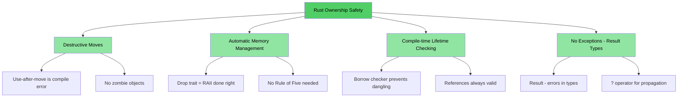
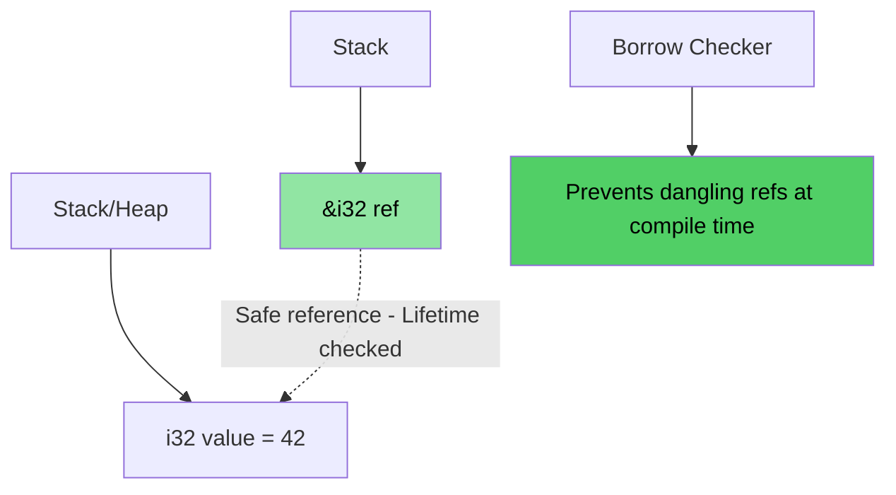
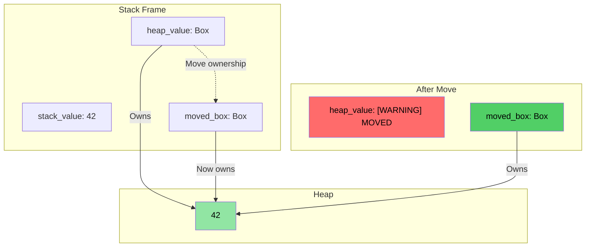
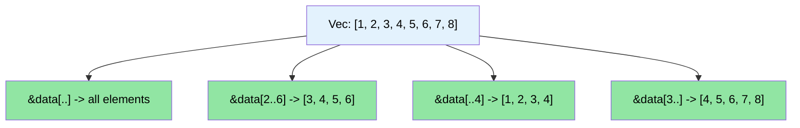

# Speaker intro and general approach / 讲师介绍与整体方法

> **What you'll learn / 你将学到：** Course structure, the interactive format, and how familiar C/C++ concepts map to Rust equivalents. This chapter sets expectations and gives you a roadmap for the rest of the book.
>
> 课程结构、互动式学习方式，以及熟悉的 C/C++ 概念如何映射到 Rust 对应概念。本章会帮助你建立预期，并为后续内容提供学习路线图。

- Speaker intro / 讲师介绍
    - Principal Firmware Architect in Microsoft SCHIE (Silicon and Cloud Hardware Infrastructure Engineering) team / Microsoft SCHIE（Silicon and Cloud Hardware Infrastructure Engineering）团队首席固件架构师
    - Industry veteran with expertise in security, systems programming (firmware, operating systems, hypervisors), CPU and platform architecture, and C++ systems / 在安全、系统编程（固件、操作系统、虚拟机监控器）、CPU 与平台架构以及 C++ 系统方面经验丰富
    - Started programming in Rust in 2017 (@AWS EC2), and have been in love with the language ever since / 2017 年在 AWS EC2 开始使用 Rust，此后长期深度投入
- This course is intended to be as interactive as possible / 本课程尽量采用高互动式教学
    - Assumption: You know C, C++, or both / 前提：你熟悉 C、C++，或者两者都熟悉
    - Examples are deliberately designed to map familiar concepts to Rust equivalents / 示例会刻意把熟悉的 C/C++ 概念映射到 Rust 对应概念
    - **Please feel free to ask clarifying questions at any point of time** / **任何时候都欢迎提出澄清性问题**
- Speaker is looking forward to continued engagement with teams / 也期待后续继续与团队深入交流

# The case for Rust / 为什么选择 Rust
> **Want to skip straight to code? / 想直接看代码？** Jump to [Show me some code / 直接跳到“给我看看代码”](ch02-getting-started.md#enough-talk-already-show-me-some-code)

Whether you're coming from C or C++, the core pain points are the same: memory safety bugs that compile cleanly but crash, corrupt, or leak at runtime.

无论你来自 C 还是 C++，核心痛点其实都一样：很多内存安全问题可以顺利编译通过，但会在运行时导致崩溃、数据损坏或内存泄漏。

- Over **70% of CVEs** are caused by memory safety issues - buffer overflows, dangling pointers, use-after-free / 超过 **70% 的 CVE** 都源于内存安全问题，例如缓冲区溢出、悬垂指针、释放后使用
- C++ `shared_ptr`, `unique_ptr`, RAII, and move semantics are steps in the right direction, but they are **bandaids, not cures** - they leave use-after-move, reference cycles, iterator invalidation, and exception safety gaps wide open / C++ 的 `shared_ptr`、`unique_ptr`、RAII 和移动语义是在往正确方向努力，但它们更像**创可贴，而不是根治方案**，因为它们仍然留下了 move 后使用、引用环、迭代器失效和异常安全等缺口
- Rust provides the performance you rely on from C/C++, but with **compile-time guarantees** for safety / Rust 保留了你依赖的 C/C++ 性能，同时提供了**编译期**安全保证

> **Deep dive / 深入阅读：** See [Why C/C++ Developers Need Rust / 为什么 C/C++ 开发者需要 Rust](ch01-1-why-c-cpp-developers-need-rust.md) for concrete vulnerability examples, the complete list of what Rust eliminates, and why C++ smart pointers aren't enough.
>
> 若想看更具体的漏洞示例、Rust 究竟消除了哪些问题，以及为什么 C++ 智能指针仍不够，请阅读 [Why C/C++ Developers Need Rust / 为什么 C/C++ 开发者需要 Rust](ch01-1-why-c-cpp-developers-need-rust.md)。

----

# How does Rust address these issues? / Rust 如何解决这些问题？

## Buffer overflows and bounds violations / 缓冲区溢出与越界访问
- All Rust arrays, slices, and strings have explicit bounds associated with them. The compiler inserts checks to ensure that any bounds violation results in a **runtime crash** (panic in Rust terms) - never undefined behavior / Rust 的数组、切片和字符串都带有明确边界。编译器会插入检查，确保任何越界访问只会导致**运行时崩溃**（Rust 中称为 panic），而不会变成未定义行为

## Dangling pointers and references / 悬垂指针与悬垂引用
- Rust introduces lifetimes and borrow checking to eliminate dangling references at **compile time** / Rust 通过生命周期和借用检查，在**编译期**消除悬垂引用
- No dangling pointers, no use-after-free - the compiler simply won't let you / 不会出现悬垂指针，也不会出现释放后使用，因为编译器根本不允许这种代码通过

## Use-after-move / move 后继续使用
- Rust's ownership system makes moves **destructive** - once you move a value, the compiler **refuses** to let you use the original. No zombie objects, no "valid but unspecified state" / Rust 的所有权系统让 move 成为**破坏性操作**：一旦值被移动，编译器就会**拒绝**你继续使用原值。不会有“僵尸对象”，也不会有“有效但状态未指定”的模糊状态

## Resource management / 资源管理
- Rust's `Drop` trait is RAII done right - the compiler automatically frees resources when they go out of scope, and **prevents use-after-move** which C++ RAII cannot / Rust 的 `Drop` trait 可以看作“真正做对了的 RAII”：资源离开作用域时自动释放，同时还能**阻止 move 后继续使用**，这一点是 C++ RAII 做不到的
- No Rule of Five needed (no copy ctor, move ctor, copy assign, move assign, destructor to define) / 不再需要 Rule of Five（不需要手写复制构造、移动构造、复制赋值、移动赋值和析构函数）

## Error handling / 错误处理
- Rust has no exceptions. All errors are values (`Result<T, E>`), making error handling explicit and visible in the type signature / Rust 没有异常机制。所有错误都是值（`Result<T, E>`），因此错误处理是显式的，并直接体现在类型签名中

## Iterator invalidation / 迭代器失效
- Rust's borrow checker **forbids modifying a collection while iterating over it**. You simply cannot write the bugs that plague C++ codebases: / Rust 的借用检查器**禁止在遍历集合时修改该集合**。很多困扰 C++ 代码库的 bug，在 Rust 中根本写不出来：
```rust
// Rust equivalent of erase-during-iteration: retain()
pending_faults.retain(|f| f.id != fault_to_remove.id);

// Or: collect into a new Vec (functional style)
let remaining: Vec<_> = pending_faults
    .into_iter()
    .filter(|f| f.id != fault_to_remove.id)
    .collect();
```

## Data races / 数据竞争
- The type system prevents data races at **compile time** through the `Send` and `Sync` traits / 类型系统会通过 `Send` 与 `Sync` trait 在**编译期**阻止数据竞争

## Memory Safety Visualization / 内存安全可视化

### Rust Ownership - Safe by Design / Rust 所有权：设计上就是安全的

```rust
fn safe_rust_ownership() {
    // Move is destructive: original is gone
    let data = vec![1, 2, 3];
    let data2 = data;           // Move happens
    // data.len();              // Compile error: value used after move
    
    // Borrowing: safe shared access
    let owned = String::from("Hello, World!");
    let slice: &str = &owned;  // Borrow - no allocation
    println!("{}", slice);     // Always safe
    
    // No dangling references possible
    /*
    let dangling_ref;
    {
        let temp = String::from("temporary");
        dangling_ref = &temp;  // Compile error: temp doesn't live long enough
    }
    */
}
```



## Memory Layout: Rust References / 内存布局：Rust 引用



### `Box<T>` Heap Allocation Visualization / `Box<T>` 堆分配示意

```rust
fn box_allocation_example() {
    // Stack allocation
    let stack_value = 42;
    
    // Heap allocation with Box
    let heap_value = Box::new(42);
    
    // Moving ownership
    let moved_box = heap_value;
    // heap_value is no longer accessible
}
```



## Slice Operations Visualization / 切片操作示意

```rust
fn slice_operations() {
    let data = vec![1, 2, 3, 4, 5, 6, 7, 8];
    
    let full_slice = &data[..];        // [1,2,3,4,5,6,7,8]
    let partial_slice = &data[2..6];   // [3,4,5,6]
    let from_start = &data[..4];       // [1,2,3,4]
    let to_end = &data[3..];           // [4,5,6,7,8]
}
```



# Other Rust USPs and features / Rust 的其他独特优势与特性
- No data races between threads (compile-time `Send`/`Sync` checking) / 线程之间不会出现数据竞争（`Send`/`Sync` 在编译期检查）
- No use-after-move (unlike C++ `std::move` which leaves zombie objects) / 没有 move 后继续使用（不同于 C++ `std::move` 可能留下“僵尸对象”）
- No uninitialized variables / 不存在未初始化变量
    - All variables must be initialized before use / 所有变量都必须初始化后才能使用
- No trivial memory leaks / 不会轻易出现“低级”内存泄漏
    - `Drop` trait = RAII done right, no Rule of Five needed / `Drop` trait 可视为“真正做对了的 RAII”，无需 Rule of Five
    - Compiler automatically releases memory when it goes out of scope / 变量离开作用域时，编译器自动释放内存
- No forgotten locks on mutexes / 不会忘记正确管理 mutex 锁
    - Lock guards are the *only* way to access the data (`Mutex<T>` wraps the data, not the access) / 锁保护对象是访问数据的*唯一*方式（`Mutex<T>` 包装的是数据本身，而不是访问路径）
- No exception handling complexity / 没有异常处理复杂性
    - Errors are values (`Result<T, E>`), visible in function signatures, propagated with `?` / 错误是值（`Result<T, E>`），体现在函数签名中，并通过 `?` 传播
- Excellent support for type inference, enums, pattern matching, zero cost abstractions / 对类型推断、枚举、模式匹配和零成本抽象有很强支持
- Built-in support for dependency management, building, testing, formatting, linting / 内建依赖管理、构建、测试、格式化和 lint 支持
    - `cargo` replaces make/CMake + lint + test frameworks / `cargo` 可以取代 make/CMake 以及一整套 lint 和测试框架组合

# Quick Reference: Rust vs C/C++ / 速查：Rust 与 C/C++ 对比

| **Concept / 概念** | **C** | **C++** | **Rust** | **Key Difference / 关键差异** |
|-------------|-------|---------|----------|-------------------|
| Memory management / 内存管理 | `malloc()/free()` | `unique_ptr`, `shared_ptr` | `Box<T>`, `Rc<T>`, `Arc<T>` | Automatic, no cycles / 自动管理，避免引用环问题 |
| Arrays / 数组 | `int arr[10]` | `std::vector<T>`, `std::array<T>` | `Vec<T>`, `[T; N]` | Bounds checking by default / 默认带边界检查 |
| Strings / 字符串 | `char*` with `\0` | `std::string`, `string_view` | `String`, `&str` | UTF-8 guaranteed, lifetime-checked / 默认 UTF-8，并带生命周期检查 |
| References / 引用 | `int* ptr` | `T&`, `T&&` (move) | `&T`, `&mut T` | Borrow checking, lifetimes / 借用检查与生命周期 |
| Polymorphism / 多态 | Function pointers / 函数指针 | Virtual functions, inheritance / 虚函数、继承 | Traits, trait objects / trait 与 trait object | Composition over inheritance / 组合优于继承 |
| Generic programming / 泛型编程 | Macros (`void*`) | Templates | Generics + trait bounds | Better error messages / 错误信息更友好 |
| Error handling / 错误处理 | Return codes, `errno` | Exceptions, `std::optional` | `Result<T, E>`, `Option<T>` | No hidden control flow / 没有隐藏控制流 |
| NULL/null safety / 空值安全 | `ptr == NULL` | `nullptr`, `std::optional<T>` | `Option<T>` | Forced null checking / 强制显式处理空值 |
| Thread safety / 线程安全 | Manual (pthreads) / 手工保证 | Manual synchronization / 手工同步 | Compile-time guarantees / 编译期保证 | Data races impossible / 数据竞争在结构上不可能 |
| Build system / 构建系统 | Make, CMake | CMake, Make, etc. | Cargo | Integrated toolchain / 一体化工具链 |
| Undefined behavior / 未定义行为 | Runtime crashes / 运行时崩溃 | Subtle UB (signed overflow, aliasing) / 隐蔽 UB（如有符号溢出、别名问题） | Compile-time errors / 编译期报错 | Safety guaranteed / 安全性更有保障 |
