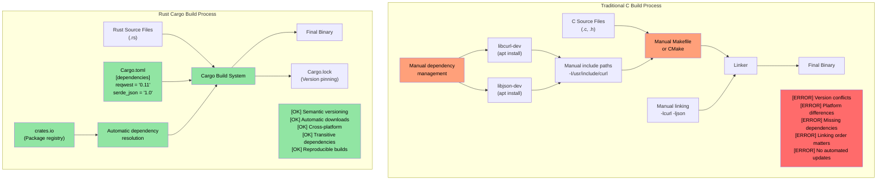

# 2. Enough talk already: Show me some code / 2. 少说多练：先看代码

> **What you'll learn / 你将学到：** Your first Rust program — `fn main()`, `println!()`, and how Rust macros differ fundamentally from C/C++ preprocessor macros. By the end you'll be able to write, compile, and run simple Rust programs.
>
> 你的第一个 Rust 程序 —— `fn main()`、`println!()` 以及 Rust 宏如何从根本上区别于 C/C++ 的预处理器宏。学完本章，你将能够编写、编译并运行简单的 Rust 程序。

```rust
fn main() {
    println!("Hello world from Rust");
}
```
- The above syntax should be similar to anyone familiar with C-style languages / 以上语法对于熟悉 C 风格语言的人来说应该很亲切
    - All functions in Rust begin with the ```fn``` keyword / Rust 中所有函数都以 ```fn``` 关键字开头
    - The default entry point for executables is ```main()``` / 可执行程序的默认入口点是 ```main()```
    - The ```println!``` looks like a function, but is actually a **macro**. Macros in Rust are very different from C/C++ preprocessor macros — they are hygienic, type-safe, and operate on the syntax tree rather than text substitution / ```println!``` 看起来像函数，但实际上是一个**宏**。Rust 中的宏与 C/C++ 的预处理器宏非常不同 —— 它们是卫生的、类型安全的，并且是在语法树上操作而非简单的文本替换
- Two great ways to quickly try out Rust snippets / 两种快速尝试 Rust 代码片段的好主意：
    - **Online / 在线**: [Rust Playground](https://play.rust-lang.org/) — paste code, hit Run, share results. No install needed / 粘贴代码、点击运行、分享结果。无需安装
    - **Local REPL / 本地 REPL**: Install [`evcxr_repl`](https://github.com/evcxr/evcxr) for an interactive Rust REPL (like Python's REPL, but for Rust) / 安装 [`evcxr_repl`](https://github.com/evcxr/evcxr) 以获得交互式 Rust REPL（像 Python 的 REPL，但用于 Rust）：
```bash
cargo install --locked evcxr_repl
evcxr   # Start the REPL, type Rust expressions interactively / 启动 REPL，交互式键入 Rust 表达式
```

### Rust Local installation / Rust 本地安装
- Rust can be locally installed using the following methods / 可以使用以下方法在本地安装 Rust：
    - Windows：https://static.rust-lang.org/rustup/dist/x86_64-pc-windows-msvc/rustup-init.exe
    - Linux / WSL：```curl --proto '=https' --tlsv1.2 -sSf https://sh.rustup.rs | sh```
- The Rust ecosystem is composed of the following components / Rust 生态由以下组件构成：
    - ```rustc``` 是独立的编译器，但很少直接使用
    - 首选工具 ```cargo``` 是万能军刀，用于依赖管理、构建、测试、格式化、代码扫描（linting）等
    - Rust 工具链有 ```stable```（稳定版）、```beta```（测试版）和 ```nightly```（开发版/实验性）三个频道，但我们会坚持使用 ```stable```。每六周发布一次新版本，使用 ```rustup update``` 命令升级 stable 安装
- We'll also install the ```rust-analyzer``` plug-in for VSCode / 我们还将为 VSCode 安装 ```rust-analyzer``` 插件

# Rust packages (crates) / Rust 包（crate）
- Rust binaries are created using packages (hereby called crates) / Rust 二进制文件是使用包（此处称为 crate）创建的
    - 一个 crate 既可以是独立的，也可以依赖于其他 crate。依赖的 crate 可以是本地的或远程的。第三方 crate 通常从名为 ```crates.io``` 的集中仓库下载。
    - ```cargo``` 工具会自动处理 crate 及其依赖项的下载。这在概念上相当于链接 C 库
    - Crate 依赖项在一个名为 ```Cargo.toml``` 的文件中表达。它还定义了 crate 的目标类型：独立可执行文件、静态库、动态库（少见）
    - 参考：https://doc.rust-lang.org/cargo/reference/cargo-targets.html

## Cargo vs Traditional C Build Systems

### Dependency Management Comparison



### Cargo Project Structure / Cargo 项目结构
 
 ```text
 my_project/
 |-- Cargo.toml          # Project configuration (like package.json) / 项目配置
 |-- Cargo.lock          # Exact dependency versions (auto-generated) / 准确的依赖版本（自动生成）
 |-- src/
 |   |-- main.rs         # Main entry point for binary / 二进制程序主入口
 |   |-- lib.rs          # Library root (if creating a library) / 库入口
 |   `-- bin/            # Additional binary targets / 额外的二进制目标
 |-- tests/              # Integration tests / 集成测试
 |-- examples/           # Example code / 示例代码
 |-- benches/            # Benchmarks / 基准测试
 `-- target/             # Build artifacts (like C's build/ or obj/) / 构建产物（相当于 C 的 build/ 或 obj/）
     |-- debug/          # Debug builds (fast compile, slow runtime) / 调试构建（编译快，运行快）
     `-- release/        # Release builds (slow compile, fast runtime) / 发布构建（编译慢，运行快）
 ```
 
### Common Cargo Commands / 常用 Cargo 命令
 
 ```mermaid
 graph LR
    subgraph "Project Lifecycle / 项目生命周期"
        NEW["cargo new my_project<br/>创建新项目"]
        CHECK["cargo check<br/>快速语法检查"]
        BUILD["cargo build<br/>编译项目"]
        RUN["cargo run<br/>构建并执行"]
        TEST["cargo test<br/>运行所有测试"]
         
         NEW --> CHECK
         CHECK --> BUILD
         BUILD --> RUN
         BUILD --> TEST
     end
     
    subgraph "Advanced Commands / 进阶命令"
        UPDATE["cargo update<br/>更新依赖"]
        FORMAT["cargo fmt<br/>格式化代码"]
        LINT["cargo clippy<br/>Lint 检查与建议"]
        DOC["cargo doc<br/>生成文档"]
        PUBLISH["cargo publish<br/>发布到 crates.io"]
    end
    
    subgraph "Build Profiles / 构建配置"
        DEBUG["cargo build<br/>调试模式<br/>编译快，运行慢<br/>带调试符号"]
        RELEASE["cargo build --release<br/>发布模式<br/>编译慢，运行快<br/>全量优化"]
    end
    
    style NEW fill:#a3d5ff,color:#000
    style CHECK fill:#91e5a3,color:#000
    style BUILD fill:#ffa07a,color:#000
    style RUN fill:#ffcc5c,color:#000
    style TEST fill:#c084fc,color:#000
    style DEBUG fill:#94a3b8,color:#000
    style RELEASE fill:#ef4444,color:#000
```

# Example: cargo and crates / 示例：cargo 与 crate
- In this example, we have a standalone executable crate with no other dependencies / 在此示例中，我们只有一个没有其他依赖项的独立可执行 crate
- Use the following commands to create a new crate called ```helloworld``` / 使用以下命令创建一个名为 ```helloworld``` 的新 crate
 ```bash
 cargo new helloworld
 cd helloworld
 cat Cargo.toml
 ```
+
+---
+
+In this book we'll primarily be using `cargo run` and `cargo test`.
+
+在本书中，我们主要会使用 `cargo run` 和 `cargo test`。
+
+Now that we hopefully have an environment setup and are ready to compile, let's jump straight in and look at some Rust language basics. 
+
+现在我们已经搭建好了环境并准备好进行编译，让我们直接进入 Rust 语言的基础知识学习。
+
+[Next: Variables and Types >>](ch03-01-variables-and-mutability.md)
+
+[下一章：变量与类型 >>](ch03-01-variables-and-mutability.md)


