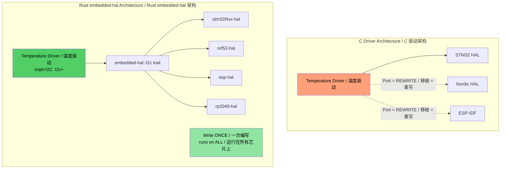
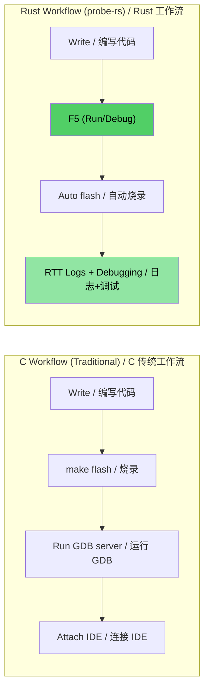

## MMIO and Volatile Register Access / MMIO 与 Volatile 寄存器访问

> **What you'll learn / 你将学到：** Type-safe hardware register access in embedded Rust — volatile MMIO patterns, register abstraction crates, and how Rust's type system can encode register permissions that C's `volatile` keyword cannot.
>
> 嵌入式 Rust 中的类型安全硬件寄存器访问 —— volatile MMIO 模式、寄存器抽象 crate，以及 Rust 的类型系统如何编码 C 语言中的 `volatile` 关键字无法表示的寄存器权限。

*In C firmware, you access hardware registers via `volatile` pointers to specific memory addresses. Rust has equivalent mechanisms — but with type safety.*

在 C 语言固件中，你通过指向特定内存地址的 `volatile` 指针来访问硬件寄存器。Rust 具有等效的机制 —— 但具备类型安全性。

---

### C volatile vs Rust volatile / C volatile vs Rust volatile

```c
// C — typical MMIO register access / 典型的 MMIO 寄存器访问
#define GPIO_BASE     0x40020000
#define GPIO_MODER    (*(volatile uint32_t*)(GPIO_BASE + 0x00))
#define GPIO_ODR      (*(volatile uint32_t*)(GPIO_BASE + 0x14))

void toggle_led(void) {
    GPIO_ODR ^= (1 << 5);  // Toggle pin 5 / 翻转引脚 5
}
```

```rust
// Rust — raw volatile (low-level, rarely used directly) / 原始 volatile（底层，极少直接使用）
use core::ptr;

const GPIO_BASE: usize = 0x4002_0000;
const GPIO_ODR: *mut u32 = (GPIO_BASE + 0x14) as *mut u32;

/// # Safety
/// Caller must ensure GPIO_BASE is a valid mapped peripheral address.
/// 调用者必须确保 GPIO_BASE 是有效的映射外设地址。
unsafe fn toggle_led() {
    // SAFETY: GPIO_ODR is a valid memory-mapped register address.
    // 安全说明：GPIO_ODR 是有效的内存映射寄存器地址。
    let current = unsafe { ptr::read_volatile(GPIO_ODR) };
    unsafe { ptr::write_volatile(GPIO_ODR, current ^ (1 << 5)) }; // 翻转位 5
}
```

---

### svd2rust — Type-Safe Register Access (the Rust way) / svd2rust —— 类型安全的寄存器访问（Rust 方式）

*In practice, you **never** write raw volatile pointers. Instead, `svd2rust` generates a **Peripheral Access Crate (PAC)** from the chip's SVD file (the same XML file used by your IDE's debug view):*

在实践中，你**绝不会**手动编写原始 volatile 指针。相反，`svd2rust` 会根据芯片的 SVD 文件（与 IDE 调试视图中使用的 XML 文件相同）生成 **外设访问 Crate (PAC)**：

```rust
// Generated PAC code (you don't write this — svd2rust does)
// 生成的 PAC 代码（不是你写的，是 svd2rust 生成的）
// The PAC makes invalid register access a compile error
// PAC 将无效的寄存器访问变为编译错误

// Usage with PAC / 配合 PAC 使用：
use stm32f4::stm32f401;  // PAC crate for your chip / 芯片对应的 PAC crate

fn configure_gpio(dp: stm32f401::Peripherals) {
    // Enable GPIOA clock / 启用 GPIOA 时钟 —— 类型安全，无魔法数字
    dp.RCC.ahb1enr.modify(|_, w| w.gpioaen().enabled());

    // Set pin 5 to output / 将引脚 5 设为输出 —— 不会意外写入只读字段
    dp.GPIOA.moder.modify(|_, w| w.moder5().output());

    // Toggle pin 5 / 翻转引脚 5 —— 类型检查过的字段访问
    dp.GPIOA.odr.modify(|r, w| {
        // SAFETY: toggling a single bit in a valid register field.
        // 安全说明：在有效寄存器字段中翻转单个位。
        unsafe { w.bits(r.bits() ^ (1 << 5)) }
    });
}
```

| **C register access / C 寄存器访问** | **Rust PAC equivalent / Rust PAC 等价物** |
|-------------------|---------------------|
| `#define REG (*(volatile uint32_t*)ADDR)` | PAC crate generated by `svd2rust` / 由 `svd2rust` 生成的 PAC crate |
| `REG |= BITMASK;` | `periph.reg.modify(|_, w| w.field().variant())` |
| `value = REG;` | `let val = periph.reg.read().field().bits()` |
| Wrong field / 错误字段 → silent UB | Compile error / 编译错误 —— 字段不存在 |
| Wrong width / 错误宽度 → silent UB | Type-checked / 类型检查 —— u8 vs u16 vs u32 |

---

## Interrupt Handling and Critical Sections / 中断处理与临界区

*C firmware uses `__disable_irq()` / `__enable_irq()` and ISR functions with `void` signatures. Rust provides type-safe equivalents.*

C 语言固件使用 `__disable_irq()` / `__enable_irq()` 以及签名为 `void` 的 ISR 函数。Rust 提供了类型安全的等价方案。

### C vs Rust Interrupt Patterns / C vs Rust 中断模式对比

```c
// C — traditional interrupt handler / 传统中断处理器
volatile uint32_t tick_count = 0;

void SysTick_Handler(void) {   // Naming critical / 命名规范至关重要 —— 弄错会导致 HardFault
    tick_count++;
}

uint32_t get_ticks(void) {
    __disable_irq();
    uint32_t t = tick_count;   // Critical section / 在临界区内读取
    __enable_irq();
    return t;
}
```

```rust
// Rust — using cortex-m and critical sections / 使用 cortex-m 和临界区
use core::cell::Cell;
use cortex_m::interrupt::{self, Mutex};

// Shared state / 由由临界区 Mutex 保护的共享状态
static TICK_COUNT: Mutex<Cell<u32>> = Mutex::new(Cell::new(0));

#[cortex_m_rt::exception]     // Ensures vector table / 属性确保正确放置在向量表中
fn SysTick() {                // Error if name mismatch / 如果名称与有效异常不匹配，则报错
    interrupt::free(|cs| {    // cs = token / cs = 临界区令牌（证明 IRQ 已禁用）
        let count = TICK_COUNT.borrow(cs).get();
        TICK_COUNT.borrow(cs).set(count + 1);
    });
}

fn get_ticks() -> u32 {
    interrupt::free(|cs| TICK_COUNT.borrow(cs).get())
}
```

---

### RTIC — Real-Time Interrupt-driven Concurrency / RTIC —— 实时中断驱动并发

*For complex firmware with multiple interrupt priorities, RTIC (formerly RTFM) provides **compile-time task scheduling with zero overhead**:*

对于具有多个中断优先级的复杂固件，RTIC（原名 RTFM）提供 **零开销的编译时任务调度**：

```rust
#[rtic::app(device = stm32f4xx_hal::pac, dispatchers = [USART1])]
mod app {
    use stm32f4xx_hal::prelude::*;

    #[shared]
    struct Shared {
        temperature: f32,   // Shared / 任务间共享 —— RTIC 管理加锁
    }

    #[local]
    struct Local {
        led: stm32f4xx_hal::gpio::Pin<'A', 5, stm32f4xx_hal::gpio::Output>,
    }

    #[init]
    fn init(cx: init::Context) -> (Shared, Local) {
        let dp = cx.device;
        let gpioa = dp.GPIOA.split();
        let led = gpioa.pa5.into_push_pull_output();
        (Shared { temperature: 25.0 }, Local { led })
    }

    // Hardware task / 硬件任务：在 SysTick 中断上运行
    #[task(binds = SysTick, shared = [temperature], local = [led])]
    fn tick(mut cx: tick::Context) {
        cx.local.led.toggle();
        cx.shared.temperature.lock(|temp| {
            // Exclusive access / RTIC 保证此处的排他性访问 —— 无需手动加锁
            *temp += 0.1;
        });
    }
}
```

**Why RTIC matters for C firmware devs / 为什么 RTIC 对 C 语言固件开发者很重要：**
- The `#[shared]` annotation replaces manual mutex management / `#[shared]` 标注取代了手动的互斥锁管理。
- Priority-based preemption is configured at compile time — no runtime overhead / 基于优先级的抢占是在编译时配置的 —— 无运行时开销。
- Deadlock-free by construction (the framework proves it at compile time) / 结构上无死锁（框架在编译时证明了这一点）。
- ISR naming errors are compile errors, not runtime HardFaults / ISR 命名错误会变为编译错误，而不是运行时的 HardFault。

---

## Panic Handler Strategies / Panic 处理器策略

*In C, when something goes wrong in firmware, you typically reset or blink an LED. Rust's panic handler gives you structured control:*

在 C 语言仪表中，当固件出错时，你通常会复位或闪烁 LED。Rust 的 panic 处理器为你提供了结构化的控制：

```rust
// Strategy 1: Halt / 策略 1：停机（用于调试 —— 连接调试器，检查状态）
use panic_halt as _;  // Infinite loop on panic

// Strategy 2: Reset / 策略 2：复位 MCU
use panic_reset as _;  // Triggers system reset

// Strategy 3: Log via probe / 策略 3：通过探针记录日志（开发阶段）
use panic_probe as _;  // Sends panic info over debug probe (with defmt)

// Strategy 4: Log then halt / 策略 4：通过 defmt 记录日志后停机
use defmt_panic as _;  // Rich panic messages over ITM/RTT

// Strategy 5: Custom handler / 策略 5：自定义处理器（生产环境固件）
use core::panic::PanicInfo;

#[panic_handler]
fn panic(info: &PanicInfo) -> ! {
    // 1. Disable IRQs / 禁用中断以防止进一步损坏
    cortex_m::interrupt::disable();

    // 2. Write info / 将 panic 信息写入预留的 RAM 区域（复位后依然存在）
    // SAFETY / 安全说明：PANIC_LOG 是链接脚本中定义的预留内存区域。
    unsafe {
        let log = 0x2000_0000 as *mut [u8; 256];
        // Write message / 写入截断的 panic 消息
        use core::fmt::Write;
        let mut writer = FixedWriter::new(&mut *log);
        let _ = write!(writer, "{}", info);
    }

    // 3. Reset or Blink / 触发看门狗复位（或闪烁错误 LED）
    loop {
        cortex_m::asm::wfi();  // Wait for interrupt / 等待中断（停机时降低功耗）
    }
}
```

---

## Linker Scripts and Memory Layout / 链接脚本与内存布局

*C firmware devs write linker scripts to define FLASH/RAM regions. Rust embedded uses the same concept via `memory.x`:*

C 语言固件开发者编写链接脚本来定义 FLASH/RAM 区域。嵌入式 Rust 通过 `memory.x` 使用相同的概念：

```ld
/* memory.x — placed at root / 放置在 crate 根目录，由 cortex-m-rt 使用 */
MEMORY
{
  /* STM32F401 values / 针对你的 MCU 进行调整 —— 这些是 STM32F401 的值 */
  FLASH : ORIGIN = 0x08000000, LENGTH = 512K
  RAM   : ORIGIN = 0x20000000, LENGTH = 96K
}

/* Optional: panic log / 可选：为 panic 日志预留空间（见上文） */
_panic_log_start = ORIGIN(RAM);
_panic_log_size  = 256;
```

```toml
# .cargo/config.toml — 设置目标和链接标志
[target.thumbv7em-none-eabihf]
runner = "probe-rs run --chip STM32F401RE"  # 使用调试探针烧录并运行
rustflags = [
    "-C", "link-arg=-Tlink.x",              # cortex-m-rt 的链接脚本
]

[build]
target = "thumbv7em-none-eabihf"            # 带有硬件 FPU 的 Cortex-M4F
```

| **C linker script / C 链接脚本** | **Rust equivalent / Rust 等价物** |
|-----------------|-----------------|
| `MEMORY { FLASH ..., RAM ... }` | `memory.x` at crate root / crate 根目录下的 `memory.x` |
| `__attribute__((section(".data")))` | `#[link_section = ".data"]` |
| `-T linker.ld` in Makefile | `-C link-arg=-Tlink.x` in `.cargo/config.toml` |
| Startup (`startup.s`) | `cortex-m-rt` `#[entry]` macro / 宏 |

---

## Writing `embedded-hal` Drivers / 编写 `embedded-hal` 驱动程序

*The `embedded-hal` crate defines traits for SPI, I2C, GPIO, UART, etc. Drivers written against these traits work on **any MCU** — this is Rust's killer feature for embedded reuse.*

`embedded-hal` crate 定义了 SPI、I2C、GPIO、UART 等 trait。基于这些 trait 编写的驱动程序可以在**任何 MCU** 上运行 —— 这是 Rust 在嵌入式领域复用性方面的“杀手级特性”。

### C vs Rust: A Temperature Sensor Driver / C vs Rust：温度传感器驱动程序对比

```c
// C — driver tightly coupled to STM32 HAL / 驱动程序与 STM32 HAL 紧耦合
#include "stm32f4xx_hal.h"

float read_temperature(I2C_HandleTypeDef* hi2c, uint8_t addr) {
    uint8_t buf[2];
    HAL_I2C_Mem_Read(hi2c, addr << 1, 0x00, I2C_MEMADD_SIZE_8BIT,
                     buf, 2, HAL_MAX_DELAY);
    int16_t raw = ((int16_t)buf[0] << 4) | (buf[1] >> 4);
    return raw * 0.0625;
}
// Problem / 问题：驱动仅适用于 STM32 HAL。移植到 Nordic = 重写。
```

```rust
// Rust — driver works on ANY MCU that implements embedded-hal / 驱动程序适用于任何实现 embedded-hal 的 MCU
use embedded_hal::i2c::I2c;

pub struct Tmp102<I2C> {
    i2c: I2C,
    address: u8,
}

impl<I2C: I2c> Tmp102<I2C> {
    pub fn new(i2c: I2C, address: u8) -> Self {
        Self { i2c, address }
    }

    pub fn read_temperature(&mut self) -> Result<f32, I2C::Error> {
        let mut buf = [0u8; 2];
        self.i2c.write_read(self.address, &[0x00], &mut buf)?;
        let raw = ((buf[0] as i16) << 4) | ((buf[1] as i16) >> 4);
        Ok(raw as f32 * 0.0625)
    }
}

// Works on STM32, Nordic, ESP32, RP2040 — any MCU / 适用于 STM32、nRF、ESP32、RP2040 以及任何具有 I2C 实现的芯片
```



---

## Global Allocator Setup / 全局分配器设置

*The `alloc` crate gives you `Vec`, `String`, `Box` — but you need to tell Rust where heap memory comes from. This is the equivalent of implementing `malloc()` for your platform:*

`alloc` crate 为你提供了 `Vec`、`String`、`Box` —— 但你需要告诉 Rust 堆内存从何处而来。这相当于为你的平台实现 `malloc()`：

```rust
#![no_std]
extern crate alloc;
use embedded_alloc::Heap;

#[global_allocator]
static HEAP: Heap = Heap::empty();

#[entry]
fn main() -> ! {
    // Initialize the allocator with a memory region
    // (typically a portion of RAM not used by stack or static data)
    // 初始化带有内存区域的分配器（通常是栈和静态数据之外的 RAM 区域）
    {
        const HEAP_SIZE: usize = 4096;
        static mut HEAP_MEM: [u8; HEAP_SIZE] = [0; HEAP_SIZE];
        // SAFETY / 安全说明：HEAP_MEM 仅在分配开始前的初始化期间在此处访问。
        unsafe { HEAP.init(HEAP_MEM.as_ptr() as usize, HEAP_SIZE) }
    }

    // Now use heap types / 现在可以使用堆类型了！
    let mut log_buffer: Vec<u8> = Vec::with_capacity(256);
    let name: String = String::from("sensor_01");
    // // ...

    loop {}
}
```

| **C heap setup / C 堆设置** | **Rust equivalent / Rust 等价物** |
|-------------|-----------------|
| `_sbrk()` / custom `malloc()` | `#[global_allocator]` + `Heap::init()` |
| `configTOTAL_HEAP_SIZE` (FreeRTOS) | `HEAP_SIZE` constant / `HEAP_SIZE` 常量 |
| `pvPortMalloc()` | `alloc::vec::Vec::new()` — automatic / 自动完成 |
| Exhaustion / 堆耗尽 → UB | `alloc_error_handler` → controlled panic |

---

## Mixed `no_std` + `std` Workspaces / 混合使用 `no_std` 与 `std` 的工作区

*Real projects (like a large Rust workspace) often have `no_std` library crates for hardware-portable logic and `std` binary crates for the Linux application layer.*

实际项目（如大型 Rust 工作区）通常包含包含硬件可移植逻辑的 `no_std` 库 crate 和针对 Linux 应用层的 `std` 二进制 crate。

```text
workspace_root/
├── Cargo.toml
├── protocol/               # Library crate
│   ├── Cargo.toml          # #![no_std]
│   └── src/lib.rs
├── firmware/               # MCU binary
│   ├── Cargo.toml          # #![no_std], depends on protocol
│   └── src/main.rs
└── host_tool/              # Linux binary
    ├── Cargo.toml          # depends on protocol
    └── src/main.rs         # Uses std::fs, std::net, etc.
```

*The key pattern: the `protocol` crate uses `#![no_std]` so it compiles for **both** the MCU firmware and the Linux host tool. Shared code, zero duplication.*

关键点在于：`protocol` crate 使用了 `#![no_std]`，因此它可以**同时**为 MCU 固件和 Linux 主机工具编译。代码共享，零冗余。

```toml
# protocol/Cargo.toml / 协议 crate 的配置
[package]
name = "protocol"

[features]
default = []
std = []  # Optional: enable std-specific features when building for host

[dependencies]
serde = { version = "1", default-features = false, features = ["derive"] }
# Note / 注意：default-features = false 删除了 serde 对 std 的依赖
```

```rust
// protocol/src/lib.rs
#![cfg_attr(not(feature = "std"), no_std)]

#[derive(serde::Serialize, serde::Deserialize, defmt::Format)]
pub struct DiagPacket {
    pub sensor_id: u16,
    pub value: i32,
    pub fault_code: u16,
}

// Works in both / 此函数同时适用于 no_std 和 std 环境
pub fn parse_packet(data: &[u8]) -> Result<DiagPacket, &'static str> {
    if data.len() < 8 {
        return Err("packet too short");
    }
    Ok(DiagPacket {
        sensor_id: u16::from_le_bytes([data[0], data[1]]),
        value: i32::from_le_bytes([data[2], data[3], data[4], data[5]]),
        fault_code: u16::from_le_bytes([data[6], data[7]]),
    })
}
```

---

## Exercise: Hardware Abstraction Layer Driver / 练习：硬件抽象层驱动

*Write a `no_std` driver for a hypothetical LED controller that communicates over SPI. The driver should be generic over any SPI implementation using `embedded-hal`.*

为一个通过 SPI 通信的虚拟 LED 控制器编写 `no_std` 驱动程序。驱动程序应对使用 `embedded-hal` 的任何 SPI 实现泛型化。

**Requirements / 需求：**
1. 定义 `LedController<SPI>` 结构体
2. 实现 `new()`、`set_brightness(led: u8, brightness: u8)` 和 `all_off()`
3. SPI 协议：将 `[led_index, brightness_value]` 作为 2 字节事务发送
4. 使用 Mock SPI 实现编写测试

```rust
// Starter code / 入门代码
#![no_std]
use embedded_hal::spi::SpiDevice;

pub struct LedController<SPI> {
    spi: SPI,
    num_leds: u8,
}

// TODO: Implement / 待办：实现相关方法
// TODO: Create MockSpi / 待办：创建测试用的 MockSpi
```

<details><summary>Solution / 解决方案（点击展开）</summary>

```rust
#![no_std]
use embedded_hal::spi::SpiDevice;

impl<SPI: SpiDevice> LedController<SPI> {
    pub fn new(spi: SPI, num_leds: u8) -> Self {
        Self { spi, num_leds }
    }

    pub fn set_brightness(&mut self, led: u8, brightness: u8) -> Result<(), SPI::Error> {
        if led >= self.num_leds {
            return Ok(()); // Ignore out-of-range / 静默忽略越界引脚
        }
        self.spi.write(&[led, brightness])
    }

    pub fn all_off(&mut self) -> Result<(), SPI::Error> {
        for i in 0..self.num_leds {
            self.set_brightness(i, 0)?;
        }
        Ok(())
    }
}

#[cfg(test)]
mod tests {
    use super::*;

    // Mock SPI / 记录所有事务的 Mock SPI
    struct MockSpi {
        transactions: Vec<Vec<u8>>,
    }

    // Minimal error / Mock 使用的极简错误类型
    #[derive(Debug)]
    struct MockError;
    impl embedded_hal::spi::Error for MockError {
        fn kind(&self) -> embedded_hal::spi::ErrorKind {
            embedded_hal::spi::ErrorKind::Other
        }
    }

    impl embedded_hal::spi::ErrorType for MockSpi {
        type Error = MockError;
    }

    impl SpiDevice for MockSpi {
        fn transaction(&mut self, operations: &mut [embedded_hal::spi::Operation<'_, u8>]) -> Result<(), Self::Error> {
             for op in operations {
                 if let embedded_hal::spi::Operation::Write(buf) = op {
                     self.transactions.push(buf.to_vec());
                 }
             }
             Ok(())
        }
    }

    #[test]
    fn test_led_controller() {
         let spi = MockSpi { transactions: Vec::new() };
         let mut controller = LedController::new(spi, 8);
         controller.set_brightness(0, 255).unwrap();
         assert_eq!(controller.spi.transactions[0], vec![0, 255]);
    }
}
```

</details>

---

## Debugging Embedded Rust — probe-rs, defmt, and VS Code / 嵌入式 Rust 调试 —— probe-rs、defmt 与 VS Code

*C firmware developers typically debug with OpenOCD + GDB or vendor-specific IDEs (Keil, IAR, Segger Ozone). Rust's embedded ecosystem has converged on **probe-rs** as the unified debug probe interface, replacing the OpenOCD + GDB stack with a single, Rust-native tool.*

C 固件开发者通常使用 OpenOCD + GDB 或厂商特定的 IDE（Keil、IAR、Segger Ozone）进行调试。Rust 嵌入式生态系统已经趋向于使用 **probe-rs** 作为统一调试探针接口，用一个 Rust 原生工具取代了 OpenOCD + GDB 栈。

### probe-rs — The All-in-One Debug Probe Tool / probe-rs —— 全能调试探针工具

*`probe-rs` replaces the OpenOCD + GDB combination. It supports CMSIS-DAP, ST-Link, J-Link, and other debug probes out of the box:*

`probe-rs` 取代了 OpenOCD + GDB 的组合。它开箱即用地支持 CMSIS-DAP、ST-Link、J-Link 等调试探针：

```bash
# Install probe-rs / 安装 probe-rs (包含 cargo-flash 和 cargo-embed)
cargo install probe-rs-tools

# Flash and run / 烧录并运行固件
cargo flash --chip STM32F401RE --release

# Flash and RTT / 烧录、运行并打开 RTT（实时传输）控制台
cargo embed --chip STM32F401RE
```

| **Aspect / 维度** | **OpenOCD + GDB** | **probe-rs** |
|--------|--------------|----------|
| Install / 安装 | 2 separate pkgs / 两个独立包 + 脚本 | `cargo install probe-rs-tools` |
| Config / 配置 | 针对开发板/探针的 `.cfg` 文件 | `--chip` flag or `Embed.toml` / `--chip` 或 `Embed.toml` |
| Console / 控制台 | Semihosting (极慢) | RTT (约快 10 倍) |
| Log / 日志 | `printf` | `defmt` (结构化、零成本) |
| Flash / 烧录 | XML pack 文件 / XML pack 文件 | Built-in for 1000+ chips / 内置支持 1000+ 芯片 |
| GDB support / 支持 | Native / 原生 | `probe-rs gdb` 适配器 |

---

### `Embed.toml` — Project Configuration / `Embed.toml` —— 项目配置

*Instead of juggling `.cfg` and `.gdbinit` files, probe-rs uses a single config:*

probe-rs 使用单一配置，省去了在 `.cfg` 和 `.gdbinit` 文件之间周旋的烦恼：

```toml
# Embed.toml — 放置在项目根目录
[default.general]
chip = "STM32F401RETx"

[default.rtt]
enabled = true           # 启用 RTT 控制台
channels = [
    { up = 0, mode = "BlockIfFull", name = "Terminal" },
]

[default.flashing]
enabled = true           # 运行前进行烧录
restore_unwritten_bytes = false

[default.reset]
halt_afterwards = false  # 烧录并复位后开始运行

[default.gdb]
enabled = false          # 设为 true 以在 1337 端口暴露 GDB 服务
gdb_connection_string = "127.0.0.1:1337"
```

```bash
# With Embed.toml / 有了配置后只需运行：
cargo embed              # 烧录 + RTT 控制台 —— 无需额外参数
cargo embed --release    # Release 构建
```

---

### defmt — Deferred Formatting for Embedded Logging / defmt —— 针对嵌入式日志的延迟格式化

*`defmt` (deferred formatting) replaces `printf` debugging. Format strings are stored in the ELF file, not in flash — so log calls on the target send only an index + argument bytes. This makes logging **10–100× faster** than `printf` and uses a fraction of the flash space:*

`defmt` 取代了 `printf` 调试。格式化字符串存储在 ELF 文件中，而不是 FLASH 中 —— 因此目标机上的日志调用仅发送索引和参数字节。这使得日志记录比 `printf` **快 10–100 倍**，且仅消耗极小一部分 FLASH 空间：

```rust
#![no_std]
#![no_main]

use defmt::{info, warn, error, debug, trace};
use defmt_rtt as _; // RTT transport / RTT 传输 —— 将 defmt 输出链接到 probe-rs

#[cortex_m_rt::entry]
fn main() -> ! {
    info!("Boot complete, firmware v{}", env!("CARGO_PKG_VERSION"));

    let sensor_id: u16 = 0x4A;
    let temperature: f32 = 23.5;

    // Minimal overhead / 格式化字符串留在 ELF 中，不在 FLASH 中 —— 近乎零开销
    debug!("Sensor {:#06X}: {:.1}°C", sensor_id, temperature);

    if temperature > 80.0 {
        warn!("Overtemp on sensor {:#06X}: {:.1}°C", sensor_id, temperature);
    }

    loop {
        cortex_m::asm::wfi(); // Wait for IRQ / 等待中断
    }
}

// Custom types / 自定义类型 —— 派生 defmt::Format 替代 Debug
#[derive(defmt::Format)]
struct SensorReading {
    id: u16,
    value: i32,
    status: SensorStatus,
}

#[derive(defmt::Format)]
enum SensorStatus {
    Ok,
    Warning,
    Fault(u8),
}

// info!("Reading: {:?}", reading);  // <-- 使用 Format trait，而非 std Debug
```

**defmt vs `printf` vs `log` 对比：**

| **Feature / 特性** | **C `printf`** | **Rust `log`** | **`defmt`** |
|---------|-------------------------|-------------------|---------|
| Speed / 速度 | ~100ms / call | N/A (needs std) | ~1μs / call |
| Flash / 占用 | 全量格式化字符串 | 全量字符串 | Index only (bytes) / 仅索引 (字节) |
| Transport / 传输 | Semihosting (停掉 CPU) | 串口/UART | RTT (无阻塞) |
| 结构化输出 | ❌ 否 | 仅文本 | ✅ 有类型、二进制编码 |
| `no_std` | Semihosting / 模拟 | Facade only / 门面 | ✅ Native / 原生 |
| Filter / 过滤 | 手动 `#ifdef` | 环境变量 | 通过特性开关 |

---

### VS Code Debug Configuration / VS Code 调试配置

*With the `probe-rs` VS Code extension, you get full graphical debugging — breakpoints, variable inspection, call stack, and register view:*

通过 `probe-rs` 的 VS Code 扩展，你可以获得全图形化调试 —— 断点、变量检查、调用栈以及寄存器视图：

```jsonc
// .vscode/launch.json / VS Code 启动配置
{
    "version": "0.2.0",
    "configurations": [
        {
            "type": "probe-rs-debug",
            "request": "launch",
            "name": "STM32F4-Debug",
            "chip": "STM32F401RETx",
            "flashingConfig": {
                "enabled": true
            },
            "coreConfigs": [
                {
                    "coreIndex": 0,
                    "rttEnabled": true
                }
            ]
        }
    ]
}
```

*Install the extension / 安装扩展：*
`ext install probe-rs.probe-rs-debugger`

### C Debugger Workflow vs Rust Embedded Debugging / C 调试工作流 vs Rust 嵌入式调试


