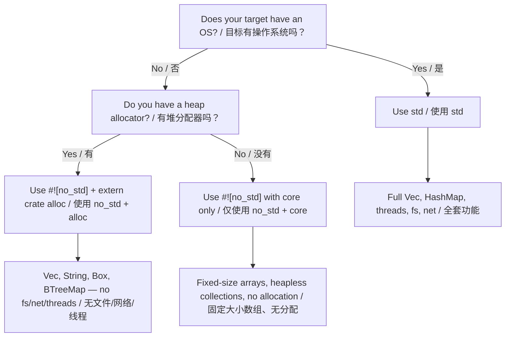

# `no_std` — Rust Without the Standard Library / `no_std` —— 不依赖标准库的 Rust

> **What you'll learn / 你将学到：** How to write Rust for bare-metal and embedded targets using `#![no_std]` — the `core` and `alloc` crate split, panic handlers, and how this compares to embedded C without `libc`.
>
> 如何使用 `#![no_std]` 为裸机和嵌入式目标编写 Rust 代码 —— `core` 和 `alloc` crate 的划分、panic 处理器，以及这与不带 `libc` 的嵌入式 C 的对比。

*If you come from embedded C, you're already used to working without `libc` or with a minimal runtime. Rust has a first-class equivalent: the **`#![no_std]`** attribute.*

如果你来自嵌入式 C 领域，你已经习惯了在没有 `libc` 或只有极简运行时的情况下工作。Rust 有一个一流的等价物：**`#![no_std]`** 属性。

---

## What is `no_std`? / 什么是 `no_std`？

*When you add `#![no_std]` to the crate root, the compiler removes the implicit `extern crate std;` and links only against **`core`** (and optionally **`alloc`**).*

当你在 crate 根部添加 `#![no_std]` 时，编译器会移除隐式的 `extern crate std;`，并仅链接到 **`core`**（以及可选的 **`alloc`**）。

| **Layer / 层级** | **What it provides / 提供内容** | **Requires OS / heap? / 需要 OS/堆？** |
|-------|-----------------|---------------------|
| `core` | Primitive types, `Option`, `Result`, `Iterator`, math, `slice`, `str`, atomics, `fmt` | **No** — runs on bare metal / 否 —— 可在裸机运行 |
| `alloc` | `Vec`, `String`, `Box`, `Rc`, `Arc`, `BTreeMap` | Needs allocator / 需要分配器，但**无需 OS** |
| `std` | `HashMap`, `fs`, `net`, `thread`, `io`, `env`, `process` | **Yes** — needs an OS / 是 —— 需要操作系统 |

> **Rule of thumb for embedded devs / 嵌入式开发者的经验法则：**
> *If your C project links against `-lc` and uses `malloc`, you can probably use `core` + `alloc`. If it runs on bare metal without `malloc`, stick with `core` only.*
> 
> 如果你的 C 项目链接了 `-lc` 并且使用了 `malloc`，你大概可以使用 `core` + `alloc`。如果它是在没有 `malloc` 的情况下在裸机上运行，请坚持仅使用 `core`。

---

## Declaring `no_std` / 声明 `no_std`

```rust
// src/lib.rs (or src/main.rs for a binary with #![no_main]) / 或用于带 #![no_main] 的二进制
#![no_std]

// You still get everything in `core` / 你仍然拥有 core 中的一切：
use core::fmt;
use core::result::Result;
use core::option::Option;

// If you have an allocator, opt in to heap types / 如果你有分配器，可以启用堆类型：
extern crate alloc;
use alloc::vec::Vec;
use alloc::string::String;
```

*For a bare-metal binary you also need `#![no_main]` and a panic handler:*

对于裸机二进制文件，你还需要 `#![no_main]` 和一个 panic 处理器：

```rust
#![no_std]
#![no_main]

use core::panic::PanicInfo;

#[panic_handler]
fn panic(_info: &PanicInfo) -> ! {
    loop {} // hang on panic / 发生 panic 时挂起 —— 替换为你开发板的复位/LED 闪烁代码
}
```

---

## What you lose (and alternatives) / 失去了什么（以及替代方案）

| **`std` feature / std 特性** | **`no_std` alternative / no_std 替代方案** |
|---------------|---------------------|
| `println!` | `core::write!` to UART / `defmt` |
| `HashMap` | `heapless::FnvIndexMap` (fixed) or `BTreeMap` |
| `Vec` | `heapless::Vec` (stack-allocated / 栈分配) |
| `String` | `heapless::String` or `&str` |
| `std::io::Read/Write` | `embedded_io::Read/Write` |
| `thread::spawn` | Interrupts / 中断处理器、RTIC 任务 |
| `std::time` | Hardware timers / 硬件定时器外设 |
| `std::fs` | Flash / EEPROM drivers / 驱动程序 |

---

## Notable `no_std` crates for embedded / 值得关注的嵌入式 `no_std` Crate

| **Crate** | **Purpose / 用途** | **Notes / 说明** |
|-------|---------|-------|
| [`heapless`](https://crates.io/crates/heapless) | Fixed-capacity collections / 固定容量集合 | No allocator / 无需分配器 —— 全在栈上 |
| [`defmt`](https://crates.io/crates/defmt) | Efficient logging / 高效日志 | Like `printf` / 类似 printf 但在主机端延迟格式化 |
| [`embedded-hal`](https://crates.io/crates/embedded-hal) | HW abstraction / 硬件抽象 Trait | Implement once / 一次实现，处处运行 |
| [`cortex-m`](https://crates.io/crates/cortex-m) | ARM Cortex-M register access / 寄存器访问 | Low-level / 底层，类似 CMSIS |
| [`cortex-m-rt`](https://crates.io/crates/cortex-m-rt) | Runtime/startup / 运行时/启动代码 | Replaces `startup.s` / 替代你的 `startup.s` |
| [`rtic`](https://crates.io/crates/rtic) | Real-Time Concurrency / 实时并发 | Compile-time scheduling / 编译时任务调度 |
| [`embassy`](https://crates.io/crates/embassy-executor) | Async executor / 异步执行器 | `async/await` on bare metal / 裸机上的异步 |
| [`postcard`](https://crates.io/crates/postcard) | Binary serialization / 二进制序列化 | Replaces `serde_json` / 替代 `serde_json` |
| [`thiserror`](https://crates.io/crates/thiserror) | Derive for `Error` / 为 Error trait 准备的派生宏 | Works in `no_std` / 在 `no_std` 中可用 |
| [`smoltcp`](https://crates.io/crates/smoltcp) | TCP/IP stack / TCP/IP 协议栈 | Networking without OS / 无需 OS 即可联网 |

---

## C vs Rust: bare-metal comparison / C vs Rust：裸机对比

*A typical embedded C blinky:*

一个典型的嵌入式 C 语言 LED 闪烁程序：

```c
// C — bare metal, vendor HAL / 裸机环境，厂商 HAL
#include "stm32f4xx_hal.h"

void SysTick_Handler(void) {
    HAL_GPIO_TogglePin(GPIOA, GPIO_PIN_5);
}

int main(void) {
    HAL_Init();
    __HAL_RCC_GPIOA_CLK_ENABLE();
    GPIO_InitTypeDef gpio = { .Pin = GPIO_PIN_5, .Mode = GPIO_MODE_OUTPUT_PP };
    HAL_GPIO_Init(GPIOA, &gpio);
    HAL_SYSTICK_Config(HAL_RCC_GetHCLKFreq() / 1000);
    while (1) {}
}
```

*The Rust equivalent (using `embedded-hal` + a board crate):*

Rust 的等效实现（使用 `embedded-hal` + 开发板 crate）：

```rust
#![no_std]
#![no_main]

use cortex_m_rt::entry;
use panic_halt as _; // panic handler / panic 处理器：死循环
use stm32f4xx_hal::{pac, prelude::*};

#[entry]
fn main() -> ! {
    let dp = pac::Peripherals::take().unwrap();
    let gpioa = dp.GPIOA.split();
    let mut led = gpioa.pa5.into_push_pull_output();

    let rcc = dp.RCC.constrain();
    let clocks = rcc.cfgr.freeze();
    let mut delay = dp.TIM2.delay_ms(&clocks);

    loop {
        led.toggle();
        delay.delay_ms(500u32);
    }
}
```

**Key differences for C devs / 给 C 开发者的关键区别说明：**
- `Peripherals::take()` returns `Option` — ensures the singleton pattern at compile time / 确保在编译时满足单例模式（无重复初始化 bug）。
- `.split()` moves ownership of individual pins / 转移了单个引脚的所有权 —— 不存在两个模块驱动同一个引脚的风险。
- All register access is type-checked / 所有寄存器访问都经过类型检查 —— 你不会意外地写入只读寄存器。
- The borrow checker prevents data races (with RTIC) / 借用检查器防止了数据竞态（配合 RTIC）。

---

## When to use `no_std` vs `std` / 何时使用 `no_std` 或 `std`



---

# Exercise: `no_std` ring buffer / 练习：`no_std` 环形缓冲区

*🔴 **Challenge** — combines generics, `MaybeUninit`, and `#[cfg(test)]` in a `no_std` context*

🔴 **Challenge / 挑战题** —— 在 `no_std` 环境中结合运用泛型、`MaybeUninit` 和 `#[cfg(test)]`

*In embedded systems you often need a fixed-size ring buffer (circular buffer) that never allocates. Implement one using only `core` (no `alloc`, no `std`).*

在嵌入式系统中，你经常需要一个从不发生分配的固定大小环形缓冲区（Ring Buffer）。请仅使用 `core`（不使用 `alloc` 和 `std`）实现一个。

**Requirements / 需求：**
- 对元素类型 `T: Copy` 泛型化
- 固定容量 `N`（常量泛型）
- `push(&mut self, item: T)` —— 存满时覆盖最旧的元素
- `pop(&mut self) -> Option<T>` —— 返回最旧的元素
- `len(&self) -> usize`, `is_empty(&self) -> bool`
- 必须能在 `#![no_std]` 下编译

```rust
// Starter code / 入门代码
#![no_std]
use core::mem::MaybeUninit;

pub struct RingBuffer<T: Copy, const N: usize> {
    buf: [MaybeUninit<T>; N], // 缓冲区
    head: usize,  // next write / 下一个写入位置
    tail: usize,  // next read / 下一个读取位置
    count: usize,
}

// TODO: Implement / 待办：实现相关方法
```

<details><summary>Solution / 解决方案（点击展开）</summary>

```rust
#![no_std]
use core::mem::MaybeUninit;

impl<T: Copy, const N: usize> RingBuffer<T, N> {
    pub const fn new() -> Self {
        Self {
            // SAFETY: MaybeUninit does not require initialization / 安全说明：MaybeUninit 不需要初始化
            buf: unsafe { MaybeUninit::uninit().assume_init() },
            head: 0,
            tail: 0,
            count: 0,
        }
    }

    pub fn push(&mut self, item: T) {
        self.buf[self.head] = MaybeUninit::new(item);
        self.head = (self.head + 1) % N;
        if self.count == N {
            // Buffer full / 缓冲区已满 —— 覆盖最旧项，移动末端索引
            self.tail = (self.tail + 1) % N;
        } else {
            self.count += 1;
        }
    }

    pub fn pop(&mut self) -> Option<T> {
        if self.count == 0 {
            return None;
        }
        // SAFETY / 安全说明：我们只读取之前经由 push() 写入的位置
        let item = unsafe { self.buf[self.tail].assume_init() };
        self.tail = (self.tail + 1) % N;
        self.count -= 1;
        Some(item)
    }

    pub fn len(&self) -> usize { self.count }
    pub fn is_empty(&self) -> bool { self.count == 0 }
}
```

**Why this matters for embedded C devs / 为什么这对嵌入式 C 开发者很重要：**
- `MaybeUninit` is Rust's equivalent of uninitialized memory — like `char buf[N];` in C / `MaybeUninit` 是 Rust 对“未初始化内存”的等价处理方式。
- The `unsafe` blocks are minimal and documented / `unsafe` 块极少且带有注释。
- `const fn new()` allows static allocation without runtime constructor / 允许直接在 `static` 变量中创建，无运行时构造开销。
- Tests run on host with `cargo test` / 即使是 `no_std` 代码，测试也可以在主机端运行。

</details>
