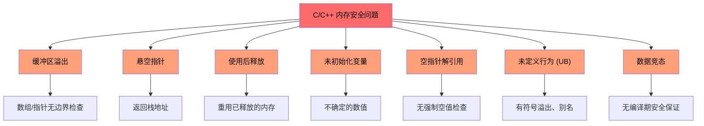
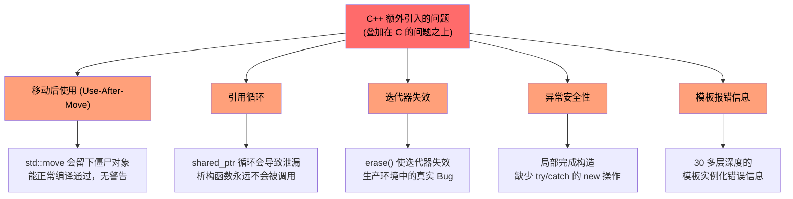
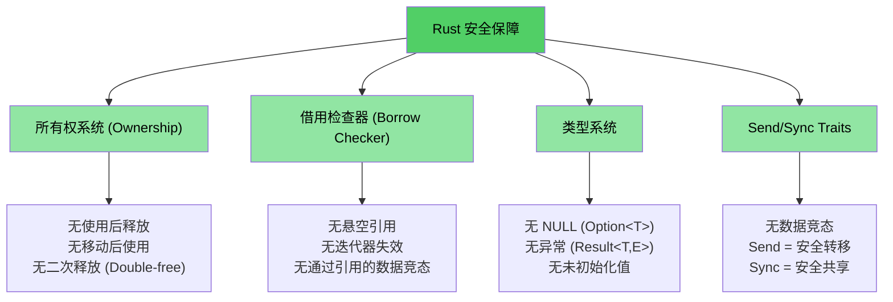

[English Original](../en/ch01-1-why-c-cpp-developers-need-rust.md)

# 为什么 C/C++ 开发者需要 Rust

> **你将学到：**
> - Rust 消除的问题完整清单 —— 内存安全、未定义行为、数据竞态等
> - 为什么 `shared_ptr`、`unique_ptr` 及其它 C++ 缓解措施只是权宜之计，而非根本落地方案
> - 具体的 C 和 C++ 漏洞案例，这些在安全的 Rust 中从结构上就是不可能发生的

> **想直接看代码？** 请跳至 [少说废话：直接看代码](ch02-getting-started.md#enough-talk-already-show-me-some-code)

## Rust 消除的问题 —— 完整清单

在深入研究案例之前，先看一份执行摘要。安全的 Rust **从结构上防止了**下表中的每一个问题 —— 文明、工具链或代码审查，而是通过类型系统和编译器实现的：

| **已消除的问题** | **C** | **C++** | **Rust 是如何防止的** |
|----------------------|:-----:|:-------:|--------------------------|
| 缓冲区上溢 / 下溢 | ✅ | ✅ | 所有数组、切片和字符串都带有边界；索引访问在运行时进行检查 |
| 内存泄漏 (无需 GC) | ✅ | ✅ | `Drop` trait = 实现正确的 RAII；自动清理，无需“五法则” |
| 悬空指针 (Dangling pointers) | ✅ | ✅ | 生命周期系统在编译期证明引用比其引用的对象存活更久 |
| 使用后释放 (Use-after-free) | ✅ | ✅ | 所有权系统使这成为编译错误 |
| 移动后使用 (Use-after-move) | — | ✅ | 移动是**破坏性**的 —— 原绑定关系将不复存在 |
| 未初始化变量 | ✅ | ✅ | 所有变量在使用前必须被初始化；编译器强制执行这一点 |
| 整数上溢 / 下溢 UB | ✅ | ✅ | 调试构建 (Debug) 在溢出时触发 Panic；发布构建 (Release) 执行环绕 (无论哪种都是已定义行为) |
| 空指针解引用 / 段错误 (SEGV) | ✅ | ✅ | 不存在空指针；`Option<T>` 强制执行显式处理 |
| 数据竞态 (Data races) | ✅ | ✅ | `Send`/`Sync` trait + 借用检查器使数据竞态成为编译错误 |
| 不受控的副作用 | ✅ | ✅ | 默认不可变；修改操作需要显式的 `mut` 关键字 |
| 不使用继承 (更好的可维护性) | — | ✅ | Trait + 组合取代类继承层级；促进重用而不产生耦合 |
| 无异常；可预测的控制流 | — | ✅ | 错误即是值 (`Result<T, E>`)；无法被忽略，没有隐藏的 `throw` 路径 |
| 迭代器失效 | — | ✅ | 借用检查器禁止在迭代的同时修改集合 |
| 引用循环 / 泄漏的析构 | — | ✅ | 所有权呈树状结构；`Rc` 循环属于可选功能，且可用 `Weak` 捕获 |
| 忘记 Mutex 解锁 | ✅ | ✅ | `Mutex<T>` 包裹数据；Lock Guard 是访问数据的唯一途径 |
| 未定义行为 (通用) | ✅ | ✅ | 安全 Rust **零**未定义行为；`unsafe` 块是显式的且可审计的 |

> **核心结论**：这些不是通过编码标准强制执行的理想目标，而是**编译期的保证**。如果你的代码能编译通过，这些 Bug 就不可能存在。

---

## C 和 C++ 共同的问题

> **想跳过案例？** 直接跳至 [Rust 如何解决这一切](#how-rust-addresses-all-of-this) 或 [少说废话：直接看代码](ch02-getting-started.md#enough-talk-already-show-me-some-code)

两种语言都共有一组核心内存安全问题，这正是超过 70% 的 CVE (常见漏洞与披露) 的根源：

### 缓冲区溢出 (Buffer overflows)

C 数组、指针和字符串没有固有的边界。越过这些边界非常容易：

```c
#include <stdlib.h>
#include <string.h>

void buffer_dangers() {
    char buffer[10];
    strcpy(buffer, "字符串太长了，无法放入缓冲区！");  // 缓冲区溢出

    int arr[5] = {1, 2, 3, 4, 5};
    int *ptr = arr;           // 丢失了长度信息
    ptr[10] = 42;             // 无边界检查 —— 未定义行为
}
```

在 C++ 中，`std::vector::operator[]` 仍然不执行边界检查。只有 `.at()` 会执行 —— 但谁会去捕获那个异常呢？

### 悬空指针与使用后释放

```c
int *bar() {
    int i = 42;
    return &i;    // 返回栈变量的地址 —— 悬空指针！
}

void use_after_free() {
    char *p = (char *)malloc(20);
    free(p);
    *p = '\0';   // 使用后释放 —— 未定义行为
}
```

### 未初始化变量与未定义行为

C 和 C++ 都允许使用未初始化的变量。结果值是不确定的，读取它们属于未定义行为：

```c
int x;               // 未初始化
if (x > 0) { ... }  // UB —— x 可能是任何值
```

整数溢出在 C 中对无符号类型是**已定义**的，但对有符号类型是**未定义**的。在 C++ 中，有符号溢出也是未定义行为。两种编译器都可以且确实在利用这一点进行“优化”，从而以令人惊讶的方式破坏程序。

### 空指针解引用 (NULL pointer dereferences)

```c
int *ptr = NULL;
*ptr = 42;           // 段错误 (SEGV) —— 但编译器不会阻止你
```

在 C++ 中，`std::optional<T>` 有所帮助，但它不仅繁琐，而且经常被 `.value()` 绕过，从而抛出异常。

### 可视化：共同的问题



---

## C++ 额外引入的问题

> **只使用 C 的读者**：如果你不使用 C++，可以[直接跳到 Rust 如何解决这些问题](#how-rust-addresses-all-of-this)。
>
> **想直接看代码？** 请跳至 [少说废话：直接看代码](ch02-getting-started.md#enough-talk-already-show-me-some-code)

C++ 引入了智能指针、RAII、移动语义和异常来解决 C 的问题。但这些只是**权宜之计，而非根本性的方案** —— 它们只是将失败模式从“运行时崩溃”转变成了“运行时更隐蔽的 Bug”：

### `unique_ptr` 与 `shared_ptr` —— 只是缓解，而非解决

C++ 的智能指针相比原始的 `malloc`/`free` 是一个巨大的进步，但它们并未解决底层问题：

| C++ 缓解措施 | 修复了什么 | **未**修复什么 |
|----------------|---------------|------------------------|
| `std::unique_ptr` | 通过 RAII 防止内存泄漏 | **移动后使用 (Use-after-move)** 依然能编译通过；会留下一个僵尸 `nullptr` |
| `std::shared_ptr` | 共享所有权 | **引用循环**会导致静默的内存泄漏；`weak_ptr` 的规范化使用仍靠自觉 |
| `std::optional` | 替代了部分空值使用 | 如果为空，`.value()` 会**抛出异常** —— 产生隐藏的控制流 |
| `std::string_view` | 避免多余的拷贝 | 如果源字符串被释放，则变为**悬空引用** —— 没有任何生命周期检查 |
| 移动语义 (Move semantics) | 高效的所有权转移 | 移动后的对象处于**“有效但未指定状态”** —— 随时可能引发 UB |
| RAII | 自动资源清理 | 需要精准遵守**“五法则”**才能做到正确；任何一个错误都会引发全局性破坏 |

```cpp
// unique_ptr：移动后使用依然能正常编译
std::unique_ptr<int> ptr = std::make_unique<int>(42);
std::unique_ptr<int> ptr2 = std::move(ptr);
std::cout << *ptr;  // 编译通过！运行时触发未定义行为。
                     // 在 Rust 中，这会导致编译错误："在值被移动后进行了使用"
```

```cpp
// shared_ptr：引用循环会导致静默内存泄漏
struct Node {
    std::shared_ptr<Node> next;
    std::shared_ptr<Node> parent;  // 产生循环！析构函数永远不会被调用。
};
auto a = std::make_shared<Node>();
auto b = std::make_shared<Node>();
a->next = b;
b->parent = a;  // 内存泄漏 —— 引用计数永远不会降为 0
                 // 在 Rust 中，Rc<T> + Weak<T> 让循环关系变得显式且可被打破
```

### 移动后使用 —— 沉默的杀手

C++ 的 `std::move` 并不是真正的移动 —— 它其实是一次类型转换。原对象仍保留在“有效但未指定状态”中，编译器允许你继续使用它：

```cpp
auto vec = std::make_unique<std::vector<int>>({1, 2, 3});
auto vec2 = std::move(vec);
vec->size();  // 能够编译！但因为它解引用了 nullptr，所以运行时会崩溃
```

而在 Rust 中，移动是**破坏性**的。原始绑定将失效：

```rust
let vec = vec![1, 2, 3];
let vec2 = vec;           // 移动 —— vec 被消耗掉了
// vec.len();             // 编译错误：在值被移动后进行了使用
```

---

### 迭代器失效 —— 生产环境 C++ 代码中的真实 Bug

这些不是凭空捏造的例子 —— 它们代表着在大型 C++ 代码库中经常发现的**真实 Bug 模式**：

```cpp
// BUG 1：删除后未重新赋值迭代器 (导致未定义行为)
while (it != pending_faults.end()) {
    if (*it != nullptr && (*it)->GetId() == fault->GetId()) {
        pending_faults.erase(it);   // ← 迭代器失效了！
        removed_count++;            //   下次循环使用的是“悬空迭代器”
    } else {
        ++it;
    }
}
// 修复方案：it = pending_faults.erase(it);
```

```cpp
// BUG 2：基于索引的删除导致跳过元素
for (auto i = 0; i < entries.size(); i++) {
    if (config_status == ConfigDisable::Status::Disabled) {
        entries.erase(entries.begin() + i);  // ← 后面的元素前移
    }                                         //   i++ 会跳过由于该前移而顶替过来的元素
}
```

```cpp
// BUG 3：一个路径正确，另一个路径错误
while (it != incomplete_ids.end()) {
    if (current_action == nullptr) {
        incomplete_ids.erase(it);  // ← BUG：迭代器未被重新赋值
        continue;
    }
    it = incomplete_ids.erase(it); // ← 正确的路径
}
```

**以上所有代码在编译时都不会触发警告。** 而在 Rust 中，借用检查器会使这三种情况全都产生编译错误 —— 因为你绝对不能在迭代一个集合的同时修改它。

### 异常安全与 `dynamic_cast`/`new` 模式

现代 C++ 代码库仍然重度依赖那些没有任何编译期安全保障的模式：

```cpp
// 典型的 C++ 工厂模式 —— 每一个分支都是潜在的 Bug 源
DriverBase* driver = nullptr;
if (dynamic_cast<ModelA*>(device)) {
    driver = new DriverForModelA(framework);
} else if (dynamic_cast<ModelB*>(device)) {
    driver = new DriverForModelB(framework);
}
// 如果 driver 仍然是 nullptr 呢？如果 new 抛出了异常呢？谁该拥有 driver 呢？
```

在一个典型的包含 10 万行 C++ 的代码库中，你可能会发现数百个 `dynamic_cast` 调用（每一个都是潜在的运行时失效风险）、数百个原始的 `new` 调用（每一个都是潜在的内存泄漏风险），以及数百个 `virtual`/`override` 方法（导致到处都是虚函数表带来的开销）。

### 悬空引用与 Lambda 捕获

```cpp
int& get_reference() {
    int x = 42;
    return x;  // 悬空引用 —— 能编译通过，在运行时触发 UB
}

auto make_closure() {
    int local = 42;
    return [&local]() { return local; };  // 悬空捕获！
}
```

### 可视化：C++ 额外引入的问题



---

## Rust 如何应对这一切

上面列出的所有问题 —— 无论是 C 还是 C++ 的 —— 都能通过 Rust 的编译期保障得到根除：

| 问题 | Rust 的解决方案 |
|---------|-----------------|
| 缓冲区溢出 | 切片 (Slices) 携带长度；访问时进行边界检查 |
| 悬空指针 / 使用后释放 | 生命周期系统在编译期证明引用是有效的 |
| 移动后使用 | 移动是破坏性的 —— 编译器拒绝让你触碰原对象 |
| 内存泄漏 | `Drop` trait = 无需“五法则”的 RAII；自动且正确的清理 |
| 引用循环 | 所有权呈树状结构；`Rc` + `Weak` 让循环关系变得显式 |
| 迭代器失效 | 借用检查器禁止在借用集合的同时对其进行修改 |
| 空 (NULL) 指针 | 不存在空值。`Option<T>` 强制通过模式匹配进行显式处理 |
| 数据竞态 | `Send`/`Sync` trait 使数据竞态成为编译错误 |
| 未初始化变量 | 所有变量必须被初始化；由编译器强制执行 |
| 整数 UB | 调试模式下溢出触发 Panic；发布模式下执行环绕 (均为已定义行为) |
| 异常 | 无异常；`Result<T, E>` 在类型签名中可见，通过 `?` 传播 |
| 继承的复杂性 | Trait + 组合；没有“菱形继承”问题，也没有虚函数表的脆弱性 |
| 忘记 Mutex 解锁 | `Mutex<T>` 包裹数据；Lock Guard 是唯一的访问路径 |

```rust
fn rust_prevents_everything() {
    // ✅ 无缓冲区溢出 — 自动边界检查
    let arr = [1, 2, 3, 4, 5];
    // arr[10];  // 运行时触发 Panic，绝非 UB

    // ✅ 无移动后使用 — 编译错误
    let data = vec![1, 2, 3];
    let moved = data;
    // data.len();  // 错误：值在移动后被使用

    // ✅ 无悬空指针 — 生命周期错误
    // let r;
    // { let x = 5; r = &x; }  // 错误：x 的存活时间不够长

    // ✅ 无空值 — Option 强制处理
    let maybe: Option<i32> = None;
    // maybe.unwrap();  // 触发 Panic，但你应该使用 match 或 if let

    // ✅ 无数据竞态 — 编译错误
    // let mut shared = vec![1, 2, 3];
    // std::thread::spawn(|| shared.push(4));  // 错误：闭包可能比借用的值存活更久
    // shared.push(5);
}
```

### Rust 的安全模型 —— 全景图



## 快速参考：C vs C++ vs Rust

| **概念** | **C** | **C++** | **Rust** | **关键差异** |
|-------------|-------|---------|----------|-------------------|
| 内存管理 | `malloc()/free()` | `unique_ptr`, `shared_ptr` | `Box<T>`, `Rc<T>`, `Arc<T>` | 自动，无循环，无僵尸对象 |
| 数组 | `int arr[10]` | `std::vector<T>`, `std::array<T>` | `Vec<T>`, `[T; N]` | 默认进行边界检查 |
| 字符串 | 以 `\0` 结尾的 `char*` | `std::string`, `string_view` | `String`, `&str` | 保证 UTF-8，生命周期检查 |
| 引用 | `int*` (原始) | `T&`, `T&&` (移动) | `&T`, `&mut T` | 生命周期 + 借用检查 |
| 多态 | 函数指针 | 虚函数，继承 | Traits，特征对象 | 组合优于继承 |
| 泛型 | 宏 / `void*` | 模板 (Templates) | 泛型 + Trait 约束 | 清晰的错误提示 |
| 错误处理 | 返回值，`errno` | 异常，`std::optional` | `Result<T, E>`, `Option<T>` | 无隐藏的控制流 |
| NULL 安全性 | `ptr == NULL` | `nullptr`, `std::optional<T>` | `Option<T>` | 强制执行空值检查 |
| 线程安全性 | 手动 (pthreads) | 手动 (`std::mutex` 等) | 编译期 `Send`/`Sync` | 不可能出现数据竞态 |
| 构建系统 | Make, CMake | CMake, Make 等 | Cargo | 集成化的工具链 |
| 未定义行为 | 泛滥 | 隐晦 (有符号溢出、别名) | 安全代码中为零 | 安全有保障 |

***
